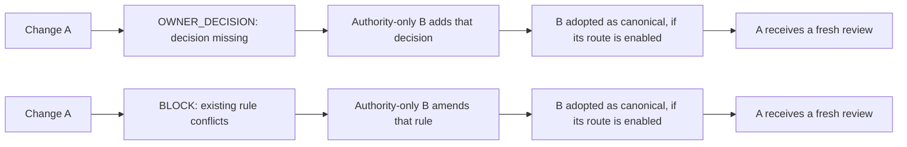

# Documentation map

Start with the [project README](../README.md) for the product overview. This
directory separates binding rules from setup and operating guidance:

| Read when you need to… | Document | Role |
| --- | --- | --- |
| Check responsibilities, review decisions, evidence, or acceptance rules | [Architecture contract](architecture.md) | Normative; owner decisions must be recorded here before implementation |
| Configure local review, CI, policy versions, or distribution | [Integration reference](integration-reference.md) | Current implementation and setup |
| Handle `OWNER_DECISION` or an unavailable CI review | [Owner intervention](owner-intervention.md) | Operational runbook |
| Prepare, publish, and verify a package release | [Release runbook](release.md) | Maintainer release procedure |
| Scope and forecast a release, record owner agreement and retrospective | [Release planning issue form](../.github/ISSUE_TEMPLATE/release_planning.yml) and [planning procedure](release.md#plan-a-release) | Planning record; does not change publication or architecture gates |
| Propose, split, deliver, and track work | [Issue and pull request workflow](issue-pr-workflow.md) | Issue criteria, partial delivery, and PR reporting |
| Understand GitHub plan limits and this repository's example setup | [GitHub assurance](github-assurance.md) | Capability and claim guide; does not enable a route |
| Diagnose child-reviewer authorization | [Reviewer host permissions](reviewer-host-permissions.md) | Host boundary and failure modes |
| Maintain this repository's `pull_request_target` event policy | [Self-gate Actions policy](self-gate-actions-policy.md) | Repository-specific operations |
| Change the package or roll it out | [Development guide](development.md) | Maintainer workflow |

[Investigations](investigations/) preserve dated experiments and proposals.
They are evidence and context, not amendments to the architecture contract.

## Two recovery flows

In either flow, A's old result remains historical. The B procedure, evidence,
and host assurance differ; consult the contract and selected consumer policy
before claiming adoption.
