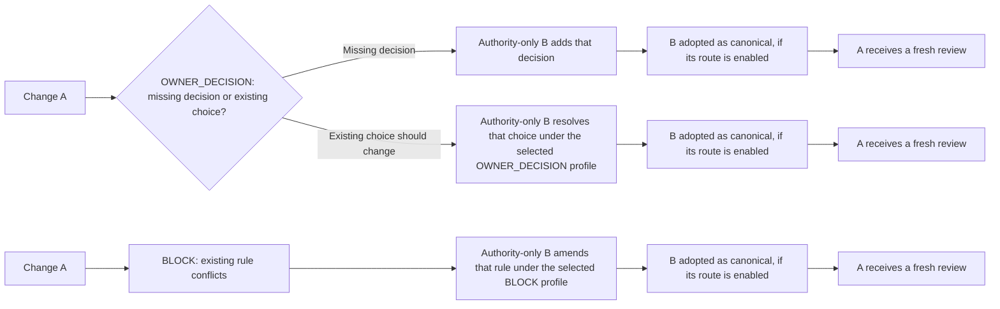

# Documentation map

Choose a reader goal below. The [project README](../README.md) is the short
consumer orientation; the [first manual review](integration-reference.md#manual-review)
is the runnable onboarding path. Detailed reference, operations and package
maintenance are separate reading paths. This index groups material without
changing its authority or implementation status.

| Reader goal | Primary guide | Role |
| --- | --- | --- |
| Run a first consumer review or configure a route | [Integration reference](integration-reference.md#manual-review) | Version-pinned manual walkthrough, then local, Skill and CI setup details |
| See one actual first review | [First-review demo transcript](https://github.com/flair-agency/architecture-gatekeeper/blob/main/docs/first-review-demo.md) | Compact native preview result; use the integration reference for setup |
| Operate a result or recover from a failed review | [Owner intervention](owner-intervention.md) | `OWNER_DECISION`, incomplete review and escalation runbook |
| Understand current host capabilities and claim limits | [GitHub assurance](github-assurance.md) | GitHub capability boundaries and repository-specific observations |
| Diagnose reviewer identity, credentials or host controls | [Reviewer host permissions](reviewer-host-permissions.md) | Child-reviewer and host boundary reference |
| Maintain this repository's self-gate | [Self-gate Actions policy](self-gate-actions-policy.md) | Self-only `pull_request_target` workflow operations |
| Change package code and verify a rollout | [Development guide](development.md) | Maintainer implementation and verification workflow |
| Publish or plan a release | [Release runbook](release.md) and [release planning form](../.github/ISSUE_TEMPLATE/release_planning.yml) | Release execution and separate planning record |
| Plan and report repository work | [Issue and pull request workflow](issue-pr-workflow.md) | Issue criteria, staged delivery and PR reporting |
| Find normative responsibilities and assurance rules | [Architecture contract](architecture.md) and its six members listed at the top | Binding consumer and package contract; owner decisions belong in canonical authority |
| Read adopted Fork authorization boundaries | [Review execution contract](architecture/review-execution.md#target-fork-pr-review-authorization-issue-331-owner-direction-2026-10-04) | Inactive shared target, separate from this repository's self-only Fork rule |
| Use or assess the explicitly selected preview API | [Unverified preview lifecycle API](integration-reference.md#unverified-preview-lifecycle-api) and [recovery status](integration-reference.md#preview-support-and-recovery-status) | Predecessor-selected preview procedures; assurance remains `UNVERIFIED` |
| Inspect dated experiments and historical evidence | [Repository-only investigation index](https://github.com/flair-agency/architecture-gatekeeper/blob/main/docs/investigations/index.md) | Non-normative evidence and proposal history |

## Contract navigation

This index groups the existing sections for reading; it changes neither their
normative status nor any route's implementation or adoption status. Read each
route's conditions and exceptions together with the shared invariants.

| Concern | Sections |
| --- | --- |
| Ownership and shared rules | [Consumer authority](architecture.md#consumer-authority), [shared mechanism](architecture.md#shared-mechanism), [acceptance authority](architecture.md#acceptance-authority-and-host-enforcement-boundary), [normative invariants](architecture.md#normative-invariants), [non-responsibilities](architecture.md#non-responsibilities) |
| Authority selection and bounds | [Distributed authority](architecture/authority-set.md#target-contract-distributed-authority), [CI bounds](architecture/authority-set.md#initial-distributed-authority-ci-bounds-issue-51-owner-decision), [local bounds](architecture/authority-set.md#initial-local-distributed-authority-bounds-issue-51-owner-decision) |
| Review execution and acceptance | [Conceptual operation](architecture.md#conceptual-operation), [local/manual review](architecture/review-execution.md#local-and-manual-review), [CI review](architecture/review-execution.md#ci-model-review), [Fork PR authorization target](architecture/review-execution.md#target-fork-pr-review-authorization-issue-331-owner-direction-2026-10-04), [current acceptance](architecture.md#current-acceptance-mechanism), [target evidence](architecture.md#target-evidence-and-acceptance-contract) |
| Missing-decision governance | [OWNER_ADDITION / G0](architecture/owner-addition.md#owner_addition--g0-route-for-missing-decisions-issue-111), [multi-document addition](architecture/owner-addition.md#target-multi-document-owner_addition-route-issue-119-owner-decision), [adoption and assurance](architecture/owner-addition.md#owner_addition-adoption-and-assurance-dimensions-issue-121-owner-decision) |
| Existing-decision governance | [Owner amendment and self trigger profiles](architecture/owner-amendment.md#target-owner-amendment-governance-issue-75-owner-decision), [procedural BLOCK amendment target](architecture/owner-amendment.md#target-procedural-block-amendment-profile-issue-147-owner-decision), [exact-claim authorization and revocation](architecture/owner-amendment.md#separate-exact-claim-authorization-and-revocation-owner-decision) |
| Development and rollout | [Dogfooding and change discipline](architecture/self-profile.md#dogfooding-and-change-discipline), [tracked work](architecture.md#relationship-to-tracked-work) |

[Investigations index in the repository](https://github.com/flair-agency/architecture-gatekeeper/blob/main/docs/investigations/index.md) preserves dated experiments and proposals.
They do not replace the primary operational guides or amend the architecture
contract.

## Why repeatable review

Repositories accumulate architecture decisions in canonical documents, but
ordinary code review does not reliably detect when a proposed change moves a
responsibility across an ownership boundary, weakens an acceptance rule, or
introduces a capability that the repository has not authorized. Instructions
alone describe the intended architecture; they do not provide a repeatable
decision at design time, during implementation, and before merge.

## Tracked work

- Issue #1 rolls the mechanism out per consumer. Each adoption selects its own
  authority and assurance policy under this contract.
- Issue #19 improves latency and routing without weakening these invariants.
- Issue #20 specifies the evidence format, attestation choice, protected-policy
  routes and model-free CI verification needed to fully separate review
  execution from acceptance verification.
- Issue #111 defines missing-decision adoption under the
  [OWNER_ADDITION / G0 contract](architecture/owner-addition.md#owner_addition--g0-route-for-missing-decisions-issue-111).
- Issue #75 defines the owner-amendment governance route. Issues #78 and #79
  cover its core and attestation work; Issue #147 authorizes a separately
  versioned procedural `BLOCK` profile whose wire formats and trusted backend
  remain unselected.

Issues may refine implementation choices, measurements and rollout. They do
not amend the architecture contract.

## Authority-change paths

In every path, A's old result remains historical. The B procedure, trigger
evidence, and host assurance differ. The applicable previous policy selects
which profile is available; consult the contract and selected consumer policy
before claiming adoption. The separate preview API remains `UNVERIFIED` and
does not satisfy protected G0 or host-enforcement requirements.
