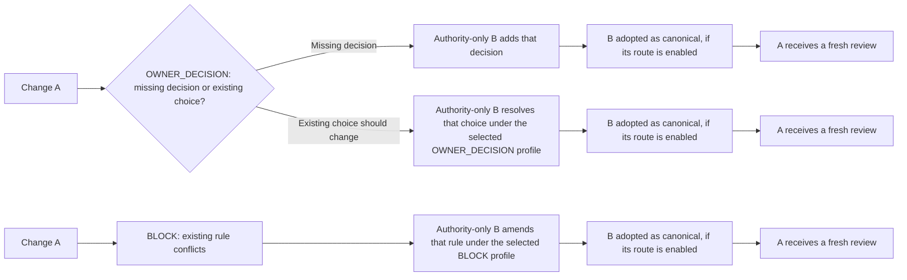

# Documentation map

Start with the [project README](../README.md) for the product overview. This
directory separates binding rules from setup and operating guidance:

| Read when you need to… | Document | Role |
| --- | --- | --- |
| Check responsibilities, review decisions, evidence, or acceptance rules | [Architecture contract](architecture.md) | All six selected members are normative; record owner decisions in the relevant member before implementation |
| Configure local review, CI, policy versions, or distribution | [Integration reference](integration-reference.md) | Current implementation and setup |
| Handle `OWNER_DECISION` or an unavailable CI review | [Owner intervention](owner-intervention.md) | Operational runbook |
| Use the package's explicitly selected unverified review or authority-change preview | [Unverified preview lifecycle API](integration-reference.md#unverified-preview-lifecycle-api) and [preview support and recovery status](integration-reference.md#preview-support-and-recovery-status) | Preview-only procedures; all assurance dimensions remain `UNVERIFIED` |
| Prepare, publish, and verify a package release | [Release runbook](release.md) | Maintainer release procedure |
| Scope and forecast a release, record owner agreement and retrospective | [Release planning issue form](../.github/ISSUE_TEMPLATE/release_planning.yml) and [planning procedure](release.md#plan-a-release) | Planning record; does not change publication or architecture gates |
| Propose, split, deliver, and track work | [Issue and pull request workflow](issue-pr-workflow.md) | Issue criteria, partial delivery, and PR reporting |
| Understand GitHub plan limits and this repository's example setup | [GitHub assurance](github-assurance.md) | Capability and claim guide; does not enable a route |
| Understand caller authorization and host integration responsibilities | [Caller authorization boundary](github-assurance.md#caller-authorization-and-host-integration-boundary) | Responsibility guide; consumer selects authorization policy |
| Review the adopted Fork PR authorization target | [Fork PR review authorization](architecture/review-execution.md#target-fork-pr-review-authorization-issue-331-owner-direction-2026-10-04) | Inactive target; consumer selects approver policy and funding scope |
| Diagnose child-reviewer authorization | [Reviewer host permissions](reviewer-host-permissions.md) | Host boundary and failure modes |
| Maintain this repository's `pull_request_target` event policy | [Self-gate Actions policy](self-gate-actions-policy.md) | Repository-specific operations |
| Change the package or roll it out | [Development guide](development.md) | Maintainer workflow |

## Contract navigation

This index groups the existing sections for reading; it changes neither their
normative status nor any route's implementation or adoption status. Read each
route's conditions and exceptions together with the shared invariants.

| Concern | Sections |
| --- | --- |
| Ownership and shared rules | [Consumer authority](architecture.md#consumer-authority), [shared mechanism](architecture.md#shared-mechanism), [acceptance authority](architecture.md#acceptance-authority-and-host-enforcement-boundary), [normative invariants](architecture.md#normative-invariants), [non-responsibilities](architecture.md#non-responsibilities) |
| Authority selection and bounds | [Distributed authority](architecture/authority-set.md#target-contract-distributed-authority), [CI bounds](architecture/authority-set.md#initial-distributed-authority-ci-bounds-issue-51-owner-decision), [local bounds](architecture/authority-set.md#initial-local-distributed-authority-bounds-issue-51-owner-decision) |
| Review execution and acceptance | [Conceptual operation](architecture.md#conceptual-operation), [local/manual review](architecture/review-execution.md#local-and-manual-review), [CI review](architecture/review-execution.md#ci-model-review), [Fork PR authorization target](architecture/review-execution.md#target-fork-pr-review-authorization-issue-331-owner-direction-2026-10-04), [current acceptance](architecture.md#current-acceptance-mechanism), [target evidence](architecture.md#target-evidence-and-acceptance-contract) |
| Missing-decision governance | [OWNER_ADDITION / G0](architecture/owner-addition.md#owner_addition--g0-route-for-missing-decisions-issue-111), [multi-document addition](architecture/owner-addition.md#target-multi-document-owner_addition-route-issue-119-owner-decision), [adoption and assurance](architecture/owner-addition.md#owner_addition-adoption-and-assurance-dimensions-issue-121-owner-decision) |
| Existing-decision governance | [Owner amendment and self trigger profiles](architecture/owner-amendment.md#target-owner-amendment-governance-issue-75-owner-decision), [procedural BLOCK amendment target](architecture/owner-amendment.md#target-procedural-block-amendment-profile-issue-147-owner-decision), [exact-claim authorization and revocation](architecture/owner-amendment.md#separate-exact-claim-authorization-and-revocation-owner-decision) |
| Development and rollout | [Dogfooding and change discipline](architecture/self-profile.md#dogfooding-and-change-discipline), [tracked work](architecture.md#relationship-to-tracked-work) |

[Investigations](investigations/) preserve dated experiments and proposals.
They are evidence and context, not amendments to the architecture contract.

## Why repeatable review

Repositories accumulate architecture decisions in canonical documents, but
ordinary code review does not reliably detect when a proposed change moves a
responsibility across an ownership boundary, weakens an acceptance rule, or
introduces a capability that the repository has not authorized. Instructions
alone describe the intended architecture; they do not provide a repeatable
decision at design time, during implementation, and before merge.

## Tracked work

- Issue #1 rolls the mechanism out per consumer. Each adoption selects its own
  authority and assurance policy under this contract.
- Issue #19 improves latency and routing without weakening these invariants.
- Issue #20 specifies the evidence format, attestation choice, protected-policy
  routes and model-free CI verification needed to fully separate review
  execution from acceptance verification.
- Issue #111 defines missing-decision adoption under the
  [OWNER_ADDITION / G0 contract](architecture/owner-addition.md#owner_addition--g0-route-for-missing-decisions-issue-111).
- Issue #75 defines the owner-amendment governance route. Issues #78 and #79
  cover its core and attestation work; Issue #147 authorizes a separately
  versioned procedural `BLOCK` profile whose wire formats and trusted backend
  remain unselected.

Issues may refine implementation choices, measurements and rollout. They do
not amend the architecture contract.

## Authority-change paths

In every path, A's old result remains historical. The B procedure, trigger
evidence, and host assurance differ. The applicable previous policy selects
which profile is available; consult the contract and selected consumer policy
before claiming adoption. The separate preview API remains `UNVERIFIED` and
does not satisfy protected G0 or host-enforcement requirements.
