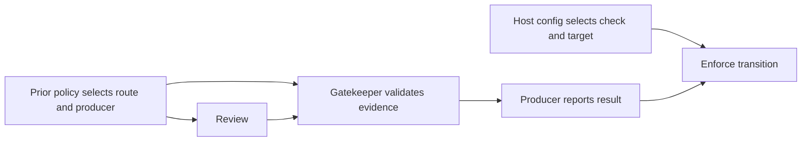
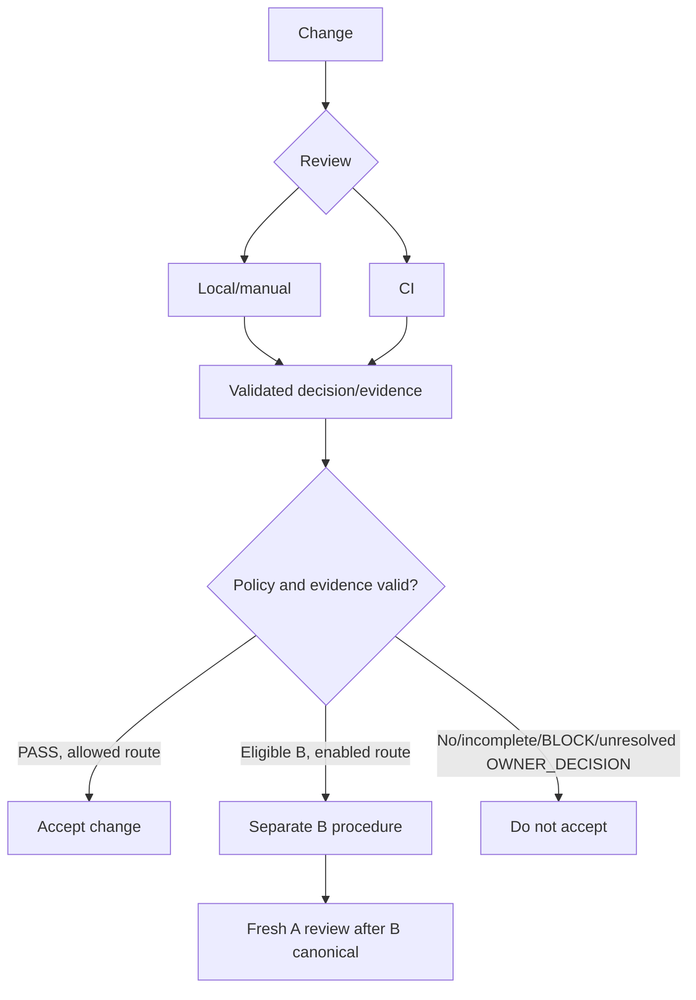

# Architecture Gatekeeper contract

This document and the five required members listed below form the normative
architecture contract for Architecture Gatekeeper. Implementation documents, examples, Issues and pull requests must
conform to it. When an implementation detail conflicts with this document, the
detail does not silently redefine the architecture; the contract must be
changed explicitly through owner review first.

For an operational starting point, use the [documentation map](README.md).
The diagrams below explain the order of operations; the surrounding text
defines the requirements and assurance claims.

All six members are required together, as selected by the committed authority
manifest. Topic separation gives no member implicit precedence. The headings
retained here for moved sections preserve old fragments; follow their links for
the full clauses. These pointers do not materialize another authority member.

| Stable ID | Required document |
| --- | --- |
| `architecture-contract` | [docs/architecture.md](architecture.md) |
| `architecture-authority-set` | [docs/architecture/authority-set.md](architecture/authority-set.md) |
| `architecture-owner-addition` | [docs/architecture/owner-addition.md](architecture/owner-addition.md) |
| `architecture-owner-amendment` | [docs/architecture/owner-amendment.md](architecture/owner-amendment.md) |
| `architecture-review-execution` | [docs/architecture/review-execution.md](architecture/review-execution.md) |
| `architecture-self-profile` | [docs/architecture/self-profile.md](architecture/self-profile.md) |

## Contract navigation

This index groups the existing sections for reading; it changes neither their
normative status nor any route's implementation or adoption status. Read each
route's conditions and exceptions together with the shared invariants. The full
[topic index is in the documentation map](README.md#contract-navigation).

## Why

Architecture Gatekeeper exists to make those semantic checks repeatable while
leaving architecture ownership with each consumer repository. Its success is
not “an AI job ran.” Its success is that a proposed change is evaluated against
explicit repository-owned authority, unresolved owner choices remain visible,
and an enforcing repository cannot accept evidence weaker than its protected
policy allows.

The mechanism must give developers useful feedback before CI without turning a
local review into a security claim it cannot support. It must also permit a
repository to require an independent CI boundary when that stronger assurance
is justified.

## What

### Consumer authority

Each consumer repository owns:

- the canonical architecture and responsibility boundaries;
- the files that constitute review authority;
- the reviewer prompt, decision schema and deterministic validation rules;
- model and reasoning selection;
- the target-branch assurance and acceptance policy.

Architecture Gatekeeper selects, transports and validates those inputs. It
does not infer a consumer's architecture from current implementation, package
layout, examples, or another consumer's policy.

### Target contract: distributed authority

See the [full normative section](architecture/authority-set.md#target-contract-distributed-authority).

### Initial distributed-authority CI bounds (Issue #51 owner decision)

See the [full normative section](architecture/authority-set.md#initial-distributed-authority-ci-bounds-issue-51-owner-decision).

### Initial local distributed-authority bounds (Issue #51 owner decision)

See the [full normative section](architecture/authority-set.md#initial-local-distributed-authority-bounds-issue-51-owner-decision).

### Shared mechanism

The package selects declared inputs from a recorded revision, invokes a review-only reviewer, validates structured decisions and consumer invariants, produces/verifies evidence only under an implemented and selected contract, and reports acceptance under protected policy.

`PASS`, `BLOCK` and `OWNER_DECISION` are semantic results; the latter escalates to canonical consumer authority, not acceptance. `OWNER_ADDITION` adds a missing decision; `OWNER_AMENDMENT` changes, replaces, removes or refines an existing one. History is never rewritten as `PASS`.

### Acceptance authority and host enforcement boundary

| Responsibility | Authority |
| --- | --- |
| Define architecture, policy, required evidence/permitted procedure | Consumer owner; canonical authority/protected policy |
| Select exact inputs, validate evidence, report result | Gatekeeper |
| Publish report | Prior-policy/host-selected producer; candidate YAML cannot select, authorize or replace |
| Protect producer; enforce check/target transition | Host/admins per route config |

Protected-base bytes/pinned actions or workflows alone prove neither caller nor producer protection; provenance verifies producers per contract. Reviewer cannot select/authorize one; its ReviewRecord grants no acceptance. Review and acceptance are distinct.

Host enforcement is independent of authentication, semantic eligibility, procedural adoption and canonical readback. Claim only with evidence of the configured rule for exact producer, required check and target transition. No evidence, no claim; block adoption only when prior policy requires enforcement. Procedural assurance differs; enforced routes fail closed.

Profiles/adapters specify producer/actor IDs, execution/credential boundaries, exact revision selection, host capabilities/limits and property verification. Examples describe mechanisms, not routes. No new evidence grade/backend, universal-application or stronger-identity requirement; no route activates or consumer architecture is decided here.

See OWNER_ADDITION and target evidence/acceptance sections for route rules.

Enforced-profile diagram; procedural profiles retain separate assurance.

### OWNER_ADDITION / G0 route for missing decisions (Issue #111)

See the [full normative section](architecture/owner-addition.md#owner_addition--g0-route-for-missing-decisions-issue-111).

### Target multi-document OWNER_ADDITION route (Issue #119 owner decision)

See the [full normative section](architecture/owner-addition.md#target-multi-document-owner_addition-route-issue-119-owner-decision).

#### v0.5.1 public fixture full-cycle release gate (owner decision)

See the [full normative section](architecture/owner-addition.md#v051-public-fixture-full-cycle-release-gate-owner-decision).

### Target owner-amendment governance (Issue #75 owner decision)

See the [full normative section](architecture/owner-amendment.md#target-owner-amendment-governance-issue-75-owner-decision).

#### Self-v1 semantic eligibility input and receipt (owner decision)

See the [full normative section](architecture/owner-amendment.md#self-v1-semantic-eligibility-input-and-receipt-owner-decision).

### Separate exact-claim authorization and revocation (owner decision)

See the [full normative section](architecture/owner-amendment.md#separate-exact-claim-authorization-and-revocation-owner-decision).

### OWNER_ADDITION adoption and assurance dimensions ([Issue #121](https://github.com/flair-agency/architecture-gatekeeper/issues/121) owner decision)

See the [full normative section](architecture/owner-addition.md#owner_addition-adoption-and-assurance-dimensions-issue-121-owner-decision).

### Three separate concepts and target contracts

[Review execution, evidence and acceptance](#shared-mechanism) remain distinct,
even in one workflow. Execution grants no merge acceptance; CI does not define
review. Evidence binding and protected-policy requirements are specified in the
[target evidence contract](#target-evidence-and-acceptance-contract).

## Conceptual operation

Local feedback is not automatically merge evidence. `OWNER_ADDITION / G0` and `OWNER_AMENDMENT` are separate B acceptance procedures; neither converts A's earlier result to `PASS`.

### Local and manual review

See the [full normative section](architecture/review-execution.md#local-and-manual-review).

#### Target local provider-independent execution (Issue #265 owner direction)

See the [full normative section](architecture/review-execution.md#target-local-provider-independent-execution-issue-265-owner-direction).

### CI model review

See the [full normative section](architecture/review-execution.md#ci-model-review).

#### Target Fork PR review authorization (Issue #331 owner direction)

See the [full normative section](architecture/review-execution.md#target-fork-pr-review-authorization-issue-331-owner-direction-2026-10-04).

#### Target provider-independent CI execution boundary (Issue #332 owner decision, 2026-10-04)

See the [full normative section](architecture/review-execution.md#target-provider-independent-ci-execution-boundary-issue-332-owner-decision-2026-10-04).

#### Target API WIF CI authentication boundary (Issue #218 owner decision, 2026-09-30)

See the [full normative section](architecture/review-execution.md#target-api-wif-ci-authentication-boundary-issue-218-owner-decision-2026-09-30).

#### Target multi-provider credential-isolated review proxy boundary (Issue #252 owner decision, 2026-10-02)

See the [full normative section](architecture/review-execution.md#target-multi-provider-credential-isolated-review-proxy-boundary-issue-252-owner-decision-2026-10-02).

#### Target Gemini CI authentication selection (Issue #252 owner decision, 2026-10-04)

See the [full normative section](architecture/review-execution.md#target-gemini-ci-authentication-selection-issue-252-owner-decision-2026-10-04).

#### Target Gemini CI execution selection (Issue #252 owner decision, 2026-10-04)

See the [full normative section](architecture/review-execution.md#target-gemini-ci-execution-selection-issue-252-owner-decision-2026-10-04).

#### GitHub step-output sink (owner decision, 2026-10-03)

See the [full normative section](architecture/review-execution.md#github-step-output-sink-owner-decision-2026-10-03).

#### GitHub self-repository ruleset-readback capability (owner decision, 2026-10-04)

For `flair-agency/architecture-gatekeeper` only, the owner selects a separate
GitHub App with repository `administration:write` and mandatory `metadata:read`
to obtain complete readback of the selected amendment-tag ruleset. Install it
only on this repository; reduced installation tokens must select only this
repository and these permissions. This is a GitHub-specific host capability,
not a shared Core requirement or a requirement for consumer UNVERIFIED preview.

Administration write technically permits ruleset and other repository
administration mutations. The owner permits this producer only to verify the
selected repository installation, mint its reduced token, GET the fixed selected
ruleset, and revoke the token. This dispatch constraint does not make the
credential read-only or eliminate its compromise blast radius. Issue #326
tracks future privilege reduction without weakening complete readback checks.

The App private key, JWT and installation token remain inside a separate
protected-main readback process selected by committed protected source and a
`main`-only Environment. They must not reach candidate code, package lifecycle
scripts, ordinary PR/artifact/attestation/tag processing, or queue jobs. Ordinary
handoff operations retain their ordinary token. No dispatch input may choose an
arbitrary privileged destination, repository, capability or filesystem sink.
Complete restriction validation and successful token revocation precede release
of a nonsecret snapshot; failures stop the selected operation without fallback.

A local snapshot may be consumed only in the same protected job, with exact
repository, workflow/revision, run/attempt, ruleset and namespace bindings and
bounded freshness. It is not portable authenticated evidence. Provisioning and
Environment protection remain host/admin responsibilities; recording this target
does not establish configuration, host enforcement or adoption. Queue transport
and its protected receiver remain separate work under Issue #210; this capability
grants no queue acceptance authority and does not activate an amendment route.

#### Target self-only GitHub Free/public reporter (Issue #210 A; owner decision)

See the [full normative section](architecture/self-profile.md#target-self-only-github-freepublic-reporter-issue-210-a-owner-decision).

#### Target: legacy v1 CI authority repair (Issue #120 owner decision)

See the [full normative section](architecture/review-execution.md#target-legacy-v1-ci-authority-repair-issue-120-owner-decision).

### Current acceptance mechanism

The current `ci-enforced` path executes the model review and acceptance flow in
one workflow run. The accept job consumes protected policy resolution, review
status and the reported structured decision from that run. The reviewed SHA and
decision digest are reporting metadata; they are not yet a standalone,
versioned evidence artifact that another verifier can independently accept.

The current `local-only` policy is an explicit protected-base waiver of CI model
review. Its accept job records the selected waiver and succeeds without a review
result or structured decision. It does not reinterpret a local `PASS` as merge
evidence, and it supplies no claim that a model review ran. Replacing that waiver
with locally produced acceptance evidence requires the Issue #20 evidence and
verification contract first.

Local/manual decisions are currently development feedback only. No current
policy accepts an author-supplied local decision in place of the required CI
model review. Issue #20 owns the unimplemented evidence format, attestation
decision, protected routing rules and deterministic CI verifier.

### Target evidence and acceptance contract

Any future architecture evidence format must be versioned structured data and
bind at least the repository identity, reviewed base and head, Gatekeeper
identity, canonical authority and review-input identities, and the validated
decision. Changes to bound state must invalidate the evidence.

Whether local evidence requires signing, which identities are trusted, and
which changes require CI model execution are protected policy decisions. These
decisions must be specified before an evidence route is accepted; service
failure cannot activate a weaker route dynamically.

`Architecture Gate / accept` is an authoritative required check only where
the host applies it to the target branch. The current enforced route verifies
its same-run result. A successful pre-merge check on the separately selected
Issue #121 procedural route reports exact-B eligibility but is not described
as host-required unless that requirement is independently verified. A final
G0 adoption record also needs the separate pre-merge and post-merge evidence
specified above. If Issue #20 adds other evidence routes, each must verify
its selected policy and evidence explicitly. No route silently reinterprets
`BLOCK`, accepts A's `OWNER_DECISION`, or treats report delivery as adoption.

### Canonical authority lifecycle

For selected Gatekeeper lifecycle-v1 tuples (predecessor/profile, topology/bounds, host/merge, caller), support requires finite predecessor-authorized owner-choice → eligible scoped B (required services/evidence) → adoption/readback, production trace, matching fixture and fail-closed negatives. Unselected: inactive. No graph-only support; failed semantics cannot force eligibility. Else `UNSUPPORTED`; retain predecessor; no acceptance/fallback/false-addition split/exception. Legacy policy/artifact/acceptance meanings remain unchanged. B1–B8 govern only this Gatekeeper lifecycle/bootstrap and its `ACTIVE` claim. Consumer-authorized external-admin exceptions remain consumer-owned; they never establish Gatekeeper adoption/`ACTIVE`.

Existing addition/amendment clauses govern B/Set/policy/evidence/freshness; bind repo/target lineage and runtime/caller. Track canonical snapshot, phase/kind, capability/assurance. `ABSENT_INITIAL`=never-existing root; missing decision=addition; lost member=recovery; T4=oversized Set. Pending retains predecessor; pre-integration failure stays pending/ineligible/incomplete; post-integration failure records placement/adoption separately (no fictitious rollback); success needs valid adoption + verified placement. Preserve history; fresh review is new.

Keep defined/implemented/released/selectable/prior-selected/eligible/owner action/adopted/canonically placed/commissioning/active distinct. Normal transitions use no exception. T0 root; T1 missing-decision addition; T2 amend existing; normal, no bootstrap; T3 equivalent maintenance (selector→T5/T6); T4 preselected bounded oversized recovery; T5 prior-authorized compatible migration; T6 incompatible migration via prior-authorized bridge or unsupported; T7 first selection via normal route or guarded bootstrap; T8 normal adoption before active; T9 later profile-fresh use, no fallback/reset.

Bootstrap only for absent-ever root or genuine first activation lacking authorized normal/staged path. T0/T7 share nonresettable repo/target lineage authorization (incl inseparable root/config); rename/backend/manifest/policy/profile changes/missing files cannot reset it. B1 proves absent-ever root or never-completed first activation (missing file/version/receipt is no proof). B2 inventories authorized normal/staged/migration/repair exits: any finite noncircular path bars bootstrap regardless of cost/deadline; missing code/tests/defect/outage do not prove absence. B3 independent existing/external governance authorizes exact scope; B4 binds candidate/paths/ops/actors/lineage; B5 verifies prep/limits/inputs/producer/host. Require implemented T8 plan before start; resulting policy must authorize it. B6 reads back first-operation target/policy/caller; B7 consumes lineage authorization; B8 later normal adoption/readback before ACTIVE, zero exception; commissioning until then. Bootstrap is external, not PASS/G0.

### Explicit unverified consumer preview procedure (owner direction, 2026-10-04)

A separately versioned, explicitly owner-selected UNVERIFIED preview
procedure (`preview-unverified-procedure-v1`) may support actual consumer
addition, amendment and control-plane migration before producer authentication
or trusted custody is available. It is a distinct profile outside existing
trusted profiles, the Gatekeeper lifecycle-v1 `ACTIVE` claim, `OWNER_ADDITION`,
`OWNER_AMENDMENT`, G0 and enforced acceptance claims. Its records never
substitute for those claims. No failure selects it automatically; existing
profiles retain every assurance requirement.

Consumer governance must authorize use and record the preview selection before
the change it governs. Prior selection and every route receipt bind the same
exact repository and target ref (`repository`/`targetBranch`) under predecessor
governance. A shared base does not permit cross-target or cross-repository replay.
Resolve its exact recorded predecessor policy, complete
selected authority, prompt, schema, required validators and reviewer settings;
candidate content cannot replace them. Missing members, invalid selectors,
exceeded limits or unavailable required review leave the step incomplete.
The predecessor-authorized route selects the eligible authority scope for each
addition or amendment; B and its records cannot expand or replace that scope.
Every completed ordinary or eligibility result identifies exactly the complete
predecessor-selected members using the route's existing authority ID/path
schema. Missing, duplicate or extra members invalidate the result. The receipt
binds that same complete selected-set identity. These completeness checks do
not change the predecessor's authority selector or its ID/path schema.

Record originally reviewed A and its exact completed semantic result. Addition
requires a completed ordinary OWNER_DECISION identifying the missing decision;
its record must bind that exact result and the missing decision's ID to A's
ownerDecisionId. PASS or BLOCK cannot trigger addition. Addition B adds only
that identified missing decision: no existing-rule edits, contradictions or
unrelated unresolved choices. For an OWNER_DECISION trigger, route
classification uses the complete bound completed result's recorded content:
addition applies only when it identifies a missing decision, while amendment
applies only when it identifies a required owner choice to change an existing
decision. For either amendment trigger profile, a separately supplied
AmendmentRecord binds the exact completed trigger and its target existing
decision. The result enum or a route record alone does not establish this
classification. If the recorded content is missing, insufficient, conflicting,
or identifies both kinds of change, neither route is ELIGIBLE. Amendment also
applies to a BLOCK trigger only under its selected BLOCK profile. For both
addition and amendment, semantic eligibility
verifies the predecessor-selected scope, excludes all implementation, workflow
and executable-policy changes and unsupported completion claims, and checks
that the complete resulting authority is coherent. Authority-only B is reviewed
against the complete predecessor authority and exact proposed bytes/diff.
For amendment, eligibility additionally verifies that the AmendmentRecord's
target is the existing decision changed by B, that B materially resolves the
exact bound trigger, and that B changes only that target decision. It excludes
unrelated authority changes, implementation,
workflow and executable-policy changes, and unsupported completion claims. It
assesses the resulting rules without requiring agreement with the superseded
target and preserves unrelated decisions. The resulting authority must be
coherent. Report B eligibility as a dedicated ELIGIBLE or INELIGIBLE result,
never semantic PASS or acceptance of originally reviewed A.
The ordinary review and compatible migration retain their predecessor semantic
decision schema and meaning. A migration is distinct from authority-only B.

A compatible control-plane migration becomes eligible only after a completed
ordinary PASS under the unchanged predecessor schema and required validators,
with semantic confirmation that predecessor governance permits that exact
migration and preview selection. Incompatible migration remains unsupported by
this preview; a future bridge requires separate prior authorization and versioned
binding rules. Before integration, the compatible migration's versioned
receipt binds the exact predecessor inputs, candidate policy/configuration and
complete successor Authority Set identity and bytes. The selected ordinary
integration verifies the same exact parent and resulting-tree bindings described
below; subsequent target readback verifies that the observed target commit
contains the exact integration commit in its ancestry and checks
policy/configuration and the complete successor Set, including an unchanged
selected manifest. The final record binds the exact target ref, integration
and observed target commits, and reports only observed procedure completion and
the Git facts checked. Candidate configuration
cannot authorize itself; this adds no authentication or enforcement assurance.
M remains within the control-plane scope authorized by predecessor governance
and preserves canonical architecture decisions. If M requires a new or changed
architecture decision, that decision must first become canonical through a
separately authorized addition or amendment; M cannot self-select, introduce or
bundle that decision into its migration.

Migration uses one exact candidate M (`headSha`), not a separate authority-only
B. Its ordinary PASS, pre-integration receipt, integration second parent and
resulting tree, and readback must bind that same M.

Versioned preview receipts bind exact repository/base and route-specific
candidate identities: A/B for addition or amendment, A for ordinary review, and
M for migration, together with records, full Set, policy/review inputs,
runtime/model/settings, decision, computed byte digests and completion time.
The final addition or amendment record binds the raw-byte SHA-256 digest of the
exact completed eligibility receipt and identities of its trigger decision and
receipt, AdditionRecord or AmendmentRecord, predecessor policy, full selected
Authority Set, reviewer inputs, runtime and dependent records.
The pre-integration migration receipt binds the ordinary PASS for the same M,
predecessor policy, full selected Set, candidate policy/configuration, complete
successor Set and runtime/reviewer inputs. The final migration record binds the
raw-byte SHA-256 digest of that single completed pre-integration receipt for the
same M, and separately binds the observed integration and readback identities.
Before normal integration, complete and validate the exact route receipt: the
eligibility receipt for addition/amendment or the pre-integration migration
receipt for migration. The integration commit message must contain exactly one
versioned Git trailer of this form, bound to that receipt's exact raw bytes:

`AGK-Preview-Receipt-v1: sha256:<64 lowercase hex digits>`

The receipt does not contain the later integration or final-record identities,
so this commitment introduces no circular binding. Finalization and every
fresh review validate the complete receipt, the single well-formed trailer and
its recomputed digest, the required ordered parents and resulting tree, and the
exact target readback. For addition, amendment and migration alike, readback
verifies that the exact observed target commit contains the exact integration
commit in its ancestry and matches the route's resulting authority state; a
B-only byte comparison cannot substitute for that ancestry check. Missing,
malformed, duplicate or mismatched trailers or
receipts leave the procedure incomplete even when placement was observed. This
shows only that the integration Git object commits to the receipt digest; it
does not authenticate reviewer execution, the receipt's completion time, owner
action, host chronology or custody. Existing trusted-profile requirements
remain unchanged.
A record may embed its exact receipt instead of storing only its digest, but it
must retain the receipt's exact digest and dependency identities. Missing or
mismatched bytes or identities leave the procedure incomplete. These integrity
bindings require no external trusted backend and provide no producer
authentication. Integrity and semantic validation are required even when
producer identity, execution origin, owner authentication, custody, policy
protection or host enforcement are UNVERIFIED. Reports state each assurance
separately; local byte consistency supplies no authentication claim. Missing,
changed or mismatched evidence stops the step rather than weakening it. Evidence
freshness here means its bound input state still matches the required lifecycle
boundary; this profile supplies no default age expiry or authenticated timestamp.
Any consumer-selected required age validator remains mandatory: unavailable
validation leaves the step incomplete rather than silently ignoring it.

The owner may integrate eligible B through the explicitly selected ordinary
procedure. For normal merge, verify recorded base as first parent, exact B as
second parent and B's tree as resulting tree; the integration commit is distinct
from B. Subsequent exact target readback verifies integration ancestry and
expected authority bytes. Other integration forms remain unsupported until
versioned binding rules exist. The final preview record binds the exact target
ref, integration commit and observed target commit. It reports adoption OBSERVED
when the bound procedure and integration/readback have completed, with
canonical placement VERIFIED only for the Git facts actually checked and
producer authentication/custody UNVERIFIED where not established. This is usable
consumer procedural adoption with explicitly limited assurance, not verified
trusted-profile adoption, G0, host prevention or principal authorization.
Placement and procedural validity remain separate; readback cannot repair an
ineligible or incomplete B. Preserve historical results and review A afresh
against the resulting canonical inputs; fresh PASS is not guaranteed.

CLI/API outputs must identify the preview profile/version and reject ambiguous
version mixing. Production trusted-profile verifiers must reject these records;
preview selection cannot weaken an enforced policy or infer an owner's business,
publication, disclosure or credential permission. No trusted backend is required
for this explicitly unverified profile. Actual consumer selection and use remain
consumer-owned; this decision authorizes implementation of that preview path,
not automatic selection, existing-route activation or readiness claims.

For this repository, numbered previews may provide preview.3 with usable
consumer UNVERIFIED addition, amendment and compatible-migration procedures,
including those new preview routes, after implementation review, a real consumer
fixture exercises every advertised path with negative verification for each
path, and package/release gates pass. This specifically refines the
existing-supported-path numbered-preview restriction in the self reference
profile for this separate UNVERIFIED procedure only. This limited preview scope
does not satisfy or waive the trusted/enforced acceptance and lifecycle gates:
Issue #210/App trusted reporting and formal Issues #272, #211 and #137 remain
required for their respective claims, as do the lifecycle-v1 `ACTIVE` criteria.
It makes no claim that those formal cases are complete.

## Normative invariants

Every implementation and rollout must preserve these invariants:

1. Consumer repositories own architecture; the shared mechanism owns no
   consumer-specific semantic decision.
2. Review execution, evidence, and acceptance verification remain distinct
   concepts; new evidence routes must give them explicit contracts even when
   one workflow implements more than one.
3. Local/manual review remains independently usable and is not merely a CI
   helper.
4. Authority, prompt, schema, validation and reviewer selection are explicit
   inputs. Any route that claims protected-instruction assurance binds them to
   the protected revision; working-tree or pull-request copies cannot silently
   replace that protected authority.
5. Any independently reusable evidence introduced by Issue #20 is invalid
   after a bound revision or relevant policy/authority identity changes.
6. Protected-base policy alone selects evidence routes and required assurance
   for protected acceptance. The versioned Issue #121 OWNER_ADDITION route
   instead reads its procedure selection from the recorded base and reports
   policy protection as not claimed unless independently established. A
   candidate cannot select either route for itself.
7. API, billing, credential, timeout or service failure never downgrades
   assurance dynamically.
8. `BLOCK` rejects the reviewed change. A separate authority-only amendment
   may be accepted through an explicitly enabled `OWNER_AMENDMENT` route
   without changing that historical `BLOCK`. `OWNER_DECISION` rejects the
   reviewed change. If a decision is missing, a separate addition may become
   canonical through an explicitly enabled protected route or the versioned
   Issue #121 recorded-base route with its stated assurance. If an existing
   decision must change, an amendment may become canonical through a separately
   enabled and verified trigger profile, including a completed
   `OWNER_DECISION` profile once defined. The original reviewed change still
   requires a fresh review and acceptable evidence where applicable.
9. Privileged credentials are not exposed to pull-request code or package
   lifecycle scripts. Credential-bearing third-party actions remain part of the
   selected CI trust boundary and follow its explicit supply-chain policy; this
   contract does not claim that every current action reference is immutable.
10. Distribution identities and executable entrypoints are exact, reviewable
    and reproducible; distribution mechanics do not define architecture.
11. The mechanism claims only the trust guarantees actually supplied by its
    execution route.
12. New consumer requirements are dogfooded through the corresponding shared
    path before broad rollout.

## Non-responsibilities

Architecture Gatekeeper does not own:

- filesystem or Git transaction monitoring;
- rollback, path leasing, object-store defense or workstation security;
- general code correctness, style, testing or vulnerability review;
- deployment, publication, service or business-operation authority;
- consumer architecture creation by inference;
- human owner decisions that are absent from canonical authority.

Gatekeeper evaluates proposed changes against consumer-owned canonical
authority and validates and reports the selected review decision, procedure,
bound evidence and assurance dimensions under the applicable consumer policy.
It does not warrant the substantive quality or correctness of
a consumer's architecture or an owner's decision. The consumer owns those
decisions and its use of the result; the hosting platform and repository
administrators own the protection, permissions, evidence availability and
merge controls they configure. A host feature's availability, a successful
check, or the `G0` label alone does not establish an assurance that was not
verified. The software's legal warranty terms are in `LICENSE`; this
responsibility boundary specifies what the mechanism claims in its reports.

Other controls may provide these capabilities. Their existence must not be
misrepresented as an Architecture Gatekeeper guarantee.

## Dogfooding and change discipline

See the [full normative section](architecture/self-profile.md#dogfooding-and-change-discipline).

### Development sequence and v0.6.0 self reference profile (owner decision)

See the [full normative section](architecture/self-profile.md#development-sequence-and-v060-self-reference-profile-owner-decision).

## Canonical document organization (owner direction, 2026-10-04)

The self contract may be split, preserving meaning, into `docs/architecture.md`
and `docs/architecture/{authority-set,owner-addition,owner-amendment,review-execution,self-profile}.md`.
All six are required selected authority, with stable IDs and no implicit
precedence. Adopt this migration authorization before moving binding clauses.
Then review the complete move, manifest, prompts, references and distribution
under the predecessor selection; the new selection applies only after adoption.
Preserve every requirement, exception, applicability, affected-member scope,
assurance, freshness, compatibility and historical result. Verify clause
coverage and complete local/CI inputs. Existing lifecycle T3/T5/T6 and acceptance
govern each stage. This permits no limit increase, route activation or fallback;
splitting does not extend the policy-selected self amendment target.

## Relationship to tracked work

The [documentation map](README.md#tracked-work) lists the related Issues.

Those Issues may refine implementation choices, measurements and rollout. They
must not be used as implicit amendments to this contract.
