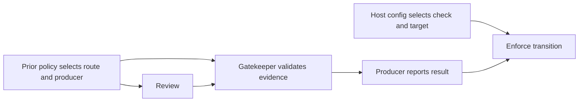
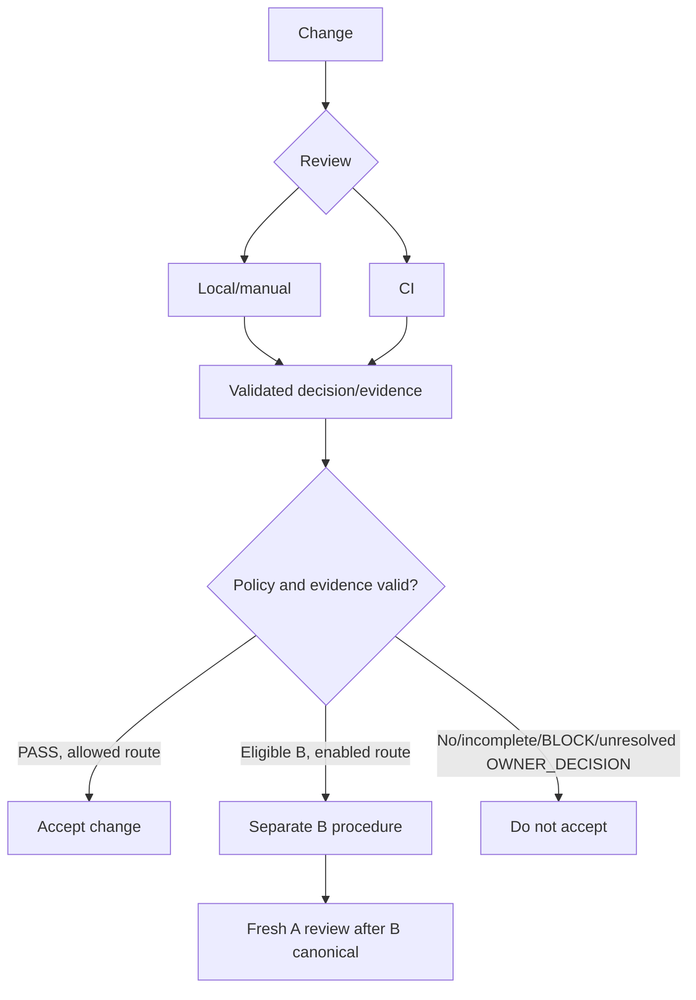
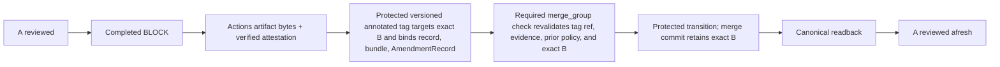

# Architecture Gatekeeper contract

This document is the normative architecture contract for Architecture
Gatekeeper. Implementation documents, examples, Issues and pull requests must
conform to it. When an implementation detail conflicts with this document, the
detail does not silently redefine the architecture; the contract must be
changed explicitly through owner review first.

For an operational starting point, use the [documentation map](README.md).
The diagrams below explain the order of operations; the surrounding text
defines the requirements and assurance claims.

## Why

Repositories accumulate architecture decisions in canonical documents, but
ordinary code review does not reliably detect when a proposed change moves a
responsibility across an ownership boundary, weakens an acceptance rule, or
introduces a capability that the repository has not authorized. Instructions
alone describe the intended architecture; they do not provide a repeatable
decision at design time, during implementation, and before merge.

Architecture Gatekeeper exists to make those semantic checks repeatable while
leaving architecture ownership with each consumer repository. Its success is
not “an AI job ran.” Its success is that a proposed change is evaluated against
explicit repository-owned authority, unresolved owner choices remain visible,
and an enforcing repository cannot accept evidence weaker than its protected
policy allows.

The mechanism must give developers useful feedback before CI without turning a
local review into a security claim it cannot support. It must also permit a
repository to require an independent CI boundary when that stronger assurance
is justified.

## What

### Consumer authority

Each consumer repository owns:

- the canonical architecture and responsibility boundaries;
- the files that constitute review authority;
- the reviewer prompt, decision schema and deterministic validation rules;
- model and reasoning selection;
- the target-branch assurance and acceptance policy.

Architecture Gatekeeper selects, transports and validates those inputs. It
does not infer a consumer's architecture from current implementation, package
layout, examples, or another consumer's policy.

### Target contract: distributed authority

A consumer may opt in to a versioned, finite Authority Set whose required
documents reside in one or more repositories. Authority topology is independent
of source layout and runtime dependencies. The consumer selects each member by
stable ID, repository identity, path and immutable revision. The selector is a
review input that identifies owner-adopted sources; it is not itself semantic
architecture authority. Links, dependencies and submodules do not implicitly
add members or establish precedence between them.

The existing `authorityFiles` decision field reports repository paths. An
opt-in distributed route reports stable source IDs in a separate `authorityIds`
field under its own decision schema. A self member's `authority-revision`
selector resolves to the protected base commit in CI or the single recorded
commit in local/manual review; its manifest does not pin a stale SHA.

An opt-in CI route claiming protected-authority assurance must select its
Authority Set and same-repository authority bytes from the protected base
revision, not the pull-request merge checkout. External revisions are
consumer-adopted snapshots: an upstream change has no effect until the
consumer updates its protected selection. A selection-change pull request is
reviewed under the previous protected selection; the new selection applies to
subsequent reviews after merge. Local/manual review selects configuration and
same-repository authority from its single recorded commit. Both routes use the
same Authority Set semantics but need not select identical snapshots, and a
local result remains development feedback under the current acceptance policy.

Before semantic review on an enabled route, Gatekeeper must resolve every
required member to a bounded, immutable regular-file snapshot, verify the
declared repository, revision and path, compute its content digest, and supply
the selected bytes and source IDs to the reviewer. The supported source types
and per-file, member-count and total-size limits must be explicit before the
route is enabled. A missing, inaccessible, malformed or unverifiable member
leaves the review incomplete, without a `PASS`, `BLOCK` or `OWNER_DECISION` and
without falling back to a smaller set. Authority content is never executed.
Source-read credentials are confined to materialization and are not exposed to
pull-request code or the semantic reviewer, which does not discover additional
authority through general repository access.

For every completed `PASS`, `BLOCK` or `OWNER_DECISION` on the enabled route,
deterministic validation requires the reported source IDs to equal the complete
required set. Omitted, duplicate or extra IDs invalidate the result as an
incomplete review. A material conflict among successfully loaded authorities
without an adopted precedence or refinement rule calls for `OWNER_DECISION`,
not an invented ordering. Report the selected-set identity and each member's
repository, resolved commit, path and content digest with the reviewed
revision. These same-run provenance details do not establish that the model
internally read every byte and are not independently reusable acceptance
evidence.

This target contract applies only after the route is implemented and explicitly
selected. Existing single-repository and CI compatibility routes retain their
current assurance claims except for the explicit fail-closed legacy v1 repair
below; naming a protected architecture file in a prompt
alone does not satisfy the materialization requirement above. An enabled
enforced review cannot downgrade to an older route when resolution fails.

### Initial distributed-authority CI bounds (Issue #51 owner decision)

The first CI implementation supports GitHub repositories only. A consumer that
selects this route must declare all five effective limits in its protected-base
policy: `maxManifestBytes`, `maxMembers`, `maxFileBytes`, `maxTotalBytes`, and
`maxPromptBytes`. There are no implicit defaults, and a pull request cannot
raise these limits for its own review. The recommended initial consumer profile
is respectively 16,384 bytes, 16 members, 65,536 bytes, 262,144 bytes, and
524,288 bytes. These recommendations do not activate the route by themselves.

The versioned Gatekeeper runtime ceilings, in the same order, are 65,536 bytes,
32 members, 131,072 bytes, 524,288 bytes, and 1,048,576 bytes. Neither workflow
inputs nor environment variables may raise these ceilings. Changing them
requires review and release of the Gatekeeper runtime. Missing, invalid or
over-ceiling effective limits fail closed before authority materialization.
The prompt limit applies to the complete review prompt, including selected
authority content. The existing protected-base selection, immutable revisions,
complete-set validation and offline review boundary continue to apply.

### Initial local distributed-authority bounds (Issue #51 owner decision)

The first local/manual Authority Set route supports same-repository (`self`)
members from the one recorded Git commit only. It is opt-in through committed
consumer configuration. The configuration selects a committed manifest and
declares all five effective limits named above; the same versioned runtime
ceilings apply. The complete prompt, including the task and any Hook context,
must fit `maxPromptBytes`. Missing, invalid or over-ceiling limits leave the
review incomplete before semantic review.

For local `self`, the configured repository name labels the current Git root;
the local same-user trust boundary does not attest its GitHub origin. The
reviewed commit and object bytes are verified within that root, and local
provenance must not claim a stronger repository-identity guarantee.

An external member selected by a local manifest is not silently omitted or
replaced with a working-tree copy. Until an explicit local source-access and
credential boundary is adopted, that selection leaves local review incomplete.
This initial route does not request a source-read credential or use one to
resolve authority. Local child execution may inherit the host environment;
this route does not claim isolation from credentials that the host already
supplies. Any later external-source route must define how source credentials
are withheld from the semantic reviewer before it is enabled. A local result
remains development feedback, not merge-acceptance evidence. Existing consumers
that have not selected this route keep the legacy `authorityFiles` behavior.

### Shared mechanism

The package selects declared inputs from a recorded revision, invokes a review-only reviewer, validates structured decisions and consumer invariants, produces/verifies evidence only under an implemented and selected contract, and reports acceptance under protected policy.

`PASS`, `BLOCK` and `OWNER_DECISION` are semantic results; the latter escalates to canonical consumer authority, not acceptance. `OWNER_ADDITION` adds a missing decision; `OWNER_AMENDMENT` changes, replaces, removes or refines an existing one. History is never rewritten as `PASS`.

### Acceptance authority and host enforcement boundary

| Responsibility | Authority |
| --- | --- |
| Define architecture, policy, required evidence/permitted procedure | Consumer owner; canonical authority/protected policy |
| Select exact inputs, validate evidence, report result | Gatekeeper |
| Publish report | Prior-policy/host-selected producer; candidate YAML cannot select, authorize or replace |
| Protect producer; enforce check/target transition | Host/admins per route config |

Protected-base bytes/pinned actions or workflows alone prove neither caller nor producer protection; provenance verifies producers per contract. Reviewer cannot select/authorize one; its ReviewRecord grants no acceptance. Review and acceptance are distinct.

Host enforcement is independent of authentication, semantic eligibility, procedural adoption and canonical readback. Claim only with evidence of the configured rule for exact producer, required check and target transition. No evidence, no claim; block adoption only when prior policy requires enforcement. Procedural assurance differs; enforced routes fail closed.

Profiles/adapters specify producer/actor IDs, execution/credential boundaries, exact revision selection, host capabilities/limits and property verification. Examples describe mechanisms, not routes. No new evidence grade/backend, universal-application or stronger-identity requirement; no route activates or consumer architecture is decided here.

See OWNER_ADDITION and target evidence/acceptance sections for route rules.

Enforced-profile diagram; procedural profiles retain separate assurance.

### OWNER_ADDITION / G0 route for missing decisions (Issue #111)

When `OWNER_DECISION` identifies a missing architecture decision, it rejects
the reviewed change A until that decision is canonical and A receives a fresh
review. A consumer
may separately opt in to a predecessor-B governance result called
`OWNER_ADDITION / G0`. It is not a semantic `PASS` for B or A, and it does not
change or erase A's prior `OWNER_DECISION`.

The initial route applies only when the **previous protected-base policy** opts
in and identifies the authority eligible for this procedure. The previous protected
Authority Set must contain exactly one `self` member, and its path must match
the policy's selected authority path. The candidate B cannot enable the route
or change its policy. B contains only the missing architecture decision being
added to that authority. It cannot change an existing rule, include
implementation or workflow changes, or assert that work was completed. The
route does not accept unrelated unresolved choices or contradictions with the
protected authority. A historical `BLOCK` ReviewRecord is not required; this
is distinct from the `OWNER_AMENDMENT` route.

An ordinary completed `OWNER_DECISION` must carry a protected structured
`ownerDecisionId`. The annotated tag's versioned `AdditionRecord` binds
`missingDecision.id` to that ID. B-specific eligibility review must verify the
ID match and decide that B adds that missing choice without contradicting
existing authority or introducing unrelated unresolved choices. The pure G0
artifact procedure validates the binding; it cannot infer those semantic
properties from authority text. This binding does not require retaining a
historical `BLOCK` or a reusable historical review artifact.

G0 requires a deliberate annotated Git tag object that targets the exact B
commit and whose annotation binds the addition to the selected authority and
missing decision, including its `ownerDecisionId`. The verifier checks the tag
object's bytes, computes and records its object ID (OID), confirms the object
targets B, and records the policy and authority state used for verification. A
Git object OID identifies those exact tag-object bytes. The tag ref that points
to the object is mutable: a read that the ref resolves to that OID establishes
only the observed mapping at read time, not that the ref cannot later move or
be deleted.

G0 makes no claim that Gatekeeper authenticated the tagger, pusher or owner, and
does not require an identity provider, a separately authenticated exact-claim
receipt, a revocation service, or a guarantee that a later tag-ref change
invalidates a green check. The result is procedural and auditable; it must not
be described as strong owner authentication or as proof that the tag remained
available through a later transition. Required verifier or service failure
remains fail closed. Privileged credentials cannot be exposed to or used to
execute B's pull-request code or package lifecycle scripts.

After B becomes canonical, A must receive a fresh review against the new
protected base under the consumer's normal acceptance policy. That review may
still return `BLOCK` or another `OWNER_DECISION`; G0 does not accept A. An
owner-authorized administrative exception remains under the consumer's
existing governance and outside this Gatekeeper result.

The deterministic verifier and protected reporting path are implemented. The
route is conditionally available only when the previous protected consumer
policy explicitly selects it and all verifier requirements above pass. This
repository's current protected policy does not select the route, so it remains
inactive for self-review. A first-time policy adoption may use the one-time,
owner-controlled administrative exception described by the consumer's existing
governance, after code review and the fixture full-cycle E2E below; that
exception is separate from Gatekeeper acceptance and does not itself enable the
route for a review. The v0.5.1 package release is gated by that public fixture
E2E and the package release checks. Passing the fixture does not activate this
repository's self-review route or any real consumer's route. The fixture does
not settle a real consumer's architecture or migration status. A work-completion
claim is not a missing architecture decision; consumer owners must establish
any required completion evidence separately.

### Target multi-document OWNER_ADDITION route (Issue #119 owner decision)

The owner selected the following bounded extension for v0.5.1 on 2026-09-26.
It removes the initial route's single-member Authority Set restriction only
through an explicitly versioned, consumer-selected route. It preserves the
single-file scope of Change B and does not authorize a consumer architecture
decision, an existing-rule amendment, or a work-completion claim.

The previous base policy selects the complete required Authority Set and
exactly one affected `self` member by stable ID and path. That member must use
`authority-revision`; its base bytes come from the same recorded base as the
policy and manifest. B may modify only that existing authority file. B cannot
change the policy, manifest, another authority member, implementation, or
workflow, or enable this route for its own review. An enforced route retains
protected-base selection. The separately versioned recorded-base procedural
route in Issue #121 reports its observed policy protection and host enforcement;
that selection does not relax addition eligibility.

Both the ordinary review of B and its separate addition-eligibility review
must receive every required member of that same base-selected Authority Set.
Same-repository members are immutable base snapshots, and external members
remain the exact consumer-selected snapshots under the existing GitHub
materialization and credential boundary. The eligibility request also receives
the affected member's proposed B bytes and exact base-to-B diff, identified as
candidate evidence rather than existing canonical authority. It must check
the proposed addition against unchanged members as well as the affected
member's existing rules. Links, prompt references, repository discovery,
summaries, and a smaller selected subset cannot substitute for required
authority bytes.

Every completed ordinary semantic decision and every completed B eligibility
result must report exactly the complete selected `authorityIds`. Missing,
duplicate, or extra IDs invalidate that review. A missing, inaccessible,
malformed, unverifiable, or oversized member leaves the procedure incomplete
before semantic review; it cannot be omitted, truncated, sampled, or replaced
by a weaker route. A material conflict among loaded authorities with no
adopted precedence or refinement rule remains an unresolved owner decision.
B must still add only the identified missing decision without changing an
existing rule, introducing a contradiction or unrelated unresolved choice,
or asserting completed work. An ordinary `BLOCK` cannot trigger this route.

The new route uses explicit policy, AdditionRecord, eligibility-schema and
report versions distinct from the initial route. Its tag-bound AdditionRecord
and procedure/report bind the repository, exact base and B commits, selected
policy revision and digest, manifest digest, complete selected-set digest,
affected member ID and path, before/after content digests, and exact missing
decision ID. The report also records every member's repository, resolved
commit, path and content digest, the annotated tag object OID and observed
tag-ref mapping. The ordinary review and eligibility result must be bound to
that same selected-set identity. A stale or mismatched base, head, policy,
set, affected member, decision ID or tag invalidates the procedure. These are
same-run bindings; they do not establish that a model read every byte or
create independently reusable acceptance evidence.

For this new route's ordinary and B-specific review, the versioned
`maxFileBytes` runtime ceiling is 262,144 bytes (256 KiB). The other ceilings
remain 65,536 manifest bytes, 32 members, 524,288 total authority bytes and
1,048,576 complete prompt bytes. The consumer must explicitly select all five
effective limits in the previous base policy. A lower selected limit remains
binding, and B cannot raise its own limit. The complete base set and the set
with the affected member replaced by its proposed bytes must each fit the
selected file and total-content limits. The complete eligibility prompt,
including all base authority bytes, proposed bytes, diff, ordinary result,
tag claim, metadata and instructions, must fit `maxPromptBytes`; exceeding it
leaves the review incomplete. This extension does not raise the limits of
the initial distributed-authority or local/manual routes.

The extension preserves `OWNER_ADDITION / G0` semantics: the annotated tag
binds exact B and its missing decision, principal authentication remains
`not_verified`, the tag-ref mapping is observed at verification time, and no
later canonical transition or continuing tag availability is inferred. B's
governance result is not a semantic `PASS` for B or A. A requires fresh review
after B becomes canonical. Existing v0.5 policy bytes, records, schemas and
historical results retain their original single-member interpretation and
limits; a verifier must reject ambiguous version mixing rather than upgrade
them by reinterpretation.

This target requires implementation, focused negative verification and the
synthetic fixture E2E below for v0.5.1 package release. It does not activate a
real consumer; representative LIVE Agency E2E remains a separate prerequisite.
Issue #120 owns legacy PR-head authority repair; consumer-specific decision
classification and rule amendments cannot replace the fixture A/B lifecycle.

#### v0.5.1 public fixture full-cycle release gate (owner decision)

The public `flair-agency/architecture-gatekeeper-v05-fixture` is the v0.5.1
release E2E. With synthetic data it must demonstrate:

1. Change A receives an ordinary `OWNER_DECISION` with its exact
   `ownerDecisionId`.
2. Authority-only B binds that decision, is assessed against the complete
   selected Authority Set, and reports `eligible` before merge, not semantic
   `PASS` for B or A.
3. The exact eligible B is adopted by an ordinary pull-request merge commit
   whose first parent is the recorded base, second parent is exact B, and tree
   equals B's tree.
4. A post-merge canonical readback verifies that the target contains that
   merge commit and the expected authority state.
5. A is reviewed freshly against the resulting canonical authority and returns
   `PASS` under the fixture's normal review policy.

Issues #119/#121 conditions still apply. A's earlier `OWNER_DECISION` remains
historical; fresh `PASS` is new. Fixture success proves no real consumer's
readiness, policy, owner authorization or host enforcement.

### Target owner-amendment governance (Issue #75 owner decision)

`OWNER_AMENDMENT` is an acceptance result for a separate, authority-only
amendment Change B that changes an existing canonical architecture decision.
It is not a semantic-review decision and does not turn a historical `BLOCK` or
`OWNER_DECISION` into `PASS`. A prior `BLOCK` is a representative trigger, not
the definition of amendment. A completed `OWNER_DECISION` may also identify an
owner choice to change an existing decision; a missing-decision addition still
belongs to `OWNER_ADDITION`. The originally reviewed Change A remains rejected
until B becomes canonical and A receives a fresh review where A exists.

The procedures below are versioned trigger profiles: BLOCK evidence is
specific to its profile and is not required for all amendments. The supported
v0.6.0 self profiles are `completed-block-v1` for a completed BLOCK and
`completed-owner-decision-self-v1` for a completed OWNER_DECISION. Each profile
must specify exact completed review evidence, predecessor binding, owner
procedure, protected producer and transition checks. A tag or candidate claim
cannot infer or enable a profile; B cannot select its route or authorize its
adoption through proposed policy.

The owner adopts profile `completed-owner-decision-self-v1`. The exact
completed ReviewRecord digest identifies escalation/revision, not human choice
or identity. AmendmentRecord and deliberate annotated tag bind exact B, target
existing decision, trigger ReviewRecord digest, prior/resulting Sets and
purpose: proposed resolution, not authenticated approval. At G0,
`principalAuthentication` and `exactClaimAuthorization` are `not_verified`;
the owner procedure is prior-policy-authorized declaration and protected
adoption, not proof of owner approval. Stronger assurance needs a separate
verified route; no G0 fallback.

B-specific semantic eligibility is a common `OWNER_AMENDMENT` invariant,
independent of trigger. Review the exact authority-only B against the full
previous protected policy and Authority Set; confirm it materially addresses
its declared trigger and amends only its target decision; exclude unrelated
changes, implementation/workflow/executable-policy edits and unsupported
completion claims, and leave resulting authority coherent. Assess resulting
rules without requiring agreement with superseded rules. This does not impose
a universal one-file limit or decision ID. Before merge, a trusted producer must
issue versioned eligibility evidence binding exact B, trigger profile and
ReviewRecord digest, AmendmentRecord, and previous policy/Set; validate record
bytes and producer provenance. `merge_group` deterministically revalidates
eligibility, trigger evidence, protected tag and transition, failing closed on
missing, stale, mismatched or unverifiable evidence. The profiles retain their
own trigger-specific evidence and semantic questions: this profile preserves
the historical `OWNER_DECISION` and assesses resolution of its escalation;
the BLOCK profile below requires a completed BLOCK and assesses resolution of
the identified conflict. Only previous-base policy opts in and scopes a route;
B cannot self-authorize. If prior policy cannot authorize first opt-in, use
owner-controlled bootstrap. Contract entry alone enables no route.

#### Self-v1 semantic eligibility input and receipt (owner decision)

The closed `owner-amendment-semantic-eligibility-v1` format reports semantic
eligibility for exact B only; it is not `PASS` or `OWNER_AMENDMENT`, does not
rewrite the trigger result, and does not authenticate an owner or authorize an
exact claim. Those assurances remain `not_verified`; this decision enables no
route.

The previous-base policy selects the trigger profile, authority scope, trusted
producer, and required `ownerAmendment.maxPromptBytes` (no default; positive
safe integer, at most the 1,048,576-byte runtime ceiling). B cannot set or
raise it. The complete prompt must fit. The protected producer supplies the
exact raw UTF-8 policy, full Authority Set and member bytes, repository/base/B,
all changed authority paths' before/after bytes and complete diff, trigger
ReviewRecord bytes and AmendmentRecord bytes, and annotated-tag identity. It
materializes the exact completed trigger ReviewRecord, verifies its selected
profile, digest, predecessor bindings, and trusted producer provenance before
constructing the prompt, then includes its decoded content as untrusted data.
The record supplies escalation/revision context only; it neither states owner
choice nor replaces canonical authority. The producer verifies all input
bindings before review. It also validates the AmendmentRecord's profile schema,
exact-byte digest, and applicable repository/base/B, trigger, target authority,
and before/after bindings before prompt construction. The prompt includes both
decoded records as separately identified untrusted data; the AmendmentRecord's
target and purpose are proposed claims, not owner choice or approval. Policy,
authority, and record content are data, not instructions. No one-file limit
applies. IDs follow protected manifest order.
`authoritySetDigest` is SHA-256 of compact UTF-8 JSON for the ordered member
descriptors `{id,repository,resolvedCommit,path,byteLength,sha256}`.

The closed decision object has exactly `version`, `kind`, `eligibility`,
`triggerProfile`, `authorityIds`, `authoritySetDigest`, and `checks`;
`version=1`, `kind=owner-amendment-semantic-eligibility-decision`, and
`eligibility` is `ELIGIBLE` or `INELIGIBLE`. Profile, complete ordered IDs,
and set digest equal the input. `checks` has exactly these boolean fields:
`materiallyAddressesTrigger`, `amendsOnlyTargetDecision`,
`excludesUnrelatedChanges`,
`excludesImplementationWorkflowAndExecutablePolicyEdits`,
`excludesUnsupportedCompletionClaims`, `resultingAuthorityIsCoherent`, and
`assessesResultingRulesWithoutRequiringAgreementWithSupersededRules`.
`ELIGIBLE` requires all checks true; `INELIGIBLE` records at least one false
check and cannot produce eligible evidence. Duplicate, extra, missing,
malformed, or mismatched fields leave review incomplete. The receipt records
the semantic determination; deterministic validation does not prove its
semantic correctness.

A completed decision has a version-1 `owner-amendment-semantic-eligibility-receipt`
in canonical UTF-8 JSON: recursively Unicode-code-point-sorted object keys,
array order preserved, compact separators, one final LF. Reject duplicate
keys and unknown, missing, noncanonical, or invalid fields at every level.
The exact top-level field set is `version,kind,eligibility,repository,baseSha,
bSha,triggerProfile,triggerReviewRecordSha256,amendmentRecordSha256,
policyRevision,policySha256,authoritySetDigest,authorityIds,changes,diffSha256,
promptSha256,schemaSha256,decisionSha256,model,reasoningEffort,gatekeeper,
tag,producer`;
`policyRevision=baseSha`. All `*Sha256` fields hash the named exact raw bytes
(decision bytes use the canonical decision encoding); `authoritySetDigest`
uses the member-descriptor algorithm above. `changes` is an ordered array of exact
`{path,beforeSha256,afterSha256}` objects. `tag` is exactly
`{tagRef,tagObjectOid,observedTagRefOid}`, binding the protected ref, exact
annotated object and observed ref mapping; it makes no claim the mutable ref
cannot later move or disappear. `producer` is exactly
`{workflowPath,workflowSha,workflowRef,runId,runAttempt,jobId}`, identifying
the selected protected workflow and exact job execution. `gatekeeper` is
exactly `{repository,revision,package}`: the canonical Gatekeeper repository,
full immutable Git commit SHA of the runtime source, and either `null` for
direct Git execution or an exact `{name,version,integrity}` package identity.
For package execution, these values identify the selected package and its
registry-read version and integrity, as required by the package distribution
contract. This is distinct from producer workflow/job identity. `model` and
`reasoningEffort` record the exact values selected by the previous-base
policy. The verifier matches runtime identity, producer, model, and effort to
their protected selections. Producer provenance must authenticate separately
before acceptance; fields alone do not authenticate the producer. It requires
every receipt identity/digest to match the protected selection and review
input. Only a validated `ELIGIBLE` receipt can serve as input to a separately
implemented acceptance route; it never reports `OWNER_AMENDMENT` or
authorizes B.

For BLOCK-triggered amendments, the exact completed `BLOCK` must identify the
conflict that B's semantic eligibility assesses. Preserve that historical
result; B never changes it to `PASS`. The first BLOCK-triggered implementation
may accept Change B at governance
grade `G0` when the **previous protected-base policy** explicitly authorizes
that grade for
the affected authority and amendment scope. `G0` still requires a deliberate,
per-amendment annotated-tag artifact. The verifier must check its immutable
object identity, exact B revision, amendment purpose and triggering `BLOCK`
identity. `G0` means the tag's creator or pusher is **not authenticated as the
owner** by Gatekeeper. Tagger name/email and author-supplied claims do not
establish identity. The resulting record must say `OWNER_AMENDMENT / G0`, name
the protected policy revision and tag object OID, and report that principal
authentication was not verified. A change cannot lower its own required grade
or select its own acceptance policy. No grade or amendment route is enabled
by default.

The `G0` option reflects the first user's existing owner-controlled exception
operation: Gatekeeper does not currently authenticate the owner behind each
amendment. Making `G1` mandatory from the outset would exclude single-owner
and other repositories that cannot yet provide a supported identity-verifying
mechanism. `G0` gives those repositories a formal, auditable procedure without
falsely claiming that each tag was pushed by the owner. It does not remove the
repository's responsibility to control who can merge under its hosting rules.

The value of this BLOCK-triggered route is procedural: it replaces a
recurring, unstructured merge exception with a separate amendment Change,
an annotated tag binding
that change to the exact triggering `BLOCK`, protected acceptance conditions
and an audit record. That improvement in process traceability must not be
described as improvement in per-change owner authentication; the latter
requires a higher-grade identity-verifying adapter.

For this route, the triggering `BLOCK` is one specific, completed and
verifiable ReviewRecord for the identified Change A, generated before B's
protected canonical transition. “Exact” requires validating the ReviewRecord
bytes and producer provenance bound by B's AmendmentRecord; it does not
require retaining the first or earliest `BLOCK` ever produced for A. A
readable record without valid producer provenance, or a digest without the
record bytes, is insufficient. Stale, unrelated, incomplete or unverifiable
evidence cannot trigger `OWNER_AMENDMENT`.

The evidence supporting B must remain valid through B's protected canonical
transition. A successful required check or a readback performed when that
check runs does not alone establish that the same evidence remains valid at a
later transition. The selected host integration must establish freshness and
ordering through that transition. If the triggering ReviewRecord or its
provenance, binding, or applicable previous protected-base authority/policy
cannot be validated at transition, B is incomplete and this route must not
authorize it. Expiry or later unavailability after a completed transition
does not retroactively invalidate that `OWNER_AMENDMENT` under this
acceptance-time evidence contract. Retention of B's acceptance record and any
post-transition audit material is a separate protected-policy choice.

If the bound triggering `BLOCK` is lost before B's transition, that pending
attempt cannot proceed on the missing record. Where the previous
protected-base policy permits recovery, a fresh review may produce a new
completed `BLOCK` for the identified Change A. This is new evidence with a
new identity, not restoration or proof of the old ReviewRecord; review
execution cannot be assumed to reproduce its exact bytes. It must be
generated under the applicable previous protected-base authority/policy, and
the repository, immutable base/head tuple and other required review inputs
must align with the identified A. If they do not align, the reviewed change
has a different A identity and B must identify it as such. B's AmendmentRecord
and every tag, evidence receipt or exact-claim authorization bound to the old
triggering `BLOCK` must be regenerated or reauthorized for the new identity.
Only a completed `BLOCK` supports this recovery; `PASS`, `OWNER_DECISION`,
refusal or incomplete review does not. The new bindings and evidence must be
validated through B's protected canonical transition.

Gatekeeper validates the selected evidence while a pending B is adopted; it
does not prescribe a universal storage backend or indefinite retention of
every earlier `BLOCK`. The consumer's protected policy and host integration
select a source that can supply the exact record bytes and verifiable producer
provenance through B's transition, and define the availability horizon and
later audit retention. Missing evidence cannot be replaced by a claim that a
previous review probably returned `BLOCK`. A first production deployment
still needs a concrete authorized evidence source and a proven final
validation/transition ordering; allowing a new `BLOCK` does not itself prove
either condition.

### Separate exact-claim authorization and revocation (owner decision)

`G0` remains a procedural governance grade with
`principalAuthentication=not_verified`. It does not itself prove that an
authorized owner approved the substance of an amendment. If an
owner-approved, versioned Amendment Claim route is later defined,
authenticated authorization of its exact claim is a **separate assurance**
from `G0` and from authentication of the annotated tag actor. Neither `G0`
nor any higher tag-actor governance grade is redefined by this assurance;
the observed grade and exact-claim authorization result must be recorded
independently. The previous protected-base policy may select or require the
additional assurance for an affected authority and amendment scope;
candidate Change B cannot waive or add it for itself. Failure,
unavailability or incompleteness of a required authorization cannot fall
back to `G0` alone or another weaker route.

When selected, the authorization must establish that a principal with the
required owner authority approved the **exact** claim identity, including
its bound prior and proposed authority revisions, amendment purpose and
supporting evidence identities. A change to any bound claim content requires
new authorization. A general PR/MR `APPROVED` state, annotated-tag actor,
mutable review body or author-supplied statement is not by itself proof that
the principal approved that exact claim at the time of authorization. The
claim identity must not depend on the later authorization receipt that
references it.

Ordinary revocation of an exact-claim authorization is prospective. If it
occurs **before the protected canonical transition** for B, adoption must be
prevented, even if an earlier required check reported success. A successful
check is not the canonical transition. After a completed protected canonical
transition, a later ordinary revocation does not erase that historical
acceptance; it prevents future or otherwise unconsumed use of the revoked
authorization. Evidence discovered later to have been invalid **at the time
of acceptance** (for example, forgery or lack of authority) is a separate
correction or incident matter, not an ordinary revoke and not an automatic
rollback rule.

This states the assurance and time semantics, not an enabled mechanism.
The exact receipt, identity-verification adapter, revocation source, and
host-specific ordering between final validation and protected merge remain
unselected and unproven. A host adapter must provide an immutable commitment
to the exact claim at authorization time and demonstrate that revocation or
claim change after a green check cannot permit a later canonical transition.
No exact-claim authorization route may be enabled until those properties and
the selected policy are proved end to end. This decision does not remove the
current BLOCK-evidence profile's trigger requirements or authorize the broader
Amendment Claim evidence model proposed in #107.

In the BLOCK-evidence profile, even at `G0`, the protected verifier must
validate a versioned ReviewRecord
for the exact historical `BLOCK`, an AmendmentRecord binding B to that review
and the authority being amended, the current repository/base/head and
authority identities, and the strict authority-amendment scope. It must reject
unrelated implementation changes in B, stale or unrelated review evidence,
and changed bound state. The check is successful only for B; it cannot accept
A using B's amendment result. A qualifying B may have been authored by a
non-owner: `G0` makes no author-identity claim. Repository merge permissions
and branch rules control who can actually merge it and are separate from the
Gatekeeper grade.

The annotated tag is procedural evidence at every enabled grade. Tag-content
and revision verification are core requirements, separate from verifying the
actor behind the tag. The `G0` route selects a Null **identity-authentication**
adapter: it reports no verified principal, while the core still requires a
valid tag artifact. A missing, malformed, stale or unverifiable tag is not a
valid `G0` result. Where a higher grade is selected, an external identity
provider is the source of actor attribution. Its adapter validates and
normalizes the provider's evidence for the exact tag; the protected core
checks that principal against the owner policy. The adapter does not itself
establish a human's identity or return acceptance results or grades. An
invalid, unavailable or incomplete selected higher-grade adapter result cannot
trigger a `G0` fallback. The tag object's remote availability and tag-ref
update/deletion must have an enforceable freshness rule before the tagged
route is enabled; a stale successful check cannot remain authoritative after
its bound evidence changes. A higher-grade adapter that relies on a push
event must additionally bind that event to the exact tag object.
Future grades may express one authenticated owner or a distinct-principal
quorum; the core must keep the number/relationship of attesters separate from
the strength of each authentication mechanism. Mechanisms and any alternatives
are selected by protected policy, never by a first-success fallback chain.

This is a target contract, not an active acceptance route. It becomes active
only after the evidence format, deterministic verifier, protected routing and
current-state checks are implemented and tested. Until then, existing
acceptance behavior remains in force. Enabling `G0` for this repository for
the first time cannot be justified by the candidate policy in that same
change; its adoption follows the existing owner-controlled exception process.

### OWNER_ADDITION adoption and assurance dimensions ([Issue #121](https://github.com/flair-agency/architecture-gatekeeper/issues/121) owner decision)

The scalar `G0` label is retained for compatibility with existing v0.5
`OWNER_ADDITION` and `OWNER_AMENDMENT` artifacts. It means only that the
annotated-tag actor's principal identity was not verified. It is not a total
governance-strength grade and makes no claim about exact-claim authorization,
quorum, policy protection, host merge enforcement, or a completed canonical
transition. Existing v0.5 policy bytes, artifacts, route behavior, and
historical results keep their original meanings.

Future governance reports must keep these assurance facts distinct:

- **Procedure and eligibility:** whether route-specific evidence and semantic
  checks are `eligible`, `ineligible`, or `incomplete` for the exact candidate.
- **Principal authentication:** whether an approved identity mechanism
  verified the relevant actor. Existing G0 reports `not_verified`; tagger
  name/email or a claim in the candidate does not change that state.
- **Exact-claim authorization:** whether a principal with the required owner
  authority authorized the bound claim. This is independent of actor
  authentication and requires its own selected evidence contract.
- **Quorum:** whether the number and relationship of authorized attestations
  selected by policy are satisfied. Quorum does not alter the strength of the
  identity mechanism for each attester.
- **Policy protection:** whether evidence establishes that the policy used for
  a decision was protected from candidate self-selection or alteration.
- **Host enforcement:** whether evidence establishes that the hosting service
  applied a merge rule to the exact target, required check and producer, with
  its bypass scope and observation time identified.
- **Canonical transition or placement:** whether a readback of the named
  target ref establishes that the exact authority state became canonical and
  what is present at observation time. This Git/readback fact does not by
  itself establish valid OWNER_ADDITION adoption.
- **Evidence freshness:** which bound evidence was checked and for which
  route-specific lifecycle boundary.

An unavailable source is reported as unavailable; a fact that was not
verified is not inferred from a green check. Reports bind their repository,
recorded base and candidate head, policy/report versions and digests, and
evidence identities. The status and provenance of each dimension remain
separate; no scalar grade may summarize them as an overall assurance level.

For the separately versioned v0.5.1 OWNER_ADDITION route, absence of verified
host merge enforcement does not by itself make an otherwise valid G0
procedure permanently `ADVISORY_ONLY`. A consumer must explicitly select the
route from the recorded base policy; B cannot enable it, weaken it, or select
policy from its own head. The report binds and identifies that base revision
and policy digest, while reporting `policyProtection=not_claimed` whenever
protection of that policy was not established. A required enforced route
cannot downgrade when its selected host evidence is absent, inaccessible,
stale or invalid.

Before merge, an eligible exact candidate's result is `eligibility=eligible`,
`adoption=pending`, and `canonical=pending`. Eligibility alone is neither
adoption nor canonical placement. A final `OWNER_ADDITION / G0` adoption
record is valid only when all of the following are established for the same
exact B:

- Its deliberate annotated G0 tag and AdditionRecord bind the required
  decision and match an ordinary completed `OWNER_DECISION` with the same
  `ownerDecisionId`.
- The ordinary review and separate B eligibility review both report exactly
  the complete selected-base `authorityIds` and the same verified selected-set
  digest; B's eligibility result is `eligible`.
- Evidence verifies that this exact eligibility result existed before merge
  and records its selected producer and completion time. Those facts come
  from a source selected by the recorded-base policy, never an
  author-controlled field or arbitrary saved green report.
- An ordinary PR merge commit has the recorded base as its first parent and
  exact B as its second parent, and its tree equals B's tree. Trusted host PR
  metadata binds that commit to the named B PR as merged before readback.
- A later readback identifies the observed target ref and verifies that it
  contains the merge commit and expected authority state.

The adoption record binds the repository, target branch, PR identity, base,
B, merge commit, its ordered parents and tree, target ref and observed target
commit, selected policy and Authority Set identities, Gatekeeper identity,
prompt, schema and validation input identities, tag object, eligibility
result, producer and timestamp. A missing, mismatched or post-merge-only
eligibility result leaves adoption incomplete. v0.5.1 supports this
merge-commit form; squash and rebase integration are unsupported until a later
route version defines and verifies their exact B-to-result binding.

Canonical placement and valid adoption are reported independently. If an
ineligible B is nevertheless merged and read back on the target, the report
may say `canonical=verified` while `adoption=invalid`; the readback must never
convert that change into a valid OWNER_ADDITION. A known ineligible B has
`adoption=invalid` even while canonical placement is pending; eligibility
alone never establishes the placement. After a valid adoption, A still
requires a fresh review against the resulting
canonical authority under the consumer's normal acceptance policy.

The v0.5.1 G0 route reports `principalAuthentication=not_verified` and reports
host enforcement as `unavailable` or `not_verified` according to observed
evidence. These are independent assurance dimensions: the procedural
adoption claim does not authenticate the owner/tag actor or claim that GitHub
prevented a disallowed merge. Conversely, unavailable host enforcement does
not invalidate the specifically evidenced procedural adoption above.

The new policy, evidence and report formats must have explicit versions
distinct from current v0.5. Existing v0.5 policy bytes, artifacts, route
behavior and historical results keep their original meanings; a verifier must
reject ambiguous version mixing and must not upgrade historical G0 results by
reinterpretation. This Issue #121 contract is limited to OWNER_ADDITION and
does not generalize to OWNER_AMENDMENT or other routes. It defines the target
contract, not an active route. Implementation, focused negative verification,
and the public fixture full-cycle E2E specified in the Issue #119 release gate
are required for the v0.5.1 package release. Passing that fixture does not
prove readiness or adoption for a real consumer or replace the protected
representative LIVE Agency end-to-end prerequisite for route activation. Each
consumer must separately select and verify the route under its own base policy
and governance.

Evidence lifecycle remains route-specific. Existing `OWNER_ADDITION / G0`
observes the mutable tag-ref mapping to the bound tag object at verification
time and makes no promise that the ref remains unchanged through a later
transition. This point-in-time semantics applies to historical v0.5 artifacts
and is not strengthened or weakened by the versioned Issue #121 route.
`OWNER_AMENDMENT` continues to require its bound evidence to remain valid
through the protected
canonical transition; its freshness requirement cannot be reduced to G0's
verification-time observation.

Issue #119 (complete multi-document Authority Set support) and Issue #120
(legacy PR-head authority failure) remain independent blockers for a LIVE
Agency consumer trial. Those trial-specific blockers are not part of the
v0.5.1 public-fixture release gate above. This assurance decision does not
resolve either issue or authorize a consumer-specific architecture.

### Three separate concepts and target contracts

Three concerns remain distinct: review execution yields a structured decision; architecture evidence binds it to repository/revision/mechanism/policy; acceptance applies prior protected-base evidence policy. One workflow may combine them, but execution grants no merge acceptance and CI does not define review.

## Conceptual operation

Local feedback is not automatically merge evidence. `OWNER_ADDITION / G0` and `OWNER_AMENDMENT` are separate B acceptance procedures; neither converts A's earlier result to `PASS`.

### Local and manual review

Local and manual review are first-class development paths. They exist to find
responsibility and trust-boundary problems before code is pushed. The runtime
uses repository-owned configuration and authority from a recorded commit,
assigns the reviewer a review-only role, and keeps task text and working-tree
content in the untrusted evidence domain. Execution adapters apply the
safeguards available in their environment; enforcement mechanisms are not
uniform semantic requirements.

The local trust boundary assumes the same user, Git executable, object store,
installed runtime and Codex environment. Local review is not a filesystem
monitor, Git transaction manager, malicious-operator defense, or proof that the
operator could not bypass their own tools.

A local decision is development feedback unless protected-base policy
explicitly permits a defined evidence format and the authoritative verifier
validates it. A bare or author-controlled `PASS` is never sufficient.

Local review uses a shared semantic contract with separate execution adapters.
The shared contract records one Git revision, reads configuration, prompt,
schema, reviewer settings and authority from that revision, constructs the
review request, and deterministically validates the returned decision. It does
not choose how every host obtains that decision.

- The automatic command Hook may launch a read-only child `codex exec`, because
  a command hook has no native reviewer handle. Its process timeout and
  read-only sandbox remain required safeguards for this automatically invoked
  child process.
- The standalone terminal CLI explicitly uses the same child transport when no
  Codex host task exists, retaining its read-only sandbox and bounded process
  timeout.
- The Codex-hosted Skill prepares the revision-bound request, applies its
  recorded model and reasoning effort to a separate host-native reviewer whose
  role is limited to review and does not include changing the reviewed
  repository, then asks the shared runtime to validate the returned JSON. A
  host that cannot provide the recorded model or reasoning effort leaves the
  review incomplete and fails closed. Host-enforced read-only sandboxing and an
  exact hard timeout are environment-specific controls, not conditions for a
  native Skill review to be complete; the host's task lifecycle may provide
  cancellation or other bounds. The Skill does not re-enter Codex through a
  nested command.
- CI retains its independent model-review adapter and exact-SHA-pinned reusable
  workflow.

For a native Skill, the review-only role is part of the semantic contract, while
physical write denial and exact hard-timeout enforcement are execution
controls. This role assignment does not prove that a host technically
prevented writes; the local trust boundary does not attest host internals.
Host sandboxing, process approval, credentials and permission to send review
inputs to a model service are outside the semantic decision contract. A host
refusal before a validated structured decision leaves the review incomplete; it
is not a `BLOCK` decision. Gatekeeper must not weaken host policy to start a
reviewer or reinterpret that refusal as an architecture judgment.

The recorded revision selects inputs; it is not a workstation integrity lock.
Authority snapshots are included in the reviewer request from committed Git
objects. The runtime neither compares those objects with working-tree bytes nor
monitors whether `HEAD` changes while a review is running.

### CI model review

CI model review provides an independent execution boundary. Protected-base
policy and instructions select the required assurance; pull-request content
cannot authorize its own weaker route. Review credentials remain isolated from
untrusted or unverified executable code, and model/API/billing failure remains
fail closed when CI model review is required.

The reusable workflow currently retains a compatibility input that can read the
prompt and schema from the reviewed checkout while a consumer bootstraps its
first base-owned instructions. That route provides model review but does not
claim protected-instruction assurance. A privileged caller that requires
protected acceptance must select protected review instructions, as this
repository's self-review does.

#### Target API WIF CI authentication boundary (Issue #218 owner decision, 2026-09-30)

GitHub Actions may use OpenAI API WIF for API auth only; it differs from managed-workspace Codex WIF (ChatGPT auth). OIDC request capability, assertion and exchanged API token stay in trusted CI, isolated from reviewer/tools, PR code and package lifecycle scripts. Only prior protected policy may select WIF; candidates cannot select or enable it. Missing/invalid/unavailable selection leaves review incomplete: no API-key fallback or weaker acceptance. Keys remain until WIF is implemented, verified and policy-selected. No reviewer/input/decision/evidence/acceptance/v0.6.0 change; inactive.

#### Target self-only GitHub Free/public reporter (Issue #210 A; owner decision)

Owner-adopted target A is for this public GitHub Free self-repository; it is not implemented/enforced and needs no hosted server, ChatGPT Cloud or WIF. Only an unprivileged candidate `merge_group` job relays/wakes the protected-default-branch `workflow_run` receiver. It independently resolves live queue SHA/state, current protected base, exact queued PR/B, prior-base policy, full Authority Set and exact evidence, runs existing ordinary semantic, B/G0 and deterministic validators. Candidate workflows, success, artifacts and policy confer no authority. Only protected producer receives the review API and GitHub App private keys via a `main`-only Environment; the self-repository App has only `checks:write`. Reports bind verified results to exact queue SHA and App identity; host config expects that App as check source.

This document activates no route. Reviewed profile/policy adoption precedes staged activation. Before rollout-completion, verified-host-enforcement or release claims, require exact-context spoof rejection and both protected BLOCK/OWNER_DECISION E2Es: exact B, evidence/tag handoff, queue transition, canonical readback, fresh A review. Current `pull_request_target`-only route remains until reviewed adoption.

#### Target: legacy v1 CI authority repair (Issue #120 owner decision)

The LIVE Agency #106 trial exposed a false acceptance: an enforced legacy v1
review treated candidate-edited authority and unsupported completion claims as
canonical. The owner explicitly authorized a fail-closed repair for v0.5.1 on
2026-09-26, including a compatibility break for existing enforced v1 consumers.
This is the target contract, not active acceptance behavior. It becomes
applicable only after PR #126's implementation and focused regression tests are
integrated. Until then, this text does not establish that the v1 runtime
enforces these requirements. Historical v1 reports are not retroactively
reclassified.

For an enforced v1 review, the recorded base policy must select a nonempty,
bounded `authorityFiles` list of canonical repository paths, plus canonical
`promptPath` and `schemaPath` values. It must include `validationPath`, either
set to a canonical JSON path for additional decision validation or explicitly
to `null` when no additional validation is selected. The caller's
`validation-path` input must match this recorded-base value exactly. Missing,
malformed, or mismatched validation selections fail before review. The workflow
must read the selected policy, instructions and authority bytes from that same
recorded base, validate regular-file snapshots, and make their identities
visible in the report. The candidate cannot choose a different base file
through caller-supplied paths or change the policy, instructions, or validation
rules used for its review; candidate-modified authority cannot be treated as
adopted.
Under this target, the ordinary v1 accept path must fail closed when any
selected authority is changed by the candidate, the selector or required
snapshot is absent or invalid, or the decision omits or adds a selected
authority path. A separate previous-base-authorized addition route remains
available for an eligible authority-only B; an ordinary v1 `PASS` cannot
substitute for it.

Previously valid enforced v1 policies without these base-selected inputs, or
without a matching caller validation selection, cease to qualify for acceptance
when this target is implemented. A candidate PR cannot enable its own
acceptance by adding the fields to its head; the consumer must first adopt the
base policy and a base-owned caller under its own governance. A caller loaded
from a pull-request merge commit can itself be candidate-controlled, including
its selected reusable-workflow revision. Until the caller and required check
producer are controlled by the applicable host mechanism, the workflow result
alone cannot claim protected merge enforcement or a protected canonical
transition. Missing host-enforcement evidence is reported as its own assurance
dimension; it does not by itself require permanent `ADVISORY_ONLY` treatment of
a procedural OWNER_ADDITION result. The separately versioned Issue #121 route
defines the evidence and selection rules for that outcome and does not weaken
this legacy v1 fail-closed target.

CI execution is one evidence source, not a prerequisite for every repository
to obtain local/manual review. Repositories may select a local-only guardrail,
an explicitly defined locally attested route, CI model review, or policy-based
routing among supported routes. The trust claim must match the selected route.

### Current acceptance mechanism

The current `ci-enforced` path executes the model review and acceptance flow in
one workflow run. The accept job consumes protected policy resolution, review
status and the reported structured decision from that run. The reviewed SHA and
decision digest are reporting metadata; they are not yet a standalone,
versioned evidence artifact that another verifier can independently accept.

The current `local-only` policy is an explicit protected-base waiver of CI model
review. Its accept job records the selected waiver and succeeds without a review
result or structured decision. It does not reinterpret a local `PASS` as merge
evidence, and it supplies no claim that a model review ran. Replacing that waiver
with locally produced acceptance evidence requires the Issue #20 evidence and
verification contract first.

Local/manual decisions are currently development feedback only. No current
policy accepts an author-supplied local decision in place of the required CI
model review. Issue #20 owns the unimplemented evidence format, attestation
decision, protected routing rules and deterministic CI verifier.

### Target evidence and acceptance contract

Any future architecture evidence format must be versioned structured data and
bind at least the repository identity, reviewed base and head, Gatekeeper
identity, canonical authority and review-input identities, and the validated
decision. Changes to bound state must invalidate the evidence.

Whether local evidence requires signing, which identities are trusted, and
which changes require CI model execution are protected policy decisions. These
decisions must be specified before an evidence route is accepted; service
failure cannot activate a weaker route dynamically.

`Architecture Gate / accept` is an authoritative required check only where
the host applies it to the target branch. The current enforced route verifies
its same-run result. A successful pre-merge check on the separately selected
Issue #121 procedural route reports exact-B eligibility but is not described
as host-required unless that requirement is independently verified. A final
G0 adoption record also needs the separate pre-merge and post-merge evidence
specified above. If Issue #20 adds other evidence routes, each must verify
its selected policy and evidence explicitly. No route silently reinterprets
`BLOCK`, accepts A's `OWNER_DECISION`, or treats report delivery as adoption.

## Normative invariants

Every implementation and rollout must preserve these invariants:

1. Consumer repositories own architecture; the shared mechanism owns no
   consumer-specific semantic decision.
2. Review execution, evidence, and acceptance verification remain distinct
   concepts; new evidence routes must give them explicit contracts even when
   one workflow implements more than one.
3. Local/manual review remains independently usable and is not merely a CI
   helper.
4. Authority, prompt, schema, validation and reviewer selection are explicit
   inputs. Any route that claims protected-instruction assurance binds them to
   the protected revision; working-tree or pull-request copies cannot silently
   replace that protected authority.
5. Any independently reusable evidence introduced by Issue #20 is invalid
   after a bound revision or relevant policy/authority identity changes.
6. Protected-base policy alone selects evidence routes and required assurance
   for protected acceptance. The versioned Issue #121 OWNER_ADDITION route
   instead reads its procedure selection from the recorded base and reports
   policy protection as not claimed unless independently established. A
   candidate cannot select either route for itself.
7. API, billing, credential, timeout or service failure never downgrades
   assurance dynamically.
8. `BLOCK` rejects the reviewed change. A separate authority-only amendment
   may be accepted through an explicitly enabled `OWNER_AMENDMENT` route
   without changing that historical `BLOCK`. `OWNER_DECISION` rejects the
   reviewed change. If a decision is missing, a separate addition may become
   canonical through an explicitly enabled protected route or the versioned
   Issue #121 recorded-base route with its stated assurance. If an existing
   decision must change, an amendment may become canonical through a separately
   enabled and verified trigger profile, including a completed
   `OWNER_DECISION` profile once defined. The original reviewed change still
   requires a fresh review and acceptable evidence where applicable.
9. Privileged credentials are not exposed to pull-request code or package
   lifecycle scripts. Credential-bearing third-party actions remain part of the
   selected CI trust boundary and follow its explicit supply-chain policy; this
   contract does not claim that every current action reference is immutable.
10. Distribution identities and executable entrypoints are exact, reviewable
    and reproducible; distribution mechanics do not define architecture.
11. The mechanism claims only the trust guarantees actually supplied by its
    execution route.
12. New consumer requirements are dogfooded through the corresponding shared
    path before broad rollout.

## Non-responsibilities

Architecture Gatekeeper does not own:

- filesystem or Git transaction monitoring;
- rollback, path leasing, object-store defense or workstation security;
- general code correctness, style, testing or vulnerability review;
- deployment, publication, service or business-operation authority;
- consumer architecture creation by inference;
- human owner decisions that are absent from canonical authority.

Gatekeeper evaluates proposed changes against consumer-owned canonical
authority and validates and reports the selected review decision, procedure,
bound evidence and assurance dimensions under the applicable consumer policy.
It does not warrant the substantive quality or correctness of
a consumer's architecture or an owner's decision. The consumer owns those
decisions and its use of the result; the hosting platform and repository
administrators own the protection, permissions, evidence availability and
merge controls they configure. A host feature's availability, a successful
check, or the `G0` label alone does not establish an assurance that was not
verified. The software's legal warranty terms are in `LICENSE`; this
responsibility boundary specifies what the mechanism claims in its reports.

Other controls may provide these capabilities. Their existence must not be
misrepresented as an Architecture Gatekeeper guarantee.

## Dogfooding and change discipline

### Development sequence and v0.6.0 self reference profile (owner decision)

The project first establishes the smallest complete workflow it can operate
on itself, then verifies it through dogfooding. It does not build a universal
host, repository-plan, provenance, or Git merge adapter in anticipation of
possible OSS use. After the self workflow is proven, additional capabilities
are derived from concrete consumer use cases and their required assurance.
This sequencing does not weaken an existing consumer's selected policy or
turn a self-only result into a general support claim.

For v0.6.0, the reference environment is this repository on GitHub Free,
public visibility. The release goal is a minimal dogfoodable self consumer:
the `OWNER_ADDITION` path from v0.5.x can add a missing canonical decision
once selected by this repository's previous-base policy, and
`OWNER_AMENDMENT / G0` can change an existing one through normal protected
adoption without routine administrator bypass. The release must prove both a
completed `BLOCK` amendment case and a completed `OWNER_DECISION` amendment
case, including a self normative-contract change under the previous protected
base policy (Issue #137). These cases must preserve historical semantic
results and establish exact B, protected evidence, canonical readback, and
fresh review where applicable. The first BLOCK-triggered deployment selects the
following existing host primitives, subject to the validation requirements
above and an explicit previous-base policy opt-in:

| Concern | Self reference selection |
| --- | --- |
| Initial `BLOCK` transport | Exact, versioned ReviewRecord in a GitHub Actions artifact |
| Producer provenance | GitHub artifact attestation over those exact bytes, verified against the selected protected producer workflow, revision, run and attempt |
| Transition evidence | Versioned annotated amendment tag targeting exact B and binding the completed ReviewRecord bytes, the verifiable attestation bundle bytes and AmendmentRecord; the tag ref is protected against update and deletion |
| Protected B transition | Required check on a `merge_group`, GitHub merge queue using a merge commit, and post-merge canonical readback; the merge commit retains exact B as its second parent |
| Git history | Linear history is not a requirement of this self profile; required checks and PR protection remain |

At the protected-tag handoff, the Actions artifact must be retrievable and its
attestation verifiable. The exact completed ReviewRecord bytes and attestation
bundle bytes must be copied into the tag and bound by its AmendmentRecord.
The verifier must establish byte-for-byte identity and validate the producer
provenance before relying on the tag. After that verified handoff, the original
Actions artifact need not remain available through B's canonical transition;
the protected tag becomes the transition evidence source. Its versioned tag
object must target exact B, bind the exact evidence and applicable previous
protected-base policy, and its remote ref must be protected against update and
deletion. The final required `merge_group` validation and host ordering must
establish those properties through the protected canonical transition; a
point-in-time read or successful check alone is insufficient. Missing or
unverifiable source evidence before handoff, tag content, tag-ref protection,
policy, or transition ordering leaves B `INCOMPLETE`. A queue check rerun by
itself does not establish evidence validity through transition. A fresh
completed `BLOCK` requires B's AmendmentRecord and tag to be rebound to that
new evidence. The first BLOCK-triggered deployment must demonstrate the
complete A → BLOCK → tag handoff → B → canonical → A fresh-review cycle before
reporting `OWNER_AMENDMENT / G0` for that case. This is necessary but
insufficient for v0.6.0: the OWNER_DECISION-triggered self contract-update
case must also complete the protected path. This profile selects no
private-repository provenance adapter, linear-history rewrite binding, or
squash/rebase adoption route. G0 still reports principal authentication as
`not_verified`.

Dogfooding means exercising every major path the repository requires of
consumers, not merely invoking the reusable CI workflow. Before broader rollout
of a path, at least one representative repository must exercise, as applicable:

- local pre-push and explicit manual review;
- configuration and committed-authority selection;
- packaged installation and real executable entrypoints;
- all structured decisions and deterministic validation;
- evidence creation and invalidation;
- protected-policy acceptance verification;
- CI model review and reporting.

Architecture-changing work follows this order:

1. state the owner decision in this contract or another named canonical owner;
2. review the conceptual responsibility and trust boundary locally;
3. implement the smallest conforming mechanism;
4. dogfood the affected path before push;
5. use CI as an independent acceptance check, not as the first design review.

## Relationship to tracked work

- Issue #1 rolls the mechanism out per consumer. Each adoption selects its own
  authority and assurance policy under this contract.
- Issue #19 improves latency and routing without weakening these invariants.
- Issue #20 specifies the evidence format, attestation choice, protected-policy
  routes and model-free CI verification needed to fully separate review
  execution from acceptance verification.
- Issue #111 defines the missing-decision adoption problem. Its `OWNER_ADDITION
  / G0` mechanism is implemented in v0.5 and available only when a previous
  protected consumer policy selects it; this repository's self policy remains
  unselected. The candidate is bound to B by an annotated tag object. It does
  not require the historical `BLOCK` evidence or exact-claim authorization
  mechanisms of `OWNER_AMENDMENT`. The mechanism is not owner-authenticated,
  and implementation changes after B becomes canonical require a fresh review.
- Issue #75 defines the owner-amendment governance route. Issue #78 develops
  its core and explicit `G0` policy path; Issue #79 investigates a later
  production attestation adapter for a higher grade.

Those Issues may refine implementation choices, measurements and rollout. They
must not be used as implicit amendments to this contract.
