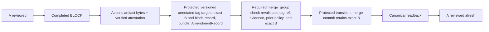

# Self reference and rollout contract

This is a required normative member of the Architecture Gatekeeper self Authority
Set. Read it with the [shared contract](../architecture.md) and every other
selected member; topic separation supplies no implicit precedence or route
activation. Setup and operating guidance are in the [documentation map](../README.md).

#### Target self-only GitHub Free/public reporter (Issue #210 A; owner decision)

Owner-adopted target A is for this public GitHub Free self-repository; it is not implemented/enforced and needs no hosted server, ChatGPT Cloud or WIF. Only an unprivileged candidate `merge_group` job relays/wakes the protected-default-branch `workflow_run` receiver. It independently resolves live queue SHA/state, current protected base, exact queued PR/B, prior-base policy, full Authority Set and exact evidence, runs existing ordinary semantic, B/G0 and deterministic validators. Candidate workflows, success, artifacts and policy confer no authority. Only protected producer receives the review API and GitHub App private keys via a `main`-only Environment; the self-repository App has only `checks:write`. Reports bind verified results to exact queue SHA and App identity; host config expects that App as check source.

This document activates no route. Reviewed profile/policy adoption precedes staged activation. Before rollout-completion, verified-host-enforcement or release claims, require exact-context spoof rejection and both protected BLOCK/OWNER_DECISION E2Es: exact B, evidence/tag handoff, queue transition, canonical readback, fresh A review. Current `pull_request_target`-only route remains until reviewed adoption.

## Dogfooding and change discipline

### Development sequence and v0.6.0 self reference profile (owner decision)

First, establish and dogfood the smallest complete self-workflow; derive later
capabilities from concrete consumer use cases and required assurance. Do not
prebuild universal host, repository-plan, provenance, or Git-merge adapters for
speculative OSS use. This sequence neither weakens existing consumer policy nor
turns self-only results into general support claims.

This repository (public GitHub Free) is the v0.6.0 reference: its previous-base
policy may select v0.5.x `OWNER_ADDITION` for missing decisions or protected
`OWNER_AMENDMENT / G0` adoption for changing existing ones, without routine
admin bypass. Final v0.6.0 must prove completed `BLOCK` and `OWNER_DECISION`
amendment cases, including the Issue #137 self contract change under prior
protected-base policy. Both preserve historical semantic results and establish
exact B, protected evidence, canonical readback, and fresh review where
applicable. A numbered preview may distribute improvements to existing
supported paths for feedback with new `OWNER_AMENDMENT` and App routes inactive;
it makes no rollout, enforcement, or completion claims for those new targets.
Final v0.6.0 still requires both cases. The first BLOCK-triggered deployment selects the
following existing host primitives, subject to the validation requirements
above and an explicit previous-base policy opt-in:

| Concern | Self reference selection |
| --- | --- |
| Initial `BLOCK` transport | Exact, versioned ReviewRecord in a GitHub Actions artifact |
| Producer provenance | GitHub artifact attestation over those exact bytes, verified against the selected protected producer workflow, revision, run and attempt |
| Transition evidence | Versioned annotated amendment tag targeting exact B and binding the completed ReviewRecord bytes, the verifiable attestation bundle bytes and AmendmentRecord; the tag ref is protected against update and deletion |
| Protected B transition | Required check on a `merge_group`, GitHub merge queue using a merge commit, and post-merge canonical readback; the merge commit retains exact B as its second parent |
| Git history | Linear history is not a requirement of this self profile; required checks and PR protection remain |

At the protected-tag handoff, the Actions artifact must be retrievable and its
attestation verifiable. The exact completed ReviewRecord bytes and attestation
bundle bytes must be copied into the tag and bound by its AmendmentRecord.
The verifier must establish byte-for-byte identity and validate the producer
provenance before relying on the tag. After that verified handoff, the original
Actions artifact need not remain available through B's canonical transition;
the protected tag becomes the transition evidence source. Its versioned tag
object must target exact B, bind the exact evidence and applicable previous
protected-base policy, and its remote ref must be protected against update and
deletion. The final required `merge_group` validation and host ordering must
establish those properties through the protected canonical transition; a
point-in-time read or successful check alone is insufficient. Missing or
unverifiable source evidence before handoff, tag content, tag-ref protection,
policy, or transition ordering leaves B `INCOMPLETE`. A queue check rerun by
itself does not establish evidence validity through transition. A fresh
completed `BLOCK` requires B's AmendmentRecord and tag to be rebound to that
new evidence. The first BLOCK-triggered deployment must demonstrate the
complete A → BLOCK → tag handoff → B → canonical → A fresh-review cycle before
reporting `OWNER_AMENDMENT / G0` for that case. This is necessary but
insufficient for v0.6.0: the OWNER_DECISION-triggered self contract-update
case must also complete the protected path. This profile selects no
private-repository provenance adapter, linear-history rewrite binding, or
squash/rebase adoption route. G0 still reports principal authentication as
`not_verified`.

Dogfooding means exercising every major path the repository requires of
consumers, not merely invoking the reusable CI workflow. Before broader rollout
of a path, at least one representative repository must exercise, as applicable:

- local pre-push and explicit manual review;
- configuration and committed-authority selection;
- packaged installation and real executable entrypoints;
- all structured decisions and deterministic validation;
- evidence creation and invalidation;
- protected-policy acceptance verification;
- CI model review and reporting.

Architecture-changing work follows this order:

1. state the owner decision in this contract or another named canonical owner;
2. review the conceptual responsibility and trust boundary locally;
3. implement the smallest conforming mechanism;
4. dogfood the affected path before push;
5. use CI as an independent acceptance check, not as the first design review.
