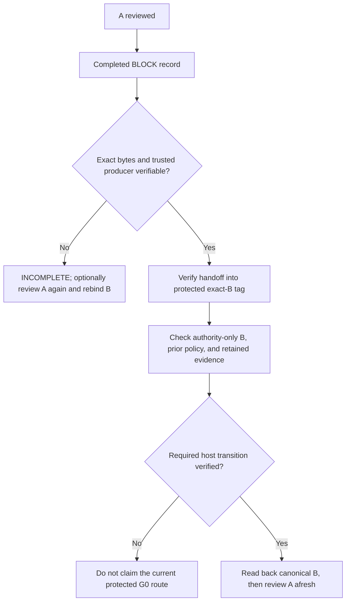

# GitHub assurance and reference configuration

This is a usage guide. [`architecture.md`](architecture.md) is the normative
contract; this guide does not enable an acceptance route. The [MIT license](../LICENSE)
supplies the software's legal terms. A Gatekeeper result describes a selected
review or adoption procedure and the evidence it verified. It is not a warranty
that the architecture decision, implementation or product is correct.

## Responsibility boundary

| Party | Responsibility and claim |
| --- | --- |
| Consumer owner | Defines canonical architecture, makes missing-decision and rule-change decisions, selects policy and accepts residual operational risk. |
| Gatekeeper | Checks selected evidence against exact revisions, authority, policy and procedure; reports what passed, failed, remained unverified or was unavailable. It cannot authenticate an owner or producer from an author-supplied claim. |
| Repository host and administrator | Configure access, branch/tag protection, required checks, bypass permissions, evidence availability and merge operation. Gatekeeper reports host enforcement only when independently verified. |

`OWNER_AMENDMENT / G0` is a **target route, not a completed self acceptance
cycle**. The v0.6.0 self contract has two separate trigger profiles:
`completed-block-v1` requires one completed, verifiable `BLOCK` for A, while
`completed-owner-decision-self-v1` requires the exact completed
`OWNER_DECISION` record. The committed main policy selects the latter at the
baseline documented below. Both profiles require exact authority-only B,
previous protected-base opt-in, trusted producer provenance and validation
through the selected protected canonical transition. Profile selection or
trigger-record production alone does not complete the amendment route. G0 does
not verify that the tag actor is the owner. If an earlier `BLOCK` record
disappears, a permitted fresh review can yield a new `BLOCK` with new B
bindings; the old bytes cannot be reconstructed from a digest. See
[#78](https://github.com/flair-agency/architecture-gatekeeper/issues/78) and
[#83](https://github.com/flair-agency/architecture-gatekeeper/issues/83).
The owner has selected a compact
[v0.6.0 public/self reference profile](architecture/self-profile.md#development-sequence-and-v060-self-reference-profile-owner-decision):
Actions artifact plus artifact attestation for initial `BLOCK` production,
followed by verified handoff of the exact record and bundle bytes into a
versioned annotated amendment tag targeting B. The tag ref must be protected
against update and deletion through B's transition; after verified handoff,
the original Actions artifact need not persist. Required `merge_group` checks
and a merge commit retain exact B identity. Selection is not E2E verification
or permission to claim the route before final ordering and canonical readback
are proven.

The following sequence describes the BLOCK-triggered profile only.



The other self trigger profile preserves the completed `OWNER_DECISION` as its
own historical trigger. This diagram does not describe that profile. Issue #147
already authorizes a separately versioned procedural `BLOCK` amendment profile,
but its profile name, wire formats and trusted backend remain unselected; it is
not an enabled route. The published preview API is separate: a consumer may
select its `preview-unverified-procedure-v1` from predecessor governance for
the bounded procedures in the [integration reference](integration-reference.md#unverified-preview-lifecycle-api).
That preview remains `UNVERIFIED` and does not satisfy protected G0, host
enforcement, or trusted producer requirements.

## Caller authorization and host integration boundary

Gatekeeper's host integration preserves its selected review, evidence,
credential and acceptance guarantees. The consumer owns caller authorization
and permission to initiate secret-bearing work under its canonical authority.
Gatekeeper does not infer that permission from host identity or membership
signals, or choose an allowlist or consumer policy.

Issue #331 records an inactive target for a shared GitHub mechanism that checks
consumer-authorized maintainer approval of an original Fork PR's exact HEAD
before consumer-funded review. Consumers retain control of approver policy and
funding scope; the selected profile, approval producer, and exact bindings
remain subject to implementation and verification. This target does not enable
a caller-authorization helper or change current routes.

An unavailable or disagreeing host signal does not authorize dynamically
weakening an adopted consumer policy. The consumer selects the relevant
principals, evidence sources and disagreement/failure rules; this guide selects
none. Caller authorization does not make candidate code safe to execute:
privileged credentials remain isolated from pull-request code and package
lifecycle scripts.

These boundaries follow the existing
[consumer authority](architecture.md#consumer-authority),
[CI credential boundary](architecture/review-execution.md#ci-model-review) and
[normative invariants](architecture.md#normative-invariants).
For GitHub integration, consult
[GitHub's official security guidance](https://docs.github.com/en/actions/reference/security/securely-using-pull_request_target)
for current platform behavior and risks. Host semantics and their discrepancies
belong to the platform; consumer-specific authorization choices require that
consumer's own decision. This guide maintains the Gatekeeper integration
boundary rather than a catalog of host identity signals or authorization recipes.

## GitHub.com plan and visibility limits

These are *available host capabilities*, not proof that a repository enabled
or correctly configured them. An individual GitHub Pro repository and an
organization GitHub Team repository are different ownership classes. Verify
the actual plan, active rules, required-check source, bypass list, workflow
revision, evidence source and merge method in each consumer.

| Repository | Branch protection / ruleset for a required check | GitHub native artifact attestation | Consequence for current protected `OWNER_AMENDMENT / G0` |
| --- | --- | --- | --- |
| Public, GitHub Free | Available | Available | A reference E2E can be tested with host-native primitives; this repository has not enabled G0 or proved B's final transition. |
| Private, GitHub Free | Not available under documented native features | Not available | Actions review, artifact retrieval, local/procedural checks and an ordinary owner merge may be possible. They cannot be reported as this **protected G0 route** using GitHub Free native controls alone. Missing host enforcement and BLOCK producer provenance must be shown separately. |
| Private, GitHub Pro / Team | Available | Not available | A protected check is possible, but the public #83 attestation route cannot authenticate the BLOCK producer here. Without a separately verified provenance adapter, the proposed G0 adoption is `INCOMPLETE`; configuration alone proves nothing. |
| Private, GitHub Enterprise Cloud | Available | Available | A native configuration is feasible, but producer validation, exact evidence, bypass, evidence lifetime and final check-to-merge ordering still require E2E proof. No G0 claim follows from the plan alone. |

GitHub documents [branch protection availability](https://docs.github.com/en/repositories/configuring-branches-and-merges-in-your-repository/managing-protected-branches/about-protected-branches),
[ruleset availability](https://docs.github.com/en/repositories/configuring-branches-and-merges-in-your-repository/managing-rulesets/available-rules-for-rulesets),
and [artifact attestation eligibility](https://docs.github.com/en/actions/how-tos/secure-your-work/use-artifact-attestations/use-artifact-attestations).
An [Actions artifact](https://docs.github.com/en/rest/actions/artifacts) supplies
bytes while it exists; artifact metadata alone does not authenticate the exact
BLOCK producer. A [check run](https://docs.github.com/en/rest/checks/runs)
supplies status, conclusion, head SHA and App identity, but is not the BLOCK
ReviewRecord. Required checks can treat skipped or neutral jobs as passing and
are bound to the relevant commit, so routing and output must also be checked
([GitHub required-check behavior](https://docs.github.com/en/pull-requests/how-tos/merge-and-close-pull-requests/troubleshooting-required-status-checks)).

GitHub Free private is an explicit limit of the **current protected amendment
contract**, not a claim that an owner cannot decide or merge. The authorized
Issue #147 procedural `BLOCK` profile still needs its own versioned contract,
wire formats, trusted backend and validation before use. The explicitly
selected preview procedure is a separate package path with `UNVERIFIED`
assurance; it is not a fallback that meets the protected contract. A separate
signing adapter could be investigated for Pro/Team private, but none is
selected or proven by this guide. Unsupported producer provenance cannot be
accepted merely by calling it G0.

### Candidate for private GitHub Free: Git evidence plus procedural adoption

This is an earlier private GitHub Free design proposal, not a supported
`OWNER_AMENDMENT / G0` behavior under the current protected-transition
contract. Issue #147 now authorizes a procedural BLOCK profile but leaves its
wire formats and trusted backend unselected. The package's current
`preview-unverified-procedure-v1` is a distinct, implemented preview path; this
older signing proposal is not that path:

1. A trusted review producer emits the exact completed `BLOCK` ReviewRecord
   for A and signs those bytes. Keep the producer's signing capability outside
   untrusted PR code and verify its workflow/service identity, revision and
   run. An owner-written `"decision":"BLOCK"` file or an ordinary Actions
   artifact is not sufficient producer provenance.
2. Put the exact ReviewRecord bytes in a reachable Git object and bind its
   digest and A/base/head identity in a signed annotated tag or another
   authenticated Git receipt. Git checks byte identity; verifying the
   signature against a pinned trusted key adds signer identity. Neither alone
   proves that the signer was the protected review producer. A movable or
   deleted ref can make the object unavailable; re-review of A can create a
   new BLOCK and require new B bindings.
3. Verify B's authority-only diff, prior recorded policy, exact B revision,
   AmendmentRecord, tag and BLOCK producer evidence. The owner inspects that
   eligibility result, adopts B with an ordinary PR merge, and a separate
   post-merge readback confirms the exact B content became canonical. Record
   `hostEnforcement=unavailable` and any policy/producer/actor assurance that
   was not actually verified. A pre-merge green check is not adoption.

Git supplies [signed annotated tags and signature verification](https://git-scm.com/docs/git-tag),
but private GitHub Free does not provide branch protection or GitHub-native
artifact attestation. Its private repositories also lack GitHub environment
secrets and protection rules, so storing a producer signing key in an ordinary
repository secret and calling it a protected producer would be unsound
([GitHub environment availability](https://docs.github.com/en/actions/how-tos/deploy/configure-and-manage-deployments/manage-environments)).
An independent signing service or an existing OIDC-backed signer with a
verified trust policy is a possible `+α`; GitHub documents
[OIDC workflow and run claims](https://docs.github.com/en/actions/reference/security/oidc),
but this adapter has not been implemented or tested here. The signer, key or
OIDC policy, Git object reachability, exact B merge/readback and negative
cases all need a bounded proof.

If separately specified and proven, this proposal could support an
**evidence-backed procedural adoption** with explicitly absent host merge
enforcement. It cannot be called the current protected `OWNER_AMENDMENT / G0`
or substituted for the selected UNVERIFIED preview procedure. A signature over
an owner-written BLOCK assertion does not establish trusted review-producer
provenance under the current contract.

## This repository as a reference

The following is a historical host-configuration snapshot recorded in the
documentation at baseline commit `3f71fece350c`, reviewed on 2026-10-07. Its
original API observation timestamp was not preserved, so these values are not
a live verification and are not permanent hosting guarantees or proof of
`OWNER_AMENDMENT`:

- `flair-agency/architecture-gatekeeper` is **public**. `main` has branch
  protection with `architecture-gate / accept` required from the GitHub Actions
  App, strict base freshness, linear history required, and force-push/deletion
  disabled. The selected v0.6.0 merge-commit profile therefore requires a
  later reviewed host-rule change; this guide does not make that change. These
  controls are available for a public repository on GitHub Free. The
  branch protection rule supplies these current branch controls. A separate
  [self amendment tag ruleset](https://github.com/flair-agency/architecture-gatekeeper/rules/24072482)
  is active for `refs/tags/architecture-gatekeeper/amendments/*`, with no
  bypass actors and update/deletion restrictions. Its configuration alone does
  not prove a complete amendment transition.
- [The caller workflow](../.github/workflows/self-architecture-gate.yml)
  invokes [the reusable Gate](../.github/workflows/architecture-gate.yml) on
  non-draft pull requests. It requests protected review instructions and
  reads [self policy](../.codex/gatekeeper/ci-policy.json) from the base.
- At baseline commit `3f71fece350c`, the committed self policy selects
  `enforced` v2 ordinary review and the self-only
  `completed-owner-decision-self-v1` `ownerAmendment` evidence producer, with
  `ownerAmendment.maxPromptBytes` explicitly set to 524,288. A later protected
  base may select a different profile; the profile used for any run must be
  read from that run's protected base.
  Under that selected profile, a completed `OWNER_DECISION` can trigger
  production of a profile-specific ReviewRecord and GitHub attestation. This
  opt-in does not enable `OWNER_AMENDMENT / G0` acceptance; a successful ordinary `PASS` check
  or a produced trigger record alone does not establish adoption.
- #83 exercised test-only real-PR BLOCK production and GitHub artifact
  attestation. Its [investigation report](investigations/2026-09-25-real-pr-block-probe-implementation.md)
  and test-only verifier remain. An [isolated merge-queue probe](https://github.com/flair-agency/architecture-gatekeeper/pull/155)
  also reran a required check on `merge_group` and preserved the exact PR head
  as a merge commit parent. A later [isolated tag probe](https://github.com/flair-agency/architecture-gatekeeper/issues/83#issuecomment-5854459496)
  recovered test-only BLOCK bytes and its attestation bundle from an annotated
  tag; an active, bypass-free tag ruleset rejected update and deletion. None
  of these probes establishes the full protected G0 transition or enables
  production G0; temporary probe rulesets and refs were removed.

Inspect the *current* host configuration before using this example:

```sh
gh repo view flair-agency/architecture-gatekeeper --json visibility,defaultBranchRef
gh api repos/flair-agency/architecture-gatekeeper/branches/main/protection
gh api repos/flair-agency/architecture-gatekeeper/rulesets
```

This reference validates what is possible in a **public GitHub Free-capable
environment**. It does not imply that a private GitHub Free consumer has the
same protection or attestation features. The first production G0 route needs
a concrete evidence source, exact producer verification, final validation
ordering and a full A → BLOCK → B → canonical → A fresh-review E2E before any
consumer-facing support claim.
