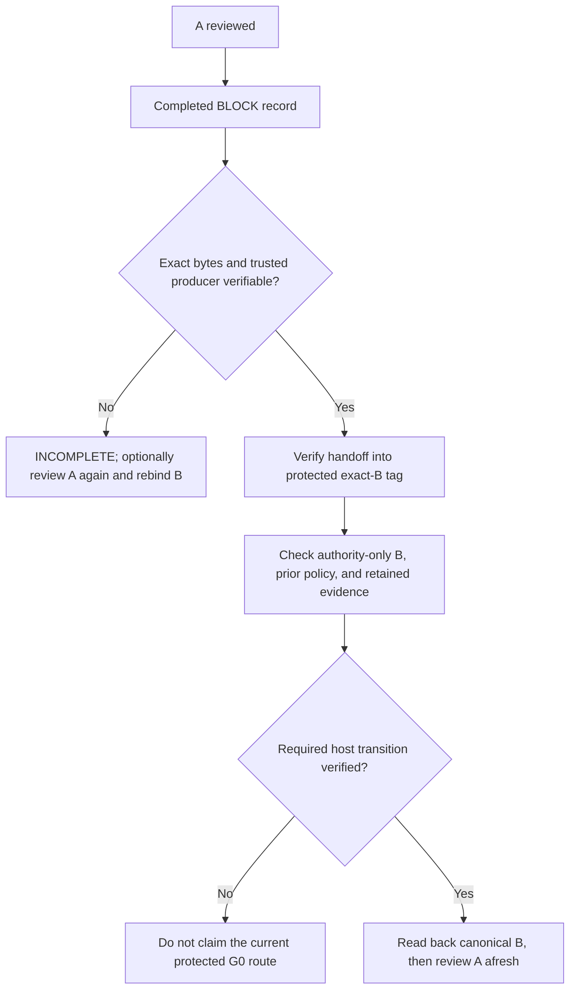

# GitHub assurance and reference configuration

This is a usage guide. [`architecture.md`](architecture.md) is the normative
contract; this guide does not enable an acceptance route. The [MIT license](../LICENSE)
supplies the software's legal terms. A Gatekeeper result describes a selected
review or adoption procedure and the evidence it verified. It is not a warranty
that the architecture decision, implementation or product is correct.

## Responsibility boundary

| Party | Responsibility and claim |
| --- | --- |
| Consumer owner | Defines canonical architecture, makes missing-decision and rule-change decisions, selects policy and accepts residual operational risk. |
| Gatekeeper | Checks selected evidence against exact revisions, authority, policy and procedure; reports what passed, failed, remained unverified or was unavailable. It cannot authenticate an owner or producer from an author-supplied claim. |
| Repository host and administrator | Configure access, branch/tag protection, required checks, bypass permissions, evidence availability and merge operation. Gatekeeper reports host enforcement only when independently verified. |

`OWNER_AMENDMENT / G0` is a **target route, not a currently enabled self-policy**.
Under the current contract it needs one completed, verifiable `BLOCK` for A,
an exact authority-only B and annotated tag, previous protected-base opt-in,
trusted producer provenance and validation through B's protected canonical
transition. G0 does not verify that the tag actor is the owner. If an earlier
BLOCK record disappears, a permitted fresh review can yield a new BLOCK, with
new B bindings; the old bytes cannot be reconstructed from a digest. See
[#78](https://github.com/flair-agency/architecture-gatekeeper/issues/78) and
[#83](https://github.com/flair-agency/architecture-gatekeeper/issues/83).
The owner has selected a compact
[v0.6.0 public/self reference profile](architecture/self-profile.md#development-sequence-and-v060-self-reference-profile-owner-decision):
Actions artifact plus artifact attestation for initial `BLOCK` production,
followed by verified handoff of the exact record and bundle bytes into a
versioned annotated amendment tag targeting B. The tag ref must be protected
against update and deletion through B's transition; after verified handoff,
the original Actions artifact need not persist. Required `merge_group` checks
and a merge commit retain exact B identity. Selection is not E2E verification
or permission to claim the route before final ordering and canonical readback
are proven.



This diagram describes the current **protected** amendment target. A future
procedural route for private GitHub Free would need a separate owner decision.

## Trusted-actor gating in `pull_request_target`

Gatekeeper's reusable workflow does not provide a trusted-actor authorization
helper or select an association allowlist. The consumer-owned caller decides
whether secret-bearing review may start. This guidance applies the existing
[consumer authority](architecture.md#consumer-authority),
[CI credential boundary](architecture/review-execution.md#ci-model-review)
and [no dynamic downgrade](architecture.md#normative-invariants) requirements;
it introduces no identity adapter, acceptance route or consumer policy.

### Identify the principal before choosing a signal

| Signal | What it describes | Authorization limit |
| --- | --- | --- |
| `pull_request.user` and `pull_request.author_association` | The PR author and that author's reported relationship to the repository | Does not identify or authorize the sender or workflow actor. |
| Event `sender` | The account reported as triggering the event | Can differ from the author; GitHub can also report a placeholder `ghost` sender. |
| `github.actor` / `GITHUB_ACTOR_ID` | The person or app associated with the initial workflow run | Identity alone supplies no consumer permission to use secrets. |
| `github.triggering_actor` | The initiator of this attempt, which can differ on a rerun | Reruns use `github.actor` privileges; rerunning as a maintainer does not replace the original author or event association. |

GitHub's [association enum](https://docs.github.com/en/graphql/reference/issues#commentauthorassociation)
describes `CONTRIBUTOR` as prior contribution and `MEMBER` as membership in the
owning organization. Neither value is a repository-role or secret-use grant.
See the [webhook sender semantics](https://docs.github.com/en/webhooks/webhook-events-and-payloads#the-sender-property)
and [Actions actor/rerun variables](https://docs.github.com/en/actions/reference/workflows-and-actions/variables#default-environment-variables).

The consumer owner must record which principals are relevant (author, event
sender, initial actor, rerun initiator, or an explicit combination), which
credentials/work are permitted, and the selected authorization evidence in that
consumer's canonical authority before changing the caller. Checking PR-author
association alone must not be described as authenticating the current actor,
proving owner approval, or making candidate code safe to execute. Do not expand
an allowlist to `CONTRIBUTOR` to repair a false denial.

### Event association and later REST association

`GITHUB_EVENT_PATH` contains the event payload for that run. A later
[`GET /repos/{owner}/{repo}/pulls/{pull_number}`](https://docs.github.com/en/rest/pulls/pulls#get-a-pull-request)
returns a separately observed PR representation, including its author
association. Preserve their source and observation time separately. The reviewed
GitHub documentation does not promise that the two association values agree,
state when either is recomputed, or establish a freshness ordering between them.
A successful REST request is not proof that its value is a more authoritative
authorization signal.

[Issue #194's investigation](investigations/2026-10-04-author-association-mismatch.md)
confirmed three event-derived `CONTRIBUTOR` denials and a later REST `MEMBER`
value. The available evidence establishes a discrepancy and correct fail-closed
routing, not its underlying GitHub cause. Membership changes, caching, timing or
a platform defect remain unproven explanations. A later read cannot rewrite an
earlier event or retroactively authorize skipped work.

### Choose the source in advance and retain denial on failure

An existing event-only caller continues to apply its adopted event policy.
Adding a diagnostic REST read does not authorize replacing the event value.
A consumer may review an optional, conservative comparison design that requires
both sources to match and satisfy its own author policy. That design needs
explicit owner adoption before it controls work; this guide enables neither
comparison nor REST-only authorization.

| Observed condition | Existing event-only policy | Owner-adopted required comparison design |
| --- | --- | --- |
| Event author association is allowed; all other required checks pass | May start the selected work under that policy | Only if the validated REST association agrees and every required principal check also passes |
| Event association is denied, including event `CONTRIBUTOR` / REST `MEMBER` under an allowlist excluding `CONTRIBUTOR` | Deny; REST cannot override it | Deny; report disagreement when present |
| Event association is allowed but the required REST association differs | A diagnostic read grants no additional authority | Deny; report disagreement when present |
| Required event or principal data is missing, malformed or unknown | Deny | Deny |
| REST read fails or cannot be validated | A diagnostic-only read grants no authority and does not change the selected event policy | Deny; no fallback to event-only or a saved earlier success |

The comparison is an example for consumer review, not a requirement that every
consumer acquire API access. A different primary source or disagreement rule is
a consumer trust-policy change, requiring its own canonical decision and
verification. Never use an automatic “allow if either source allows” rule or
retry with successively weaker signals.

### If a consumer adopts a REST lookup

The PR endpoint documents fine-grained credentials with **either** repository
`Pull requests: read` **or** `Contents: read`; public resources also support
unauthenticated reads. An Actions authorization job using its own
`GITHUB_TOKEN` can request `pull-requests: read` at that job only, with effective
access still subject to host settings. The lookup itself needs no write or
administration permission. Review actual access before adoption; the guide
does not change consumer permissions.

Keep the lookup in trusted caller code before releasing model secrets. Resolve
the fixed GitHub API destination and repository from trusted execution context,
validate the PR number, and match the response's repository, number, author ID
and relevant base/head tuple to the event being authorized. A moved head or
mismatched identity needs a new authorization/review for that tuple. Parse a
successful JSON response with known association values; missing/null/unknown
values, wrong resource, malformed JSON, authentication/permission errors,
not-found responses, rate limits, network errors and timeout leave a required
lookup denied. Bound retries and timeout. Do not follow a candidate-supplied
URL, forward credentials to an arbitrary destination, or turn API failure into
a broader allowlist. The query adds service availability, token-access and
point-in-time observation dependencies; it supplies no guarantee that identity
or permission remains unchanged until a later job.

Run the preflight without a model secret, PR checkout or candidate-controlled
executable dependencies. The secret-bearing job should require successful
completion of every authorization dependency and an explicit validated
`allowed == 'true'`; missing outputs, failed/cancelled dependencies and malformed
results keep it skipped. Record bounded nonsecret diagnostics identifying run
and attempt, event action, selected principals/source, event/API values, lookup
status and observation time, reviewed tuple, and denial reason. A successful
authorization job can legitimately mean `allowed=false`; a green workflow with
a skipped model job does not mean review completed. Treat PR data as untrusted
input rather than interpolating it into shell code.

GitHub warns that
[`pull_request_target`](https://docs.github.com/en/actions/reference/workflows-and-actions/events-that-trigger-workflows#pull_request_target)
can expose secrets or write privileges when it runs untrusted code. An identity
gate does not replace credential isolation: even an allowed author cannot
justify exposing credentials to PR code or package lifecycle scripts under the
Gatekeeper contract. Test the consumer's adopted caller with differing
principals, reruns, `CONTRIBUTOR`/`MEMBER` disagreement in both directions,
lookup failures, invalid/missing outputs and a changing PR head before enabling
secret-bearing work. This documentation change adds no reusable decision logic,
so it adds no shared mismatch-regression test or consumer workflow change.

## GitHub.com plan and visibility limits

These are *available host capabilities*, not proof that a repository enabled
or correctly configured them. An individual GitHub Pro repository and an
organization GitHub Team repository are different ownership classes. Verify
the actual plan, active rules, required-check source, bypass list, workflow
revision, evidence source and merge method in each consumer.

| Repository | Branch protection / ruleset for a required check | GitHub native artifact attestation | Consequence for current protected `OWNER_AMENDMENT / G0` |
| --- | --- | --- | --- |
| Public, GitHub Free | Available | Available | A reference E2E can be tested with host-native primitives; this repository has not enabled G0 or proved B's final transition. |
| Private, GitHub Free | Not available under documented native features | Not available | Actions review, artifact retrieval, local/procedural checks and an ordinary owner merge may be possible. They cannot be reported as this **protected G0 route** using GitHub Free native controls alone. Missing host enforcement and BLOCK producer provenance must be shown separately. |
| Private, GitHub Pro / Team | Available | Not available | A protected check is possible, but the public #83 attestation route cannot authenticate the BLOCK producer here. Without a separately verified provenance adapter, the proposed G0 adoption is `INCOMPLETE`; configuration alone proves nothing. |
| Private, GitHub Enterprise Cloud | Available | Available | A native configuration is feasible, but producer validation, exact evidence, bypass, evidence lifetime and final check-to-merge ordering still require E2E proof. No G0 claim follows from the plan alone. |

GitHub documents [branch protection availability](https://docs.github.com/en/repositories/configuring-branches-and-merges-in-your-repository/managing-protected-branches/about-protected-branches),
[ruleset availability](https://docs.github.com/en/repositories/configuring-branches-and-merges-in-your-repository/managing-rulesets/available-rules-for-rulesets),
and [artifact attestation eligibility](https://docs.github.com/en/actions/how-tos/secure-your-work/use-artifact-attestations/use-artifact-attestations).
An [Actions artifact](https://docs.github.com/en/rest/actions/artifacts) supplies
bytes while it exists; artifact metadata alone does not authenticate the exact
BLOCK producer. A [check run](https://docs.github.com/en/rest/checks/runs)
supplies status, conclusion, head SHA and App identity, but is not the BLOCK
ReviewRecord. Required checks can treat skipped or neutral jobs as passing and
are bound to the relevant commit, so routing and output must also be checked
([GitHub required-check behavior](https://docs.github.com/en/pull-requests/how-tos/merge-and-close-pull-requests/troubleshooting-required-status-checks)).

GitHub Free private is an explicit limit of the **current protected amendment
contract**, not a claim that an owner cannot decide or merge. A different
procedural amendment route would need its own owner decision, contract,
assurance labels and validation; it is not an automatic fallback. A separate
signing adapter could be investigated for Pro/Team private, but none is
selected or proven by this guide. Unsupported producer provenance cannot be
accepted merely by calling it G0.

### Candidate for private GitHub Free: Git evidence plus procedural adoption

There is a possible route worth testing. It is a **proposal**, not supported
`OWNER_AMENDMENT / G0` behavior under the current protected-transition contract:

1. A trusted review producer emits the exact completed `BLOCK` ReviewRecord
   for A and signs those bytes. Keep the producer's signing capability outside
   untrusted PR code and verify its workflow/service identity, revision and
   run. An owner-written `"decision":"BLOCK"` file or an ordinary Actions
   artifact is not sufficient producer provenance.
2. Put the exact ReviewRecord bytes in a reachable Git object and bind its
   digest and A/base/head identity in a signed annotated tag or another
   authenticated Git receipt. Git checks byte identity; verifying the
   signature against a pinned trusted key adds signer identity. Neither alone
   proves that the signer was the protected review producer. A movable or
   deleted ref can make the object unavailable; re-review of A can create a
   new BLOCK and require new B bindings.
3. Verify B's authority-only diff, prior recorded policy, exact B revision,
   AmendmentRecord, tag and BLOCK producer evidence. The owner inspects that
   eligibility result, adopts B with an ordinary PR merge, and a separate
   post-merge readback confirms the exact B content became canonical. Record
   `hostEnforcement=unavailable` and any policy/producer/actor assurance that
   was not actually verified. A pre-merge green check is not adoption.

Git supplies [signed annotated tags and signature verification](https://git-scm.com/docs/git-tag),
but private GitHub Free does not provide branch protection or GitHub-native
artifact attestation. Its private repositories also lack GitHub environment
secrets and protection rules, so storing a producer signing key in an ordinary
repository secret and calling it a protected producer would be unsound
([GitHub environment availability](https://docs.github.com/en/actions/how-tos/deploy/configure-and-manage-deployments/manage-environments)).
An independent signing service or an existing OIDC-backed signer with a
verified trust policy is a possible `+α`; GitHub documents
[OIDC workflow and run claims](https://docs.github.com/en/actions/reference/security/oidc),
but this adapter has not been implemented or tested here. The signer, key or
OIDC policy, Git object reachability, exact B merge/readback and negative
cases all need a bounded proof.

This candidate could support an **evidence-backed procedural adoption** with
explicitly absent host merge enforcement. It cannot be called the current
protected `OWNER_AMENDMENT / G0` merely because the owner accepts that risk;
that outcome would require a new owner-authorized normative route, analogous
in separation of adoption and host enforcement to the versioned
`OWNER_ADDITION` procedure. A weaker alternative where the owner merely signs
their own BLOCK assertion does not establish trusted review-producer provenance
under the current contract.

## This repository as a reference

The following is a configuration observed through the GitHub API during this
change. It is not a permanent hosting guarantee or proof of `OWNER_AMENDMENT`:

- `flair-agency/architecture-gatekeeper` is **public**. `main` has branch
  protection with `architecture-gate / accept` required from the GitHub Actions
  App, strict base freshness, linear history required, and force-push/deletion
  disabled. The selected v0.6.0 merge-commit profile therefore requires a
  later reviewed host-rule change; this guide does not make that change. These
  controls are available for a public repository on GitHub Free. The
  branch protection rule supplies these current branch controls. A separate
  [self amendment tag ruleset](https://github.com/flair-agency/architecture-gatekeeper/rules/24072482)
  is active for `refs/tags/architecture-gatekeeper/amendments/*`, with no
  bypass actors and update/deletion restrictions. Its configuration alone does
  not prove a complete amendment transition.
- [The caller workflow](../.github/workflows/self-architecture-gate.yml)
  invokes [the reusable Gate](../.github/workflows/architecture-gate.yml) on
  non-draft pull requests. It requests protected review instructions and
  reads [self policy](../.codex/gatekeeper/ci-policy.json) from the base.
- After the policy configuration is normally adopted and read back from
  `main`, the self policy selects `enforced` v2 ordinary review and the
  self-only `completed-owner-decision-self-v1` `ownerAmendment` evidence
  producer, with `ownerAmendment.maxPromptBytes` explicitly set to 524,288.
  Until that adoption, `completed-block-v1` remains the selected profile.
  Under that selected profile, a completed `OWNER_DECISION` can trigger
  production of a profile-specific ReviewRecord and GitHub attestation. This
  opt-in does not enable `OWNER_AMENDMENT / G0` acceptance; a successful ordinary `PASS` check
  or a produced trigger record alone does not establish adoption.
- #83 exercised test-only real-PR BLOCK production and GitHub artifact
  attestation. Its [investigation report](investigations/2026-09-25-real-pr-block-probe-implementation.md)
  and test-only verifier remain. An [isolated merge-queue probe](https://github.com/flair-agency/architecture-gatekeeper/pull/155)
  also reran a required check on `merge_group` and preserved the exact PR head
  as a merge commit parent. A later [isolated tag probe](https://github.com/flair-agency/architecture-gatekeeper/issues/83#issuecomment-5854459496)
  recovered test-only BLOCK bytes and its attestation bundle from an annotated
  tag; an active, bypass-free tag ruleset rejected update and deletion. None
  of these probes establishes the full protected G0 transition or enables
  production G0; temporary probe rulesets and refs were removed.

Inspect the *current* host configuration before using this example:

```sh
gh repo view flair-agency/architecture-gatekeeper --json visibility,defaultBranchRef
gh api repos/flair-agency/architecture-gatekeeper/branches/main/protection
gh api repos/flair-agency/architecture-gatekeeper/rulesets
```

This reference validates what is possible in a **public GitHub Free-capable
environment**. It does not imply that a private GitHub Free consumer has the
same protection or attestation features. The first production G0 route needs
a concrete evidence source, exact producer verification, final validation
ordering and a full A → BLOCK → B → canonical → A fresh-review E2E before any
consumer-facing support claim.
