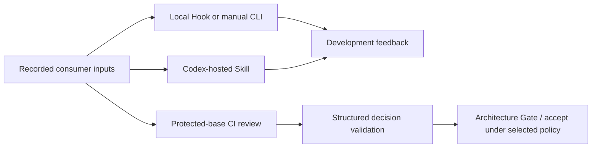

# Architecture Gatekeeper integration reference

For a short adoption path, start with the [project README](../README.md).

The [architecture contract](architecture.md) defines responsibilities and
assurance. This reference describes the current integration surface; the
[documentation map](README.md) points to operational guides.



The consumer owns its architecture and policy; this package supplies review
mechanics. For plan limits and this repository's host setup, see
[GitHub assurance](github-assurance.md).

Consumers may also own an optional decision-validation policy. The output
schema uses the following fail-closed subset of the JSON Schema constructs
accepted by OpenAI Structured Outputs: `$schema`, `description`, `$defs`, local
JSON Pointer `$ref`, `anyOf`, `type`, `enum`, `properties`, `required`,
`additionalProperties`, `items`, `minItems`, `minLength`, `minimum` and
`maximum`. Recursive local references are supported; unresolved or remote
references, malformed definitions and unsupported keywords reject the review.
Instance validation memoizes each schema/instance identity pair and is bounded
to 100,000 operations and 256 recursive evaluation levels. Exceeding either
budget, including a schema cycle that repeats without instance progress, fails
closed.
Cross-field invariants are expressed as declarative `when`/`require` rules in a
separate committed JSON file. Each condition compares a JSON Pointer value to
an explicit JSON scalar (`string`, `number`, `boolean` or `null`); object and
array equality is intentionally outside this minimal contract. The shared
runtime evaluates only those declared path/value implications and does not
infer meaning from consumer fields.

When an authority is inside a Git submodule, the local runtime reads it from the
parent revision's pinned gitlink. It never fetches a missing component;
unavailable pinned objects fail closed.

## Upgrading legacy v1 consumers

Check the installed package version and the caller's immutable workflow pin
before choosing an upgrade procedure. A consumer still on 0.5.0 is not a
0.5.1-compatible consumer merely because a newer package is installed locally.
The 0.5.1 legacy v1 repair intentionally rejects enforced policies that lack
base-selected authority and instruction paths.

The ordinary reusable `architecture-gate-consumer.yml` needs `contents: read` and
`pull-requests: write` from its caller. It contains no self-only OIDC or
attestation signer. This repository's existing `architecture-gate.yml`
retains those signing jobs and its attestation signer identity; ordinary consumers must not add `id-token: write`
or `attestations: write` to work around a self-only permission requirement.
This source change does not modify the already published 0.6.0-preview.1;
consume it only through a separately verified corrected release and exact pin.

### Adopt the protected selection before relying on the new gate

1. Inventory the existing consumer-owned canonical authority files, CI prompt,
   decision schema and optional validation file at the recorded base. Check
   the proposed selectors against those exact bytes; copying this repository's
   policy is not consumer adoption.
2. Prepare explicit v1 `authorityFiles`, `promptPath`, `schemaPath`, and
   `validationPath` (`null` if no additional validation is selected). Keep
   the existing model, effort and authority meaning. The caller must use
   protected review instructions and select the matching `validation-path`
   (empty when the recorded selection is `null`).
3. Check whether the previous consumer policy already authorizes an adoption
   process that can make this selection and its base-owned caller canonical.
   An owner must authorize the exact adoption under that consumer's governance;
   package installation, a PR comment, and this runbook do not grant that power.
4. If the old resolver rejects the new fields and the new resolver rejects the
   old base, stop the normal upgrade PR at this adoption boundary. There is no
   automatic bridge in this implementation, and this procedure authorizes no
   administrative bypass or exception. The consumer owner must identify an
   adoption process already permitted by its canonical governance and record
   the exact authorized scope and failed/incomplete Gate result. If no such
   process exists, the owner must settle that governance decision before
   proceeding. Do not temporarily drop the
   required check, enable an unselected owner route, infer selectors from the
   candidate, or convert the failure to PASS.
5. After actual adoption, read back the target branch and exact authority,
   policy and caller identities. Refresh the upgrade PR against that base and
   run the new gate. Verify least-privilege startup, protected snapshots,
   decision validation and required acceptance on the exact refreshed head.
   Local/native preparation alone is not successful CI acceptance.

Update package/lockfile and any used Skill/workflow pins consistently with the
selected corrected release. Preserve unsuccessful runs as history and report
consumer adoption and host enforcement separately. This procedure enables no
OWNER_AMENDMENT, App, merge queue, Environment migration or new owner route.

## Local integration

Install an exact release (or an exact Git commit during pre-release adoption),
then add a tiny launcher:

```js
#!/usr/bin/env node
import { runHookCli } from '@flair-agency/architecture-gatekeeper';
runHookCli();
```

The repository-owned `.codex/gatekeeper/config.json` identifies committed
inputs. See `examples/config.json`. Package resolution is local and fixed: the
launcher imports its already installed exact package version and must not use
`npx` or another registry fallback. The Hook adapter invokes an installed
`codex` binary with hooks disabled and a read-only sandbox.
See [reviewer host permissions](reviewer-host-permissions.md) for the
child-process authorization boundary.
When `validationPath` is configured, the local and manual review paths apply
that committed policy after structured generation and fail closed on a rule
violation or malformed policy.

### Optional asynchronous PostToolUse screen

A consumer may opt into a separate change screen after a supported file-capable
tool completes. This pilot reviews the bounded tracked working-tree diff and
returns informational Hook context; it does not block the completed tool,
change its result, or establish repository acceptance. No consumer is enabled
by default. Keep the launcher and hook configuration in the consumer's trusted
project, and use the exact installed package version. The normal Codex
project-trust decision still applies to the hook code and its command.

Create a consumer-owned launcher such as
`.codex/hooks/architecture-screen.mjs`:

```js
#!/usr/bin/env node
import { runPostToolScreenHookCli } from '@flair-agency/architecture-gatekeeper';
runPostToolScreenHookCli();
```

Then add this entry to the consumer's project-local `.codex/hooks.json`:

```json
{
  "hooks": {
    "PostToolUse": [
      {
        "matcher": "Bash|exec_command|apply_patch|Edit|Write",
        "hooks": [
          {
            "type": "command",
            "command": "node .codex/hooks/architecture-screen.mjs",
            "async": true,
            "timeout": 240
          }
        ]
      }
    ]
  }
}
```

The adapter accepts only `PostToolUse` events from `Bash`, `exec_command`,
`apply_patch`, `Edit`, and `Write`. It screens staged and unstaged tracked
changes up to 64 KiB. Untracked paths, dirty submodules, a changed `HEAD` during
capture, and other snapshot failures produce `incomplete`; they do not produce
a semantic decision. It waits a fixed two seconds from the first event in a
batch; later events do not extend that delay. It permits one reviewer at a time
per worktree and retries the latest changed candidate on a later eligible
event. It does not start a daemon or drain pending work after a review.
Identical candidates are deduplicated. The serialized Hook
context is capped at 4,000 UTF-8 bytes and reports status, summary, revision,
and request/snapshot identity.

This pilot is currently unsupported on native Windows because the current
single-flight lock implementation excludes `win32` and assumes atomic hard-link
support. On Windows the adapter returns informational `incomplete` before
screening. This limitation applies only to the opt-in PostToolUse screen; it
does not change the existing local review, manual, Skill, or CI paths.

The screen resolves the repository from the hook process's invocation working
directory and requires the event's `cwd` to match it. The CLI launcher must run
from the consumer session's working directory. A programmatic caller that
deliberately invokes the API from another process directory must pass the
trusted consumer directory as the `cwd` option and provide the same path in the
event.

The Hook timeout is measured in seconds and must exceed the consumer's
`reviewTimeoutMs` plus local request preparation and cleanup. For example, a
180,000 ms reviewer deadline can use a 240-second Hook timeout to leave about a
minute of headroom. Tune this to the consumer's actual timeout and host startup
cost.

This is best-effort feedback. Codex may discard an asynchronous hook's output
when a session ends; delivery can occur during the active turn or on a later
turn, and the idle host does not start a turn to deliver it. Desktop delivery
has not been verified. Keep this route opt-in and treat
`BLOCK`, `OWNER_DECISION`, and `incomplete` as informational warnings after the
tool has completed.

### First CLI trial in Architecture Gatekeeper

Use the exact installed package version with the consumer-owned launcher and
project-local `.codex/hooks.json` shown above. Start the normal CLI in the
project, trust the project and exact hook definition through the usual prompts,
then check `/hooks` for the intended handler with `Installed=1` and `Active=1`.
Make one tracked edit and continue ordinary verification while the screen
runs. The result reviews its captured candidate; untracked or unsupported
content returns `incomplete`, and `queued-latest` leaves the latest candidate
for consideration on a later eligible event; an unchanged candidate may be
deduplicated. Read Hook context in the active turn or a later user turn; an
idle session does not wake to deliver it. Treat all results as after-the-fact
development feedback and check the revision, request, and snapshot identities
before relating them to a candidate. The actual ordinary-checkout CLI loop is
recorded in the [dogfood investigation](investigations/2026-10-01-local-screening-adapter-dogfood.md).
Linked-worktree discovery remains unresolved in [Issue #250](https://github.com/flair-agency/architecture-gatekeeper/issues/250); it does not block an ordinary-checkout trial.

## Manual review

After installing a fixed package version, invoke the package-owned entrypoint
with the architecture question or proposed change:

```sh
architecture-review 'Should this responsibility move from Runtime to the Provider?'
```

The task may instead be supplied on standard input. This standalone terminal
adapter uses child `codex exec`; it is separate from the Codex-hosted Skill.
Its host boundary is described in
[reviewer host permissions](reviewer-host-permissions.md).
The command uses the same
committed consumer-owned configuration, prompt, schema, reviewer settings and
authority files as the local gate. It emits the structured `PASS`, `BLOCK` or
`OWNER_DECISION` result with the reviewed Git revision. It does not reuse Hook
input, prior Hook context or CI policy, and it does not turn a decision into
repository acceptance or implementation authority.

## Codex Skill installation

The npm package distributes the runtime and command-line entrypoints only. The
explicit `$architecture-review` workflow is distributed separately from this
repository at `skills/architecture-review/`; install that directory through the
supported Codex Skill installation route and keep its revision aligned with the
runtime release you adopt. The Skill uses the host-native reviewer/subagent
interface. It calls `architecture-review-native prepare` to construct a
committed-revision request, gives that request to a separate reviewer whose role
is limited to review and does not include changing the repository, and calls
`architecture-review-native validate` on the returned JSON. The host must apply
the recorded model and reasoning effort. Host-enforced read-only sandboxing and
an exact hard timeout are environment-specific controls; record them when
available, but they are not prerequisites for a complete native review. A
reviewer cancellation or failure leaves the review incomplete. The Skill never
falls back to the standalone CLI or launches nested `codex exec`. The
version-pinned runtime, not the Skill, selects and validates repository-owned
authority.

When recording Skill dogfood, separate a runtime prepare/validate smoke from a
host-native Skill E2E and from CI acceptance. The smoke exercises request
construction and validation only. The E2E record identifies the separate
host-native reviewer task/agent, preserves the exact prompt and schema sent
with the prepared model and reasoning effort, and traces the decision validated
back to that reviewer result. It records host-applied sandbox or timeout
controls when available. The host's model and effort must match the prepared
settings. This is diagnostic execution evidence,
not cryptographic merge evidence; CI acceptance remains the protected-policy
workflow result. Use the [native Skill E2E record template](investigations/native-skill-e2e-template.md).

## Distribution

Runtime releases are published as fixed public versions to the `@flair-agency`
GitHub Packages npm registry. Public package visibility does not make GitHub
Packages anonymous: consumers still need normal GitHub Packages authentication
with `read:packages`. A release tag must identify the exact commit whose
`package.json` declares that version. The publication workflow packs and
inspects the archive, installs it in an empty directory, exercises every public
executable, publishes with package lifecycle scripts disabled, and reads the
published version and integrity back from the registry. Reusable GitHub Actions
workflows remain pinned separately to an exact Git commit SHA.

## CI integration

Call the reusable workflow at the immutable commit that produced the reviewed
release, and pass only the two credentials declared by the workflow:

```yaml
jobs:
  architecture-gate:
    permissions:
      contents: read
      pull-requests: write
    uses: flair-agency/architecture-gatekeeper/.github/workflows/architecture-gate-consumer.yml@<release-commit-sha>
    secrets:
      OPENAI_API_KEY: ${{ secrets.OPENAI_API_KEY }}
      CI_SOURCE_READ_TOKEN: ${{ secrets.CI_SOURCE_READ_TOKEN }}
```

The caller keeps `.codex/gatekeeper/ci-policy.json`, its prompt and schema. CI
policy is read from the protected base revision, so a pull request cannot waive
its own review. `enforced` runs the exact-SHA-pinned
`openai/codex-action` v1.12 at commit
`86365089eb2b84e0a8fb0717b304f8bdcb13b20e`. The upstream Action is a trusted
credential-bearing dependency under the
[selected trust contract](architecture.md#ci-model-review).
The migration retires the temporary Flair fork and its additional lifecycle
controls; it does not establish that hosted hangs are fixed. `local-only`
records an explicit waiver and makes no OpenAI API call.

### Gemini CI Review Runner

Architecture Gatekeeper includes a standalone, zero-external-dependency runner
and credential-isolated proxy architecture (`src/gemini-launcher.mjs`,
`src/gemini-security-proxy.mjs`, and `src/gemini-ci-runner.mjs`) for executing
fail-closed architecture reviews with Google Gemini.

In accordance with the normative architecture contract (`docs/architecture.md`),
the launcher/proxy boundary supplies credential non-inheritance and scoped
dispatch; it does not supply same-user host isolation:
- **Trusted Launcher (`src/gemini-launcher.mjs`)**: Privileged supervisor process that receives
  credentials in trusted CI, starts the security proxy on local loopback, strips all sensitive
  known credential and OIDC environment selectors, and spawns the runner. It requires
  supplied credentials rather than local gcloud renewal and applies a bounded session
  deadline with child termination and proxy cleanup.
- **Security Proxy (`src/gemini-security-proxy.mjs`)**: Listens strictly on `127.0.0.1:<ephemeral>`,
  enforces strict route allowlisting (`POST ...:generateContent`), injects credentials in-flight,
  and rejects redirects and non-allowlisted routes with `403 Forbidden`.
- **Review Runner (`src/gemini-ci-runner.mjs`)**: Credential-free client that connects to the
  loopback proxy, parses results, deterministically validates decisions, and outputs results.

It supports two authentication modes with automatic endpoint routing:

- **Keyless Google Cloud Workload Identity Federation (WIF) with Vertex AI (Recommended)**:
  When a short-lived OAuth Bearer token (`CLOUDSDK_AUTH_ACCESS_TOKEN` via
  `google-github-actions/auth@v2`) is present along with a Google Cloud project
  (`GOOGLE_CLOUD_PROJECT`), requests automatically route to Google Cloud Vertex AI
  (`https://${REGION}-aiplatform.googleapis.com/...`). This avoids static API keys entirely.
- **Static API Key with Google AI Studio**:
  When `GEMINI_API_KEY` is supplied, requests automatically route to
  Google AI Studio (`https://generativelanguage.googleapis.com/...`).

Environment bearer tokens take precedence over environment API keys; explicit
credential options follow the transport's explicit-option precedence. The runner
validates decisions under the selected route and creates `decision.json` with mode
`0600` in a private temporary directory outside the checkout by default. Explicit
output paths must also be outside the reviewed repository and must not already
exist. When `GITHUB_OUTPUT` is present, it publishes `decision-kind`, `decision-file`
and `final-message` through the verified runner command-file directory, including
from a checkout working directory. Required output publication failure fails the
command. CI adoption must separately select a trusted runtime and acceptance policy.

The primary reviewer accepts a `review-job-timeout-minutes` input (default 7)
and a `review-step-timeout-minutes` input (default 5). This repository's
protected self-review caller reads the optional Actions repository variable
`ARCHITECTURE_GATE_REVIEW_JOB_TIMEOUT_MINUTES`, with the same 7-minute default;
the step input remains at its reusable-workflow default. The reusable workflow
raises valid job limits below the selected step limit plus one minute and
rejects limits above GitHub's 360-minute maximum. The step limit must be a
positive integer no greater than 359. Malformed values fail before the primary
review job starts. Other review jobs, including `OWNER_ADDITION` and
`OWNER_AMENDMENT`, keep their separately defined limits.

Upstream v1.12 has no fork-specific 240-second inner deadline input. The
primary Action step keeps its configured outer timeout; OWNER_ADDITION and
OWNER_AMENDMENT Action calls retain five-minute outer step caps. These limits
allocate time through GitHub Actions; cancellation and process cleanup remain
best effort, without a guarantee that every descendant stops. The job limit
also covers checkout, authority materialization and diagnostics, subject to
runner cancellation behavior.
If the Action step fails or times out, the next diagnostic step records the
Action outcome, whether its final-message file was written, the file size and
JSON parseability, and the installed Codex CLI/proxy versions without printing
the decision or credentials. A parseable final-message file after a timeout
points to a post-output Action/CLI lifecycle problem; an absent or invalid file
leaves the model/API execution path in question. The distinction is diagnostic
only: either failure remains incomplete and cannot satisfy
`Architecture Gate / accept`.
GitHub's **Re-run jobs → Enable debug logging** can add runner and step traces
for an individual attempt when more detail is needed.

Version 1 of `.codex/gatekeeper/ci-policy.json` accepts only `version`,
`default`, and `branches` at the top level. Both `default` and every named
branch use one of these shapes:

```json
{
  "version": 1,
  "default": { "mode": "local-only" },
  "branches": {
    "main": {
      "mode": "enforced",
      "model": "gpt-6.1-sol",
      "reasoningEffort": "medium",
      "authorityFiles": ["docs/architecture.md"],
      "promptPath": ".codex/gatekeeper/ci-prompt.md",
      "schemaPath": ".codex/gatekeeper/decision.schema.json",
      "validationPath": null
    }
  }
}
```

`local-only` accepts only `mode`; legacy v1 `enforced` requires `mode`, `model`,
`reasoningEffort`, a nonempty, unique `authorityFiles` list of canonical
repository paths, `promptPath`, `schemaPath`, and an explicit `validationPath`.
Set `validationPath` to a canonical JSON path to run consumer decision
validation, or to `null` to declare that no additional validation is selected.
The caller's `validation-path` input must exactly match that recorded-base
selection; omission or replacement fails before review. Under a `pull_request`
caller, `policy-path` must be
the fixed `.codex/gatekeeper/ci-policy.json` path. The v1 CI
review requires `protected-review-instructions: true`, receives those base
snapshots with protected prompt and schema, verifies the
same exact paths in the decision, and fails closed if B modifies any selected
authority file. Existing enforced v1 consumers without this selector must
adopt an explicit path or `null` in their base policy and set the matching
caller input before ordinary acceptance can resume. A change
to the selector in a candidate head cannot enable its own review. `model` is a nonempty identifier using
letters, digits, `.`, `_`, or `-`; `reasoningEffort` is one of `minimal`, `low`,
`medium`, `high`, `xhigh`, `max`, or `ultra`. Policy resolution validates every
branch entry, even when another branch is being reviewed. Unknown fields,
incomplete entries, or unsupported policy versions fail the policy job rather
than falling back to an older review route. Before upgrading the workflow,
remove previously ignored metadata and correct any stale branch entries.

Policy version 2 adds an opt-in distributed Authority Set to an `enforced`
branch. The protected-base branch entry must declare both
`authorityManifestPath` and every `authorityLimits` value. For example:

```json
{
  "version": 2,
  "default": { "mode": "local-only" },
  "branches": {
    "main": {
      "mode": "enforced",
      "model": "gpt-6.1-sol",
      "reasoningEffort": "medium",
      "authorityManifestPath": ".codex/gatekeeper/authorities.json",
      "authorityLimits": {
        "maxManifestBytes": 16384,
        "maxMembers": 16,
        "maxFileBytes": 65536,
        "maxTotalBytes": 262144,
        "maxPromptBytes": 524288
      }
    }
  }
}
```

The manifest is a version 1 selector with an `authorities` array of stable
`id`, GitHub `repository` (or `self`), immutable `revision` (or
`authority-revision` for `self`), and `.md` `path` values. The selected
protected output schema must require `authorityIds` as a nonempty string
array, and the caller must set `protected-review-instructions: true`. The
workflow checks the schema, complete prompt size, every selected source and
exact reported IDs before accepting a result. Missing or oversized limits,
sources or IDs fail the review. The runtime ceilings are 65,536 manifest
bytes, 32 members, 131,072 bytes per file, 524,288 bytes total, and 1,048,576
bytes for the complete prompt. The values above are the recommended effective
profile. This repository's self-review selects the version 2 route from its
protected base, with `docs/architecture.md` as its first Authority Set member.
The adoption pull request is reviewed under the prior protected-base policy;
the new selection applies to subsequent pull requests after merge. Local and
manual review can opt in separately through version 2 of
`.codex/gatekeeper/config.json`.

The selected upstream Action is pinned to an immutable commit. The workflow
no longer runs the fork-specific source/provenance verification, dependency
installation, full Action tests, rebuilt-dist comparison or integrity-observation
jobs on each review. This reduces repeated work and adopts upstream dependency
trust; it does not preserve the previous source/bundle verification claim.
Review jobs retain policy dependencies and credential isolation. A revision
update remains a reviewed workflow change. Git history retains the retired fork manifests. The
[Issue #45 trust investigation](investigations/2026-09-23-codex-action-integrity-trust-design.md)
documents the retired mechanism, not active authorization.

To enforce consumer-owned cross-field invariants in CI, pass
`validation-path` to the reusable workflow. The file is always read from the
protected base revision. Validation runs with the called workflow's immutable
runtime after the model returns and before the review job can succeed; neither
the policy nor its evaluator executes pull-request code.

The workflow publishes the result as a GitHub Actions job summary and creates
or updates one marker-owned pull-request comment. The caller must grant
`pull-requests: write` as shown above. If the token is read-only, as it normally is for a
fork pull request, the job summary and authoritative `Architecture Gate / accept`
result remain available and comment delivery is reported as a warning. Do not
switch to `pull_request_target` merely to make comments writable while checking
out or executing pull-request code.

A consumer may add an optional `findings` array to its output schema. Each
finding has a short `title`, actionable `body`, and optional `location` with a
repository-relative `path`, `line`, and `side` (`RIGHT` for an added new-file
line or `LEFT` for a deleted old-file line). The reporter caps this at 20
findings (200-character titles and 2,000-character bodies), checks the live PR
head and confirms each location against complete added/deleted diff hunks from
the PR files API, then posts all new valid findings in one GitHub review with
event `COMMENT`. Renamed, binary, missing, and truncated patches are deferred
to the summary. The review is feedback only; it does not affect
`Architecture Gate / accept`.
Every inline comment body identifies Architecture Gatekeeper, independently
of the GitHub actor display name; `BLOCK` and `OWNER_DECISION` comments also
carry the same status icon as the report heading. The sticky report and
Actions job summary link each posted or already-present finding to its direct
GitHub inline comment URL, using the URL returned by GitHub. If GitHub accepts
a review but does not return comment URLs, the finding remains reported as
delivered and the missing links are called out as a non-authoritative warning.
Unlocated, invalid, stale-head, or unpostable findings remain in the job
summary/sticky report, and delivery/API errors produce a warning. A stable
per-head finding marker and a report-job-only PR concurrency group prevent
reposting the same finding on reruns; semantic review and acceptance jobs are
not serialized by this group. The report job already holds the
`pull-requests: write` token; no credential is passed to the reviewer. Output
schemas without `findings` remain compatible.

Inline review delivery currently targets the GitHub.com public API only. The
reporter rejects another API origin or malformed repository, PR-number, or
head-SHA context before making comment API requests; GitHub Enterprise Server
delivery is not supported by this integration.

`OWNER_DECISION` fails the current accept check. A missing decision belongs in
a separate authority-only B; an implementation PR cannot use authority added
in its own head to resolve its protected-base review. A previous-base policy
may opt in to `OWNER_ADDITION / G0` with an exact-B annotated tag and matching
`ownerDecisionId`. Policy v2 requires one `self` authority; v4/v5 review the
complete set while B changes one existing file. G0 does not authenticate the
tagger, and B's adoption does not accept A. See the
[owner-intervention runbook](owner-intervention.md) for the sequence and
[architecture contract](architecture.md) for the route's exact conditions.
The self policy has not selected it. A release or fixture result alone does
not activate a consumer route or establish a work-completion claim.

### Versioned multi-document owner additions

The v0.5.1 implementation adds an opt-in **policy v4** enforced route. Policy
v2 and historical G0 records retain their existing limits and interpretation.
Adopt the new configuration and schemas in the protected base before proposing
B; B cannot enable or reconfigure its own route. The complete Authority Set
must contain the affected `self` member exactly once by ID and path, along with
every other governing document. B still modifies exactly that one existing
file. Both ordinary review and B-specific eligibility review load the complete
base-selected set; candidate B bytes and its diff are additional evidence.

```json
{
  "version": 4,
  "default": { "mode": "local-only" },
  "branches": {
    "main": {
      "mode": "enforced",
      "model": "gpt-6.1-sol",
      "reasoningEffort": "medium",
      "authorityManifestPath": ".codex/gatekeeper/authorities.json",
      "authorityLimits": {
        "maxManifestBytes": 16384,
        "maxMembers": 16,
        "maxFileBytes": 262144,
        "maxTotalBytes": 524288,
        "maxPromptBytes": 1048576
      },
      "ownerAddition": {
        "version": 2,
        "grade": "G0",
        "authorityId": "architecture-contract",
        "authorityPath": "docs/architecture.md",
        "promptPath": ".codex/gatekeeper/owner-addition.md",
        "schemaPath": ".codex/gatekeeper/owner-addition.schema.json"
      }
    }
  }
}
```

Only this route supports the 262,144-byte per-file ceiling. A consumer's lower
effective limits still apply; initial CI and local/manual routes retain the
131,072-byte runtime ceiling. Base and proposed authority sets must each fit
the selected total limit. The entire review prompt must fit its limit,
including authority bytes, proposed bytes, diff, instructions and metadata.
No member is truncated or omitted to fit a budget.

The ordinary schema must require `authorityIds`, `authoritySetDigest` and
`ownerDecisionId`. The model must return every selected ID exactly once and
the supplied set digest; `ownerDecisionId` identifies the missing choice when
the result is `OWNER_DECISION`. The version-2 eligibility schema adds required
`version: 2`, `authorityIds` and `authoritySetDigest` to the existing eligibility
booleans. See the [example schema](../examples/owner-addition-v2/eligibility.schema.json).
Consumer-specific boolean checks may be added and must all be true.

Create a new annotated tag for exact B using **AdditionRecord version 2**.
Alongside the v1 repository/base/head/policy-revision, affected authority
before/after digests, missing-decision and purpose fields, v2 requires
`policySha256` (digest of exact previous-base policy bytes) and `authoritySet`
with `manifestSha256` and `setDigest` from the complete materialized base set.
The existing canonical JSON annotation encoding and exact-B tag name remain
required. A v1 tag cannot be upgraded by changing policy alone. The version-2
procedure/report records those bindings, every member's immutable provenance,
and the observed tag-object mapping; the ordinary and eligibility results must
agree on the complete set. A mismatch or unavailable member fails closed.

Eligibility continues to reject a change to an existing rule, an unsupported
completion claim, a contradiction in any unchanged member, an unrelated owner
choice, or an ordinary `BLOCK`. G0 still does not authenticate an owner or
promise that the tag ref remains available later. LIVE Agency adoption and its
representative E2E remain separate rollout work; implementing this route does
not itself resolve its consumer-specific rule conflict or migration evidence.

### Versioned procedural adoption without host merge enforcement

Policy v5 implements a separate `procedural` route selected from the recorded
base. It keeps the v4 complete Authority Set review and one-file B write scope.
The v0.5.1 package-release gate is the fixture E2E. The representative LIVE
Agency E2E remains a separate route-activation prerequisite under the
owner-adopted contract in `docs/architecture.md` (PR #140). A package release does
not by itself activate the route for LIVE Agency. When the route is released,
a consumer without a required `Architecture Gate / accept` check can keep the
absence of host enforcement explicit. Its v5 policy then
replaces the v4 `version` with `5`, selects `mode: "procedural"` for the target
branch, and adds the following branch field:

```json
"adoptionEvidence": {
  "producer": "github-actions",
  "workflowPath": ".github/workflows/architecture-gate.yml",
  "jobName": "architecture-gate / owner-addition"
}
```

The workflow path is the consumer's caller workflow, and the job name must
match its `owner-addition` job. The base policy selects both; B cannot change
them for its own review. The B check records `eligibility=eligible`,
`adoption=pending`, `canonical=pending` and uploads the exact review evidence.
The green check alone does not establish adoption. After an ordinary PR merge
commit, the finalizer checks the pre-merge Actions run and selected producer
job, including its unique successful evidence-upload step and the artifact's
job-scoped check annotation that binds the uploader's artifact ID and digest.
It then checks the exact B and two-parent merge commit and freshly reads the
target branch and authority bytes. Only then can the
record report valid `OWNER_ADDITION / G0` adoption and verified canonical
placement. v0.5.1
does not support squash or rebase merge for B. G0 leaves actor identity
unverified, and this route does not claim GitHub enforced the check.

The finalizer is `architecture-owner-addition-finalize <owner/repo> <B PR>
--run-id <Actions run ID> [--attempt N] [--output record.json]`. It uses the
locally authenticated `gh` token unless `GH_TOKEN` or `GITHUB_TOKEN` is set,
reads GitHub evidence, and writes a record only when an output path is
explicitly given. Its output does not replace A's fresh review after B is
canonical. See the [owner-intervention runbook](owner-intervention.md).
The token needs read access to both Actions and Checks evidence in the target
repository; a fine-grained token must include Actions: read and Checks: read.

For `OWNER_DECISION` and CI review failures caused by API, billing, model,
credential or service availability, follow the
[owner-intervention runbook](owner-intervention.md). CI failure remains
fail closed; any repository-owner merge bypass is recorded as an explicit
operational exception outside Architecture Gate acceptance.

This repository dogfoods the reusable workflow through
`.github/workflows/self-architecture-gate.yml`. The `pull_request_target` caller
requires the scoped [self-Gate Actions event policy](self-gate-actions-policy.md)
before GitHub's 2026-11-02 enforcement date. The caller and its policy, prompt
and schema come from the protected base, with
`protected-review-instructions: true`. Jobs checking out candidate code have
only `contents: read`; the reporting job has `pull-requests: write` but checks
out only the immutable called-workflow source and executes no candidate code.
Checkout-owned `AGENTS.md` is evidence, not automatically loaded reviewer
instruction. The input defaults to `false` only for consumers bootstrapping
their first base-owned prompt and schema.

The repository also dogfoods the local and Codex-hosted Skill paths through
`.codex/gatekeeper/config.json`. Version 2 selects a committed authority
manifest, self repository and five effective limits. Manual CLI, Hook and
native preparation read one recorded commit, require exact `authorityIds`,
and report set digest and member provenance. The complete local prompt must
fit its limit. An external member leaves local review incomplete; it cannot
fall back or use a source token. Version 1 public request/review APIs remain.
Working-tree content is evidence, not authority. Native self-review fails
closed after its 180-second deadline.

Lifecycle-workaround adoption evidence and repeat dogfood results are tracked
in [architecture-gatekeeper issue #15](https://github.com/flair-agency/architecture-gatekeeper/issues/15).

Consequently, the first pull request that introduces this caller cannot execute
the self-review. After that bootstrap change is adopted, subsequent pull
requests exercise the real model review, job summary and sticky-comment path.

The reusable workflow uses GitHub.com's `job.workflow_repository`,
`job.workflow_sha` and `job.workflow_ref` identity properties to load and report
the exact called-workflow revision instead of code from the consumer checkout.
These properties are not available on GitHub Enterprise Server, which is not a
supported CI target for this workflow.

## Trust boundary

This is an architecture guardrail, not a tamper-resistant security boundary.
Local execution assumes a trusted Git executable, normal object resolution and
the same-user environment already trusted to run project hooks. CI relies on a
clean GitHub checkout. No review stage implements filesystem monitoring, path
leases, rollback, local object-store defense or malicious-operator resistance.

### Local reviewer execution composition

Local manual review, UserPromptSubmit and post-tool screening use the shared
local execution boundary rather than importing a provider transport. Existing
Codex CLI defaults and synchronous APIs remain compatible. Programmatic manual
and UserPromptSubmit calls accept an optional third argument `{ reviewer }`;
post-tool screening retains its existing reviewer option. The adapter receives
the revision-bound request and, on the async path, an optional AbortSignal in
its second argument. It returns a raw structured decision; the caller still
validates schema, selected authority and committed validation policy.

Use the async API for a Promise-returning adapter. The sync API rejects such
adapters and does not run a nested event loop. Async deadlines reject late
results and request cooperative cancellation; they do not prove physical
termination of an adapter. A blocking adapter must enforce its own process
bound. Errors and invalid decisions remain incomplete, with no provider
fallback. This seam does not select Gemini for the CLI or adopt provider-setting
equivalence; explicit recorded provider settings and execution identity remain
follow-up work under #265 coordinated with #252.

The Gemini loopback proxy rejects complete serialized request bodies exceeding
16 MiB, including chunked uploads, before upstream dispatch. This implementation
limit accommodates JSON expansion beyond prompt bytes; it does not truncate inputs
or replace configured prompt limits. It is not a whole-process memory guarantee.
