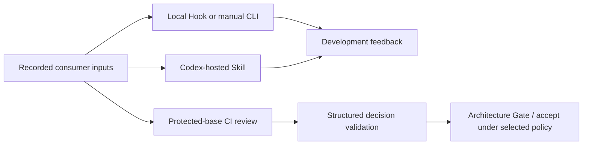

# Architecture Gatekeeper integration reference

For a short adoption path, start with the [project README](../README.md).

The [architecture contract](architecture.md) defines responsibilities and
assurance. This reference describes the current integration surface; the
[documentation map](README.md) points to operational guides.



The consumer owns its architecture and policy; this package supplies review
mechanics. For plan limits and this repository's host setup, see
[GitHub assurance](github-assurance.md).

## Manual review

This walkthrough creates a small consumer repository, installs the exact
published runtime, commits every review input, and runs one local review. It
uses the Codex provider selected by the sample settings. The CLI evaluates the
task you supply against the committed authority; it does not automatically
review an uncommitted working-tree diff. Describe the proposed change clearly
in the task or include a concise diff summary.

Before starting, use Node.js 22 or later and Git. Authenticate npm to GitHub
Packages with `read:packages` outside the project, and sign in to the local
Codex CLI with `codex login`; configure a Git author identity so the consumer
inputs can be committed. Do not put a package token in the repository.
The package entrypoint below is pinned to `0.6.0-preview.3`.

Create the complete consumer input set and package lock:

```sh
set -eu
mkdir -p architecture-review-demo/.codex/gatekeeper architecture-review-demo/docs
cd architecture-review-demo
git init -b main
npm init --yes
npm pkg set private=true --json
npm pkg set type=module

cat > docs/architecture.md <<'EOF'
# Demo consumer architecture

The API layer validates each request before storage. The storage layer persists
validated records. The consumer repository owns this architecture.
EOF

cat > .codex/gatekeeper/config.json <<'EOF'
{
  "version": 1,
  "authorityFiles": ["docs/architecture.md"],
  "promptPath": ".codex/gatekeeper/prompt.md",
  "schemaPath": ".codex/gatekeeper/decision.schema.json",
  "reviewerConfigPath": ".codex/gatekeeper/reviewer.config.json",
  "requiredReportedAuthorityFiles": ["docs/architecture.md"],
  "requiredPassArrays": ["reviewedScope"],
  "reviewTimeoutMs": 180000
}
EOF

cat > .codex/gatekeeper/prompt.md <<'EOF'
Review the proposed change only against the committed consumer architecture
included in the request. Return PASS if it follows that design, BLOCK if it
conflicts with an existing rule, or OWNER_DECISION if the architecture does not
decide the question. Report docs/architecture.md in authorityFiles and briefly
describe the reviewed scope. Do not implement changes.
EOF

cat > .codex/gatekeeper/decision.schema.json <<'EOF'
{
  "type": "object",
  "additionalProperties": false,
  "required": ["decision", "summary", "authorityFiles", "reviewedScope"],
  "properties": {
    "decision": { "enum": ["PASS", "BLOCK", "OWNER_DECISION"] },
    "summary": { "type": "string", "minLength": 1 },
    "authorityFiles": {
      "type": "array",
      "minItems": 1,
      "items": { "type": "string", "minLength": 1 }
    },
    "reviewedScope": {
      "type": "array",
      "items": { "type": "string", "minLength": 1 }
    }
  }
}
EOF

cat > .codex/gatekeeper/reviewer.config.json <<'EOF'
{
  "model": "gpt-6.1-sol",
  "reasoningEffort": "low"
}
EOF

cat > .gitignore <<'EOF'
node_modules/
EOF

npm install --package-lock-only --save-exact @flair-agency/architecture-gatekeeper@0.6.0-preview.3 --registry=https://npm.pkg.github.com
git add package.json package-lock.json docs/architecture.md .codex/gatekeeper .gitignore
git commit -m "Add consumer architecture review inputs"
npm ci
git status --short
```

The status command should print no paths. The config, prompt, schema, reviewer
settings, authority document and exact package pin are committed before the
review starts. Run the installed CLI with a specific proposed decision:

```sh
./node_modules/.bin/architecture-review \
  "For the proposed API change, should request validation stay in the API layer before storage persistence?"
```

The CLI prints a schema-validated JSON decision, the reported authority and
scope, and `reviewedRevision`. That field must equal `git rev-parse HEAD` from
the consumer repository. The process exits 0 for a schema-valid `PASS`,
`BLOCK`, or `OWNER_DECISION`; these are semantic review outcomes, not acceptance.
`PASS` means the described proposal fits this
sample authority; `BLOCK` means it conflicts with a stated rule;
`OWNER_DECISION` means the authority leaves that question open. The result is
review evidence only and does not authorize implementation or repository
acceptance. The semantic result depends on the actual proposal and consumer
authority; the sample is not a test oracle.

For other local provider settings, the terminal adapter follows the committed
reviewer configuration: Codex uses child `codex exec`, while Gemini uses the
asynchronous API transport without starting Codex. Both consume the committed
configuration, prompt, schema, reviewer settings and authority files. This
terminal route is separate from the Codex-hosted Skill and does not reuse Hook
input, prior Hook context or CI policy. See [local execution composition](#local-reviewer-execution-composition)
and [reviewer host permissions](reviewer-host-permissions.md) for provider
boundaries.

If authentication, configuration, authority files or reviewer execution fail,
the command exits 2 without a valid decision. Resolve that input or host failure
and rerun against the intended committed revision. A timeout or malformed
response is incomplete review, not `PASS`. For CI and acceptance responsibilities,
continue to [CI integration](#ci-integration); for escalation and recovery, see
[owner intervention](owner-intervention.md).

Consumers may also own an optional decision-validation policy. The output
schema uses the following fail-closed subset of the JSON Schema constructs
accepted by OpenAI Structured Outputs: `$schema`, `description`, `$defs`, local
JSON Pointer `$ref`, `anyOf`, `type`, `enum`, `properties`, `required`,
`additionalProperties`, `items`, `minItems`, `minLength`, `minimum` and
`maximum`. Recursive local references are supported; unresolved or remote
references, malformed definitions and unsupported keywords reject the review.
Instance validation memoizes each schema/instance identity pair and is bounded
to 100,000 operations and 256 recursive evaluation levels. Exceeding either
budget, including a schema cycle that repeats without instance progress, fails
closed.
Cross-field invariants are expressed as declarative `when`/`require` rules in a
separate committed JSON file. Each condition compares a JSON Pointer value to
an explicit JSON scalar (`string`, `number`, `boolean` or `null`); object and
array equality is intentionally outside this minimal contract. The shared
runtime evaluates only those declared path/value implications and does not
infer meaning from consumer fields.

When an authority is inside a Git submodule, the local runtime reads it from the
parent revision's pinned gitlink. It never fetches a missing component;
unavailable pinned objects fail closed.

<a id="adopt-the-protected-selection-before-relying-on-the-new-gate"></a>

## Upgrading legacy v1 consumers

The operator procedure now lives in [Owner intervention](owner-intervention.md#legacy-v1-consumer-upgrade).
This reference retains the old heading and subsection fragments for links from
release and consumer documentation.

## Local integration

Install an exact release (or an exact Git commit during pre-release adoption),
then add a tiny launcher:

```js
#!/usr/bin/env node
import { runHookCli } from '@flair-agency/architecture-gatekeeper';
runHookCli();
```

The repository-owned `.codex/gatekeeper/config.json` identifies committed
inputs. See `examples/config.json`. Package resolution is local and fixed: the
launcher imports its already installed exact package version and must not use
`npx` or another registry fallback. The Hook adapter selects the provider from
committed reviewer settings. Codex uses an installed `codex` binary with hooks
disabled and a read-only sandbox; Gemini uses its asynchronous API adapter and
does not inherit the Codex child-process sandbox. See [local execution
composition](#local-reviewer-execution-composition) and [reviewer host
permissions](reviewer-host-permissions.md) for the provider-specific boundary.
When `validationPath` is configured, the local and manual review paths apply
that committed policy after structured generation and fail closed on a rule
violation or malformed policy.

### Optional asynchronous PostToolUse screen

A consumer may opt into a separate change screen after a supported file-capable
tool completes. This pilot reviews the bounded tracked working-tree diff and
returns informational Hook context; it does not block the completed tool,
change its result, or establish repository acceptance. No consumer is enabled
by default. Keep the launcher and hook configuration in the consumer's trusted
project, and use the exact installed package version. The normal Codex
project-trust decision still applies to the hook code and its command.

Create a consumer-owned launcher such as
`.codex/hooks/architecture-screen.mjs`:

```js
#!/usr/bin/env node
import { runPostToolScreenHookCli } from '@flair-agency/architecture-gatekeeper';
runPostToolScreenHookCli();
```

Then add this entry to the consumer's project-local `.codex/hooks.json`:

```json
{
  "hooks": {
    "PostToolUse": [
      {
        "matcher": "Bash|exec_command|apply_patch|Edit|Write",
        "hooks": [
          {
            "type": "command",
            "command": "node .codex/hooks/architecture-screen.mjs",
            "async": true,
            "timeout": 240
          }
        ]
      }
    ]
  }
}
```

The adapter accepts only `PostToolUse` events from `Bash`, `exec_command`,
`apply_patch`, `Edit`, and `Write`. It screens staged and unstaged tracked
changes up to 64 KiB. Untracked paths, dirty submodules, a changed `HEAD` during
capture, and other snapshot failures produce `incomplete`; they do not produce
a semantic decision. It waits a fixed two seconds from the first event in a
batch; later events do not extend that delay. It permits one reviewer at a time
per worktree and retries the latest changed candidate on a later eligible
event. It does not start a daemon or drain pending work after a review.
Identical candidates are deduplicated. The serialized Hook
context is capped at 4,000 UTF-8 bytes and reports status, summary, revision,
and request/snapshot identity. Optional execution metadata is omitted when
needed to keep the serialized output within that cap.

This pilot is currently unsupported on native Windows because the current
single-flight lock implementation excludes `win32` and assumes atomic hard-link
support. On Windows the adapter returns informational `incomplete` before
screening. This limitation applies only to the opt-in PostToolUse screen; it
does not change the existing local review, manual, Skill, or CI paths.

The screen resolves the repository from the hook process's invocation working
directory and requires the event's `cwd` to match it. The CLI launcher must run
from the consumer session's working directory. A programmatic caller that
deliberately invokes the API from another process directory must pass the
trusted consumer directory as the `cwd` option and provide the same path in the
event.

The Hook timeout is measured in seconds and must exceed the consumer's
`reviewTimeoutMs` plus local request preparation and cleanup. For example, a
180,000 ms reviewer deadline can use a 240-second Hook timeout to leave about a
minute of headroom. Tune this to the consumer's actual timeout and host startup
cost.

This is best-effort feedback. Codex may discard an asynchronous hook's output
when a session ends; delivery can occur during the active turn or on a later
turn, and the idle host does not start a turn to deliver it. Desktop delivery
has not been verified. Keep this route opt-in and treat
`BLOCK`, `OWNER_DECISION`, and `incomplete` as informational warnings after the
tool has completed.

### First CLI trial in Architecture Gatekeeper

Use the exact installed package version with the consumer-owned launcher and
project-local `.codex/hooks.json` shown above. Start the normal CLI in the
project, trust the project and exact hook definition through the usual prompts,
then check `/hooks` for the intended handler with `Installed=1` and `Active=1`.
Make one tracked edit and continue ordinary verification while the screen
runs. The result reviews its captured candidate; untracked or unsupported
content returns `incomplete`, and `queued-latest` leaves the latest candidate
for consideration on a later eligible event; an unchanged candidate may be
deduplicated. Read Hook context in the active turn or a later user turn; an
idle session does not wake to deliver it. Treat all results as after-the-fact
development feedback and check the revision, request, and snapshot identities
before relating them to a candidate. The actual ordinary-checkout CLI loop is
recorded in the [dogfood investigation](https://github.com/flair-agency/architecture-gatekeeper/blob/main/docs/investigations/2026-10-01-local-screening-adapter-dogfood.md).
Linked-worktree discovery remains unresolved in [Issue #250](https://github.com/flair-agency/architecture-gatekeeper/issues/250); it does not block an ordinary-checkout trial.

## Codex Skill installation

The npm package distributes the runtime and command-line entrypoints only. The
explicit `$architecture-review` workflow is distributed separately from this
repository at `skills/architecture-review/`; install that directory through the
supported Codex Skill installation route and keep its revision aligned with the
runtime release you adopt. The Skill uses the host-native reviewer/subagent
interface. The trusted Skill execution side allocates a unique protected
session directory and supplies uncreated request/decision filenames independent
of candidate inputs. It owns retained E2E records and cleanup on success,
failure or cancellation. The adapter does not attest that allocation's privacy;
exclusive file creation and permissions do not prove parent-directory integrity.
It calls `architecture-review-native prepare` to construct a
committed-revision request, gives that request to a separate reviewer whose role
is limited to review and does not include changing the repository, and calls
`architecture-review-native validate` on the returned JSON. The host must apply
the recorded model and reasoning effort. Host-enforced read-only sandboxing and
an exact hard timeout are environment-specific controls; record them when
available, but they are not prerequisites for a complete native review. A
reviewer cancellation or failure leaves the review incomplete. The Skill never
falls back to the standalone CLI or launches nested `codex exec`. The
version-pinned runtime, not the Skill, selects and validates repository-owned
authority.

When recording Skill dogfood, separate a runtime prepare/validate smoke from a
host-native Skill E2E and from CI acceptance. The smoke exercises request
construction and validation only. The E2E record identifies the separate
host-native reviewer task/agent, preserves the exact prompt and schema sent
with the prepared model and reasoning effort, and traces the decision validated
back to that reviewer result. It records host-applied sandbox or timeout
controls when available. The host's model and effort must match the prepared
settings. This is diagnostic execution evidence,
not cryptographic merge evidence; CI acceptance remains the protected-policy
workflow result. Use the [native Skill E2E record template](investigations/native-skill-e2e-template.md).

## Distribution

Runtime releases are published as fixed public versions to the `@flair-agency`
GitHub Packages npm registry. Public package visibility does not make GitHub
Packages anonymous: consumers still need normal GitHub Packages authentication
with `read:packages`. A release tag must identify the exact commit whose
`package.json` declares that version. The publication workflow packs and
inspects the archive, installs it in an empty directory, exercises every public
executable, publishes with package lifecycle scripts disabled, and reads the
published version and integrity back from the registry. Reusable GitHub Actions
workflows remain pinned separately to an exact Git commit SHA.

## CI integration

Call the reusable workflow at the immutable commit that produced the reviewed
release, and pass only the two credentials declared by the workflow:

```yaml
jobs:
  architecture-gate:
    permissions:
      contents: read
      pull-requests: write
    uses: flair-agency/architecture-gatekeeper/.github/workflows/architecture-gate-consumer.yml@<release-commit-sha>
    secrets:
      OPENAI_API_KEY: ${{ secrets.OPENAI_API_KEY }}
      CI_SOURCE_READ_TOKEN: ${{ secrets.CI_SOURCE_READ_TOKEN }}
```

The caller keeps `.codex/gatekeeper/ci-policy.json`, its prompt and schema. CI
policy is read from the protected base revision, so a pull request cannot waive
its own review. `enforced` runs the exact-SHA-pinned
`openai/codex-action` v1.12 at commit
`86365089eb2b84e0a8fb0717b304f8bdcb13b20e`. The upstream Action is a trusted
credential-bearing dependency under the
[selected trust contract](architecture/review-execution.md#ci-model-review).
The migration retires the temporary Flair fork and its additional lifecycle
controls; it does not establish that hosted hangs are fixed. `local-only`
records an explicit waiver and makes no OpenAI API call.

On the protected Authority Set and legacy v1 consumer routes, the reviewer
receives the exact event base/head revisions, verified merge revision and the
base-to-merge committed diff as untrusted task data. Untracked helper checkouts
are excluded from that diff. The complete prompt, including task data, must fit
the selected limit; missing revisions, mismatched merge parents or excess bytes
leave review incomplete. These parent checks validate GitHub's synthetic review
checkout against the recorded event tuple; they do not restrict the eventual PR
merge strategy or prove canonical transition or host enforcement. A stale or
mismatched checkout requires a fresh review run. Other compatibility routes are
unchanged.

When the pinned Action supplies them, the reviewer job emits bounded numeric
Codex usage and tool counts to its Actions log, including on the ordinary
review path. It does not publish raw Codex JSONL, per-request API cost, or proof
of the provider's effective service tier; missing or malformed usage remains
unavailable for cost attribution.

#### Self-review credential migration

This repository-only procedure now lives in [GitHub assurance](github-assurance.md#self-review-credential-migration).
It describes self-review Environment credential selection; ordinary consumers
are unaffected.

### Gemini CI Review Runner

Architecture Gatekeeper includes a standalone, zero-external-dependency runner
and credential-isolated proxy architecture (`src/gemini-launcher.mjs`,
`src/gemini-security-proxy.mjs`, and `src/gemini-ci-runner.mjs`) for executing
fail-closed architecture reviews with Google Gemini.

In accordance with the normative architecture contract (`docs/architecture.md`),
the launcher/proxy boundary supplies credential non-inheritance and scoped
dispatch; it does not supply same-user host isolation:
- **Trusted Launcher (`src/gemini-launcher.mjs`)**: Privileged supervisor process that receives
  credentials in trusted CI, starts the security proxy on local loopback, strips all sensitive
  known credential and OIDC environment selectors, and spawns the runner. It requires
  supplied credentials rather than local gcloud renewal. This boundary does not
  make an already-authenticated same-user Cloud SDK installation inaccessible;
  the host must withhold ambient user credentials or supply separate OS isolation
  for that stronger guarantee. The launcher applies a bounded session
  deadline with child termination and proxy cleanup.
- **Security Proxy (`src/gemini-security-proxy.mjs`)**: Listens strictly on `127.0.0.1:<ephemeral>`,
  enforces strict route allowlisting (`POST ...:generateContent`), injects credentials in-flight,
  and rejects redirects and non-allowlisted routes with `403 Forbidden`.
- **Review Runner (`src/gemini-ci-runner.mjs`)**: Credential-free client that connects to the
  loopback proxy, parses results, deterministically validates decisions, and outputs results.

It supports two authentication modes with automatic endpoint routing:

- **Keyless Google Cloud Workload Identity Federation (WIF) with Vertex AI (Recommended)**:
  When a short-lived OAuth Bearer token (`CLOUDSDK_AUTH_ACCESS_TOKEN` via
  `google-github-actions/auth@v2`) is present along with a Google Cloud project
  (`GOOGLE_CLOUD_PROJECT`), requests automatically route to Google Cloud Vertex AI
  (`https://${REGION}-aiplatform.googleapis.com/...`). This avoids static API keys entirely.
- **Static API Key with Google AI Studio**:
  When `GEMINI_API_KEY` is supplied, requests automatically route to
  Google AI Studio (`https://generativelanguage.googleapis.com/...`).

Environment bearer tokens take precedence over environment API keys; explicit
credential options follow the transport's explicit-option precedence. The runner
validates decisions under the selected route and creates `decision.json` with mode
`0600` in a private temporary directory outside the checkout by default. Explicit
output paths must also be outside the reviewed repository and must not already
exist. They must remain within `RUNNER_TEMP` or a recognized OS temporary root:
`os.tmpdir()`, `/tmp`, `/private/tmp`, `/var/folders`, or `/private/var/folders`.
Existing-ancestor checks reject symlink escapes from the selected root; arbitrary
artifact directories outside these roots are unsupported. When `GITHUB_OUTPUT` is present, it publishes `decision-kind`, `decision-file`
and `final-message` through the trusted runner-provided canonical existing file, with regular-file,
link and opened-identity checks, including from a checkout working directory. Required output publication failure fails the
command. CI adoption must separately select a trusted runtime and acceptance policy.

### Protected Codex execution selection

**Implementation-stage only; consumer adoption is unavailable pending hosted
verification.** Consumers must not configure this object until a representative
protected policy-selected CI model review and reporting path has been exercised.
The resolver and workflow wiring are retained for bounded dogfooding under #332;
implementation and schema acceptance alone establish no supported route.

For that staged verification, the implementation accepts an exact `execution`
object on a Codex policy branch:

```json
{
  "reviewJobTimeoutMinutes": 7,
  "reviewStepTimeoutMinutes": 5,
  "codexProfile": "standard"
}
```

These example values do not select a consumer profile. When the object is
present, both reusable workflows use its protected-base values for the ordinary
review job/step deadlines and Codex arguments. The job limit must strictly
exceed the step limit, with integer ceilings of 360 and 359 minutes. No limit is
silently increased. `standard` retains the existing ephemeral/read-only review
arguments; `flex` additionally selects `service_tier='flex'`. Model and effort
remain the branch's existing protected selections. Caller timeout inputs and
the self Flex probe do not override a policy-selected execution object.
Unsupported, partial or invalid execution objects fail during policy resolution;
this Codex selection cannot be applied to a Gemini branch. Governance-job
settings remain separate. The candidate self policy selects its existing effective
7-minute job, 5-minute step and standard Codex profile for staged verification.
Protected adoption and a subsequent opted-in hosted run remain required;
configuration alone proves neither backend identity nor process termination.
Consumer adoption stays unavailable pending representative hosted verification.
Gemini remains unwired.

Opted-in staged ordinary reviews pass the exact Action final-message source
through shared execution normalization before existing semantic validators.
Only a fixed execution status is appended through the validated runner-provided
output sink; raw reviewer bytes are never re-published by this bridge. Failure,
cancellation, missing or oversized material leaves execution incomplete. A
completed observation, including malformed response text, is not a validated
decision or acceptance. Whole-job cancellation may prevent observation; a
requested timeout proves no descendant termination.

For branches without this object, existing compatibility behavior is retained.
The primary reviewer accepts a `review-job-timeout-minutes` input (default 7)
and a `review-step-timeout-minutes` input (default 5). This repository's
protected self-review caller reads the optional Actions repository variable
`ARCHITECTURE_GATE_REVIEW_JOB_TIMEOUT_MINUTES`, with the same 7-minute default;
the step input remains at its reusable-workflow default. The reusable workflow
raises valid job limits below the selected step limit plus one minute and
rejects limits above GitHub's 360-minute maximum. The step limit must be a
positive integer no greater than 359. Malformed values fail before the primary
review job starts. Other review jobs, including `OWNER_ADDITION` and
`OWNER_AMENDMENT`, keep their separately defined limits.

Upstream v1.12 has no fork-specific 240-second inner deadline input. The
primary Action step keeps its configured outer timeout; OWNER_ADDITION and
OWNER_AMENDMENT Action calls retain five-minute outer step caps. These limits
allocate time through GitHub Actions; cancellation and process cleanup remain
best effort, without a guarantee that every descendant stops. The job limit
also covers checkout, authority materialization and diagnostics, subject to
runner cancellation behavior.
If the Action step fails or times out, the next diagnostic step records the
Action outcome, whether its final-message file was written, the file size and
JSON parseability, and the installed Codex CLI/proxy versions without printing
the decision or credentials. A parseable final-message file after a timeout
points to a post-output Action/CLI lifecycle problem; an absent or invalid file
leaves the model/API execution path in question. The distinction is diagnostic
only: either failure remains incomplete and cannot satisfy
`Architecture Gate / accept`.
GitHub's **Re-run jobs → Enable debug logging** can add runner and step traces
for an individual attempt when more detail is needed.

Version 1 of `.codex/gatekeeper/ci-policy.json` accepts only `version`,
`default`, and `branches` at the top level. Both `default` and every named
branch use one of these shapes:

```json
{
  "version": 1,
  "default": { "mode": "local-only" },
  "branches": {
    "main": {
      "mode": "enforced",
      "model": "gpt-6.1-sol",
      "reasoningEffort": "medium",
      "authorityFiles": ["docs/architecture.md"],
      "promptPath": ".codex/gatekeeper/ci-prompt.md",
      "schemaPath": ".codex/gatekeeper/decision.schema.json",
      "validationPath": null
    }
  }
}
```

`local-only` accepts only `mode`; legacy v1 `enforced` requires `mode`, `model`,
`reasoningEffort`, a nonempty, unique `authorityFiles` list of canonical
repository paths, `promptPath`, `schemaPath`, and an explicit `validationPath`.
Set `validationPath` to a canonical JSON path to run consumer decision
validation, or to `null` to declare that no additional validation is selected.
The caller's `validation-path` input must exactly match that recorded-base
selection; omission or replacement fails before review. Under a `pull_request`
caller, `policy-path` must be
the fixed `.codex/gatekeeper/ci-policy.json` path. The v1 CI
review requires `protected-review-instructions: true`, receives those base
snapshots with protected prompt and schema, verifies the
same exact paths in the decision, and fails closed if B modifies any selected
authority file. Existing enforced v1 consumers without this selector must
adopt an explicit path or `null` in their base policy and set the matching
caller input before ordinary acceptance can resume. A change
to the selector in a candidate head cannot enable its own review. `model` is a nonempty identifier using
letters, digits, `.`, `_`, or `-`; `reasoningEffort` is one of `minimal`, `low`,
`medium`, `high`, `xhigh`, `max`, or `ultra`. Policy resolution validates every
branch entry, even when another branch is being reviewed. Unknown fields,
incomplete entries, or unsupported policy versions fail the policy job rather
than falling back to an older review route. Before upgrading the workflow,
remove previously ignored metadata and correct any stale branch entries.

Policy version 2 adds an opt-in distributed Authority Set to an `enforced`
branch. The protected-base branch entry must declare both
`authorityManifestPath` and every `authorityLimits` value. For example:

```json
{
  "version": 2,
  "default": { "mode": "local-only" },
  "branches": {
    "main": {
      "mode": "enforced",
      "model": "gpt-6.1-sol",
      "reasoningEffort": "medium",
      "authorityManifestPath": ".codex/gatekeeper/authorities.json",
      "authorityLimits": {
        "maxManifestBytes": 16384,
        "maxMembers": 16,
        "maxFileBytes": 65536,
        "maxTotalBytes": 262144,
        "maxPromptBytes": 524288
      }
    }
  }
}
```

The manifest is a version 1 selector with an `authorities` array of stable
`id`, GitHub `repository` (or `self`), immutable `revision` (or
`authority-revision` for `self`), and `.md` `path` values. The selected
protected output schema must require `authorityIds` as a nonempty string
array, and the caller must set `protected-review-instructions: true`. The
workflow checks the schema, complete prompt size, every selected source and
exact reported IDs before accepting a result. Missing or oversized limits,
sources or IDs fail the review. The runtime ceilings are 65,536 manifest
bytes, 32 members, 131,072 bytes per file, 524,288 bytes total, and 1,048,576
bytes for the complete prompt. The values above are the recommended effective
profile. This repository's self-review selects the version 2 route from its
protected base, with `docs/architecture.md` and all five topic members selected
as one complete Authority Set.
The adoption pull request is reviewed under the prior protected-base policy;
the new selection applies to subsequent pull requests after merge. Local and
manual review can opt in separately through version 2 of
`.codex/gatekeeper/config.json`.

The selected upstream Action is pinned to an immutable commit. The workflow
no longer runs the fork-specific source/provenance verification, dependency
installation, full Action tests, rebuilt-dist comparison or integrity-observation
jobs on each review. This reduces repeated work and adopts upstream dependency
trust; it does not preserve the previous source/bundle verification claim.
Review jobs retain policy dependencies and credential isolation. A revision
update remains a reviewed workflow change. Git history retains the retired fork manifests. The
[Issue #45 trust investigation](https://github.com/flair-agency/architecture-gatekeeper/blob/main/docs/investigations/2026-09-23-codex-action-integrity-trust-design.md)
documents the retired mechanism, not active authorization.

To enforce consumer-owned cross-field invariants in CI, pass
`validation-path` to the reusable workflow. The file is always read from the
protected base revision. Validation runs with the called workflow's immutable
runtime after the model returns and before the review job can succeed; neither
the policy nor its evaluator executes pull-request code.

The workflow publishes the result as a GitHub Actions job summary and creates
or updates one marker-owned pull-request comment. The caller must grant
`pull-requests: write` as shown above. If the token is read-only, as it normally is for a
fork pull request, the job summary and authoritative `Architecture Gate / accept`
result remain available and comment delivery is reported as a warning. Do not
switch to `pull_request_target` merely to make comments writable while checking
out or executing pull-request code.

A caller initiating secret-bearing work follows the consumer's adopted
authorization policy and preserves credential isolation. See the
[caller authorization boundary](github-assurance.md#caller-authorization-and-host-integration-boundary)
for the division of responsibility; host-specific identity signals and
consumer authorization recipes are not selected by Gatekeeper.

A consumer may add an optional `findings` array to its output schema. Each
finding has a short `title`, actionable `body`, and optional `location` with a
repository-relative `path`, `line`, and `side` (`RIGHT` for an added new-file
line or `LEFT` for a deleted old-file line). The reporter caps this at 20
findings (200-character titles and 2,000-character bodies), checks the live PR
head and confirms each location against complete added/deleted diff hunks from
the PR files API, then posts all new valid findings in one GitHub review with
event `COMMENT`. Renamed, binary, missing, and truncated patches are deferred
to the summary. The review is feedback only; it does not affect
`Architecture Gate / accept`.
Every inline comment body identifies Architecture Gatekeeper, independently
of the GitHub actor display name; `BLOCK` and `OWNER_DECISION` comments also
carry the same status icon as the report heading. The sticky report and
Actions job summary link each posted or already-present finding to its direct
GitHub inline comment URL, using the URL returned by GitHub. If GitHub accepts
a review but does not return comment URLs, the finding remains reported as
delivered and the missing links are called out as a non-authoritative warning.
Unlocated, invalid, stale-head, or unpostable findings remain in the job
summary/sticky report, and delivery/API errors produce a warning. A stable
per-head finding marker and a report-job-only PR concurrency group prevent
reposting the same finding on reruns; semantic review and acceptance jobs are
not serialized by this group. The report job already holds the
`pull-requests: write` token; no credential is passed to the reviewer. Output
schemas without `findings` remain compatible.

Inline review delivery currently targets the GitHub.com public API only. The
reporter rejects another API origin or malformed repository, PR-number, or
head-SHA context before making comment API requests; GitHub Enterprise Server
delivery is not supported by this integration.

`OWNER_DECISION` fails the current accept check. A missing decision belongs in
a separate authority-only B; an implementation PR cannot use authority added
in its own head to resolve its protected-base review. A previous-base policy
may opt in to `OWNER_ADDITION / G0` with an exact-B annotated tag and matching
`ownerDecisionId`. Policy v2 requires one `self` authority; v4/v5 review the
complete set while B changes one existing file. G0 does not authenticate the
tagger, and B's adoption does not accept A. See the
[owner-intervention runbook](owner-intervention.md) for the sequence and
[architecture contract](architecture.md) for the route's exact conditions.
The self policy has not selected it. A release or fixture result alone does
not activate a consumer route or establish a work-completion claim.

### Versioned multi-document owner additions

The v0.5.1 implementation adds an opt-in **policy v4** enforced route. Policy
v2 and historical G0 records retain their existing limits and interpretation.
Adopt the new configuration and schemas in the protected base before proposing
B; B cannot enable or reconfigure its own route. The complete Authority Set
must contain the affected `self` member exactly once by ID and path, along with
every other governing document. B still modifies exactly that one existing
file. Both ordinary review and B-specific eligibility review load the complete
base-selected set; candidate B bytes and its diff are additional evidence.

```json
{
  "version": 4,
  "default": { "mode": "local-only" },
  "branches": {
    "main": {
      "mode": "enforced",
      "model": "gpt-6.1-sol",
      "reasoningEffort": "medium",
      "authorityManifestPath": ".codex/gatekeeper/authorities.json",
      "authorityLimits": {
        "maxManifestBytes": 16384,
        "maxMembers": 16,
        "maxFileBytes": 262144,
        "maxTotalBytes": 524288,
        "maxPromptBytes": 1048576
      },
      "ownerAddition": {
        "version": 2,
        "grade": "G0",
        "authorityId": "architecture-contract",
        "authorityPath": "docs/architecture.md",
        "promptPath": ".codex/gatekeeper/owner-addition.md",
        "schemaPath": ".codex/gatekeeper/owner-addition.schema.json"
      }
    }
  }
}
```

Only this route supports the 262,144-byte per-file ceiling. A consumer's lower
effective limits still apply; initial CI and local/manual routes retain the
131,072-byte runtime ceiling. Base and proposed authority sets must each fit
the selected total limit. The entire review prompt must fit its limit,
including authority bytes, proposed bytes, diff, instructions and metadata.
No member is truncated or omitted to fit a budget.

The ordinary schema must require `authorityIds`, `authoritySetDigest` and
`ownerDecisionId`. The model must return every selected ID exactly once and
the supplied set digest; `ownerDecisionId` identifies the missing choice when
the result is `OWNER_DECISION`. The version-2 eligibility schema adds required
`version: 2`, `authorityIds` and `authoritySetDigest` to the existing eligibility
booleans. See the [example schema](../examples/owner-addition-v2/eligibility.schema.json).
Consumer-specific boolean checks may be added and must all be true.

Create a new annotated tag for exact B using **AdditionRecord version 2**.
Alongside the v1 repository/base/head/policy-revision, affected authority
before/after digests, missing-decision and purpose fields, v2 requires
`policySha256` (digest of exact previous-base policy bytes) and `authoritySet`
with `manifestSha256` and `setDigest` from the complete materialized base set.
The existing canonical JSON annotation encoding and exact-B tag name remain
required. A v1 tag cannot be upgraded by changing policy alone. The version-2
procedure/report records those bindings, every member's immutable provenance,
and the observed tag-object mapping; the ordinary and eligibility results must
agree on the complete set. A mismatch or unavailable member fails closed.

Eligibility continues to reject a change to an existing rule, an unsupported
completion claim, a contradiction in any unchanged member, an unrelated owner
choice, or an ordinary `BLOCK`. G0 still does not authenticate an owner or
promise that the tag ref remains available later. LIVE Agency adoption and its
representative E2E remain separate rollout work; implementing this route does
not itself resolve its consumer-specific rule conflict or migration evidence.

### Versioned procedural adoption without host merge enforcement

Policy v5 implements a separate `procedural` route selected from the recorded
base. It keeps the v4 complete Authority Set review and one-file B write scope.
The v0.5.1 package-release gate is the fixture E2E. The representative LIVE
Agency E2E remains a separate route-activation prerequisite under the
owner-adopted contract in `docs/architecture.md` (PR #140). A package release does
not by itself activate the route for LIVE Agency. When the route is released,
a consumer without a required `Architecture Gate / accept` check can keep the
absence of host enforcement explicit. Its v5 policy then
replaces the v4 `version` with `5`, selects `mode: "procedural"` for the target
branch, and adds the following branch field:

```json
"adoptionEvidence": {
  "producer": "github-actions",
  "workflowPath": ".github/workflows/architecture-gate.yml",
  "jobName": "architecture-gate / owner-addition"
}
```

The workflow path is the consumer's caller workflow, and the job name must
match its `owner-addition` job. The base policy selects both; B cannot change
them for its own review. The B check records `eligibility=eligible`,
`adoption=pending`, `canonical=pending` and uploads the exact review evidence.
The green check alone does not establish adoption. After an ordinary PR merge
commit, the finalizer checks the pre-merge Actions run and selected producer
job, including its unique successful evidence-upload step and the artifact's
job-scoped check annotation that binds the uploader's artifact ID and digest.
It then checks the exact B and two-parent merge commit and freshly reads the
target branch and authority bytes. Only then can the
record report valid `OWNER_ADDITION / G0` adoption and verified canonical
placement. v0.5.1
does not support squash or rebase merge for B. G0 leaves actor identity
unverified, and this route does not claim GitHub enforced the check.

The finalizer is `architecture-owner-addition-finalize <owner/repo> <B PR>
--run-id <Actions run ID> [--attempt N] [--output record.json]`. It uses the
locally authenticated `gh` token unless `GH_TOKEN` or `GITHUB_TOKEN` is set,
reads GitHub evidence, and writes a record only when an output path is
explicitly given. Its output does not replace A's fresh review after B is
canonical. See the [owner-intervention runbook](owner-intervention.md).
The token needs read access to both Actions and Checks evidence in the target
repository; a fine-grained token must include Actions: read and Checks: read.

For `OWNER_DECISION` and CI review failures caused by API, billing, model,
credential or service availability, follow the
[owner-intervention runbook](owner-intervention.md). CI failure remains
fail closed; any repository-owner merge bypass is recorded as an explicit
operational exception outside Architecture Gate acceptance.

This repository dogfoods the reusable workflow through
`.github/workflows/self-architecture-gate.yml`. The `pull_request_target` caller
requires the scoped [self-Gate Actions event policy](self-gate-actions-policy.md)
before GitHub's 2026-11-02 enforcement date. The caller and its policy, prompt
and schema come from the protected base, with
`protected-review-instructions: true`. Jobs checking out candidate code have
only `contents: read`; the reporting job has `pull-requests: write` but checks
out only the immutable called-workflow source and executes no candidate code.
Checkout-owned `AGENTS.md` is evidence, not automatically loaded reviewer
instruction. The input defaults to `false` only for consumers bootstrapping
their first base-owned prompt and schema.

The repository also dogfoods the local and Codex-hosted Skill paths through
`.codex/gatekeeper/config.json`. Version 2 selects a committed authority
manifest, self repository and five effective limits. Manual CLI, Hook and
native preparation read one recorded commit, require exact `authorityIds`,
and report set digest and member provenance. The complete local prompt must
fit its limit. An external member leaves local review incomplete; it cannot
fall back or use a source token. Version 1 public request/review APIs remain.
Working-tree content is evidence, not authority. The native Skill prepare
command reports the configured `reviewTimeoutMs`, but the package does not
enforce a hard wall-clock limit on a host-native reviewer. Host cancellation or
other time bounds are environment-specific; physical termination is not
verified. See the [Codex Skill installation and execution boundary](#codex-skill-installation)
and the [review execution contract](architecture/review-execution.md#local-and-manual-review).

Lifecycle-workaround adoption evidence and repeat dogfood results are tracked
in [architecture-gatekeeper issue #15](https://github.com/flair-agency/architecture-gatekeeper/issues/15).

Consequently, the first pull request that introduces this caller cannot execute
the self-review. After that bootstrap change is adopted, subsequent pull
requests exercise the real model review, job summary and sticky-comment path.

The reusable workflow uses GitHub.com's `job.workflow_repository`,
`job.workflow_sha` and `job.workflow_ref` identity properties to load and report
the exact called-workflow revision instead of code from the consumer checkout.
These properties are not available on GitHub Enterprise Server, which is not a
supported CI target for this workflow.

## Trust boundary

This is an architecture guardrail, not a tamper-resistant security boundary.
Local execution assumes a trusted Git executable, normal object resolution and
the same-user environment already trusted to run project hooks. CI relies on a
clean GitHub checkout. No review stage implements filesystem monitoring, path
leases, rollback, local object-store defense or malicious-operator resistance.

### Local reviewer execution composition

Local manual review, UserPromptSubmit and post-tool screening use the shared
local execution boundary. Hook event parsing remains specific to the Codex
host; reviewer selection is independent of that event format. Configuration,
selected authority, prompt, schema and reviewer settings come from the same
recorded Git revision, with deterministic validation shared by both providers.

The file selected by `reviewerConfigPath` chooses one provider. Existing settings
without `provider` continue to select Codex. For example:

```json
{ "provider": "codex", "model": "gpt-6.1-sol", "reasoningEffort": "medium" }
```

An explicit Gemini selection uses its own settings:

```json
{ "provider": "gemini", "model": "gemini-2.5-flash", "thinkingBudget": 1024 }
```

Commit these settings before review. `reviewTimeoutMs` remains in the gate
configuration. Gemini thinking budgets must match a supported model profile;
Codex `reasoningEffort` and Gemini `thinkingBudget` are not interchangeable.
Unsupported settings leave review incomplete. Gemini uses the existing
[authentication modes](#gemini-ci-review-runner) contract; local execution does not
establish the separate CI credential-isolation boundary.

The installed manual CLI and Hook CLIs use asynchronous execution and select
the recorded provider. Gemini does not start Codex or require OpenAI credentials.
Programmatic `runManualReviewAsync` and `runHookAsync` support both providers;
existing synchronous APIs support Codex and reject a Gemini selection before
starting any reviewer. The Codex-native Skill supports Codex settings only and
fails closed for Gemini rather than substituting its host model.

Request a separate execution report with `architecture-review --execution-report`
or the manual-review programmatic `{ executionReport: true }` option. The report has shape
`{ decision: validatedDecision, execution }`; the default API/CLI result remains
the consumer decision, without overwriting any consumer field. The adapter report
contains:
`provider`, `requestedModel`, and `appliedSettings`. Gemini may also report
`backendReportedModel` from the HTTP envelope. Requested identity and applied
settings do not attest the backend's internals, model quality, or acceptance.

Programmatic manual and UserPromptSubmit calls retain an optional third argument
`{ reviewer }`; post-tool screening retains its reviewer option. This is a
trusted adapter injection seam. The adapter receives the revision-bound request
and, on the async path, an AbortSignal in its second argument. It may return a
raw structured decision. To return `{ decision, execution }`, explicitly select
`reviewerResultFormat: "envelope"` in the caller options. There is no shape-based
guess that can reinterpret consumer-owned fields. A raw injected result has
no attested execution identity; an injected envelope's metadata belongs to that
adapter. The caller still validates the decision against schema, authority and
committed validation policy. Use the async API for Promise-returning adapters;
a legacy sync callback returning a Promise is rejected after invocation.

Async deadlines reject late results and request cooperative cancellation; they
do not prove physical termination. A blocking adapter must enforce its own
process bound. Errors and invalid decisions remain incomplete, with no fallback
or parallel result adoption. These local results remain development feedback,
not protected CI acceptance.

The Gemini loopback proxy rejects complete serialized request bodies exceeding
16 MiB, including chunked uploads, before upstream dispatch. This implementation
limit accommodates JSON expansion beyond prompt bytes; it does not truncate inputs
or replace configured prompt limits. It is not a whole-process memory guarantee.


### Self GitHub complete-ruleset readback isolation

The owner approved a repository-limited GitHub App with `Administration: write`
only because GitHub omits `bypass_actors` unless the requester can write the
ruleset. This is a GitHub-specific host readback capability, not a universal
Gatekeeper or unverified consumer-preview requirement. Its Administration write
token technically permits ruleset and other repository administration mutations. Owner-permitted operations and code dispatch are
limited to the selected ruleset GET and token revocation; this constraint does
not make the credential read-only or remove its compromise blast radius.
The JWT is used only to verify the selected repository installation and mint
its reduced token. No installation token, JWT or App key is written to disk,
workflow output, ordinary handoff environment, PR code or package lifecycle.

This implementation supports only the two protected-main repository-dispatch
handoff workflows. Configure the `github-ruleset-readback` Environment with an
explicit deployment branch restriction to `main`, and place
`RULESET_READBACK_PRIVATE_KEY` only in that Environment. Select
`RULESET_READBACK_APP_ID` and `RULESET_READBACK_INSTALLATION_ID` as Environment
variables. Install the App only on this repository, with Administration write
and no additional repository capabilities beyond mandatory metadata read.
The token request further selects only this repository and that permission;
the producer rejects broader returned permissions or repositories.
`OWNER_AMENDMENT_TAG_RULESET_ID` remains the existing selected ruleset variable.
App registration, installation, key provisioning and Environment protections
are owner/admin operations after independent review, and are not configured or
verified merely by this document or workflow declaration.

The App key exists only in the isolated readback step. It releases a private,
nonsecret local snapshot only after complete restriction validation and successful
revocation. Storage is the fixed private snapshot below the hosted runner `_temp`
directory derived from the actual checkout, rather than an arbitrary environment
path. The launcher requires a matching real nonsymlink RUNNER_TEMP; the consumer
requires a regular nonsymlink 0600 file in its nonsymlink 0700 directory. Outside
paths and unsafe storage reject before use. Subsequent same-job handoff processing
requires the exact repository,
protected workflow/revision, run/attempt, ruleset and namespace and a readback no
older than five minutes. It validates explicit empty bypass actors again; an
omitted field never means empty. A snapshot is a trusted local launcher input,
not a portable authenticated receipt, and cannot be reused across runs. PR,
artifact, attestation-verification and tag calls retain the ordinary GITHUB_TOKEN.
Failures stop handoff; no privileged-token fallback or rule bypass exists.
Actions step/runner debug settings do not justify logging credentials: this CLI
prints only fixed status/error text and never prints raw token-bearing responses.

This fixes the handoff's complete ruleset-readback boundary only. Semantic
eligibility preparation/signing and actual queue verification still require a
fresh complete ruleset readback. A main-only secret cannot be handed to a queue
job; protected producer/receiver and authenticated per-transition transport are
separate work tracked by #210. This slice does not establish full amendment
adoption, queue acceptance, host enforcement, or preview activation. #326 tracks
future reduction of GitHub write privilege required for readback; it does not
relax the current fail-closed restriction checks.

## Unverified preview lifecycle API

The `preview-unverified-procedure-v1` package surface implements ordinary review
(`mode: "review"`), a completed-`BLOCK` amendment (`mode: "amendment"`),
missing-decision addition (`mode: "addition"`), existing-choice amendment
(`mode: "amendment"` with predecessor-selected
`amendmentTriggerProfile: "completed-owner-decision-v1"`), and one initial
compatible legacy v1-to-v1/v2 control-plane migration (`mode: "migration"`).
It resolves the committed
selection and all review inputs from the exact predecessor, materializes the
entire selected Authority Set, and creates a request using the unchanged
predecessor semantic schema and validators. Preparation reads Git objects and
returns model/reasoning settings with the request; it does not contact a model
or use credentials.

Commit this version-1 selection at `.codex/gatekeeper/preview-lifecycle.json`
before the reviewed change. Its policy, prompt, schema, validator and caller must
match the predecessor's model-backed Codex policy; governance and `authorityPaths`
must belong to its complete Authority Set. `authorityPaths` and `migrationPaths`
remain required compatibility fields. For review and B routes, `migrationPaths`
is inert. The initial migration alone requires it to name exactly the selection
file, `.codex/gatekeeper/ci-policy.json`, and
`.github/workflows/architecture-gate.yml`.
The selected eligibility schema and validator are used for B routes. A
completed-`BLOCK` amendment additionally requires the predecessor to select
`amendmentTriggerProfile: "completed-block-v1"`; existing-choice amendment
requires `completed-owner-decision-v1`.

```json
{
  "version": 1,
  "profile": "preview-unverified-procedure-v1",
  "repository": "example/consumer",
  "targetBranch": "main",
  "governancePath": "docs/governance.md",
  "authorization": "Owner selected ordinary unverified review preview",
  "policyPath": ".codex/gatekeeper/ci-policy.json",
  "promptPath": ".codex/gatekeeper/ci-prompt.md",
  "schemaPath": ".codex/gatekeeper/decision.schema.json",
  "validationPath": null,
  "eligibilitySchemaPath": ".codex/gatekeeper/preview-eligibility.schema.json",
  "eligibilityValidationPath": null,
  "amendmentTriggerProfile": "completed-block-v1",
  "callerPath": ".github/workflows/architecture-gate.yml",
  "authorityPaths": ["docs/architecture.md"],
  "migrationPaths": [".codex/gatekeeper/ci-policy.json"],
  "maxPromptBytes": 524288
}
```

```json
{
  "version": 1,
  "repository": "example/consumer",
  "targetBranch": "main",
  "baseSha": "<exact predecessor commit>",
  "headSha": "<exact proposed review commit>",
  "mode": "review",
  "selectionPath": ".codex/gatekeeper/preview-lifecycle.json",
  "trigger": null,
  "record": null
}
```

Run from the consumer repository and pass its root explicitly to the API calls.
Preparation reads committed inputs only; it does not call a model or use
credentials. The caller is responsible for obtaining an actual review response
through its selected review-only process.

```js
import {
  preparePreviewLifecycle,
  completePreviewLifecycle,
} from '@flair-agency/architecture-gatekeeper/preview-lifecycle';

const root = process.cwd();
const request = await preparePreviewLifecycle(spec, root);
// Send request.prompt and request.schema to the selected review-only reviewer.
const receipt = await completePreviewLifecycle(request, actualResponse, root);
```

Send the emitted prompt and response schema to a review-only reviewer using the
recorded `reviewer.model` and `reviewer.reasoningEffort`, then pass its actual
structured response to `completePreviewLifecycle`. Completion rechecks the exact
committed inputs, predecessor decision schema, full selected authority IDs or
paths, and every selected deterministic validator. Ordinary completion accepts
`PASS`, `BLOCK` or `OWNER_DECISION`; unresolved owner choices remain escalations.

The initial migration is available only when the exact predecessor has an
enforced legacy v1 policy and a compatible preview selection already recorded
under predecessor governance. That selection must bind the exact repository
and target, governance and authority scope, migration control-plane paths, and
the v1 policy and instruction inputs. The selected policy snapshot binds the
reviewer settings. The candidate must retain the recorded selection
byte-for-byte; it cannot replace or expand that authorization. The predecessor
must not select a trusted
acceptance route, and the authority inputs must be compatible and self-owned.
The migration retains the legacy ceiling of 16 authority members and the
legacy per-file, total-authority and prompt bounds.
The v1-to-v2 conversion supports only a local-only default, exactly one named
enforced target, and unchanged local-only settings on any other named branches.
It cannot introduce an enforced default or convert multiple named enforced
branches; a same-version v1 migration does not use this conversion limit.
Prepare M with
`mode: "migration"`, `trigger: null`, and `record: null`, using the exact old
and proposed commits. M must receive `PASS` under the predecessor's unchanged
prompt, schema, validator, reviewer settings and complete Authority Set. The
same predecessor semantics retain a schema-valid `BLOCK` or `OWNER_DECISION`
as an `INELIGIBLE` completed receipt, including a rejection that reports missing
predecessor authorization. Such a receipt preserves the result for validation
and history; it cannot be integrated or used as a B trigger. Only an authorized
`PASS` makes M eligible for integration.
For the initial v1-to-v2 conversion, M checks a narrow B-core projection: the
successor B schema must be a simple top-level object requiring self-contained
`decision` and `authorityIds` properties, the decision schema must admit both
`ELIGIBLE` and `INELIGIBLE`, and the IDs property must admit the exact successor
IDs. Core schema forms outside this bounded grammar, including references,
composition, and core-field constraints that cannot be checked from the known
decision and IDs, are unsupported. A B validator may require an exact known ID
at a fixed `/authorityIds/<index>` path or require the same decision value
under a known `decision` condition. Other authority-field rules and
unknown-condition rules on core fields are unsupported. These checks do not
establish that arbitrary B-only schema or validator requirements are
satisfiable. M never supplies B-only values; the full selected schema and
validator run against the actual B response. A schema that requires legacy
`authorityFiles` is unsupported. Separately, M's proposed successor ID view
must validate against both the unchanged predecessor schema and validator;
closed predecessor schemas may use paths-only or IDs-only alternatives. The
stored M response remains unchanged.

Digest-bearing schemas and validators are unsupported for initial v1-to-v2
migration, as are digest-bearing M `PASS` decisions. A digest-bearing `BLOCK`
or `OWNER_DECISION` can still be retained as an ineligible historical receipt
when it validates under the predecessor inputs. For v1-to-v2 migration, the
successor set digest binds the candidate revision. The final migration record
separately stores complete successor-set snapshots and their computed digests
at the integration commit and observed target commit. Same-version v1
migration also records complete legacy path, byte-length and SHA-256
descriptors read from each actual committed revision, with the legacy
canonical digest over those descriptors. Both forms bind the observed
revision; the completed candidate receipt remains unchanged. When target and
integration are the same commit, the final record reuses that materialization.
A fresh ordinary review revalidates the final readback and uses the
materialized successor set at its selected base and its actual digest.
The proposed policy/configuration and successor selection are untrusted M inputs;
they may change only the selected control-plane paths. The successor must
preserve every predecessor-selected authority member in the same order with
identical raw bytes, preserve reviewer settings and limits, and not select a
trusted acceptance route. The successor selects an explicit B eligibility
schema and validator. The migration receipt is ordinary M evidence marked
`ELIGIBLE` only for the later migration procedure; it is not B eligibility.

After validating the completed receipt, integrate the exact M using the
supported normal merge form: recorded base first parent, exact M second parent,
and M's tree as the result. Include exactly one
`AGK-Preview-Receipt-v1: sha256:<digest>` trailer over the receipt's exact raw
bytes. The observer requires those bytes to equal `previewReceiptBytes(receipt)`
byte-for-byte; whitespace, key-order or other parsed-equivalent JSON
reserializations do not match. `observePreviewLifecycle` verifies that binding
and exact target readback before `prepareFreshPreviewReview` can prepare a
separate successor A.
Later migrations, incompatible authority bridges, changed/omitted authority,
changed review settings, and trusted-route activation remain unsupported.
This procedure reports only observed placement and Git facts; producer,
execution, owner, custody, policy-protection and host-enforcement assurances
remain `UNVERIFIED`.

The M request uses the same exported lifecycle API; its mode does not itself
authorize or apply the proposed policy:

```js
const migrationSpec = {
  version: 1,
  repository: 'example/consumer',
  targetBranch: 'main',
  baseSha: '<exact legacy-v1 predecessor commit>',
  headSha: '<exact proposed migration commit M>',
  mode: 'migration',
  selectionPath: '.codex/gatekeeper/preview-lifecycle.json',
  trigger: null,
  record: null,
};
const request = await preparePreviewLifecycle(migrationSpec, root);
// Obtain the actual predecessor-schema review response, then:
const receipt = await completePreviewLifecycle(request, actualResponse, root);
```

Only a completed ordinary `BLOCK` receipt can trigger the selected amendment
route. Build a B spec with `mode: "amendment"`, the completed receipt as
`trigger`, and the exact externally recorded amendment record as `record`.
Preparation rejects other trigger outcomes and profiles, and scopes B to selected
authority paths. Send its prompt and eligibility schema to the recorded reviewer
and complete it with the actual response; only `ELIGIBLE` may proceed to
`observePreviewLifecycle`. Observation verifies the exact receipt trailer, normal
merge parents and tree, and canonical readback. `prepareFreshPreviewReview`
requires a new A based on the observed successor. These APIs validate records;
they do not integrate changes or contact a reviewer.

A missing-decision addition is triggered only by a completed ordinary
`OWNER_DECISION` that carries a nonempty `ownerDecisionId`. Build a B spec with
`mode: "addition"`, that receipt as `trigger`, and an external
`preview-addition-record` whose target is the exact same ID. The B change must
append only the missing decision to selected authority, preserving all existing
authority bytes; replacement, deletion, unrelated or mixed-scope changes are
rejected or ineligible. Complete the request with the selected eligibility
schema and validator. Only `ELIGIBLE` may proceed through the same observation
and fresh-review APIs described above.

An existing-choice amendment requires a completed ordinary `OWNER_DECISION`
and the predecessor-selected `completed-owner-decision-v1` profile. Its
external `preview-amendment-record` names the existing target decision. The
trigger must require an owner choice to change an existing decision; a missing,
mixed, insufficient or unrelated trigger is ineligible. The record identifies
a proposed target and is not authenticated owner approval. B must materially
resolve only that target while preserving unrelated decisions and rules. An
`ownerDecisionId` is required only if the unchanged predecessor schema requires
one. Complete with the selected eligibility schema and validator; only
`ELIGIBLE` may proceed through observation and a fresh successor review.

The receipt remains `adoption=PENDING` and `canonical=PENDING`; all producer,
execution, owner, custody, policy-protection and host-enforcement assurances are
`UNVERIFIED`. It is not trusted acceptance evidence. This package surface exposes
`preparePreviewLifecycle`, `completePreviewLifecycle`, `validatePreviewReceipt`,
`observePreviewLifecycle`, `prepareFreshPreviewReview` and `previewReceiptBytes`
from `@flair-agency/architecture-gatekeeper/preview-lifecycle`.

Preparation rejects other unsupported modes, and receipt revalidation repeats
the route checks so unsupported receipts cannot be treated as supported
results. No consumer should infer route support from inert selection
declarations.

### Preview support and recovery status

The published [`0.6.0-preview.3` release](https://github.com/flair-agency/architecture-gatekeeper/releases/tag/v0.6.0-preview.3),
built from source commit `3f71fece350c`, implements these five API procedures.
Its release and synthetic fixture evidence do not establish trusted
acceptance, real-consumer adoption, or an `ACTIVE` lifecycle claim; all six
assurance dimensions remain `UNVERIFIED`. Support is limited to the exact
predecessor-selected tuple and trigger described above; installing the package
or adding inert fields to a selection does not select a route.

| Procedure | Required predecessor state | Release behavior |
| --- | --- | --- |
| Ordinary review | Supported model-backed predecessor policy, complete selected Authority Set, and committed version-1 preview selection binding the exact repository, target, governance and authority scope, and review inputs | `review` may return `PASS`, `BLOCK` or `OWNER_DECISION`; the receipt remains unverified evidence. |
| BLOCK amendment | Ordinary completed `BLOCK`; the same exact predecessor selection must select `completed-block-v1` and the B schema/validator | B must resolve only the exact bound trigger; unsupported or mixed changes are ineligible. |
| Missing-decision addition | Ordinary completed `OWNER_DECISION` naming a missing decision ID; exact predecessor selection includes B schema/validator | B appends only that decision and preserves existing authority bytes. |
| Existing-choice amendment | Ordinary completed `OWNER_DECISION`; exact predecessor selection chooses `completed-owner-decision-v1` and the B schema/validator | B proposes a material resolution of the exact existing target; the record is not authenticated owner approval. |
| Initial legacy migration | Enforced legacy v1 policy, a compatible preview selection already recorded in the exact predecessor and binding repository, target, governance, authority scope, migration paths and v1 review inputs; no trusted acceptance selection | M must receive predecessor-schema `PASS`. One compatible v1/v2 successor only; preserve the selection, complete authority bytes, reviewer settings and limits, and change only the selected control-plane paths. |

The previously documented source-matched archive at
`9822ab915d63faadd8b2671f3a2f2507cb09e29d` and its installed-package fixtures
exercise all five procedures, including negative eligibility cases under an
earlier implementation. That implementation did not enforce the
already-required predecessor-recorded migration selection, so its cycle does
not verify that contract or the current runtime. Its local synthetic consumer
packet records a model-reviewed migration M `PASS`, successor A
positive and negative reviews, B positive `ELIGIBLE` and negative `INELIGIBLE`
reviews, and a fresh successor A `PASS`. It records successful normal
integration and readback for the positive M and B transitions. These local
fixture results do not establish that a downstream consumer selected the route,
that its protected caller ran the package, or that a protected acceptance check
passed. Preview receipts do not supply trusted acceptance.

The [preview.3 release record](https://github.com/flair-agency/architecture-gatekeeper/releases/tag/v0.6.0-preview.3)
reports a fresh five-procedure synthetic matrix using the installed pinned API,
including the initial migration, positive/negative B cases where applicable,
and normal integration/readback for positive B and migration. Its matrix digest
is `e5d0e896f8702a63b5333d8bd28142dda2416133efc400c1e0044b4b4286f4c7`. This
addresses the earlier migration-selection fixture gap for that exact release
and recorded predecessor tuple. It does not establish a real consumer's route
selection, host enforcement, trusted adoption, or `ACTIVE` status. A changed
runtime or predecessor tuple requires its own fresh cycle. This paragraph
records the release report; it is not a new execution or independent
verification of that matrix.

The migration procedure does not support later migrations, incompatible
bridges, changed or omitted authority members, changed reviewer settings,
trusted-route or recovery activation, root or host enforcement, or an
external/backend enforcement claim. If the exact predecessor tuple does not
meet the stated conditions, stop with the existing policy and treat migration
as unsupported. Do not infer a fallback, bootstrap, or recovery exception.

#### Package and pin recovery

Recovery is a compatibility check over an exact package, workflow, Skill,
protected policy and caller tuple. Package installation alone changes none of
those protected consumer inputs. Before recommending an update or pin change,
record and test each component against the same committed fixture and preserve
the authority and receipt history.

Until exact evidence for the relevant recovery question is recorded, make no
recovery recommendation. A package pin alone cannot reverse adopted authority;
any recovery must preserve history and follow the consumer's already-authorized
procedure. If no compatible procedure is demonstrated, stop and escalate the
unresolved consumer decision rather than inventing a downgrade or exception.

The historical preview.2-to-preview.3 rehearsal, including its limits and
source-matched fixture results, is preserved in the [repository investigation
record](https://github.com/flair-agency/architecture-gatekeeper/blob/main/docs/investigations/2026-10-07-preview-package-pin-recovery-history.md).
For present package support boundaries, see [preview support and recovery
status](#preview-support-and-recovery-status). The investigation filename date
marks its 2026-10-07 extraction; the rehearsal event date was not recorded.
