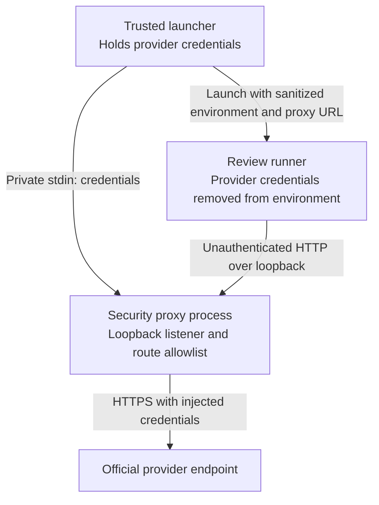

# Credential-Isolated Review Proxy Security Model & Interface Specification

Status: investigation & architectural proposal. This document specifies the
abstract security boundary, interface contract, and concrete provider
implementations (Codex and Gemini) for credential-isolated AI reviews. It
complements `docs/investigations/2026-09-27-ai-executor-dependency-boundary.md`
and prepares normative assurance rules for `docs/architecture.md`.

---

## 1. Context and Problem Statement

Architecture Gatekeeper mandates strict credential isolation in
`docs/architecture.md` (Assurance Rule 9):

> *"Privileged credentials are not exposed to pull-request code or package
> lifecycle scripts."*

In the original Codex implementation, this requirement is satisfied by the
underlying `openai/codex-action` and its bundled Rust proxy,
[`codex-responses-api-proxy`](https://github.com/openai/codex/tree/main/codex-rs/responses-api-proxy).
The proxy runs in a separate process, holds the `OPENAI_API_KEY`, binds to a
local loopback port (`127.0.0.1:<PORT>`), and exposes an unauthenticated
endpoint to the review client while stripping the key from the client's
environment (`env -u OPENAI_API_KEY`).

When designing the standalone Google Gemini review path (#252), an in-process
transport approach was initially built. However, an in-process design retains
credentials (`GEMINI_API_KEY` or `CLOUDSDK_AUTH_ACCESS_TOKEN`) directly within
the runner's memory space and process environment. While input sanitization
guards against URL tampering, an in-process mechanism directly exposes
credentials to the runner process environment and any client-side monkey-patching
(`globalThis.fetch`).

To establish a **consistent defense-in-depth architecture** across AI providers
without ad-hoc security mechanisms, we define a **review proxy security model
and interface contract** for credential non-inheritance and constrained routing.

---

## 2. Threat Model and Security Objectives

### 2.1 Threat Vectors and Host Boundaries

| Threat ID | Threat Description | Attack Vector / Mitigation Scope |
| :--- | :--- | :--- |
| **T-1: Credential Exfiltration** | An untrusted review task or dependency attempts to read and leak secrets. | Mitigated: Reads `process.env` or command-line parameters (secrets are stripped). Note: Defending against same-user OS memory inspection requires container/job boundary isolation. |
| **T-2: SSRF / Arbitrary Egress** | A forged request redirects traffic to an attacker-controlled endpoint with credentials attached. | Mitigated: Strict upstream host pinning and redirect fail-closed behavior prevent dispatch to unauthorized hosts. |
| **T-3: Scope Escalation** | An unauthorized request attempts to invoke provider APIs outside the review scope. | Mitigated: Strict HTTP method and route allowlisting rejects non-review API calls with `403 Forbidden`. |
| **T-4: Traffic Snooping** | External network actors attempt to intercept review payloads or endpoints. | Mitigated: Strict loopback binding (`127.0.0.1:<ephemeral>`) prevents non-local access. |

### 2.2 Security Objectives

- **O-1 (Credential Non-Inheritance)**: The review client process must **never
  receive or inherit** provider credentials in its process environment or
  command-line options. Secrets are supplied exclusively to the supervisor/proxy.
- **O-2 (Strict Loopback Binding)**: The proxy must listen strictly on
  `127.0.0.1` using an ephemeral port. It must reject all external network
  interfaces.
- **O-3 (Strict Method and Route Allowlisting)**: Only deterministic,
  whitelisted review paths (e.g. `POST /v1/responses` or `POST ...:generateContent`)
  are accepted. All other HTTP methods and paths must fail closed with
  `403 Forbidden`.
- **O-4 (In-Flight Header Injection)**: The client issues plain, uncredentialed
  HTTP requests to the local proxy. The proxy authenticates upstream requests
  immediately before dispatch.
- **O-5 (Upstream Host Pinning)**: Outgoing requests are constrained to official,
  hardcoded provider domains (`api.openai.com`, `generativelanguage.googleapis.com`,
  or `*-aiplatform.googleapis.com`). Redirects must fail closed.

---

## 3. Abstract Architecture & Topology

To strictly enforce O-1, the architecture distinguishes two distinct runtime
roles:
1. **Trusted Launcher (Credential-bearing supervisor)**: Receives environment
   secrets from the CI platform, selects the verified proxy executable, spawns
   the proxy, and starts the reviewer with an explicitly sanitized environment.
2. **Review Runner (Credential-free client)**: Runs in a separate child process
   with all provider secrets and OIDC/token-renewal capabilities removed from
   its environment and accessible resources. In GitHub Actions this includes
   `ACTIONS_ID_TOKEN_REQUEST_URL` and `ACTIONS_ID_TOKEN_REQUEST_TOKEN`; withholding
   an exchanged token alone does not prevent obtaining a replacement. It
   communicates exclusively with the local loopback endpoint.



The proxy constrains its own credential-bearing dispatch. This diagram does
not imply that direct runner networking is blocked or that same-user processes
are isolated.

### 3.1 Interface Specification: `ReviewSecurityProxy`

Every provider-specific proxy must conform to the following contract:

```typescript
/** Configuration supplied to launch the isolated security proxy by the trusted launcher */
export interface ProxyConfig {
  /** Target provider identity */
  provider: 'codex' | 'gemini';
  
  /** 
   * Secret credentials passed strictly via IPC/stdin pipe from the trusted launcher,
   * never as command-line arguments or inherited by the review runner.
   */
  credentials: {
    apiKey?: string;
    bearerToken?: string;
    projectId?: string;
    region?: string;
  };

  /** Exact model authorized by launcher-selected policy; never client-selected */
  model: string;

  /** Upstream target routing options */
  upstreamOptions?: {
    region?: string;
    projectId?: string;
  };

  /** Review timeout deadline bounding the proxy lifecycle */
  deadlineMs: number;
}

/** Active proxy endpoint handle returned to the launcher */
export interface ProxyEndpoint {
  /** Local base URL (e.g., "http://127.0.0.1:54321") */
  readonly baseUrl: string;

  /** Effective provider */
  readonly provider: 'codex' | 'gemini';

  /** Gracefully terminates the proxy process and releases sockets */
  shutdown(): Promise<void>;
}

/** Abstract Review Security Proxy Contract */
export interface ReviewSecurityProxy {
  /**
   * Spawns or starts the isolated proxy process, injects credentials,
   * binds loopback socket, and returns the endpoint handle.
   */
  start(config: ProxyConfig): Promise<ProxyEndpoint>;
}
```

### 3.2 Invariants and Contract Rules

1. **Launcher Separation**: The review runner child process must never invoke
   `Proxy.start(config)` with credentials. Launching the proxy and populating
   credentials belongs exclusively to the supervisor/launcher.
2. **Ephemeral Loopback Port**: The proxy must request port `0` from the OS
   to bind an unassigned ephemeral port on `127.0.0.1`, avoiding port conflicts
   and unauthorized pre-binding.
3. **No Redirects**: The proxy must set `redirect: 'error'` or `'manual'` on
   upstream requests. HTTP 3xx responses must fail closed.
4. **Selected Scope**: The launcher supplies the exact authorized model and,
   for Vertex, project and region. Every request must match those selections;
   missing selections, scope mismatches, query strings and extra path components
   fail closed. Client input cannot choose or override upstream scope.
5. **Deterministic Teardown**: The proxy must terminate upon:
   - Explicit `shutdown()` invocation by the launcher;
   - Client process termination (SIGPIPE / closed IPC);
   - Reaching `deadlineMs`.

---

## 4. Concrete Provider Implementations

### 4.1 Codex Implementation: `CodexResponsesProxy`

- **Underlying Executable**: `codex-responses-api-proxy` (Rust binary).
- **Credentials**: `OPENAI_API_KEY` piped via `stdin`.
- **Accepted Inbound Route**:
  - `POST /v1/responses` (no query string allowed).
- **Upstream Endpoint**:
  - `https://api.openai.com/v1/responses`
- **In-Flight Header**:
  - `Authorization: Bearer <OPENAI_API_KEY>`
- **Security Features**:
  - Memory-locked credential storage (`mlock(2)`).
  - All non-matching routes return `403 Forbidden`.

### 4.2 Gemini Implementation: `GeminiSecurityProxy`

- **Underlying Engine**: Builtin Node.js `node:http` server in an isolated
  child process (zero external npm dependencies).
- **Credentials**:
  - **Mode A (WIF / Vertex AI)**: `CLOUDSDK_AUTH_ACCESS_TOKEN` + `GOOGLE_CLOUD_PROJECT`.
  - **Mode B (AI Studio)**: `GEMINI_API_KEY`.
- **Accepted Inbound Routes**:
  - Vertex AI: `POST /v1/projects/:project/locations/:region/publishers/google/models/:model:generateContent`
  - AI Studio: `POST /v1beta/models/:model:generateContent`
  - Require an exact path derived from launcher-selected project, region and
    model (Vertex), or launcher-selected model (AI Studio). Matching only a
    `:generateContent` suffix or syntactic pattern is insufficient. Reject scope
    mismatches, query strings and extra components before upstream dispatch.
- **Upstream Endpoints**:
  - Vertex AI: `https://${region}-aiplatform.googleapis.com` (pinned domain regex: `^[a-z0-9-]+-aiplatform\.googleapis\.com$`).
  - AI Studio: `https://generativelanguage.googleapis.com`.
- **In-Flight Header Injection**:
  - Vertex AI: Injects `Authorization: Bearer <CLOUDSDK_AUTH_ACCESS_TOKEN>`.
  - AI Studio: Injects header `x-goog-api-key: <GEMINI_API_KEY>`.
- **Security Features**:
  - Client sends unauthenticated payload over local loopback.
  - Proxy strictly validates target model name (`/^[a-z0-9.-]+$/`) and action.
  - Rejects any external or malformed requests with `403 Forbidden`.

---

## 5. Security & Assurance Comparison and Scope Boundaries

The table below summarizes the concrete structural mechanisms. Under
normative invariant 11 (*"The mechanism claims only the trust guarantees
actually supplied by its execution route"*), this proposal claims only:
1. **Credential Non-Inheritance**: Secrets are removed from the review runner's
   environment and launch parameters. This does not prevent same-user inspection
   of other processes or credential access through other host resources.
2. **Constrained Proxy Routing**: Requests are strictly allowlisted to verified
   provider model endpoints, preventing proxy dispatch to arbitrary destinations. This does not constrain
   direct network connections made by the runner.

Matching proxy topology across providers does **not** by itself establish
equivalent cross-provider assurance. Any claim of equivalence or protection
against compromised same-user host execution requires verified host sandboxing,
container boundaries, and owner acceptance evidence.

| Dimension | In-Process Validation (Initial) | Codex Responses Proxy | Gemini Security Proxy (This Spec) |
| :--- | :--- | :--- | :--- |
| **Process Role** | Runner holds credentials | Supervisor holds credentials | Supervisor holds credentials |
| **Child Env Inheritance** | Direct access | Stripped (`env -u`) | Stripped (`env -u`) |
| **Loopback Ingress** | N/A (Direct fetch) | `127.0.0.1:<ephemeral>` | `127.0.0.1:<ephemeral>` |
| **Route Allowlist** | String/URL regex | Strict `POST /v1/responses` | Strict `POST ...:generateContent` |
| **External Egress** | Sanitized URL | Host pinned to OpenAI | Host pinned to Google / Vertex |
| **External Dependencies** | 0 | Bundled Rust binary | 0 (Node.js standard library) |
| **Claimed Property** | Input sanitization only | Credential non-inheritance & route constraint | Credential non-inheritance & route constraint |

> [!IMPORTANT]
> **Normative Boundary Note**: Process separation and loopback binding provide
> credential non-inheritance and route constraint within a single host. They do
> not prevent a compromised process with identical OS user privileges from
> connecting to unauthenticated loopback ports or inspecting host memory. True
> protected isolation requires combining this proxy topology with CI runner
> job isolation and protected repository checkout boundaries.

---

## 6. Implementation and Adoption Roadmap

In accordance with `docs/architecture.md` (Authority & Non-regression rules),
new mandatory assurance requirements cannot be imposed on consumers through
investigation materials alone. Adoption must proceed through explicit owner
authorization:

1. **Phase 1: Architectural Specification & Owner Adoption**:
   - Establish this document under `docs/investigations/`.
   - Consumer owners review and authorize canonical updates to
     `docs/architecture.md` regarding multi-provider proxy assurance.
2. **Phase 2: Adapter Delivery for Selected Paths**:
   - Implement `src/gemini-security-proxy.mjs` using `node:http`.
   - Provide a supervisor launcher that spins up the proxy, isolates
     credentials, and executes `gemini-ci-runner.mjs` against the loopback URL.
   - Comprehensive test suite in `test/gemini-security-proxy.test.mjs` covering
     route allowlisting, credential injection, withheld OIDC capabilities,
     project/region/model mismatch rejection and fail-closed behavior.
3. **Phase 3: Formal Verification & Evidence Integration**:
   - Integrate with reusable CI workflows.
   - Collect and verify execution evidence before enabling any protected
     acceptance route for Gemini.

## Coordination with the reviewer execution contract

Issue #265 defines provider-independent local callers; Issue #252 owns CI
provider support. The security proxy is a separate credential-handling adapter,
not the reviewer execution interface or a prerequisite for local portability.
Agree on request/result identity, provider-specific settings, deadlines and
incomplete/error behavior across those issues before shared implementation.
A proxy does not construct authority, validate semantic decisions, select a
provider for acceptance, or activate fallback. Existing local feedback retains
its stated same-user trust boundary unless a separate route is adopted.
