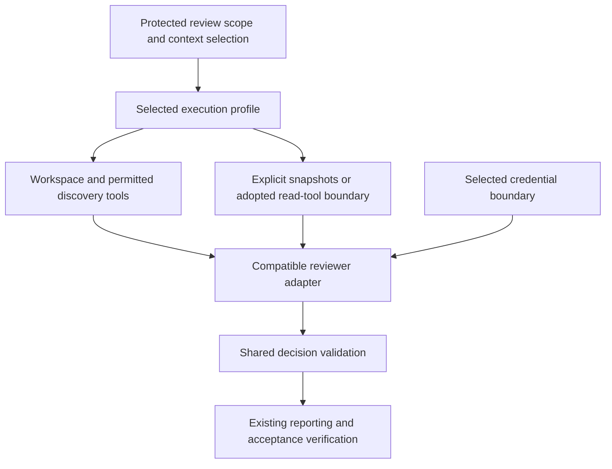

# Reviewer execution options for Gemini CI: Vertex AI with WIF

Status: staged delivery; execution profile selected by the owner on 2026-10-04.
This document records the user's selection of
Vertex AI with Google Cloud Workload Identity Federation (WIF) as the provider
and authentication direction for Issue #252. It is not canonical architecture,
consumer CI policy, implementation, route activation, or acceptance evidence.
The canonical contract remains [`../architecture.md`](../architecture.md),
which requires protected consumer selection and verified route-specific
evidence before protected acceptance can rely on this route.

## Observed implementation at `origin/main` 121c154

The current protected self-review policy is CI policy v2. It selects Codex
(`gpt-6.1-sol`, medium reasoning), a protected Authority Set manifest and
limits, plus owner-amendment settings. `src/resolve-ci-policy.mjs` does not
select a reviewer provider or an authentication route. The reusable
`.github/workflows/architecture-gate.yml` requires `OPENAI_API_KEY` and invokes
the pinned `openai/codex-action`. It does not invoke the Gemini launcher.
Therefore the protected route remains Codex-only.

The workflow checks out the pull request merge commit and supplies that
workspace to Codex under a read-only sandbox. It separately materializes
protected prompt, schema, validation policy and selected authority content.
The Codex process also has repository/Git visibility through its workspace; the
current route does not promise that it can inspect only a serialized list of
files.

The Gemini implementation is available as a package runtime. The launcher
starts a loopback proxy and creates an allowlisted child environment, while
the runner supports request JSON, preflight and deterministic response
validation. The CI workflow does not call either component. The current
launcher resolves Google Cloud credentials in its trusted parent process,
supports bearer credentials for Vertex, and constrains the proxy to a selected
model, project and region. No protected CI policy currently selects Vertex,
WIF or any Gemini endpoint.

`src/prepare-review-context.mjs` currently prepares a bounded prompt by
appending a textual base-to-reviewed-merge diff and changed paths. It verifies
the three revisions and merge parents, excludes untracked files, rejects
binary/invalid text, and enforces the selected prompt limit. It does not create
individual before/after file snapshots or package protected references as a
separate input packet. The consumer workflow invokes this helper; the legacy
reusable `architecture-gate.yml` does not. Neither workflow dispatches Gemini.

## Optional snapshot context helper

`src/prepare-review-file-context.mjs` provides an internal, currently unwired
preparation helper. Trusted orchestration supplies exact merge revisions,
explicit base reference paths and all three limits. It returns full before/after
regular UTF-8 file snapshots, Git object IDs and content digests; absent sides
are `null`. It reads committed objects, not working-tree files, and rejects
unsupported file modes, invalid text, missing objects and exceeded limits.
The complete serialized result, including metadata and JSON escaping, is bounded.

This provider-independent helper supports at most 32 changed-path/reference entries, 131,072
bytes per blob and 524,288 bytes per serialized context. Callers must explicitly
select limits at or below those runtime caps. These are internal preparation
bounds, not newly adopted consumer policy or replacements for `maxPromptBytes`.
A future composer must additionally bound the complete prompt and verify the
protected selection and complete Authority Set. The helper does not establish
repository-origin identity, infer required references, execute a reviewer,
persist evidence, or alter either CI workflow. Its snapshot selection is not
itself proof of protected authority or semantic completeness.

## Execution contract before CI integration

Provider choice does not select an execution model. The current Codex route
uses a CLI agent with workspace/Git access; the implemented Gemini transport
uses REST requests containing explicit context. Comparing these as equivalent
provider adapters hides differences in context discovery and responsibility.
The Vertex AI/WIF authentication selection does not select REST over a CLI.

Before wiring Gemini into CI, compare execution options against one review
contract, preserving existing protected selection and acceptance:

| Concern | Contract to specify and verify |
| --- | --- |
| Review scope | Repository identity as supported; exact base, head and reviewed merge revisions |
| Protected context | Selected authority, prompt, schema, validation and their identities |
| Context access | Available workspace/Git reads, discovery tools or explicit snapshots; revision binding, bounds and unsupported inputs |
| Execution capabilities | Allowed tools, writes, commands, network destinations and cancellation; distinguish configured controls from enforced controls |
| Credentials | Vertex/WIF credential ownership, launcher interfaces, proxy compatibility and renewal boundary |
| Output | Extracted decision, deterministic validation, execution identity and incomplete failure outcomes |

### Options to compare

| Option | Context responsibility | Required investigation |
| --- | --- | --- |
| Codex CLI with workspace (current baseline) | Agent can discover additional repository context | Document actual access, input binding, sandbox, credential and timeout guarantees |
| Gemini CLI with workspace | Proposed agent-based alternative, to be verified | Pin and inspect CLI behavior; verify Vertex/WIF and proxy integration, tool policy, writes, prompt injection exposure, output extraction and cancellation |
| Gemini REST with explicit context | Trusted orchestration selects supplied files or provides separately specified read tools | Verify reference selection covers the chosen review scope, hard bounds, and incomplete outcomes when context cannot be supplied |

The snapshot helper can supply explicit context to any compatible adapter. It
is not a mandatory Gemini preprocessing step or a complete context strategy.
A REST-only request needs supplied context, but need not use this particular
helper; a separately adopted read-tool boundary is another option. A workspace
adapter may use snapshots for reproducibility without giving up discovery.
Identical strings are not proof of equivalent review capabilities or quality.
No `read-only`, command denial, credential isolation or network guarantee is
inferred from an adapter's name or an operating mode.

## Revised delivery sequence

1. Implement the owner-selected Gemini CLI profile with a controlled,
   revision-bound review workspace and explicit read-tool allowlist. Candidate
   control files remain evidence with original path/revision identity rather
   than automatically loaded configuration. The selection is recorded in
   canonical authority; it activates no route.
2. Implement protected selection of the chosen provider, runtime, context
   strategy, model/settings and limits. Preserve old Codex policy versions;
   candidate inputs cannot select their own reviewer or raise bounds.
3. Integrate Vertex/WIF under the adopted credential boundary. Verify OIDC,
   token and renewal non-inheritance through explicit runner interfaces,
   constrained provider dispatch, credential lifetime and failure handling.
   No credential or provider fallback is activated by authentication failure.
4. Exercise ordinary review and each enabled governance path with shared
   deterministic validation and route-specific producer evidence. Require
   bounded owner-adjudicated cases and real authorized reviews; schema success
   does not prove semantic quality or host merge enforcement.

This is a proposed responsibility diagram, not an implemented universal
adapter framework. No route or capability is activated by this plan.

## Verification and remaining selections

Evaluate candidate options using the same review cases and authority. Record
which context each can access, which restrictions the host actually enforces,
credential exposure, total deadline/cancellation behavior and validated output.
Cover PASS/BLOCK/OWNER_DECISION plus unavailable context, unsupported input,
authentication, timeout, refusal, partial and invalid-output failures. Verify
Gemini with Codex absent and OpenAI credentials unset. Preserve fail-closed
acceptance and independently verify any required host protection.

Still open: adopting consumer and branch; exact
Google identity bindings, project/region, quotas and billing limits, credential
lifetime/renewal, supported file classes, complete
prompt limits, retention/cleanup and route-specific governance evidence.
The adopted model/thinking profile requires implementation and verification,
not another selection.
Standby/fallback or parallel result adoption stays with #259. Vertex AI with
WIF remains the selected authentication direction. #252 remains open until
its CI adoption criteria are met; this work adds no release gate.

## Internal CLI delivery slice

The CLI profile has three internal building blocks. The optional snapshot helper
can feed `materialize-review-workspace.mjs`: it writes fixed ordinal text files
and a manifest retaining original paths, exact revisions, modes, object IDs and
content digests. Candidate filenames never select a filesystem destination or
CLI configuration name. Every selected snapshot is retained; absent sides remain
explicit. This helper verifies packet consistency and bounds, not origin identity,
complete repository context, protected reference selection or host confinement.
The trusted orchestrator remains responsible for those inputs and coverage.

`gemini-cli-response.mjs` extracts the JSON output envelope only after successful
process completion within explicit output limits. Response text then passes the
existing request-bound decision validation. CLI exit zero alone is insufficient.

The proxy accepts the fixed CLI streaming alias only with explicit opt-in and
maps it to the selected Vertex project, region and model. It discards client
credential headers and injects the parent-owned Bearer credential upstream.
Ordinary non-streaming routes retain their existing scope checks. This slice
provides no CLI installer, process supervisor, protected CI selection or workflow
activation. It does not assert that a read-tool configuration is host isolation.

Offline validation used npm Gemini CLI 0.62.0, an isolated fixture HOME,
controlled workspace and a loopback canned SSE server. The CLI performed a
`read_file` call through the actual streaming proxy; the upstream received only
the parent dummy Bearer header on the protected-scope route. A shell request was
rejected by the configured tool inventory. Dummy credentials are not WIF evidence.
Malformed decision text still produced CLI exit zero; HTTP 401 produced failure;
a nonresponding server required an external watchdog. Further implementation
must verify cancellation with descendants, complete context selection, CLI
version/configuration control, thinking settings and authenticated governance
cases before route activation.

## Internal CLI process supervisor

`gemini-cli-process.mjs` runs an already provisioned CLI under a fresh private
HOME, a fixed operational environment and generated read-tool configuration.
It accepts only the reported CLI version 0.62.0; that consistency check does not
attest installed bytes. The trusted caller owns the installer/runtime identity,
private parent, controlled workspace, protected scope/settings, request preflight
and final `gemini-cli-response.mjs` validation. This is not a standalone review
or acceptance entrypoint.

The selected model and thinking setting are explicit. The prompt is sent through
stdin as a lossless JSON string envelope and the model is a literal option
value, so prompt text cannot become CLI flags or exceed the OS single-argument
limit. Literal at-signs are JSON Unicode escapes: the pinned CLI cannot interpret
candidate tokens as client-side file references. The fixed transport prefix asks
the reviewer to decode the complete selected prompt; exact decode roundtrip is
checked before execution. This does not attest that the model followed the prompt.
The same prompt bound covers the entire encoded stdin, including the prefix;
encoding overflow fails closed without truncation or raw-input fallback. The prompt limit cannot exceed the
pinned CLI stdin limit of 8 MiB; oversized input fails before execution. Ambient credentials, renewal selectors, `NODE_OPTIONS` and default HOME
configuration are not forwarded. The SDK's fixed non-secret placeholder enables
Vertex client mode only; the proxy replaces it with its parent-owned Bearer
credential upstream. Missing system settings/default paths inside the private
HOME prevent ambient system configuration. Gemini CLI requires root ownership
for system settings, so generated user-owned files cannot enforce that layer;
no ownership check is bypassed. Instead, the physical workspace and every
ancestor, and all directories below the workspace must contain no operational
`.gemini`, `.agents`, `.env` or `GEMINI.md`. Descendant symbolic links are rejected
rather than following an unchecked subtree; symbolic links or unreadable
subdirectories leave execution incomplete.
Rejection precedes launch: candidate control bytes belong only in ordinal
evidence snapshots, not auto-loaded paths. This prevents workspace overrides
and avoids relying on an empty MCP map to erase entries during deep merge.
The trusted caller must keep those directories stable throughout execution.

One deadline covers setup, version probe and review. Explicit prompt/stdout/stderr
byte limits reject overflow without returning a truncated decision. Output is
strict UTF-8. Cancellation, timeout and overflow kill the POSIX process group;
cleanup also handles descendants after main-process exit and removes the private
HOME. This implementation rejects Windows and claims neither host confinement nor
an absolute kernel termination guarantee. OS-level uninterruptible processes
remain outside that guarantee.

Focused fixtures exercise a mismatched/hung version probe, hung review, abort,
output overflow, split/invalid UTF-8, option-shaped prompts, and descendants with
inherited or closed output pipes. An additional fixed-CLI offline run used the
actual supervisor and proxy with test-only network interception: `read_file`
succeeded, only the four selected tools were advertised, both model requests
carried thinkingBudget 1024, and the upstream saw only the fixed scope and parent
dummy Bearer. No real WIF exchange or semantic-quality proof is supplied. Protected
CI wiring, complete context composition and authenticated governance evidence
remain #252 work.

### Nested context regression (PR #310)

A pinned CLI 0.62.0 offline reproduction put a marker in `src/GEMINI.md` and
requested only `read_file` of `src/sentinel.txt`. The marker was absent from the
first model request but appeared automatically in the second request's contents.
This verifies the just-in-time context path, not merely startup discovery.
The launcher rejects operational controls throughout the descendant tree before
allocating HOME or running the version probe. Descendant control names are
case-folded to cover case-insensitive filesystems. Ordinal evidence remains available
to explicit read tools. Tree stability still belongs to the trusted caller; this
check neither monitors later writes nor establishes host confinement. No real
credential exchange or semantic-quality evidence is supplied by the offline probe.

### Client-side prompt expansion regression (PR #310)

Gemini CLI 0.62.0 processes headless input through its at-command parser before
the first provider request. It directly invokes file reading even though
`read_many_files` is absent from the selected model tool inventory. An offline
probe sent a 62-byte prompt with a file-reference token and observed a 12 KB
fixture marker automatically included in the first request. Interactive paste
escaping does not control this headless path.

The supervisor therefore encodes the complete selected prompt as one JSON string,
with every literal at-sign represented as `\u0040`. Decoding recovers original
diff hunk markers, scoped package names, quoted text, Unicode and backslashes.
The wire framing changes; selected authority and candidate bytes do not. The
fixed prefix explains only decoding, supplies no replacement review policy, and
also avoids leading slash-command dispatch. The same pinned offline probe with
encoded input observed no fixture expansion. This proves client-side preprocessing
control and encoding reversibility, not model compliance or semantic quality.

## Internal controlled-workspace session

The next internal composition owns only materialization, CLI execution, envelope
extraction and workspace cleanup. The trusted caller supplies a protected prompt
that directs the CLI to the fixed `manifest.json` and selected evidence, explicit
workspace/process limits, selected scope/settings and an already provisioned CLI.
It retains ownership of exact revision/policy binding, context completeness,
proxy/WIF lifecycle and deterministic CI decision validation. Candidate paths
remain manifest data rather than operational configuration names.

The session returns response text, not a validated decision or acceptance result.
In particular, `validateGeminiCliResponse` delegates to the local committed-config
review contract and must not substitute for protected CI prompt/schema, authority
and consumer-rule validation. CI integration must use the same protected checks
as Codex. No public launcher, policy selector or workflow invokes this internal
session yet. Actual WIF and enabled governance runs remain required for adoption.

## Adopted model-setting implementation

The owner selected `gemini-3.8-flash` with `thinkingLevel: MEDIUM` on 2026-10-04;
canonical authority records that selection. The internal process/session path
sends exactly that level setting without a simultaneous `thinkingBudget`.
Legacy budget-based model fixtures remain separately supported; no budget is
added as a default or combined with the selected level setting.

Focused process and session tests verify the generated CLI configuration contains
`thinkingLevel: MEDIUM` and no `thinkingBudget`. They also verify that LOW and HIGH
are explicit valid levels, invalid/mixed settings fail before process startup,
and legacy budget selection remains intact. A pinned CLI 0.62.0 offline run through
the actual supervisor and scoped proxy confirmed both the initial request and
after-tool request carried `thinkingLevel: MEDIUM`, `includeThoughts: false`,
and no `thinkingBudget`. Only the four selected read tools were advertised.
The endpoint was a loopback canned server using dummy credentials, so this
confirms outbound configuration rather than model support, WIF authentication
or review quality. Authenticated route evidence, quality, cost, latency and
decision consistency remain required before activation.

## Trusted-parent CLI/proxy composition

The internal composition keeps the explicit bearer credential in the trusted
parent. The parent starts the scoped Vertex proxy, passes only its loopback
endpoint to the controlled CLI session, and closes the proxy on success or
failure. Model, project and region come from one selected execution input; the
caller cannot independently override the proxy scope or endpoint. One bounded
deadline covers proxy startup and CLI execution. The result remains response
text for the existing protected CI validators, not a local review decision or
new acceptance format.

This composition does not discover authentication from environment variables,
install a runtime, select a deployment, activate a workflow, or add fallback.
Protected CI retains exact-base policy/authority selection and its existing
ordinary and enabled governance validation paths. Public workflow integration
and authenticated Vertex/WIF cases remain subsequent work.

### Protected CI integration seam

The existing prepared review context, exact-base authority snapshots/provenance,
decision schema and validators remain the CI contract. The trusted CI parent
supplies those already selected inputs to the internal proxy/session composition
and validates its raw response with the existing protected CI checks. It must
not route the result through the local committed-config review contract. An
ordinary review probe does not establish enabled OWNER_ADDITION or
OWNER_AMENDMENT route coverage; each requires its existing downstream semantic
pipeline. No CI workflow or acceptance route is activated by this composition.

## Prepared protected-CI transport adapter

The internal adapter accepts an already-prepared protected complete prompt and
decision-schema JSON text, preserving their bytes while appending explicit
output-schema instructions. It bounds the complete encoded CLI stdin, including
the fixed lossless JSON transport envelope, against the caller-selected prompt
limit before starting the proxy or CLI. The schema is checked with the generic
supported schema-definition validator; that preflight is not validation of a
model response.

The adapter does not read local committed reviewer configuration, construct a
local review request, or establish prompt, schema, packet, revision or authority
provenance. The trusted CI orchestrator retains exact-base policy selection,
complete context and evidence instructions, packet binding, and downstream
protected schema, authority and consumer-rule validation. Its result remains
raw response text. Unsupported schema dialects fail closed. No workflow,
provider selector, installer, authentication discovery or fallback is added.

## Historical PoC authentication evidence correction

The successful run `36921176825` at
`d63b46279c21ccf9ce27ede8368f88841483a068` obtained a Google WIF access token
and reported project `architecture-gatekeeper`. That establishes the historical
identity exchange/project metadata, not a Vertex model call. Its review-step log
also shows a populated (masked) `GEMINI_API_KEY`. The historical CI runner passed
that key as `options.apiKey`, and the historical transport selects this explicit
API key before `options.accessToken`, routing it to Google AI Studio. Therefore
that successful review is not authenticated Vertex evidence for the selected
CLI/proxy route or its model/thinking/location settings. A new verification must
supply only the parent WIF bearer, with API-key fallback absent. No credential
values are included in this investigation.

## Provider-neutral prepared Authority Set decision validation

The internal result validator composes the existing JSON Schema,
prepared Authority Set and consumer-rule validators using explicit
caller-prepared materials. It rejects malformed or duplicate-key JSON and
invalid UTF-8, bounds response and schema bytes before parsing, and preserves
valid PASS, BLOCK and OWNER_DECISION results. The caller explicitly supplies a
rules object or `null`; `null` means its protected selection has no additional
rules, not a fallback. The response ceiling uses the existing ordinary CI
decision bound of 64 KiB; the schema ceiling is 1 MiB.

This helper covers prepared Authority Set provenance versions already
supported by the existing validator, not legacy authority-file selection. It
reads no local reviewer configuration and selects no provider or policy.
Protected provenance, exact revisions, complete context and route-specific
receipt or evidence requirements remain orchestration responsibilities.
Validation remains separate from acceptance: BLOCK and OWNER_DECISION are not
rewritten or discarded. No workflow or acceptance route is activated.
