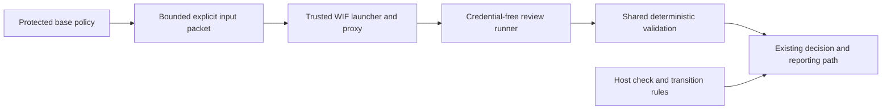

# Gemini CI Delivery Plan: Vertex AI with Google Cloud WIF

Status: proposed delivery plan. This document records the user's selection of
Vertex AI with Google Cloud Workload Identity Federation (WIF) as the provider
and authentication direction for Issue #252. It is not canonical architecture,
consumer CI policy, implementation, route activation, or acceptance evidence.
The canonical contract remains [`../architecture.md`](../architecture.md),
which requires protected consumer selection and verified route-specific
evidence before protected acceptance can rely on this route.

## Observed implementation at `origin/main` 121c154

The current protected self-review policy is CI policy v2. It selects Codex
(`gpt-6.1-sol`, medium reasoning), a protected Authority Set manifest and
limits, plus owner-amendment settings. `src/resolve-ci-policy.mjs` does not
select a reviewer provider or an authentication route. The reusable
`.github/workflows/architecture-gate.yml` requires `OPENAI_API_KEY` and invokes
the pinned `openai/codex-action`. It does not invoke the Gemini launcher.
Therefore the protected route remains Codex-only.

The workflow checks out the pull request merge commit and supplies that
workspace to Codex under a read-only sandbox. It separately materializes
protected prompt, schema, validation policy and selected authority content.
The Codex process also has repository/Git visibility through its workspace; the
current route does not promise that it can inspect only a serialized list of
files.

The Gemini implementation is available as a package runtime. The launcher
starts a loopback proxy and creates an allowlisted child environment, while
the runner supports request JSON, preflight and deterministic response
validation. The CI workflow does not call either component. The current
launcher resolves Google Cloud credentials in its trusted parent process,
supports bearer credentials for Vertex, and constrains the proxy to a selected
model, project and region. No protected CI policy currently selects Vertex,
WIF or any Gemini endpoint.

`src/prepare-review-context.mjs` currently prepares a bounded prompt by
appending a textual base-to-reviewed-merge diff and changed paths. It verifies
the three revisions and merge parents, excludes untracked files, rejects
binary/invalid text, and enforces the selected prompt limit. It does not create
individual before/after file snapshots or package protected references as a
separate input packet. The consumer workflow invokes this helper; the legacy
reusable `architecture-gate.yml` does not. Neither workflow dispatches Gemini.

## Proposed staged deliveries

These stages are implementation proposals. Each requires the relevant owner
authorization before it changes canonical policy or a protected route. A
stage may provide runtime support without enabling consumer adoption.

### 1. Immutable, explicit review input packet

Add a bounded preparation API that produces a private immutable packet from
recorded revisions. It should contain the exact changed-path list, full before
and after snapshots for each selected changed file, and the protected
references selected by the caller's prior policy: prompt, schema, validation
rules, and authority snapshots or Authority Set members. Bind the packet to
repository identity as available, base SHA, head SHA, reviewed merge SHA,
manifest/selection identity, content digests, and the exact file paths. Reject
missing objects, path ambiguity, symlinks or submodules unless an adopted
source rule explicitly supports them, invalid encodings, binary files unless
their treatment is selected, and all size/count limits before reviewer startup.
Write the packet outside the checkout with restrictive permissions and no
overwrite.

“Complete input packet” here means complete relative to this explicit selected
context and its declared bounds. It does not claim semantic completeness of
architecture authority, nor prove the reviewer understood every byte. Existing
Codex workspace visibility remains a separate property; passing a packet alone
does not remove that visibility. Keep the current patch-based helper available
until the packet path is reviewed and selected.

### 2. Protected provider policy and shared validation

Version the CI policy schema to select a provider/authentication route only
from protected-base bytes. Define the exact supported values, required fields,
provider model scope, project and region selection, input-packet limits, and
failure behavior. The policy resolver should reject unknown fields, missing or
malformed selections, candidate-controlled overrides, and values beyond
runtime ceilings. Preserve existing policy versions and Codex behavior for
consumers that have not adopted the new version.

Route both supported reviewers through the same prepared input and
provider-independent deterministic checks where their decision schemas permit
it: JSON/schema validation, authority-set completeness, decision invariants,
timeout handling, and no-decision behavior for preparation, service or
validation failures. Record the selected provider and bounded provenance in
the result without treating model output or packet provenance as acceptance by
itself.

### 3. Protected Vertex AI/WIF launcher path

Implement the selected direction with a trusted launcher that obtains a
GitHub OIDC assertion and exchanges it for a short-lived Google credential
through an explicitly configured Google Cloud WIF trust. Keep the OIDC request
capability, assertion, exchanged token, and token renewal capability out of
the review runner's environment, arguments, files, and other launch handles.
Keep credential-bearing dispatch inside a loopback proxy whose upstream is the
selected regional Vertex AI host and whose method, exact project/region/model
route, request shape, redirect handling, and deadline are constrained by
protected policy. Fail closed on missing identity configuration, failed
exchange, scope mismatch, disallowed destination, redirect, timeout, API
failure, or invalid response. Do not fall back to an API key, Codex, another
provider, or a weaker input route.

Credential non-inheritance and constrained proxy dispatch do not establish
network isolation, same-user process isolation, or that independently
available Cloud SDK credentials and identity services cannot be used by the
runner. Any stronger host claim needs separate selection and verification.

### 4. Ordinary review and enabled-route governance

Integrate the new runner first as a protected-policy-selected ordinary review
path that emits the existing semantic decision kinds and follows existing
fail-closed reporting. Keep acceptance separate: host check selection and
target-transition enforcement remain independently configured and verified.
Then consider any route-specific procedural evidence or owner-governance
integration as a separate delivery with explicit evidence producer, actor,
identity, lifecycle, and verification rules. Do not infer those rules from
the proxy or from a successful semantic review. No owner-addition,
owner-amendment, or other special governance path becomes enabled merely
because ordinary Gemini review is available.

## Minimal flow

The diagram describes a proposed runtime flow. It does not claim the host
enforces the resulting check or that the consumer has selected this route.

## Acceptance and evidence matrix

| Stage | Required verification | What it may establish | What it does not establish |
| --- | --- | --- | --- |
| Input packet | Revision/parent binding; exact before/after bytes and protected-reference digests; limits; path, symlink, submodule and encoding cases; private output; no overwrite | Packet matches the declared selected context | Semantic authority completeness or reviewer comprehension |
| Policy selection | Base-revision resolution; strict schema/version validation; malformed, unknown and candidate override rejection; old-version compatibility | Protected policy selected provider and bounded scope | Correct external WIF trust configuration or host enforcement |
| WIF launcher/proxy | OIDC capability containment; exchange success/failure; child env/argv/files/handles inspection; exact Vertex route/model/project/region; redirect, method, timeout and scope rejection | Credentials are not passed through explicit runner interfaces and proxy dispatch is constrained as tested | Direct network blocking, same-user isolation, or absence of independently available host credentials |
| Shared validation | Schema and decision invariants; complete selected authority IDs/files where applicable; no decision on every preparation/provider/validation error; no fallback | The supplied response meets deterministic contract checks | Semantic correctness or acceptance authority |
| Adoption and host enforcement | Protected consumer selection; exact producer/check/target rule; route-specific execution evidence; independent host transition verification | The configured consumer route is adopted and the host applies its selected acceptance rule | Universal provider equivalence or unselected governance routes |

## Decisions intentionally left open

This plan records Vertex AI with Google Cloud WIF as the user's selected
provider/authentication direction. The following still require an explicit
consumer or deployment decision before implementation or activation:

- Which consumer repository and protected branch will adopt the route, and
  whether this repository's self-review is the first consumer.
- The Google Cloud project, WIF provider/service-account trust setup, allowed
  GitHub repository/ref claims, token audience and lifetime, and the exact
  deployment/environment secret and permission boundary.
- The Vertex region and official endpoint allowlist, model identifier,
  thinking/reasoning settings, request and response quotas, billing limits,
  retry policy and service deadline.
- Whether the explicit packet supplements the review prompt while the reviewer
  retains workspace access, or whether a separately verified execution
  boundary will restrict repository access to the packet.
- Which changed-file classes are supported (binary files, symlinks, submodules,
  generated content), packet retention and cleanup, and exact per-file/count/
  total/prompt ceilings within runtime ceilings.
- Whether provider adoption changes only ordinary semantic review or also
  requires route-specific producer evidence, special governance integration,
  or changed host-enforced acceptance.
- Rollout, rollback and the point at which any consumer may stop requiring the
  current Codex credential and route.

Until those decisions are recorded in canonical authority and the selected
route is implemented and verified, the protected route remains the existing
Codex route. This document records runtime delivery proposals only; it does
not enable a route, amend acceptance policy, or claim adoption.
