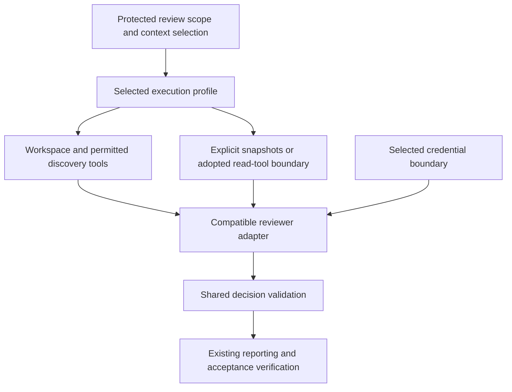

# Reviewer execution options for Gemini CI: Vertex AI with WIF

Status: proposed delivery plan. This document records the user's selection of
Vertex AI with Google Cloud Workload Identity Federation (WIF) as the provider
and authentication direction for Issue #252. It is not canonical architecture,
consumer CI policy, implementation, route activation, or acceptance evidence.
The canonical contract remains [`../architecture.md`](../architecture.md),
which requires protected consumer selection and verified route-specific
evidence before protected acceptance can rely on this route.

## Observed implementation at `origin/main` 121c154

The current protected self-review policy is CI policy v2. It selects Codex
(`gpt-6.1-sol`, medium reasoning), a protected Authority Set manifest and
limits, plus owner-amendment settings. `src/resolve-ci-policy.mjs` does not
select a reviewer provider or an authentication route. The reusable
`.github/workflows/architecture-gate.yml` requires `OPENAI_API_KEY` and invokes
the pinned `openai/codex-action`. It does not invoke the Gemini launcher.
Therefore the protected route remains Codex-only.

The workflow checks out the pull request merge commit and supplies that
workspace to Codex under a read-only sandbox. It separately materializes
protected prompt, schema, validation policy and selected authority content.
The Codex process also has repository/Git visibility through its workspace; the
current route does not promise that it can inspect only a serialized list of
files.

The Gemini implementation is available as a package runtime. The launcher
starts a loopback proxy and creates an allowlisted child environment, while
the runner supports request JSON, preflight and deterministic response
validation. The CI workflow does not call either component. The current
launcher resolves Google Cloud credentials in its trusted parent process,
supports bearer credentials for Vertex, and constrains the proxy to a selected
model, project and region. No protected CI policy currently selects Vertex,
WIF or any Gemini endpoint.

`src/prepare-review-context.mjs` currently prepares a bounded prompt by
appending a textual base-to-reviewed-merge diff and changed paths. It verifies
the three revisions and merge parents, excludes untracked files, rejects
binary/invalid text, and enforces the selected prompt limit. It does not create
individual before/after file snapshots or package protected references as a
separate input packet. The consumer workflow invokes this helper; the legacy
reusable `architecture-gate.yml` does not. Neither workflow dispatches Gemini.

## Optional snapshot context helper

`src/prepare-review-file-context.mjs` provides an internal, currently unwired
preparation helper. Trusted orchestration supplies exact merge revisions,
explicit base reference paths and all three limits. It returns full before/after
regular UTF-8 file snapshots, Git object IDs and content digests; absent sides
are `null`. It reads committed objects, not working-tree files, and rejects
unsupported file modes, invalid text, missing objects and exceeded limits.
The complete serialized result, including metadata and JSON escaping, is bounded.

This provider-independent helper supports at most 32 changed-path/reference entries, 131,072
bytes per blob and 524,288 bytes per serialized context. Callers must explicitly
select limits at or below those runtime caps. These are internal preparation
bounds, not newly adopted consumer policy or replacements for `maxPromptBytes`.
A future composer must additionally bound the complete prompt and verify the
protected selection and complete Authority Set. The helper does not establish
repository-origin identity, infer required references, execute a reviewer,
persist evidence, or alter either CI workflow. Its snapshot selection is not
itself proof of protected authority or semantic completeness.

## Execution contract before CI integration

Provider choice does not select an execution model. The current Codex route
uses a CLI agent with workspace/Git access; the implemented Gemini transport
uses REST requests containing explicit context. Comparing these as equivalent
provider adapters hides differences in context discovery and responsibility.
The Vertex AI/WIF authentication selection does not select REST over a CLI.

Before wiring Gemini into CI, compare execution options against one review
contract, preserving existing protected selection and acceptance:

| Concern | Contract to specify and verify |
| --- | --- |
| Review scope | Repository identity as supported; exact base, head and reviewed merge revisions |
| Protected context | Selected authority, prompt, schema, validation and their identities |
| Context access | Available workspace/Git reads, discovery tools or explicit snapshots; revision binding, bounds and unsupported inputs |
| Execution capabilities | Allowed tools, writes, commands, network destinations and cancellation; distinguish configured controls from enforced controls |
| Credentials | Vertex/WIF credential ownership, launcher interfaces, proxy compatibility and renewal boundary |
| Output | Extracted decision, deterministic validation, execution identity and incomplete failure outcomes |

### Options to compare

| Option | Context responsibility | Required investigation |
| --- | --- | --- |
| Codex CLI with workspace (current baseline) | Agent can discover additional repository context | Document actual access, input binding, sandbox, credential and timeout guarantees |
| Gemini CLI with workspace | Proposed agent-based alternative, to be verified | Pin and inspect CLI behavior; verify Vertex/WIF and proxy integration, tool policy, writes, prompt injection exposure, output extraction and cancellation |
| Gemini REST with explicit context | Trusted orchestration selects supplied files or provides separately specified read tools | Verify reference selection covers the chosen review scope, hard bounds, and incomplete outcomes when context cannot be supplied |

The snapshot helper can supply explicit context to any compatible adapter. It
is not a mandatory Gemini preprocessing step or a complete context strategy.
A REST-only request needs supplied context, but need not use this particular
helper; a separately adopted read-tool boundary is another option. A workspace
adapter may use snapshots for reproducibility without giving up discovery.
Identical strings are not proof of equivalent review capabilities or quality.
No `read-only`, command denial, credential isolation or network guarantee is
inferred from an adapter's name or an operating mode.

## Revised delivery sequence

1. Compare the options above and propose the smallest execution/context profile
   that meets the consumer's review requirements. Record required owner
   decisions in canonical authority before activation. Existing runtime work
   and this optional helper do not settle that choice.
2. Implement protected selection of the chosen provider, runtime, context
   strategy, model/settings and limits. Preserve old Codex policy versions;
   candidate inputs cannot select their own reviewer or raise bounds.
3. Integrate Vertex/WIF under the adopted credential boundary. Verify OIDC,
   token and renewal non-inheritance through explicit runner interfaces,
   constrained provider dispatch, credential lifetime and failure handling.
   No credential or provider fallback is activated by authentication failure.
4. Exercise ordinary review and each enabled governance path with shared
   deterministic validation and route-specific producer evidence. Require
   bounded owner-adjudicated cases and real authorized reviews; schema success
   does not prove semantic quality or host merge enforcement.

This is a proposed responsibility diagram, not an implemented universal
adapter framework. No route or capability is activated by this plan.

## Verification and remaining selections

Evaluate candidate options using the same review cases and authority. Record
which context each can access, which restrictions the host actually enforces,
credential exposure, total deadline/cancellation behavior and validated output.
Cover PASS/BLOCK/OWNER_DECISION plus unavailable context, unsupported input,
authentication, timeout, refusal, partial and invalid-output failures. Verify
Gemini with Codex absent and OpenAI credentials unset. Preserve fail-closed
acceptance and independently verify any required host protection.

Still open: execution/context profile; adopting consumer and branch; exact
Google identity bindings, project/region, model/thinking settings, quotas and
billing limits, credential lifetime/renewal, supported file classes, complete
prompt limits, retention/cleanup and route-specific governance evidence.
Standby/fallback or parallel result adoption stays with #259. Vertex AI with
WIF remains the selected authentication direction. #252 remains open until
its CI adoption criteria are met; this work adds no release gate.
