# Preview.4 gap roadmap for #405 (proposed)

**Status:** nonnormative planning document for independent review. It does not
amend the selected architecture Set, select a consumer route, authorize an
integration or administration action, activate a route, or establish consumer
proof. It supports #405's finite roadmap. #403 may freeze the planning scope
after independent review of the complete inventory, gap allocation and
recorded unknowns; actual consumer completion remains a Preview.4 release gate.

**Authority and source-inventory snapshot at main #450 (2026-10-10).** This
roadmap records the complete selected six-member Set at main commit
`a5b84dfd71859547d95f5a9fe64c26cc7aa85665`: [architecture contract](../architecture.md),
[Authority Set](../architecture/authority-set.md),
[owner addition](../architecture/owner-addition.md),
[owner amendment](../architecture/owner-amendment.md),
[review execution](../architecture/review-execution.md), and
[self profile](../architecture/self-profile.md), selected by
[authorities.json](../../.codex/gatekeeper/authorities.json). The lifecycle
catalogue merged in #411 is a traceability aid, not authority or proof
([catalogue](2026-10-08-preview4-lifecycle-clause-catalogue.md)). Source and
test references below identify mechanisms at the stated revision only.

The earlier initial Set snapshot was `426fd7832dd5b32e6e74df74f63ba29926b7d717`.
Compared with that snapshot, `review-execution.md` at 939 records that
PR #126 implemented and regression-tested the authorized legacy v1 repair and
that it shipped in v0.5.1. The earlier text described that same authorized
repair as a target pending integration. This is a documentation status update
for the existing repair, not a new rule; neither wording establishes adoption
by a consumer or protected host enforcement.

## Integration checkpoint through PR #450 (2026-10-10)

At this checkpoint GitHub main was
`a5b84dfd71859547d95f5a9fe64c26cc7aa85665` (#450), directly parented by
`70c921463f19c1b57d7e17f2f871db447ae32953` (#449). PR #450 adds the typed
GitHub ruleset-readback implementation at
[`src/github/github-ruleset-readback.mts`](../../src/github/github-ruleset-readback.mts)
while retaining the compatibility entry point
[`src/github-ruleset-readback.mjs`](../../src/github-ruleset-readback.mjs).
It adds focused positive/negative type fixtures and type tests and updates
readback, lifecycle and TypeScript-build tests, plus the development guide and
source-layout map. These changes describe a source mechanism and its tests;
they do not prove LIVE host configuration, consumer operation, adoption or
lifecycle evidence, and add no release gate. They do not satisfy the separate
#407–#409 gates.

The selector and all six selected authority files have the same Git blob IDs
at 5f1f993, 9397854, 899dcc5, 70c9214 and a5b84df. Thus #447–#450 do not
change the selected inputs. The initial 426fd78 and historical 5f1f993
checkpoints below remain historical; this source-inventory snapshot is fixed at
#450 and is not a moving claim. Consumer and issue observations below—including
the ADA observation and the #423 row—remain recorded observations and are not
refreshed by this source checkpoint. This checkpoint asserts no newer consumer
or issue statuses.

Main later advanced to `678cb4ab1fda0e9415190e1140a79951d811b2e4` (#451).
That source-only change adjusts the typed GitHub CLI runner contract in
[`src/github/github-cli-runner.mts`](../../src/github/github-cli-runner.mts)
and adds composition, type and runtime tests, including passing the runner to
`verifyOwnerAmendmentBlockEvidence`. The #450 T0–T9 matrix remains a fixed
mechanism inventory; this note accounts for the later #451 source delta without
treating its tests as consumer, host, adoption, or lifecycle evidence. It adds
no route selection, owner decision, or release gate.

## Current LIVE decision path (2026-10-10 JST)

The current operational question is whether the existing private-document
update can resume LIVE work and what the next private cleanup step is. LIVE
#145's initial setup exception and #147's control selection are already
adopted; they are not approval requests to repeat. LIVE PR #139 remains the
original four-file Change A, not a B. Its hosted review run
[37982817641](https://github.com/flair-agency/live-agency/actions/runs/37982817641)
reached the selected OpenAI API and failed before producing a structured
decision because the API returned `Quota exceeded. Check your plan and billing
details.` The job therefore supplies neither `PASS`, `OWNER_DECISION`, nor
`BLOCK`, and deterministic validation did not run. This is service
unavailability, not a semantic result, GitHub host limitation, or evidence
that B is required. Do not rerun until the human confirms the existing API
quota has recovered; no billing change or alternate service is selected.

Once a complete review is available, follow its result:

- **`PASS`:** use the existing ordinary route and acceptance policy to verify
  whether the already-approved private update can merge and resume the
  identified next private cleanup. Record the exact candidate, ordinary
  validation, integration/readback and actual work advanced. Do not force a B
  or claim all cleanup or public qualification is complete.
- **Exact `OWNER_DECISION`:** preserve the exact unresolved choice and original
  A identity. Only if the selected route and owner-provided context call for an
  addition, assess a separately identified authority-only B through the
  already selected v4 procedure. Do not infer or invent its missing-decision
  ID, B, or approval.
- **`BLOCK`:** retain it as `BLOCK`; do not relabel it as an addition trigger.
  Resolve the stated blocker under existing policy before proceeding.
- **Incomplete/service failure:** retain the failure and wait for the selected
  service to be available. It does not authorize fallback, billing changes,
  or a semantic classification.

The adopted v4 `OWNER_ADDITION / G0` procedure has its own selected
eligibility, producer, pre-merge and canonical-readback requirements.
Host-enforcement proof is a separate assurance dimension: its absence alone
does not invalidate an otherwise valid G0 procedure that satisfies the
selected obligations. Record enforcement as unknown where evidence is absent;
do not claim enforcement. Earlier 2026-10-09 403 observations and the
withdrawn Team/public-repository hypothesis remain dated history, not a
current prerequisite or a proposed visibility/protection/Team change.

The LIVE integrated-source join correction is recorded at
`d92392ed247162244253cfed5488f4843f437720`; its predecessor integrations are
source work only and do not prove an actual B.
The prior #139 review attempt at native candidate
`d412f4e88890b50423dfca59da572ba248a59e5b` passed local native review and
fixed Preview.3 validation, but it is not the hosted result: run
37982817641 failed quota before a structured decision. The remote Ready PR #139
snapshot `3a51f0a5380b6b5b5adc33edfeecee5c4bab8bdb` is based on
`d92392ed247162244253cfed5488f4843f437720`; no merge, adoption, readback, or
fresh-A result exists. Do not transfer prior candidate checks to a later
head.

Separate [LIVE PR #157](https://github.com/flair-agency/live-agency/pull/157)
remains a Draft at head `71e00f18e45e1fa9d25fcdf2adcc23aecf27c952`, based on
`d92392ed247162244253cfed5488f4843f437720`. Its `docs/domain/model.md`
§10 documentation edit (+12/−16) is independent existing Preview.3 preparation,
not evidence that #139 is unblocked, that work resumed, or that all
cleanup/public qualification is complete. Local native review passed, fixed
Preview.3 validation exited 0, and its two ordinary CI checks succeeded; Gate
was skipped (run `114009570827`). It remains unmerged and unaccepted. These
Preview.3 results do not validate #139 or Preview.4.

This candidate is based on current main `abfc9283a8011667d3a0d0581e863a35001a0ed7`.
The selector and all six authority blobs remain byte-identical to the fixed
#450/#451 source inventory; that inventory remains a historical mechanism
snapshot and is not extended here. The TypeScript quality/source work tracked
by #412/#417/#419 and the separate Gemini work do not create new Preview.4
release gates or substitute for the LIVE #407–#409 evidence.

## Historical integration checkpoint through PR #449 (2026-10-09)

This section preserves the preceding source inventory at main
`70c921463f19c1b57d7e17f2f871db447ae32953` (#449), directly parented by
`899dcc524cf09772d8c4a050a1f8eb7885948563` (#448), then
`93978544ca860860a675afa49b2c95cfad9c11eb` (#447). It is historical and
superseded by the fixed #450 checkpoint above. #447 added typed GitHub
authority-source, merge-group-event and canonical-readback mechanisms. #448
moved the OWNER_ADDITION canonical-readback adapter and GitHub App check
reporter into typed implementations with compatibility entry points and focused
tests. #449 changed only the synthetic proxy-session fixture to atomically
publish its JSON observation; assertion, timeout and runtime were unchanged.
These package changes provide no LIVE consumer-operation, host-enforcement,
adoption or lifecycle evidence and add no release gate. The selected Set blobs
were unchanged through #449. Consumer and issue observations at that checkpoint
were not refreshed.

## Historical integration checkpoint through PR #447 (2026-10-09)

This section preserves the earlier source checkpoint at main
`93978544ca860860a675afa49b2c95cfad9c11eb` (#447); it is historical and
superseded by the later #448/#449 checkpoint above. PR #447 added typed GitHub
authority-source, merge-group-event and canonical-readback mechanisms with
focused type and behavior tests, while retaining their compatibility entry
points. These are package source, test and development-documentation changes;
they provide no consumer-operation, host-enforcement, adoption or lifecycle
evidence and do not satisfy the separate #407–#409 gates. The selector and all
six selected authority files are unchanged from #446 through #448.

## Historical integration checkpoint through PR #446 (2026-10-09)

This section preserves the earlier roadmap checkpoint at main
`5f1f993f9491e7dab4998e850038c23e1d714677` (#446); it is historical and
superseded by the #447 checkpoint above. At that checkpoint, its direct parent was
`2bd5ca7480b91aabbfcecf08301d9c0fcda57165` (#444), whose parent is
`da113eedf8b41053f7f0b9eb757e626c04ba3e12` (#442). These immutable commit
links establish that the #446 checkpoint included both #444 and #446 after the
historical #442 checkpoint below.

Between da113ee and 5f1f993, the source and tests add bounded artifact-ZIP and
GitHub helper leaves (#444), then move amendment PR/run context and self-scope
inspection into TypeScript with focused tests (#446). The compatibility runtime
entry points remain in place; documentation also updates the source map and
development guide. These are package source and test changes. They provide no
new LIVE consumer-operation, host-enforcement, adoption, or lifecycle evidence
and do not satisfy the separate #407–#409 gates.

The selector and six selected authority files have the same Git blob IDs at
da113ee and 5f1f993. The source checkpoint did not change those selected
inputs. Consumer and issue observations below—including the ADA observation
and the #423 row—are retained as recorded evidence and were not refreshed at
that checkpoint. It asserted no newer consumer or issue statuses.

## Historical checkpoint through PR #442 (2026-10-09)

This section preserves the roadmap's earlier checkpoint at main
`da113eedf8b41053f7f0b9eb757e626c04ba3e12`, after #442. Its status statements
describe that observation point and are not a current consumer-state inventory
for base 5f1f993. The preceding checkpoint used main
`9082001396d1edf0c6457d4d72a91a5fd552d514`; the then-reviewed candidate was
based on `b0cf703f24f9a15925868aafcd2fa80d16c016dd`, where PR #435 was already
merged. At the #442 checkpoint, this candidate integrated da113ee through a
normal merge. Git blob reads showed the selector and six selected authority
files byte-identical between da113ee and the prior comparison endpoint
74aae0d. PR #442 added TypeScript coverage and implementations for
owner-amendment artifact and attestation observations. This was package
development progress, not consumer operation or LIVE route evidence. The
authorized legacy v1 repair was shipped in v0.5.1; neither that repair nor the
#442 integration selected or activated another route.

The compared Git blob IDs at those historical endpoints (`9082001` and
`74aae0d`, not current main) are:

| Selected member | Blob ID |
|---|---|
| `docs/architecture.md` | `abecc6d8758ce253fb4958ff442c7ebffb1984f7` |
| `docs/architecture/authority-set.md` | `a4b02a8f290adfb3c39d781702fea773377c1c9f` |
| `docs/architecture/owner-addition.md` | `7e4e20f1c04bb51983d8ad692cc85902fb71b392` |
| `docs/architecture/owner-amendment.md` | `f0dcf66930e8ca83e1cdff861dacb5cb8c698a95` |
| `docs/architecture/review-execution.md` | `aa4f30b19a904a5ee7120f466aa448b544b8bf56` |
| `docs/architecture/self-profile.md` | `24b2c0bb864fe828e38bc6ace8567726a1dbbf73` |
| `.codex/gatekeeper/authorities.json` | `0e44628e533c52df787cd58bbe9d140e8b5a1b7a` |

At the #442 checkpoint, LIVE's adopted state had advanced since the initial
snapshot:

- **D / LIVE #145:** the consumer-approved initial external setup exception
  completed and merged as `b730befa4779d6c2a653a60b11b53832975f4e27`, with
  verified overview-only readback for all eight selected authority members.
  This is a recorded setup exception, not evidence that the historical v1
  result became a normal pass. [Public evidence](https://github.com/flair-agency/architecture-gatekeeper/issues/406#issuecomment-6051350463).
- **C / LIVE #147:** the consumer approved and merged the normal control
  adoption as `2539ed7db957074ba957357e528f86479810869c`. It records 11
  controls, documentation and test paths; keeps all eight selected authority
  members unchanged; and passed normal predecessor review/acceptance, the two
  required CI checks, Code Security and independent review. Security Review
  was optional, not a required check. C selects the enforced v4
  `OWNER_ADDITION / G0` route with `ownerAddition v2`. The retained local v1
  and older-schema split stayed pinned to runtime `3f71fece`; the local schema
  bytes matched the predecessor. This C owner choice was reported as adopted
  at that checkpoint and was not reopened by the separate evidence-transport
  gap below. It did not establish a normal B or a completed T1 lifecycle.
  [Public evidence](https://github.com/flair-agency/architecture-gatekeeper/issues/407#issuecomment-6051350994).
- **Recorded as still open for LIVE at that checkpoint:** actual B execution, #139 adoption, fresh A,
  post-merge v4 connection verification (#407), host-enforcement proof for
  check source, bypass and transition ordering, ordinary-result evidence
  observability through the selected source, and a finite operational trace
  remain incomplete. On
  2026-10-09, the selected branch-protection GET and repository-rulesets GET
  both returned HTTP 403 with GitHub's message that the feature requires
  GitHub Pro or a public repository. Repository metadata reports
  `private=true`; the checking identity reports `admin=true`. This is evidence
  of a plan/visibility capability limit, not proof that protection is absent
  or that caller permission alone caused the 403. No plan upgrade or visibility
  change had been selected. Host enforcement remained unknown. Issues #405,
  #406 and #407 were reported open; this checkpoint did not itself freeze scope,
  complete the release gate, or change the date.
- **Separate ADA operational observation recorded at that time:** ADA PR #83 merged normally at
  `f582d0a7abbb14770b112ce290e5650b91b83826` after changing its local/native
  review tooling and CI reusable-workflow pin to published Preview.3. The
  ADA main at the recorded observation pointed to
  `3f71fece350c3b5004cc81a7cb2253569a91e6b5`.
  The PR's own checks ran under its predecessor base selection; the consumer's
  open [issue #7](https://github.com/flair-agency/architecture-decision-authoring/issues/7)
  tracks an eligible later PR to observe the merged Preview.3 pin. This is real
  bounded consumer integration and check evidence, but not an actual lifecycle
  A→B→canonical→fresh-A trace. No ADA lifecycle B or selected lifecycle
  predecessor is identified here, so do not force LIVE's T1 route onto ADA or
  invent another ADA task. [PR #83](https://github.com/flair-agency/architecture-decision-authoring/pull/83)
  and the recorded [ADA main](https://github.com/flair-agency/architecture-decision-authoring/commit/f582d0a7abbb14770b112ce290e5650b91b83826)
  are the observed sources.
- **Separate runner-output finding:** PR #432 and run
  [37721924693](https://github.com/flair-agency/architecture-gatekeeper/actions/runs/37721924693)
  reproduce GitHub suppressing a job output named `final_message` as possibly
  secret while a same-job JSON output succeeds. The consumer workflow under
  investigation uses `final_message` in ordinary addition/report handoff, so this is relevant
  evidence for #407's verification plan. Full
  consumer inventory, secret-boundary analysis, replacement design, negative
  cases and hosted verification remain open; no LIVE incident is established.
- **Package preview scope:** quality PR #435 merged normally as
  `b0cf703f24f9a15925868aafcd2fa80d16c016dd` (reviewed head
  `8cf722b7ad8c90b3c05859c2119b4073f8c7d2a9`), PR #440 merged normally as
  `74aae0d3cc25cd4621c5181af45c80f38517da13` (reviewed head
  `e7bb5721d865859da29e7f980235bf0a27f94b6e`), and PR #442 merged normally as
  `da113eedf8b41053f7f0b9eb757e626c04ba3e12`. All three are present in this
  candidate's current base. They are package-quality progress; none establishes
  consumer operation or expands Preview.4 adoption or assurance.
- **Separate package PR #423:** reviewed head
  `9c7f29557e374ede784cf276191ea65d0733d0f2` remains OPEN and BEHIND, with its
  exact merge approval pending. It has not merged and does not block recording
  these informational checkpoints.

The 2026-10-09 issue-metadata snapshot showed no assignees for #403, #405,
#406, #407, #408 or #409. Project/issue assignment synchronization is
underway, so this dated observation may have changed. The table below records
task roles and dependencies, not personal assignments. A 2026-10-09 API
re-read confirms LIVE PR #139 remains OPEN with four changed files at head
`866c0c4a855877ed74e2a769d6555e20321b2b63` (base
`01ab182e2167f2ad54138dcaa6fa00e7b412eb7e`); before treating it as the actual
pending work, #408 must re-read its exact base, selected policy and owner context after a
complete review becomes available. Its four-path content is the original
Change A; it is not an eligible B. The current hosted attempt is incomplete
from quota failure, so it establishes no present semantic outcome and no B
requirement. Only an exact fresh `OWNER_DECISION`, together with the selected
route and supplied owner context, can make a separate authority-only B
relevant. A `PASS`, `BLOCK`, incomplete result, or missing owner context follows
the branches above; none authorizes relabeling #139 or fabricating a work item.

These are coordination and evidence updates only. The original T0–T9 and B1–B8
tables retain their source-revision analysis; interpret their LIVE statuses
through this checkpoint. In particular, a completed D exception and adopted
C improve the route state but do not satisfy the remaining T1, T8 or T9 proof.

## Proposed priority and route boundaries

The original LIVE work had two changes. D amended the existing owner
responsibility and completed the initial external setup exception as recorded
above. C then completed the consumer-governed control adoption and selected
enforced v4 `OWNER_ADDITION / G0` with `ownerAddition v2`. The T1 addition
path is conditional, not the current assumed next step: the current hosted
attempt is incomplete, and its next decision branch depends on a fresh complete
review of Change A. The public catalogue's historical #139 `OWNER_DECISION`,
#144 separately authorized administrator exception and #143 two-file selection
remain historical evidence only; none substitutes for a future exact B if the
fresh result and owner context make one necessary.

The initial D exception is not normal B evidence, and its historical v1 result
is not reclassified as a normal pass. C's merge preserves all eight selected
authority members and the retained local v1/older-schema split; the runtime
pin is `3f71fece`, and the local schema is byte-identical to the predecessor.
Exact v4 caller/evidence connection and host-enforcement evidence remain
unverified as distinct facts; only the selected procedure obligations gate
G0 eligibility/adoption. A shared extension would require its own versioned contract
and authorization before implementation.

**Host-state evidence is unverified.** On 2026-10-09, both the selected
branch-protection GET and repository-rulesets GET returned HTTP 403. GitHub's
response cited a feature requirement. The repository reported `private=true`,
while the checking identity reported `admin=true`; the result did not establish
that settings are absent or that caller permissions alone caused it. The
earlier plan/visibility hypothesis was withdrawn on 2026-10-10; no Team, plan,
repository visibility, or protection change is selected. Check producer ID
`15368` was observed, but whether it is required, its exact source binding,
bypass scope, and ordering through transition remain unknown. This uncertainty
limits enforcement claims; by itself it is not a new G0 procedural eligibility
requirement.

```mermaid
flowchart LR
  D0[D initial setup exception LIVE #145] --> C[C control adoption LIVE #147; v4 G0 ownerAddition v2]
  C --> A[Review original Change A when selected API is available]
  A -->|PASS| P[Ordinary required validation, report and acceptance]
  A -->|BLOCK or incomplete| S[Preserve result; resolve or wait for actual cause]
  A -->|exact OWNER_DECISION and selected context requires addition| I[Assess separately identified authority-only B]
  A -->|OWNER_DECISION without selected addition path| S
  I --> T[Bind exact B, AdditionRecord, tag, policy and Set]
  T --> O[Same-run ordinary B review: exact OWNER_DECISION and complete authorityIds]
  O --> Prep[Prepare verifies exact B, tag, decision ID and selected Set]
  Prep --> E[Separate B eligibility: eligible, selected producer, pre-merge]
  E --> M[Normal selected B integration]
  M --> R[Canonical target and authority readback]
  R --> G[Validate full selected v4 G0 adoption record]
  G --> F[Fresh ordinary review of original A after actual B adoption]
  F -->|PASS| P
  F -->|BLOCK, OWNER_DECISION or incomplete| S
  P --> D1[Integrate private-document update and read back after required acceptance]
  D1 --> W[Observe identified next private cleanup advance]
  X[Historical administrator exception] -. separate, not success proof .-> T
```

The diagram distinguishes completed setup/selection from incomplete lifecycle
proof. D (#145) is canonically placed through its approved setup exception;
C (#147) is adopted through normal controls. The current hosted review of A is
incomplete from service quota failure, so no current B requirement is
established. Follow the complete semantic result and already selected route. Assess whether the
selected v4 source provides the evidence required by its existing contract if
a B path is actually selected. Host enforcement is reported separately and
does not add a prerequisite to otherwise valid G0 procedure. No portable
raw-byte/producer bundle is added as a gate. A future B path requires exact
fresh ordinary review and decision-ID binding under the selected v4 process;
the historical raw #139 result cannot trigger it. The historical #144
exception remains separate. No migration M is currently identified as
necessary. If one is later selected, its exact predecessor must authorize it
and the same M must receive ordinary `PASS`; the package API or receipt alone
proves neither.

### Conditional LIVE B operation and verification plan (#407–#409)

This plan is for the still-open real LIVE work only. It does not make an
operation successful in advance. #407 owns connection and package-path
verification; #408 owns the real consumer transition and resumed-work trace;
#409 owns recovery evidence and any separately authorized release record. The
2026-10-09 assignee snapshot is recorded above and project synchronization is
underway. These are task-role allocations, not personal assignments.
Consumer-owned choices and actions stay with the LIVE owner.

| Step / issue | Inputs to capture before proceeding | Expected evidence and pass condition | Stop, preserve, and resume rule |
|---|---|---|---|
| **1. Revalidate the original A / #408** | Re-read LIVE PR #139, exact head/base and four-path diff, current C policy/caller, complete selected Set, and current owner context. Its latest hosted attempt failed on API quota before returning a structured decision; native PASS and local validation on candidate `d412f4e` do not replace that hosted outcome. | Wait for human confirmation that the existing selected API quota is available before one fresh review. Preserve the exact candidate and resulting ordinary validation/report evidence. Classify only a complete result as `PASS`, exact `OWNER_DECISION`, or `BLOCK`; the resumed private update and identified next cleanup are the practical value outcome to measure. | No rerun before quota recovery. Incomplete service failure is not a decision. Do not ask again for adopted #145/#147 choices or infer a B from the old #139 result. Follow the corresponding branch below. |
| **2. Verify the adopted v4 caller and inputs / #407** | Exact LIVE commit after C (`2539ed7db957074ba957357e528f86479810869c`), selected `OWNER_ADDITION / G0` policy and `ownerAddition v2`, runtime pin `3f71fece`, caller/workflow revision, complete selector, local schema bytes, repository and target. | Read back the exact caller/runtime, policy, selector, target/ref, producer and input identities needed by the selected procedure; record source and revision and compare all eight authorities and schema with post-C state. Keep host-enforcement observations separately labeled. | A mismatch or missing procedure-required field is `UNKNOWN / INCOMPLETE`. Missing host-enforcement proof alone does not invalidate otherwise valid G0 procedure; do not claim enforcement without evidence. No new credential, permission or storage responsibility is added without applicable owner authority. |
| **3. Bound any host-enforcement claim / #407** | Available readback for producer `15368`, required-check name/source, target/ref rules, bypass actors, merge methods and final-check-to-transition order. The 2026-10-09 API reads returned 403; their cause was not conclusively attributed. | If readable evidence is available through the already selected/authorized path, record whether the host enforces the exact required producer/check and transition, including bypass scope and observation time. Otherwise record enforcement as unverified. | The 403 does not prove rule absence and does not make a plan/visibility, Team, or protection change an approved task. Do not block a valid G0 procedural result solely because enforcement evidence is unavailable; do not make a host-enforcement claim. |
| **4. Close the runner-output investigation / #407** | PR #432 reproduction and workflow run `37721924693`; complete consumer references and data flow for `final_message`; the exact producer/reporting boundary and any selected replacement path. | Inventory each consumer, identify whether output can contain secret material, cover success, missing, malformed, suppressed and wrong/stale-run cases, and run the focused plus hosted checks for any authorized change. | The reproduction is not a LIVE incident and does not authorize a new shared producer/storage/privacy responsibility. If a replacement needs a contract or responsibility change, record the consumer/AGK owner decision in canonical authority before implementation. |
| **4a. Assess selected-source evidence observability / #407** | Current selected runtime pin `3f71fece`, LIVE caller/workflow and policy, exact ordinary-result and G0 evidence obligations in the selected v4 contract, and the currently authorized source(s). | Trace the exact selected source and determine whether it exposes each contract-required fact, including the exact pre-merge eligibility result, selected producer and completion-time binding for B and policy. Record which facts are available and any specifically demonstrated missing obligation. | Assess the existing authorized route against the contract; do not treat an unselected portable byte/bundle format as a missing obligation or gate. If a specifically required fact cannot be obtained, record that fact and its impact. Only then may a separately scoped shared-producer/private-Actions-artifact/storage/retention proposal be prepared for canonical owner authority before implementation. C's adopted control choice remains in force. |
| **5. Follow the complete A result / #408** | Exact current #139 candidate/base and selected policy/Set; verified selected caller/runtime; a full structured result from the existing selected API. | `PASS` follows the current ordinary acceptance route. Exact `OWNER_DECISION` preserves its ID and original A; only if selected route and supplied owner context require addition, define a separate authority-only B, expected ID and AdditionRecord. `BLOCK` remains BLOCK and is resolved under current policy. | Incomplete service failure stops here without semantic classification. Do not relabel #139 as B, fabricate an ID or B, or repeat previously adopted consumer choices. |
| **6. If justified, prepare and review the exact B / #408** | Only the separately identified B and exact decision/AdditionRecord context supported by Step 5, current predecessor, selected authority bytes/policy and already-published annotated tag binding exact B before dispatch. | In one run, ordinary review must return the exact `OWNER_DECISION`/`ownerDecisionId` and complete selected `authorityIds`; preparation fetches and binds the exact tag/AdditionRecord/decision and selected set before separate B eligibility. Record required source identities and eligible result. | If Step 5 did not establish an exact addition path and decision ID, this step does not apply. Mismatch, missing evidence, or service failure leaves the procedure incomplete and predecessor in force. Do not use v5, #144, or #145 as substitutes. |
| **7. Complete the selected normal transition / #408** | If Step 6 produced eligible exact B: owner action, selected procedure, ordinary acceptance and any applicable host transition evidence. If Step 5 was PASS, use the selected ordinary route for that original candidate instead. | Follow the route actually selected for the completed result. For a B merge-commit form, verify recorded base as first parent, exact B as second parent and tree equality; capture checks, target, merge commit, actor and time. Keep host-enforcement status as separately observed evidence. | A failure before integration leaves the predecessor and eligible evidence intact. If integration occurred, preserve placement and adoption facts separately. Do not use an administrator bypass or claim enforcement without proof. Other merge forms require prior selected binding. |
| **8. Read back canonical state after transition / #408** | Completed selected transition and its expected authority/policy/workflow/selector identities; authorized readback source. | Read back target commit and exact resulting authority/policy/caller identities; verify target ancestry and record source/time. This is part of adoption evidence if a B route was used. | Mismatch/unavailability leaves canonical placement or adoption unresolved. Recovery goes to #409 only for an observed interruption or authorized recovery; preserve preceding evidence. |
| **9. If B is adopted, validate its full v4 G0 adoption record / #408** | Only if Steps 5–8 actually take the B branch: the facts from authenticated sources selected under recorded-base policy, plus every canonical record identity: repository, target branch and PR; base and exact B; merge commit, ordered parents and tree; target ref and observed target commit; selected policy revision/version/digest and complete Authority Set identities (manifest, set and member bindings); Gatekeeper identity; ordinary and addition prompt/schema and selected validation input identities; tag object/AdditionRecord; exact eligibility result, selected producer and completion timestamp. | Identify and verify an authorized full-record builder and validator, including an already-permitted consumer-owned verification connection and output/recording path. It must assemble and validate **all** required identities and their agreement with authenticated selected-source facts for this exact B under `docs/architecture/owner-addition.md`, rather than merely add unchecked fields to a report. The public `evaluateOwnerAdditionAdoption` API may check its subset of lifecycle/binding facts, requiring `eligibility=eligible`, `adoption=valid`, and `canonical=verified`; that result is necessary for that subset and cannot prove whole-record validity. Preserve `principalAuthentication=not_verified` and observed host enforcement separately. The pure evaluator accepts caller-supplied `status: verified` facts; it neither acquires/authenticates them nor builds, writes or validates the full canonical record. | The existing `architecture-owner-addition-finalize` CLI accepts only policy v5/procedural and cannot finalize LIVE's selected v4 route. No authorized v4 full-record builder/validator has yet been identified in the reviewed source. #407/#408 must establish that operation and its permitted output path before completion. If unavailable, or any canonical identity is missing, mismatched, stale or unauthenticated, **stop before fresh A and withhold G0 adoption and release proof even if the evaluator returns `adoption=valid`**. The existing full-record obligation and consumer-owned connection require no new owner decision; a new shared producer/custody responsibility requires its own canonical owner authority before implementation. No portable bundle, storage or retention gate is added. |
| **10. Fresh A and resumed work where applicable / #408** | If B was adopted: validated full adoption record, current canonical snapshot and original A identity/scope. If original A returned PASS: that exact review and the actual next owner-selected private cleanup item. | After actual B adoption, run a fresh ordinary review of original A as required by the selected v4 route. Resume only when that review is `PASS` and selected ordinary validation, reporting and acceptance succeed for the same exact A revision. On the original A `PASS` branch, resume only after its selected ordinary validation, reporting and acceptance succeed for that exact revision. Then record the already approved private-document update and identified next cleanup that actually resumes; do not infer all cleanup or public qualification. | A fresh A `BLOCK`, `OWNER_DECISION`, incomplete result, failed validation/report/acceptance, or any identity/readback mismatch stops resumption. Preserve the current phase and prior evidence; resolve the specific cause. Do not invent work. |
| **11. Interruption and release gate / #409** | Interruption point, last complete evidence, whether canonical integration occurred, the exact selected lifecycle-v1 tuple and its production trace, matching fixture and fail-closed negative evidence for any support/ACTIVE claim, and the release plan if actual consumer value and normal release gates are established. | Recovery record identifies pending versus placed/adopted state and evidence to regenerate from current bindings. For any support/ACTIVE claim, tie the production trace, matching fixture and fail-closed negatives to this exact tuple; #409 reviews the claim against those records. Release evidence binds the exact reviewed package candidate, installed workflow/Skill path, compatibility and recovery checks, plus demonstrated private update and next-work value. Validate the full canonical G0 record only if the B route is taken. | Before merge, resume from the last verified prerequisite. After merge, retain placement and perform only authorized recovery. Publish only after #403's independent inventory review, #408's actual value proof, applicable adoption evidence (including full G0 record validation if B was adopted), normal release prerequisites and human-reviewed can/cannot notes. A support/ACTIVE claim also requires the exact tuple's production trace, matching fixture, fail-closed negatives and #409 claim review; otherwise withhold that claim and hold/reforecast without changing the target date by inference. |

The focused operational test plan follows those transition gates: wrong/stale
candidate or run, missing or changed authority, wrong caller/runtime/policy,
missing or mismatched decision ID, missing authorization for a separately
required owner action, check-source spoof or bypass, failed host readback,
integration-order failure, canonical readback mismatch, service interruption
before and after merge, stale fresh-A inputs,
missing or mismatched policy/Gatekeeper/prompt/schema/validation record identities (including an evaluator-valid subset with an invalid full record),
and resumed work with changed bindings must all remain incomplete and preserve
their history. Positive evidence must traverse the same installed caller and
host path used by LIVE. Existing unit fixtures or package type migration may
support mechanism checks but do not substitute for any of these hosted or
consumer observations. No tests are claimed as run by this documentation
candidate.

`ci-policy v5` with `ownerAddition v2` is not selected for this LIVE work and is
a deferred alternative; its finalizer is not the selected v4 path. Do not add
v5 implementation or switch policy as a shortcut. The package's existing
preview APIs remain available as explicitly UNVERIFIED mechanisms; this
roadmap proposes no new universal or all-route preview implementation.
Preview records cannot stand in for v4 enforced acceptance, authenticate an
owner, or demonstrate trusted adoption.
The trusted self amendment target and the Issue #147 procedural amendment
target remain separate, deferred work with their own selection and evidence
gates.

## Evidence vocabulary

| State | Evidence needed | Limit |
|---|---|---|
| Defined | Applicable clause in the selected Set | Does not prove source support or selection. |
| Implemented | Exact source, workflow and focused fixture at a named commit | Does not prove predecessor selection, live host settings or consumer operation. |
| Selected | Exact consumer predecessor policy, caller and complete selected inputs | Does not prove host enforcement or a completed route. |
| Connected | Readback of the exact caller, required check, target/ref rules, permissions, and integration procedure | Does not establish semantic B eligibility or adoption. |
| Actual proof | Exact A/B or M trace, bound evidence, ordinary transition, canonical readback, fresh A, and resumed-work handling where applicable | Proves only that tuple and time; does not generalize to other consumers. |

Keep defined, implemented, released, selectable, prior-selected, eligible,
owner action, adopted, canonically placed, commissioning, and active separate.
An unread or unselected selector is `UNKNOWN / NOT CLASSIFIED`, not
`UNSUPPORTED`. Use `UNSUPPORTED` only for an identified selected tuple whose
contract has no authorized normal route or bridge, or explicitly excludes the
requested integration form. No diagram, source file, test fixture, issue state
or green check substitutes for connection or actual proof.

## Transition coverage T0–T9

| Case | Applicability and exact evidence status | Source/test evidence at fixed main #450 (`a5b84dfd71859547d95f5a9fe64c26cc7aa85665`; mechanism only) | Specific next task and proposed allocation |
|---|---|---|---|
| **T0 Root** | Not applicable to the known existing LIVE repository unless a distinct never-existing root/lineage is in scope. No absent-ever root claim is needed for the proposed existing consumer. | Lifecycle definition in `docs/architecture.md`; preview records in `src/preview-lifecycle.mjs`, `test/preview-lifecycle.test.mjs` do not prove historical absence. | #405 records not-applicable for this existing repository; no bootstrap or release task. If a separate tuple appears, collect its lineage under #405 before classifying. |
| **T1 Addition for missing decision** | Conditional path only. LIVE #139 remains the original four-path A; its current hosted attempt failed quota before a structured result, so T1 is neither triggered nor ruled out. If a fresh result is exact `OWNER_DECISION` and selected context supports an addition, the already adopted v4 `OWNER_ADDITION / G0` path permits a separately bound authority-only B. | Policy and owner-addition mechanisms: [`src/resolve-ci-policy.mjs`](../../src/resolve-ci-policy.mjs), [`src/owner-addition-ci.mjs`](../../src/owner-addition-ci.mjs), [`src/owner-addition-multiauthority.mjs`](../../src/owner-addition-multiauthority.mjs), [`src/owner-addition-finalize.mjs`](../../src/owner-addition-finalize.mjs), [`src/owner-addition-adoption.mjs`](../../src/owner-addition-adoption.mjs), [`src/ci-enforced-acceptance.mjs`](../../src/ci-enforced-acceptance.mjs); consumer workflow [`architecture-gate-consumer.yml`](../../.github/workflows/architecture-gate-consumer.yml); focused tests remain mechanism evidence only. | #407 verifies exact selected caller/procedure and evidence obligations, with host enforcement reported separately. #408 first obtains a complete A result. Only the exact `OWNER_DECISION` branch with supported owner context proceeds to B; then bind exact B/tag/ID/set, eligibility, ordinary transition/readback and required full record, with fresh A when applicable. `PASS` follows ordinary route, `BLOCK` remains BLOCK, and incomplete failure waits. v5 finalizer is not v4 proof. This roadmap adds no route or release gate. |
| **T2 Existing-decision amendment** | No normal T2 amendment tuple or exact predecessor profile is identified for the LIVE scope recorded here; mark T2 unexercised and not selected. D's LIVE #145 consumer-authorized external-setup exception is complete and its overview-only readback covered all eight selected authority members, but it is not a normal existing-decision amendment trace or Gatekeeper adoption. This distinction does not alter the separate normal T1 B scope or its status. | Preview mechanics: [`src/preview-lifecycle.mjs`](../../src/preview-lifecycle.mjs), [`preview-amendment-block.test.mjs`](../../test/preview-amendment-block.test.mjs), [`preview-amendment-owner.test.mjs`](../../test/preview-amendment-owner.test.mjs). Trusted mechanism examples: [`src/owner-amendment.mjs`](../../src/owner-amendment.mjs), [`src/owner-amendment-semantic-eligibility.mjs`](../../src/owner-amendment-semantic-eligibility.mjs), [`src/owner-amendment-merge-group-acceptance.mjs`](../../src/owner-amendment-merge-group-acceptance.mjs); focused tests [`owner-amendment.test.mjs`](../../test/owner-amendment.test.mjs), [`owner-amendment-semantic-eligibility.test.mjs`](../../test/owner-amendment-semantic-eligibility.test.mjs), [`owner-amendment-merge-group-acceptance.test.mjs`](../../test/owner-amendment-merge-group-acceptance.test.mjs). These references show mechanisms only; they do not select a LIVE T2 tuple or prove its execution. | #406 remains open for the recorded owner-responsibility work; the completed #145 exception is not counted as T2 evidence, a normal amendment trace, or Gatekeeper adoption. The trusted self and Gatekeeper Issue #147 procedural amendment targets remain separate deferred alternatives with their own gates. No new T2 task or Preview.4 prerequisite is added while T2 is unselected for this LIVE scope. |
| **T3 Equivalent maintenance / selector change** | C's LIVE selector/configuration adoption is complete and selects v4 `OWNER_ADDITION / G0` with `ownerAddition v2`. The v4 post-merge connection remains unverified. No separate equivalent-maintenance transition is identified; do not infer equivalence from identical bytes. | [`src/preview-lifecycle.mjs`](../../src/preview-lifecycle.mjs), [`src/authority-set.mjs`](../../src/authority-set.mjs), [`test/preview-lifecycle.test.mjs`](../../test/preview-lifecycle.test.mjs), [`test/authority-set.test.mjs`](../../test/authority-set.test.mjs). | #405 records the adopted C and the remaining connection gap. A distinct selector/maintenance tuple, if proposed, must be reviewed separately; no additional implementation/release is allocated from the current evidence. |
| **T4 Oversized Authority Set recovery** | Conditional only if LIVE's selected set exceeds selected/runtime bounds and recovery was selected beforehand. No LIVE T4 evidence is established. | Bounds/materialization: [`src/authority-set.mjs`](../../src/authority-set.mjs), [`src/prepare-authority-set.mjs`](../../src/prepare-authority-set.mjs), [`test/authority-set.test.mjs`](../../test/authority-set.test.mjs), [`test/prepare-authority-set.test.mjs`](../../test/prepare-authority-set.test.mjs). | #405 read exact limits and set. If under bounds, mark not applicable. If over bounds, #406 canonical owner decision if needed, then separately bounded #407 only under prior authorization. No package or consumer release allocation absent evidence. |
| **T5 Compatible migration** | No LIVE migration M is currently identified as necessary; D and C have already been adopted. Any future M would need an exact prior-selected predecessor and ordinary `PASS` for that same M. | Narrow initial v1→v2 preview path: [`src/preview-lifecycle.mjs`](../../src/preview-lifecycle.mjs), [`test/preview-migration-initial.test.mjs`](../../test/preview-migration-initial.test.mjs). This is only a mechanism; it does not prove a LIVE migration or select v4. | #405 records no M task absent a demonstrated consumer need and exact predecessor authority. If needed, #407 captures same-M ordinary `PASS`, pre-integration receipt, ordered integration/tree and target ancestry/readback. The API/receipt alone does not authorize M or prove the adopted v4 connection. #408 verifies actual consumer state. |
| **T6 Incompatible migration** | No incompatible migration is currently identified. If no selector/tuple is read, status is unknown; for a known selected tuple with no prior-authorized bridge, contract result is `UNSUPPORTED`. | Preview implementation explicitly rejects incompatible migration: [`src/preview-lifecycle.mjs`](../../src/preview-lifecycle.mjs), [`test/preview-migration-initial.test.mjs`](../../test/preview-migration-initial.test.mjs). | #405 classify only after exact predecessor review. If incompatible, retain predecessor and defer; a bridge needs owner-authorized canonical contract decision (#406) and a separately scoped #407. No fallback or release allocation. |
| **T7 First selection** | C completed LIVE's first v4 selection with `ownerAddition v2`. Post-merge v4 caller/runtime and selected-procedure evidence are still being verified; selection alone does not prove an operation. Host enforcement is a separate unknown. | Policy selection mechanism in [`src/resolve-ci-policy.mjs`](../../src/resolve-ci-policy.mjs), workflow path above, [`test/resolve-ci-policy.test.mjs`](../../test/resolve-ci-policy.test.mjs). | #407 verifies the exact selected caller/procedure evidence. Bootstrap is not selected. Do not claim a normal B operation before its trace or host enforcement without corresponding host evidence. |
| **T8 Adoption before ACTIVE** | C's control configuration is adopted, but no normal B adoption or full lifecycle is established; this roadmap makes no ACTIVE claim. If the current A result and owner context select a later B path, any ACTIVE claim requires eligible exact B, owner action, valid final G0 adoption record, ordinary integration and canonical readback, plus production trace, matching fixture and fail-closed negative evidence for the exact selected lifecycle-v1 tuple. These tuple-level support/ACTIVE facts are distinct from normal G0 adoption and fresh-A evidence. | Mechanisms: addition source/test paths in T1; typed OWNER_ADDITION readback [`src/github/github-owner-addition-readback.mts`](../../src/github/github-owner-addition-readback.mts) and its compatibility entry point [`src/github-owner-addition-readback.mjs`](../../src/github-owner-addition-readback.mjs), with focused type and behavior tests [`test/github-owner-addition-readback-types.test.mjs`](../../test/github-owner-addition-readback-types.test.mjs), [`test/github-owner-addition-readback.test.mjs`](../../test/github-owner-addition-readback.test.mjs). Source tests are not LIVE host readback or proof that a fixture matches the selected tuple. | #405 records the exact tuple and maps its evidence obligations; #407 maps the selected mechanisms to a matching fixture and fail-closed negatives; #408 captures the actual LIVE production trace alongside normal B, readback, authorized full canonical G0 record building/validation and fresh review of original A. The evaluator subset alone cannot complete normal G0 adoption; stop its operation if the full-record builder/validator or required adoption facts are unavailable. #409 reviews any support/ACTIVE claim against the exact tuple evidence. Separately, withhold lifecycle support, ACTIVE and full-lifecycle claims until the exact-tuple production trace, matching fixture and fail-closed negative evidence are complete. |
| **T9 Later profile-fresh use** | No validated final adoption record, fresh review of original A or resumed-work trace exists. The current quota-failed attempt does not establish whether the conditional B path applies; fresh A after B is required when B is actually adopted under the selected route. | Preview fresh review: `prepareFreshPreviewReview` in [`src/preview-lifecycle.mjs`](../../src/preview-lifecycle.mjs), [`test/preview-lifecycle.test.mjs`](../../test/preview-lifecycle.test.mjs). Ordinary CI review is in the consumer workflow above. | If B is adopted, #408 validates the complete G0 record before fresh review of original A and separately records resumed work. The evaluator subset alone is insufficient. #409 handles permitted recovery with regenerated evidence. The PASS branch proceeds under its ordinary route. No fallback on stale evidence or service failure. |

### T2 route-family dispositions

These are separate routes; source/API presence does not select one for LIVE.

| Route family | Applicability and disposition | Separate gate / release allocation |
|---|---|---|
| LIVE D / #145 setup exception | Completed consumer-authorized external-setup exception with overview-only readback for all eight selected authority members. It is not a normal existing-decision amendment/T2 trace or Gatekeeper adoption; no normal T2 tuple or exact predecessor profile is identified for the current LIVE scope, so T2 remains unexercised and not selected. It is also not normal T1 B proof. | #406 remains open for the recorded owner-responsibility work. The completed exception neither relabels historical v1 results nor proves the later normal B. No new T2 task or Preview.4 prerequisite is created absent a selected LIVE T2 tuple. |
| Preview `BLOCK` amendment | UNVERIFIED mechanism only; not the current missing-decision case. | Retain existing preview API; no new all-route implementation or LIVE activation. Any later preview release must satisfy its route-specific consumer selection and fixture gates. |
| Preview `OWNER_DECISION` amendment | UNVERIFIED mechanism only; applies to a bound existing-decision change, not missing-decision addition. | Same preview-only gate, separate from BLOCK and addition. No LIVE activation under this roadmap. |
| Trusted self amendment | Self-repository target only; currently inactive pending its protected BLOCK and OWNER_DECISION end-to-end cases. | Deferred to self-profile gates and separate owner review; no Preview.4/LIVE release claim. |
| Gatekeeper Issue #147 procedural BLOCK target | Distinct inactive target; requires exact completed BLOCK with authenticated producer provenance, selected evidence custody through transition, prior-policy selection, eligible exact B, adoption/readback and fresh A. | Deferred until its own canonical selection, implementation, negative fixtures and finite production trace are authorized. This is separate from the LIVE Agency PR #147 C adoption above. |
| ADA consumer introduction | ADA merged PR #83 at `f582d0a`; it pins the local/native tooling and reusable CI caller to Preview.3. That PR's checks use predecessor selection and do not verify the post-merge pin. No lifecycle B tuple is currently identified in this roadmap. | Keep the actual post-merge consumer observation in ADA [issue #7](https://github.com/flair-agency/architecture-decision-authoring/issues/7): next eligible real PR, current selected inputs, CI caller/runtime observation, and usefulness feedback. Until a lifecycle tuple is selected and evidenced, mark lifecycle applicability `not established`, not `UNSUPPORTED`; do not assign new AGK route work. |

### Cross-cutting loss, interruption and unsupported cases

| Case | LIVE / ADA applicability | Accountable issue and dependency | Required next handling |
|---|---|---|---|
| Missing authority versus lost selected authority | Historical completed review of LIVE #139 identified a missing approved artifact identity; the current hosted attempt failed before a decision, so the current semantic classification remains incomplete. No lost-member event is established for LIVE or ADA. | #405 classifies the exact predecessor and member history; #406 owns any required canonical owner choice; #407 implements only a prior-authorized recovery path. | A fresh exact missing-decision result can follow T1 only when the selected route and owner context require a normal B. A lost selected member is recovery, not addition or bootstrap. Preserve the predecessor and stop if the exact prior member/recovery binding cannot be read back. |
| Lost trigger, receipt or producer evidence | No normal LIVE B receipt or adoption record exists yet; historical #139 and #144 records remain preserved with their original limits. ADA has no lifecycle B trace identified here. | #408 captures the evidence required by the selected contract for the real transition; #409 recovers only after an observed interruption and only under selected policy. | Validate required evidence from its selected source and record any specifically missing contract-required binding. Do not treat a comment, digest or check summary as a substitute where the selected contract requires source evidence. A portable archive or raw-byte collection format is not independently required. |
| Revocation of exact-claim authorization | No exact-claim authorization route is selected for LIVE's current v4 addition path; D's exception is not such a route. ADA lifecycle applicability is not established. | No implementation allocation. #406 is a dependency only if a consumer owner proposes a new authorization responsibility; canonical authority must record its choice before #407 can implement it. | Do not invent a revocation mechanism or infer authorization from PR approval/tag actor. If a future selected contract includes revocation, require its final-check-to-transition ordering; absent selection this case is not part of LIVE's current B proof. |
| Service interruption before/after canonical transition | No B interruption has occurred because the normal B has not run. | #408 owns the actual transition; #409 owns the recovery record and requires #408's observed phase. | Before integration, retain the predecessor and resume only from current verified inputs. After integration, preserve the commit and separate placement/adoption; regenerate dependent evidence and use only authorized recovery. |
| `UNKNOWN` versus `UNSUPPORTED` | LIVE host readback is unavailable (403), and ADA lifecycle tuple selection is unestablished. Neither is evidence that no route exists. | #405 records classification after reading exact tuple; #407 resolves selected connection facts where authorized. | Use `UNKNOWN / INCOMPLETE` for unavailable or unselected facts. Use `UNSUPPORTED` only after identifying the selected tuple and confirming its contract has no authorized normal route or bridge. Retain the predecessor and do not fallback. |

## Bootstrap controls B1–B8

These guards apply only if a consumer independently selects guarded bootstrap
for T0 or T7. Bootstrap is not selected for LIVE. D's initial setup exception
and C's normal control adoption are complete, and C selects v4
`OWNER_ADDITION / G0` with `ownerAddition v2`. The selected caller/procedure connection and finite operational trace remain
unverified; host-enforcement facts are separately unknown. This does not make a
B the current next action or make host evidence an additional G0 procedure gate. This does not establish that no normal exit exists. No B
guard is treated as satisfied by missing files, package APIs or test fixtures.

| Guard | Applicability / evidence status | Source mechanism (not actual proof) | Specific task and disposition |
|---|---|---|---|
| **B1** Absent-ever / never-completed | Bootstrap is not selected; no absent-ever evidence collected. The known existing repository is not proposed as T0. | Contract only; preview records do not prove historical absence. | #405 records bootstrap N/A to the proposed path, not a satisfied B1. Reassess only if a separate bootstrap tuple is selected. |
| **B2** Inventory all exits; no finite path | Not assessed for LIVE bootstrap because bootstrap is not selected. The current existing-repository A path is not bootstrap; quota failure leaves its semantic branch incomplete. | Source shows v4 mechanisms, but source/fixtures cannot prove LIVE host settings or exhaust consumer-authorized exits. | Keep bootstrap N/A to current scope. Do not infer no normal exit or use bootstrap to resolve current A; use the selected review result and existing controls. |
| **B3** Independent exact-scope governance | Bootstrap is not selected. Consumer approval and adoption are recorded for D's setup exception and C's normal controls; no bootstrap authorization is selected. | No shared mechanism can self-authorize. | Keep bootstrap out of scope. #406 remains open for the tracked owner responsibility; completed D approval is not authority for a separate bootstrap route. |
| **B4** Bind candidate, paths, operations, actors and lineage | Bootstrap not selected. D/C identities and control adoption are recorded; no B candidate is currently triggered by the incomplete A review. | v4 procedure bindings in `src/owner-addition-ci.mjs`; preview bindings in `src/preview-lifecycle.mjs`. | Reassess only if the exact fresh A result and owner context select B. Do not infer lineage reset or guard satisfaction. |
| **B5** Verify preparation, limits, inputs, producer and host | Bootstrap not selected. Exact v4 selected-procedure connection is under verification; host-enforcement evidence is separate and unknown. | `src/authority-set.mjs`, `src/prepare-authority-set.mjs`, `src/owner-addition-ci.mjs`. | #407 verifies selected procedure inputs; #408 captures actual operation evidence if that branch is selected. Source does not satisfy B5. Missing host-enforcement proof alone does not invalidate valid G0 procedure. |
| **B6** First-operation target/policy/caller readback | Bootstrap not selected. D/C readbacks exist; the first normal B operation and its target/policy/caller readback have not occurred. | Typed OWNER_ADDITION readback [`src/github/github-owner-addition-readback.mts`](../../src/github/github-owner-addition-readback.mts) and compatibility entry point [`src/github-owner-addition-readback.mjs`](../../src/github-owner-addition-readback.mjs); focused type and behavior tests [`test/github-owner-addition-readback-types.test.mjs`](../../test/github-owner-addition-readback-types.test.mjs), [`test/github-owner-addition-readback.test.mjs`](../../test/github-owner-addition-readback.test.mjs). | #407/#408 verify exact target, policy and caller connection for normal B. Tests do not prove LIVE configuration or B6. |
| **B7** Consume lineage authorization | No bootstrap authorization is selected or proposed. | Preview receipt integrity is not external authorization consumption. | Not applicable to current normal-route plan. If a bootstrap tuple is separately selected, assess under its exact authorizing contract. |
| **B8** Later normal adoption/readback before ACTIVE | Bootstrap not selected; normal B integration/readback and ordinary T8 remain separate conditions for any ACTIVE claim. | See T8 mechanisms above. | #408 supplies actual B integration/readback and fresh-A proof if the route is adopted. No bootstrap or ACTIVE claim. |

## Finite work sequence and release gates

| Issue | Reviewable outcome / task role | Dependency and exit evidence | Proposed disposition |
|---|---|---|---|
| [#403](https://github.com/flair-agency/architecture-gatekeeper/issues/403) | Coordinator role: independently review the full transition matrix, exceptional paths, evidence gaps and recorded unknowns; then decide whether planning scope can be frozen. | Review complete six-member mapping, available LIVE/ADA evidence, issue-level ownership/dependencies and explicit unknowns. Actual consumer completion is not a scope-freeze prerequisite; it remains a release gate. | This candidate is reviewable planning input. Independent completeness review determines freeze readiness. |
| [#405](https://github.com/flair-agency/architecture-gatekeeper/issues/405) | Roadmap coordinator role: finish finite transition/guard allocation and LIVE feasibility. | Record adopted D #145/C #147; classify the exact selected lifecycle tuple; verify the v4 caller and selected-source obligations; separately report host-enforcement evidence; allocate any required production trace, matching fixture and fail-closed negatives across #407/#408/#409; retain #139/#144 history and branch on the complete current A result. | This candidate supplies a documentation increment. It does not complete #405, release package code or activate LIVE. |
| [#406](https://github.com/flair-agency/architecture-gatekeeper/issues/406) | Consumer owner role: resolve any remaining owner-responsibility work using adopted decisions where sufficient. | #145 setup exception and canonical placement are complete; any new shared evidence/custody responsibility requires an owner choice recorded in canonical authority first. | Keep the already adopted C choice intact. Do not treat the separate transport extension as authorized. |
| [#407](https://github.com/flair-agency/architecture-gatekeeper/issues/407) | Package/host integration workstream role under coordinator. | Exact authority, selector, runtime and caller; selected-source obligations; #432 output inventory and secret boundary; for the exact selected tuple, map mechanism to matching fixture and fail-closed negatives; assess existing authorized sources and any required consumer-owned full-record builder/validator for canonical v4 identities. Report host-enforcement proof independently. If a contract-required fact is demonstrably unavailable and needs shared producer/custody change, prepare a separate versioned owner-authorized proposal. | No universal preview route implementation or all-route fixture gate. No unselected storage/retention or plan/visibility change is assumed. Security Review is optional, not a required check. |
| [#408](https://github.com/flair-agency/architecture-gatekeeper/issues/408) | LIVE operator and consumer-owner action workstream, coordinated by #408 role. | The branch of Steps 1–10 that applies to the completed A result; #407 selected-procedure evidence review; only if an exact OWNER_DECISION and owner context require addition, a separately identified authority-only B and its normal procedure/readback/full-record validation. For the PASS branch, record the private update and actual next private cleanup advanced. Preserve host-enforcement uncertainty and do not force B. | Do not claim normal B adoption, ACTIVE, full lifecycle or consumer value until the applicable trace and adoption evidence are complete. |
| [#409](https://github.com/flair-agency/architecture-gatekeeper/issues/409) | Release/recovery coordinator role; consumer owner for consumer actions. | Step 11 above, observed interruption or completed #408 proof, regenerated current evidence, installed compatibility/recovery checks, approved release plan, and review of any support/ACTIVE claim against the exact tuple's production trace, matching fixture and fail-closed negative evidence. | No automatic recovery or publishing. Withhold any support/ACTIVE claim if exact-tuple evidence is incomplete. Hold/reforecast if the target date arrives before evidence; do not infer a date or scope change now. |
| [#423](https://github.com/flair-agency/architecture-gatekeeper/pull/423) | PR author/maintainer; separate from #405–#408. | Historical snapshot recorded here: head `9c7f29557e374ede784cf276191ea65d0733d0f2` was OPEN against base `d288bb64ee4916c207d378b1695cca0491f49223` and behind the then-current main; exact merge approval was a separate gate. This status has not been refreshed by the source checkpoint above. | Do not count that recorded snapshot as merged or completed evidence. Its prompt/input-binding fix was separate until approved and integrated; this roadmap makes no newer #423 status claim. |

## Non-goals and limits

### Proposed Preview.4 can/cannot statement (not a scope freeze)

**Can:** carry forward the shipped preview mechanisms for their previously
selected, explicitly UNVERIFIED paths; record LIVE's completed D setup exception
and C control adoption accurately; and give #407/#408 a concrete, finite
decision path for the current #139 review, then resume the already approved
private update and identified next cleanup when the result permits. A separate
B follows only if an exact result and selected owner context require it. ADA's
merged Preview.3 pin is a separate bounded consumer integration datapoint.

**Cannot:** establish that LIVE's selected host check is required or enforced,
classify the quota-failed #139 attempt, force #139 into B, convert #139/#144
history to normal success, or claim canonical readback, fresh A where required,
resumed work, `ACTIVE`, trusted acceptance, self-profile readiness, or release
completion. ADA's PR #83 does
not yet establish post-merge Preview.3 CI use or a lifecycle trace. No package
source, policy, host setup, credential capability or route activation is
included here. The October 10, 2026 18:00 JST target remains unchanged; if the
normal consumer proof and review gates are incomplete then #409 holds and
reforecasts from evidence rather than treating the date as a waiver.

No package code, schema, workflow, canonical authority or consumer repository is
changed by this roadmap. It does not enable a route, authorize an admin
exception, or decide whether a consumer's architecture is complete. D setup
and C control adoption are recorded; this roadmap makes no claim of LIVE host
enforcement, normal B adoption, full lifecycle completion, fresh A,
resumed-work completion, self-profile readiness, or broad support.
The `ci-policy v5` procedural alternative, trusted self amendment route, and
Issue #147 BLOCK procedural target remain deferred pending their own explicit
prior selection and end-to-end gates. Existing preview APIs are mechanism
evidence only. Package release status and consumer adoption status are
independent.
