# Preview.4 gap roadmap for #405 (proposed)

**Status:** nonnormative planning document for independent review. It does not
amend the selected architecture Set, select a consumer route, authorize an
integration or administration action, activate a route, or establish consumer
proof. It supports #405's finite roadmap. #403 may freeze the planning scope
after independent review of the complete inventory, gap allocation and
recorded unknowns; actual consumer completion remains a Preview.4 release gate.

**Authority and baseline.** This roadmap is based on the complete selected
six-member Set at `origin/main` commit
`426fd7832dd5b32e6e74df74f63ba29926b7d717`: [architecture contract](../architecture.md),
[Authority Set](../architecture/authority-set.md),
[owner addition](../architecture/owner-addition.md),
[owner amendment](../architecture/owner-amendment.md),
[review execution](../architecture/review-execution.md), and
[self profile](../architecture/self-profile.md), selected by
[authorities.json](../../.codex/gatekeeper/authorities.json). The lifecycle
catalogue merged in #411 is a traceability aid, not authority or proof
([catalogue](2026-10-08-preview4-lifecycle-clause-catalogue.md)). Source and
test references below identify mechanisms at the stated revision only.

## Current checkpoint (2026-10-09)

The original roadmap below remains a dated baseline; this checkpoint records
later evidence and supersedes earlier status statements where they differ. The
earlier checkpoint used main `9082001396d1edf0c6457d4d72a91a5fd552d514`. This
candidate now integrates current main
`817a0d2ddee7327346d6c824721571c2fdd42daa` through a normal merge. The
authority manifest and each of the six selected authority files have identical
Git blob IDs at both revisions; this integration supplies no authority change.
Main's TypeScript source-layout and workflow/test-quality work is package
development progress, not consumer operation or LIVE route evidence. The
authorized legacy v1 repair remains shipped in v0.5.1; neither that repair nor
this integration selects or activates another route.

The compared Git blob IDs (`9082001` / current `817a0d2`) are:

| Selected member | Blob ID |
|---|---|
| `docs/architecture.md` | `abecc6d8758ce253fb4958ff442c7ebffb1984f7` |
| `docs/architecture/authority-set.md` | `a4b02a8f290adfb3c39d781702fea773377c1c9f` |
| `docs/architecture/owner-addition.md` | `7e4e20f1c04bb51983d8ad692cc85902fb71b392` |
| `docs/architecture/owner-amendment.md` | `f0dcf66930e8ca83e1cdff861dacb5cb8c698a95` |
| `docs/architecture/review-execution.md` | `aa4f30b19a904a5ee7120f466aa448b544b8bf56` |
| `docs/architecture/self-profile.md` | `24b2c0bb864fe828e38bc6ace8567726a1dbbf73` |
| `.codex/gatekeeper/authorities.json` | `0e44628e533c52df787cd58bbe9d140e8b5a1b7a` |

LIVE's adopted state has advanced since the initial snapshot:

- **D / LIVE #145:** the consumer-approved initial external setup exception
  completed and merged as `b730befa4779d6c2a653a60b11b53832975f4e27`, with
  verified overview-only readback for all eight selected authority members.
  This is a recorded setup exception, not evidence that the historical v1
  result became a normal pass. [Public evidence](https://github.com/flair-agency/architecture-gatekeeper/issues/406#issuecomment-6051350463).
- **C / LIVE #147:** the consumer approved and merged the normal control
  adoption as `2539ed7db957074ba957357e528f86479810869c`. It records 11
  controls, documentation and test paths; keeps all eight selected authority
  members unchanged; and passed normal predecessor review/acceptance, the two
  required CI checks, Code Security and independent review. Security Review
  was optional, not a required check. C selects the enforced v4
  `OWNER_ADDITION / G0` route with `ownerAddition v2`. The retained local v1
  and older-schema split stays pinned to runtime `3f71fece`; the local schema
  bytes match the predecessor. This C owner choice remains adopted and is not
  reopened by the separate evidence-transport gap below. It does not establish
  a normal B or a completed T1 lifecycle. [Public evidence](https://github.com/flair-agency/architecture-gatekeeper/issues/407#issuecomment-6051350994).
- **Still open for LIVE:** actual B execution, #139 adoption, fresh A,
  post-merge v4 connection verification (#407), host-enforcement proof for
  check source, bypass and transition ordering, ordinary-result evidence
  observability through the selected source, and a finite operational trace
  remain incomplete. On
  2026-10-09, the selected branch-protection GET and repository-rulesets GET
  both returned HTTP 403 with GitHub's message that the feature requires
  GitHub Pro or a public repository. Repository metadata reports
  `private=true`; the checking identity reports `admin=true`. This is evidence
  of a plan/visibility capability limit, not proof that protection is absent
  or that caller permission alone caused the 403. No plan upgrade or visibility
  change has been selected. Host enforcement remains unknown. Issues #405,
  #406 and #407 remain open; this checkpoint does not itself freeze scope,
  complete the release gate, or change the date.
- **Separate ADA operational observation:** ADA PR #83 merged normally at
  `f582d0a7abbb14770b112ce290e5650b91b83826` after changing its local/native
  review tooling and CI reusable-workflow pin to published Preview.3. The
  merged current main still points to `3f71fece350c3b5004cc81a7cb2253569a91e6b5`.
  The PR's own checks ran under its predecessor base selection; the consumer's
  open [issue #7](https://github.com/flair-agency/architecture-decision-authoring/issues/7)
  tracks an eligible later PR to observe the merged Preview.3 pin. This is real
  bounded consumer integration and check evidence, but not an actual lifecycle
  A→B→canonical→fresh-A trace. No ADA lifecycle B or selected lifecycle
  predecessor is identified here, so do not force LIVE's T1 route onto ADA or
  invent another ADA task. [PR #83](https://github.com/flair-agency/architecture-decision-authoring/pull/83)
  and the current [ADA main](https://github.com/flair-agency/architecture-decision-authoring/commit/f582d0a7abbb14770b112ce290e5650b91b83826)
  are the observed sources.
- **Separate runner-output finding:** PR #432 and run
  [37721924693](https://github.com/flair-agency/architecture-gatekeeper/actions/runs/37721924693)
  reproduce GitHub suppressing a job output named `final_message` as possibly
  secret while a same-job JSON output succeeds. The consumer workflow under
  investigation uses `final_message` in ordinary addition/report handoff, so this is relevant
  evidence for #407's verification plan. Full
  consumer inventory, secret-boundary analysis, replacement design, negative
  cases and hosted verification remain open; no LIVE incident is established.
- **Package preview scope:** quality PR #435 remains a Draft PR at
  `bc2d9d7515fd347944aa16fb7cbfd6111113461c`; its reported installed-smoke
  result at `aa708928` and the earlier #433 timeout do not establish consumer
  value. That quality work does not expand Preview.4 adoption or assurance.
- **Separate package PR #423:** reviewed head
  `9c7f29557e374ede784cf276191ea65d0733d0f2` remains OPEN and BEHIND, with its
  exact merge approval pending. It has not merged and does not block recording
  these informational checkpoints.

The 2026-10-09 issue-metadata snapshot showed no assignees for #403, #405,
#406, #407, #408 or #409. Project/issue assignment synchronization is
underway, so this dated observation may have changed. The table below records
task roles and dependencies, not personal assignments. LIVE PR #139 is still
OPEN at head
`866c0c4a855877ed74e2a769d6555e20321b2b63` (base
`01ab182e2167f2ad54138dcaa6fa00e7b412eb7e`); before treating it as the actual
pending B, #408 must re-read its current base, selected policy and owner
selection. A stale base or unconfirmed owner selection pauses that trace; it
does not authorize reopening or fabricating another work item.

These are coordination and evidence updates only. The original T0–T9 and B1–B8
tables retain their source-revision analysis; interpret their LIVE statuses
through this checkpoint. In particular, a completed D exception and adopted
C improve the route state but do not satisfy the remaining T1, T8 or T9 proof.

## Proposed priority and route boundaries

The original LIVE work had two changes. D amended the existing owner
responsibility and completed the initial external setup exception as recorded
above. C then completed the consumer-governed control adoption and selected
enforced v4 `OWNER_ADDITION / G0` with `ownerAddition v2`. The still-open T1
work is a later normal B for the missing approved-artifact-identity decision
identified by Change A. The public catalogue's #139 `OWNER_DECISION`, #144
separately authorized administrator exception and #143 two-file selection
remain historical evidence only; none substitutes for the later exact B.

The initial D exception is not normal B evidence, and its historical v1 result
is not reclassified as a normal pass. C's merge preserves all eight selected
authority members and the retained local v1/older-schema split; the runtime
pin is `3f71fece`, and the local schema is byte-identical to the predecessor.
The exact v4 post-merge consumer connection and host enforcement evidence are
still incomplete. A shared extension would require its own versioned contract
and authorization before implementation.

**Host-state evidence is plan-limited and incomplete.** On 2026-10-09, both
the selected branch-protection GET and repository-rulesets GET returned HTTP
403. GitHub's response says the feature requires GitHub Pro or a public
repository. The repository reports `private=true`, while the checking identity
reports `admin=true`; this does not establish that the settings are absent or
that the result is a permission-only failure. No plan upgrade or repository
visibility change has been selected. Check producer ID `15368` was observed,
but whether it is required, its exact source binding, bypass scope, and
ordering through transition remain unknown until readable host evidence exists.

```mermaid
flowchart LR
  A[Historical A escalation context; preserved] -. context only; old raw result is not a trigger .-> E
  D[D initial setup exception merged as LIVE #145; not normal B proof] --> C[C normal control adoption merged as LIVE #147; enforced v4 G0 addition v2 selected]
  C --> P[Verify post-merge v4 connection and required host enforcement]
  P --> Q[Assess selected-source evidence against existing v4 obligations]
  Q -. optional future collector proposal .-> Q2[Portable raw bytes and producer bundle]
  Q --> E[Fresh ordinary review of exact B in same run: OWNER_DECISION with exact missing ID]
  E --> K[B-specific eligibility separately binds that missing ID]
  K --> B[Exact B through normal merge procedure]
  B --> R[Consumer readback: target, policy, caller, authority]
  R --> F[Fresh A review and resumed-work check]
  X[Historical administrator exception] -. separate, not success proof .-> B
```

The diagram distinguishes completed setup/selection from incomplete lifecycle
proof. D (#145) is canonically placed through its approved setup exception;
C (#147) is adopted through normal controls. Neither completes the later
normal B. First verify the exact post-merge v4 connection and required host
enforcement, then verify whether the selected v4 source provides the evidence
required by its existing contract for an exact ordinary review of B. The
portable raw-byte/producer bundle discussed below is a possible future
collection format, not a precondition added by this roadmap. The v4 path calls
for a fresh ordinary review of exact B in the same run,
returning `OWNER_DECISION` with the exact missing decision ID; separate B
eligibility binds that ID before the normal merge procedure. The
historical raw #139 result is context only and cannot trigger this review. The
historical #144 exception remains separate and does not prove normal B
eligibility. No migration M is currently identified as necessary. If a
consumer later selects one, its own exact predecessor must give prior authority
and the same M must receive ordinary `PASS`; the package's preview migration
API or receipt alone proves neither.

### Normal LIVE B operation and verification plan (#407–#409)

This plan is for the still-open real LIVE work only. It does not make an
operation successful in advance. #407 owns connection and package-path
verification; #408 owns the real consumer transition and resumed-work trace;
#409 owns recovery evidence and any separately authorized release record. The
2026-10-09 assignee snapshot is recorded above and project synchronization is
underway. These are task-role allocations, not personal assignments.
Consumer-owned choices and actions stay with the LIVE owner.

| Step / issue | Inputs to capture before proceeding | Expected evidence and pass condition | Stop, preserve, and resume rule |
|---|---|---|---|
| **1. Revalidate the real pending work / #408** | Read current LIVE PR #139 state, exact head and base, branch target, current C policy and caller, full selected authority Set, and confirmation that this remains the owner-selected pending work. Historical API snapshot: PR #139 OPEN, head `866c0c4a855877ed74e2a769d6555e20321b2b63`, base `01ab182e2167f2ad54138dcaa6fa00e7b412eb7e`. | A single recorded tuple ties the real owner-selected candidate to the post-C predecessor and the exact selected files/policy. | If PR #139 is stale, its owner selection is unconfirmed, or the current policy/caller differs from C's recorded tuple, pause and ask the consumer owner to identify the next real work. Do not replay the old #139 result or create a test PR. |
| **2. Prove the post-merge v4 connection / #407** | Exact LIVE commit after C (`2539ed7db957074ba957357e528f86479810869c`), selected `OWNER_ADDITION / G0` policy and `ownerAddition v2`, runtime pin `3f71fece`, caller/workflow revision, complete authority selector, local schema bytes, repository and target branch. | Read back the executing caller and runtime, exact policy and selector, target/ref, producer identity, and any required host check. Record raw readback source and revision. Compare all eight authority identities and local schema to the approved post-C state. | A mismatch or missing field is `UNKNOWN / INCOMPLETE`. For host controls, the 2026-10-09 GETs returned the documented plan/visibility 403 described above; do not infer absent settings or attribute it only to caller permissions. A plan/visibility change is unselected. Do not claim the selected host connection is proved until readable evidence is available. No new credential, permission or storage responsibility is added without applicable owner authority. |
| **3. Verify check source and transition ordering / #407** | Host readback for check producer `15368`, exact required-check name and source binding, target/ref rules, bypass actors, merge methods, and ordering from final check through protected transition. | Evidence shows the selected check is required for the intended target and bound to the expected producer, with bypass and transition ordering recorded. Keep workflow success, check identity, required status and enforcement as separate facts. | Branch-protection and ruleset GETs both returned 403 with GitHub's plan requirement while repository metadata is private and caller is admin. This points to a plan/visibility capability limit; it does not establish protection state or rule absence. No plan upgrade or visibility change is selected. Keep host enforcement unknown pending an authorized readable path. |
| **4. Close the runner-output investigation / #407** | PR #432 reproduction and workflow run `37721924693`; complete consumer references and data flow for `final_message`; the exact producer/reporting boundary and any selected replacement path. | Inventory each consumer, identify whether output can contain secret material, cover success, missing, malformed, suppressed and wrong/stale-run cases, and run the focused plus hosted checks for any authorized change. | The reproduction is not a LIVE incident and does not authorize a new shared producer/storage/privacy responsibility. If a replacement needs a contract or responsibility change, record the consumer/AGK owner decision in canonical authority before implementation. |
| **4a. Assess selected-source evidence observability / #407** | Current selected runtime pin `3f71fece`, LIVE caller/workflow and policy, exact ordinary-result and G0 evidence obligations in the selected v4 contract, and the currently authorized source(s). | Trace the exact selected source and determine whether it exposes the contract-required pre-merge eligibility result, producer and completion-time binding for the exact B and selected policy. Record which required facts are available and any specifically demonstrated missing contract obligation. | The selected consumer path does not currently expose portable raw ordinary-result bytes and a complete producer bundle. That is an implementation/evidence-observability gap, not by itself a failed G0 prerequisite or a reason to block B. First assess the existing authorized route against the contract. If a specifically required fact cannot be obtained, record that fact and its impact; only then may a separately scoped shared-producer/private-Actions-artifact/storage/retention proposal be prepared for canonical owner authority before implementation. C's adopted control choice remains in force. |
| **5. Review the exact B in one ordinary run / #408** | Exact current B SHA/tree and changed-path set; Step 1 predecessor; current selected authority bytes and policy; ordinary reviewer/schema and selected v4 caller/runtime; the selected source for the contract-required result and pre-merge eligibility evidence. | The fresh ordinary A review of this exact B returns `OWNER_DECISION` with the exact missing approved-artifact-identity decision ID. The selected source binds the required pre-merge result, producer and completion time to this exact B and policy under G0. Do not reuse historical #139 output. | Stop on a missing or mismatched fact that the current selected contract requires, an ineligible result, a different/missing ID, a stale run, or unverified caller/policy. Preserve the result and predecessor. Absence of an unselected portable archive/bundle format alone is not a stop condition. |
| **6. Establish B eligibility and owner action / #408** | The exact Step 5 result and B identity, plus the consumer's prior-selected v4 eligibility procedure binding the exact missing ID, actor, paths, operation and lineage. | Separate B-specific eligibility accepts that exact ID and exact B; the consumer owner performs the authorized owner action. Eligibility and owner action are recorded separately. | Missing prior selection, mismatched ID/SHA, unauthorized actor, or service failure leaves B incomplete and the predecessor in force. Do not use `ci-policy v5` finalization, #144's exception, D's setup approval, or the historic #139 raw result as a substitute. |
| **7. Complete the normal protected transition / #408** | Eligible exact B, consumer owner action, Step 2/3 connection evidence, normal required checks and the approved integration procedure. | For the selected normal merge form, verify the recorded base is the first parent, exact B is the second parent, and the integration tree equals B's tree. Capture final run/check identities, target, merge commit, actor and integration timestamp. Use the selected ordinary route without administrator bypass. | Before integration, a failure leaves B pending. If integration has occurred, preserve the resulting placement and adoption facts separately and do not retry by rewriting the result. Missing ordered-parent/tree or readback evidence means incomplete assurance, not retroactive acceptance. Other merge forms need their own prior-selected binding. |
| **8. Canonical readback after transition / #408** | Merged commit and target branch; expected authority/policy/workflow/selector identities; authorized readback path. | Read back the canonical target commit and exact authority bytes, policy, caller and producer after merge. Verify target ancestry contains the integration commit and authority bytes match the intended B result. Record readback source and time. | Any mismatch, unavailable readback or inability to bind the caller leaves canonical placement/adoption unresolved. Route to #409 only for an observed interruption or separately authorized recovery; preserve the pre-failure evidence. |
| **9. Fresh A and actual resumed work / #408** | Post-transition canonical snapshot, newly resolved current policy/caller and authority inputs, then the next genuine pending owner-selected operation. | Run a new ordinary A against current bindings. Record its exact result and, only if the selected procedure permits, resume the actual pending work. Capture the result of that real work; a green test or source merge is not its substitute. | If inputs changed, regenerate all dependent evidence. If A is not `PASS` or the service is unavailable, keep work stopped and preserve results; no stale-evidence fallback. Do not invent work to demonstrate resumption. |
| **10. Interruption and release gate / #409** | Interruption point, last complete evidence, whether canonical integration already occurred, and the release plan only if actual consumer proof and review gates are complete. | Recovery record identifies pending versus placed/adopted state and lists evidence that must be regenerated from current bindings. Release evidence binds the exact reviewed package candidate, installed workflow/Skill path, compatibility and recovery checks, plus demonstrated consumer value. | Before merge, resume from the last verified prerequisite. After merge, retain placement and perform only authorized recovery. Publish only after #403's independent inventory review, #408's actual value proof, normal release prerequisites and human-reviewed can/cannot notes; otherwise hold/reforecast without changing the target date by inference. |

The focused operational test plan follows those transition gates: wrong/stale
candidate or run, missing or changed authority, wrong caller/runtime/policy,
missing or mismatched decision ID, unauthorized actor, check-source spoof or
bypass, failed host readback, integration-order failure, canonical readback
mismatch, service interruption before and after merge, stale fresh-A inputs,
and resumed work with changed bindings must all remain incomplete and preserve
their history. Positive evidence must traverse the same installed caller and
host path used by LIVE. Existing unit fixtures or package type migration may
support mechanism checks but do not substitute for any of these hosted or
consumer observations. No tests are claimed as run by this documentation
candidate.

`ci-policy v5` with `ownerAddition v2` is not selected for this LIVE work and is
a deferred alternative; its finalizer is not the selected v4 path. Do not add
v5 implementation or switch policy as a shortcut. The package's existing
preview APIs remain available as explicitly UNVERIFIED mechanisms; this
roadmap proposes no new universal or all-route preview implementation.
Preview records cannot stand in for v4 enforced acceptance, authenticate an
owner, or demonstrate trusted adoption.
The trusted self amendment target and the Issue #147 procedural amendment
target remain separate, deferred work with their own selection and evidence
gates.

## Evidence vocabulary

| State | Evidence needed | Limit |
|---|---|---|
| Defined | Applicable clause in the selected Set | Does not prove source support or selection. |
| Implemented | Exact source, workflow and focused fixture at a named commit | Does not prove predecessor selection, live host settings or consumer operation. |
| Selected | Exact consumer predecessor policy, caller and complete selected inputs | Does not prove host enforcement or a completed route. |
| Connected | Readback of the exact caller, required check, target/ref rules, permissions, and integration procedure | Does not establish semantic B eligibility or adoption. |
| Actual proof | Exact A/B or M trace, bound evidence, ordinary transition, canonical readback, fresh A, and resumed-work handling where applicable | Proves only that tuple and time; does not generalize to other consumers. |

Keep defined, implemented, released, selectable, prior-selected, eligible,
owner action, adopted, canonically placed, commissioning, and active separate.
An unread or unselected selector is `UNKNOWN / NOT CLASSIFIED`, not
`UNSUPPORTED`. Use `UNSUPPORTED` only for an identified selected tuple whose
contract has no authorized normal route or bridge, or explicitly excludes the
requested integration form. No diagram, source file, test fixture, issue state
or green check substitutes for connection or actual proof.

## Transition coverage T0–T9

| Case | Applicability and exact evidence status | Source/test evidence at `426fd7832dd5b32e6e74df74f63ba29926b7d717` (mechanism only) | Specific next task and proposed allocation |
|---|---|---|---|
| **T0 Root** | Not applicable to the known existing LIVE repository unless a distinct never-existing root/lineage is in scope. No absent-ever root claim is needed for the proposed existing consumer. | Lifecycle definition in `docs/architecture.md`; preview records in `src/preview-lifecycle.mjs`, `test/preview-lifecycle.test.mjs` do not prove historical absence. | #405 records not-applicable for this existing repository; no bootstrap or release task. If a separate tuple appears, collect its lineage under #405 before classifying. |
| **T1 Addition for missing decision** | Applies to the later normal B for A's missing approved-artifact-identity decision. D and C are complete checkpoints; LIVE has selected enforced v4 `OWNER_ADDITION / G0` with `ownerAddition v2`. Exact post-merge connection, host enforcement and normal B remain incomplete. #139 is historical context, not the B trigger or adoption proof; #144 is a separate exception. | Policy parsing: [`src/resolve-ci-policy.mjs`](../../src/resolve-ci-policy.mjs); owner-addition mechanisms: [`src/owner-addition-ci.mjs`](../../src/owner-addition-ci.mjs), [`src/owner-addition-multiauthority.mjs`](../../src/owner-addition-multiauthority.mjs), [`src/owner-addition-finalize.mjs`](../../src/owner-addition-finalize.mjs), [`src/owner-addition-adoption.mjs`](../../src/owner-addition-adoption.mjs), [`src/ci-enforced-acceptance.mjs`](../../src/ci-enforced-acceptance.mjs), consumer workflow [`architecture-gate-consumer.yml`](../../.github/workflows/architecture-gate-consumer.yml); focused tests [`policy.test.mjs`](../../test/policy.test.mjs), [`owner-addition-ci.test.mjs`](../../test/owner-addition-ci.test.mjs), [`owner-addition-multiauthority.test.mjs`](../../test/owner-addition-multiauthority.test.mjs), [`owner-addition-finalize.test.mjs`](../../test/owner-addition-finalize.test.mjs), [`owner-addition-adoption.test.mjs`](../../test/owner-addition-adoption.test.mjs), [`github-owner-addition-readback.test.mjs`](../../test/github-owner-addition-readback.test.mjs). | #405 records the selected v4 family and outstanding normal route gaps. #407 verifies the exact post-merge v4 connection and host evidence. Then a fresh ordinary review of exact B in the same run must return `OWNER_DECISION` with the exact missing ID; separate B eligibility binds that ID; then the normal transition/readback, fresh A and resumed-work trace. Old #139 raw result cannot trigger this route. The v5 finalizer does not establish v4 behavior. A shared connection extension is separate/versioned. Package release: no route change from this roadmap. Consumer proof/adoption: #408. |
| **T2 Existing-decision amendment** | Applies to D, which amended the existing responsibility and completed the first external setup procedure through the approved initial-setup exception. LIVE #145 is merged; overview-only readback covered all eight selected authority members. This exception is separate from normal T1 B eligibility and does not relabel the historical v1 result as a normal pass. | Preview mechanics: [`src/preview-lifecycle.mjs`](../../src/preview-lifecycle.mjs), [`preview-amendment-block.test.mjs`](../../test/preview-amendment-block.test.mjs), [`preview-amendment-owner.test.mjs`](../../test/preview-amendment-owner.test.mjs). Trusted mechanism examples: [`src/owner-amendment.mjs`](../../src/owner-amendment.mjs), [`src/owner-amendment-semantic-eligibility.mjs`](../../src/owner-amendment-semantic-eligibility.mjs), [`src/owner-amendment-merge-group-acceptance.mjs`](../../src/owner-amendment-merge-group-acceptance.mjs); focused tests [`owner-amendment.test.mjs`](../../test/owner-amendment.test.mjs), [`owner-amendment-semantic-eligibility.test.mjs`](../../test/owner-amendment-semantic-eligibility.test.mjs), [`owner-amendment-merge-group-acceptance.test.mjs`](../../test/owner-amendment-merge-group-acceptance.test.mjs). They do not select LIVE. | LIVE #145's setup checkpoint is complete; #406 remains open for the tracked owner-responsibility work. The exception does not establish normal B eligibility or the v4 post-merge connection. The trusted self and Gatekeeper Issue #147 procedural amendment targets remain separate deferred alternatives, each with their own gates; no Preview.4 activation follows from D. |
| **T3 Equivalent maintenance / selector change** | C's LIVE selector/configuration adoption is complete and selects v4 `OWNER_ADDITION / G0` with `ownerAddition v2`. The v4 post-merge connection remains unverified. No separate equivalent-maintenance transition is identified; do not infer equivalence from identical bytes. | [`src/preview-lifecycle.mjs`](../../src/preview-lifecycle.mjs), [`src/authority-set.mjs`](../../src/authority-set.mjs), [`test/preview-lifecycle.test.mjs`](../../test/preview-lifecycle.test.mjs), [`test/authority-set.test.mjs`](../../test/authority-set.test.mjs). | #405 records the adopted C and the remaining connection gap. A distinct selector/maintenance tuple, if proposed, must be reviewed separately; no additional implementation/release is allocated from the current evidence. |
| **T4 Oversized Authority Set recovery** | Conditional only if LIVE's selected set exceeds selected/runtime bounds and recovery was selected beforehand. No LIVE T4 evidence is established. | Bounds/materialization: [`src/authority-set.mjs`](../../src/authority-set.mjs), [`src/prepare-authority-set.mjs`](../../src/prepare-authority-set.mjs), [`test/authority-set.test.mjs`](../../test/authority-set.test.mjs), [`test/prepare-authority-set.test.mjs`](../../test/prepare-authority-set.test.mjs). | #405 read exact limits and set. If under bounds, mark not applicable. If over bounds, #406 canonical owner decision if needed, then separately bounded #407 only under prior authorization. No package or consumer release allocation absent evidence. |
| **T5 Compatible migration** | No LIVE migration M is currently identified as necessary; D and C have already been adopted. Any future M would need an exact prior-selected predecessor and ordinary `PASS` for that same M. | Narrow initial v1→v2 preview path: [`src/preview-lifecycle.mjs`](../../src/preview-lifecycle.mjs), [`test/preview-migration-initial.test.mjs`](../../test/preview-migration-initial.test.mjs). This is only a mechanism; it does not prove a LIVE migration or select v4. | #405 records no M task absent a demonstrated consumer need and exact predecessor authority. If needed, #407 captures same-M ordinary `PASS`, pre-integration receipt, ordered integration/tree and target ancestry/readback. The API/receipt alone does not authorize M or prove the adopted v4 connection. #408 verifies actual consumer state. |
| **T6 Incompatible migration** | No incompatible migration is currently identified. If no selector/tuple is read, status is unknown; for a known selected tuple with no prior-authorized bridge, contract result is `UNSUPPORTED`. | Preview implementation explicitly rejects incompatible migration: [`src/preview-lifecycle.mjs`](../../src/preview-lifecycle.mjs), [`test/preview-migration-initial.test.mjs`](../../test/preview-migration-initial.test.mjs). | #405 classify only after exact predecessor review. If incompatible, retain predecessor and defer; a bridge needs owner-authorized canonical contract decision (#406) and a separately scoped #407. No fallback or release allocation. |
| **T7 First selection** | C completed LIVE's first v4 selection with `ownerAddition v2`. Post-merge v4 caller/runtime connection is still being verified; selection alone does not prove a working or enforced route. | Policy selection mechanism in [`src/resolve-ci-policy.mjs`](../../src/resolve-ci-policy.mjs), workflow path above, [`test/resolve-ci-policy.test.mjs`](../../test/resolve-ci-policy.test.mjs). | #407 verifies the exact v4 post-merge connection and host evidence. Bootstrap is not selected. Do not claim the normal B route is operational or enforced before that evidence and the B trace. |
| **T8 Adoption before ACTIVE** | C's control configuration is adopted, but no normal B adoption or full lifecycle is established; this roadmap makes no ACTIVE claim. A later ACTIVE claim requires eligible exact B, owner action, ordinary integration and canonical readback. | Mechanisms: addition source/test paths in T1; readback adapters [`src/github-owner-addition-readback.mjs`](../../src/github-owner-addition-readback.mjs), [`test/github-owner-addition-readback.test.mjs`](../../test/github-owner-addition-readback.test.mjs). Source tests are not LIVE host readback. | #407 closes the selected v4 connection gap if possible; #408 covers the consumer's normal B transition/readback and fresh A. Until all selected facts complete, do not claim normal B adoption, ACTIVE or full lifecycle. #409 recovery/publish only after an observed result/failure and separate authorization. |
| **T9 Later profile-fresh use** | No fresh A or resumed-work trace after a normal LIVE B exists; the normal B has not been completed. | Preview fresh review: `prepareFreshPreviewReview` in [`src/preview-lifecycle.mjs`](../../src/preview-lifecycle.mjs), [`test/preview-lifecycle.test.mjs`](../../test/preview-lifecycle.test.mjs). Ordinary CI review is in the consumer workflow above. | #408 includes fresh A and a resumed pending-work scenario against current bindings after the normal B. #409 handles permitted recovery with regenerated dependent evidence. No fallback on stale evidence or service failure. |

### T2 route-family dispositions

These are separate routes; source/API presence does not select one for LIVE.

| Route family | Applicability and disposition | Separate gate / release allocation |
|---|---|---|
| Current LIVE D | T2 existing-decision amendment for the owner responsibility and initial external setup. The approved exception is complete and merged as LIVE #145; its overview-only readback covered all eight selected authority members. It is not normal T1 B proof. | #406 remains open for the tracked owner-responsibility work. The completed exception neither relabels historical v1 results nor proves the later normal B. |
| Preview `BLOCK` amendment | UNVERIFIED mechanism only; not the current missing-decision case. | Retain existing preview API; no new all-route implementation or LIVE activation. Any later preview release must satisfy its route-specific consumer selection and fixture gates. |
| Preview `OWNER_DECISION` amendment | UNVERIFIED mechanism only; applies to a bound existing-decision change, not missing-decision addition. | Same preview-only gate, separate from BLOCK and addition. No LIVE activation under this roadmap. |
| Trusted self amendment | Self-repository target only; currently inactive pending its protected BLOCK and OWNER_DECISION end-to-end cases. | Deferred to self-profile gates and separate owner review; no Preview.4/LIVE release claim. |
| Gatekeeper Issue #147 procedural BLOCK target | Distinct inactive target; requires exact completed BLOCK with authenticated producer provenance, selected evidence custody through transition, prior-policy selection, eligible exact B, adoption/readback and fresh A. | Deferred until its own canonical selection, implementation, negative fixtures and finite production trace are authorized. This is separate from the LIVE Agency PR #147 C adoption above. |
| ADA consumer introduction | ADA merged PR #83 at `f582d0a`; it pins the local/native tooling and reusable CI caller to Preview.3. That PR's checks use predecessor selection and do not verify the post-merge pin. No lifecycle B tuple is currently identified in this roadmap. | Keep the actual post-merge consumer observation in ADA [issue #7](https://github.com/flair-agency/architecture-decision-authoring/issues/7): next eligible real PR, current selected inputs, CI caller/runtime observation, and usefulness feedback. Until a lifecycle tuple is selected and evidenced, mark lifecycle applicability `not established`, not `UNSUPPORTED`; do not assign new AGK route work. |

### Cross-cutting loss, interruption and unsupported cases

| Case | LIVE / ADA applicability | Accountable issue and dependency | Required next handling |
|---|---|---|---|
| Missing authority versus lost selected authority | LIVE's known gap is a missing approved artifact identity, not evidence that a previously selected member was lost. No lost-member event is established for LIVE or ADA. | #405 classifies the exact predecessor and member history; #406 owns any required canonical owner choice; #407 implements only a prior-authorized recovery path. | A missing decision can follow T1 only when the exact normal B route is selected. A lost selected member is recovery, not addition or bootstrap. Preserve the predecessor and stop if the exact prior member/recovery binding cannot be read back. |
| Lost trigger, receipt or producer evidence | No normal LIVE B receipt or adoption record exists yet; historical #139 and #144 records remain preserved with their original limits. ADA has no lifecycle B trace identified here. | #408 captures the evidence required by the selected contract for the real transition; #409 recovers only after an observed interruption and only under selected policy. | Validate required evidence from its selected source and record any specifically missing contract-required binding. Do not treat a comment, digest or check summary as a substitute where the selected contract requires source evidence. A portable archive or raw-byte collection format is not independently required. |
| Revocation of exact-claim authorization | No exact-claim authorization route is selected for LIVE's current v4 addition path; D's exception is not such a route. ADA lifecycle applicability is not established. | No implementation allocation. #406 is a dependency only if a consumer owner proposes a new authorization responsibility; canonical authority must record its choice before #407 can implement it. | Do not invent a revocation mechanism or infer authorization from PR approval/tag actor. If a future selected contract includes revocation, require its final-check-to-transition ordering; absent selection this case is not part of LIVE's current B proof. |
| Service interruption before/after canonical transition | No B interruption has occurred because the normal B has not run. | #408 owns the actual transition; #409 owns the recovery record and requires #408's observed phase. | Before integration, retain the predecessor and resume only from current verified inputs. After integration, preserve the commit and separate placement/adoption; regenerate dependent evidence and use only authorized recovery. |
| `UNKNOWN` versus `UNSUPPORTED` | LIVE host readback is unavailable (403), and ADA lifecycle tuple selection is unestablished. Neither is evidence that no route exists. | #405 records classification after reading exact tuple; #407 resolves selected connection facts where authorized. | Use `UNKNOWN / INCOMPLETE` for unavailable or unselected facts. Use `UNSUPPORTED` only after identifying the selected tuple and confirming its contract has no authorized normal route or bridge. Retain the predecessor and do not fallback. |

## Bootstrap controls B1–B8

These guards apply only if a consumer independently selects guarded bootstrap
for T0 or T7. Bootstrap is not selected for LIVE. D's initial setup exception
and C's normal control adoption are complete, and C selects v4
`OWNER_ADDITION / G0` with `ownerAddition v2`. The post-merge connection,
required host-enforcement facts and finite operational trace for normal B are
still incomplete. This does not establish that no normal exit exists. No B
guard is treated as satisfied by missing files, package APIs or test fixtures.

| Guard | Applicability / evidence status | Source mechanism (not actual proof) | Specific task and disposition |
|---|---|---|---|
| **B1** Absent-ever / never-completed | Bootstrap is not selected; no absent-ever evidence collected. The known existing repository is not proposed as T0. | Contract only; preview records do not prove historical absence. | #405 records bootstrap N/A to the proposed path, not a satisfied B1. Reassess only if a separate bootstrap tuple is selected. |
| **B2** Inventory all exits; no finite path | Not assessed for LIVE bootstrap because bootstrap is not selected. LIVE has adopted D and selected v4 through C, but the normal B connection, host enforcement and finite operational trace remain unverified. | Source shows v4 mechanisms (`src/resolve-ci-policy.mjs`, `src/owner-addition-ci.mjs`, consumer workflow); source and fixtures cannot prove LIVE host settings or exhaust consumer-authorized exits. | #405 records the adopted D/C and outstanding connection/trace facts. Do not claim B2 satisfied, do not claim absence of a normal exit, and do not use bootstrap as a shortcut for the connection gap. |
| **B3** Independent exact-scope governance | Bootstrap is not selected. Consumer approval and adoption are recorded for D's setup exception and C's normal controls; no bootstrap authorization is selected. | No shared mechanism can self-authorize. | Keep bootstrap out of scope. #406 remains open for the tracked owner responsibility; completed D approval is not authority for a separate bootstrap route. |
| **B4** Bind candidate, paths, operations, actors and lineage | Bootstrap not selected; D/C identities and control adoption are recorded, while the later normal B candidate and operation bindings remain unproven. | v4 procedure bindings in `src/owner-addition-ci.mjs`; preview bindings in `src/preview-lifecycle.mjs`. | #405 records the selected D/C and exact missing B facts; #408 records the actual B trace if completed. Do not infer lineage reset or guard satisfaction. |
| **B5** Verify preparation, limits, inputs, producer and host | Bootstrap not selected; C readback verified the same eight authorities, but the exact v4 post-merge connection and required host source/bypass/order remain unverified. | `src/authority-set.mjs`, `src/prepare-authority-set.mjs`, `src/owner-addition-ci.mjs`. | #407 verifies the exact selected connection/host gap; #408 captures actual operation evidence. Source does not satisfy B5. |
| **B6** First-operation target/policy/caller readback | Bootstrap not selected. D/C readbacks exist; the first normal B operation and its target/policy/caller readback have not occurred. | [`src/github-owner-addition-readback.mjs`](../../src/github-owner-addition-readback.mjs), [`test/github-owner-addition-readback.test.mjs`](../../test/github-owner-addition-readback.test.mjs). | #407/#408 verify exact target, policy and caller connection for normal B. Tests do not prove LIVE configuration or B6. |
| **B7** Consume lineage authorization | No bootstrap authorization is selected or proposed. | Preview receipt integrity is not external authorization consumption. | Not applicable to current normal-route plan. If a bootstrap tuple is separately selected, assess under its exact authorizing contract. |
| **B8** Later normal adoption/readback before ACTIVE | Bootstrap not selected; normal B integration/readback and ordinary T8 remain separate conditions for any ACTIVE claim. | See T8 mechanisms above. | #408 supplies actual B integration/readback and fresh-A proof if the route is adopted. No bootstrap or ACTIVE claim. |

## Finite work sequence and release gates

| Issue | Reviewable outcome / task role | Dependency and exit evidence | Proposed disposition |
|---|---|---|---|
| [#403](https://github.com/flair-agency/architecture-gatekeeper/issues/403) | Coordinator role: independently review the full transition matrix, exceptional paths, evidence gaps and recorded unknowns; then decide whether planning scope can be frozen. | Review complete six-member mapping, available LIVE/ADA evidence, issue-level ownership/dependencies and explicit unknowns. Actual consumer completion is not a scope-freeze prerequisite; it remains a release gate. | This candidate is reviewable planning input. Independent completeness review determines freeze readiness. |
| [#405](https://github.com/flair-agency/architecture-gatekeeper/issues/405) | Roadmap coordinator role: finish finite transition/guard allocation and LIVE normal-route feasibility. | Record D #145 and adopted C #147; verify v4 `OWNER_ADDITION / G0` `ownerAddition v2` connection and host evidence; assess selected-source observability against exact v4 evidence obligations; retain #139/#144 history and separate C adoption from normal B. | This candidate supplies a documentation increment. It does not complete #405, release package code or activate LIVE. |
| [#406](https://github.com/flair-agency/architecture-gatekeeper/issues/406) | Consumer owner role: resolve any remaining owner-responsibility work using adopted decisions where sufficient. | #145 setup exception and canonical placement are complete; any new shared evidence/custody responsibility requires an owner choice recorded in canonical authority first. | Keep the already adopted C choice intact. Do not treat the separate transport extension as authorized. |
| [#407](https://github.com/flair-agency/architecture-gatekeeper/issues/407) | Package/host integration workstream role under coordinator. | Exact authority, selector, runtime and caller; host required-check source/bypass/order; #432 output inventory and secret boundary; assess existing authorized sources for the evidence required by selected v4. If a required fact is demonstrably unavailable and needs a shared producer or custody change, prepare a separate versioned owner-authorized proposal. | No universal preview route implementation. A shared connection or data-custody extension requires separate versioned owner authorization. Plan/visibility 403 is not solved by assuming additional caller permission. Security Review is optional, not a required check. |
| [#408](https://github.com/flair-agency/architecture-gatekeeper/issues/408) | LIVE operator and consumer-owner action workstream, coordinated by #408 role. | Steps 1–9 above, #407 connection/host and selected-source evidence verification, exact current PR #139 or another confirmed real owner-selected work item, normal B, readback, fresh A and actual resumed work. | Do not claim normal B adoption, ACTIVE, full lifecycle or consumer value until the trace is complete. |
| [#409](https://github.com/flair-agency/architecture-gatekeeper/issues/409) | Release/recovery coordinator role; consumer owner for consumer actions. | Step 10 above, observed interruption or completed #408 proof, regenerated current evidence, installed compatibility/recovery checks and approved release plan. | No automatic recovery or publishing. Hold/reforecast if the target date arrives before evidence; do not infer a date or scope change now. |
| [#423](https://github.com/flair-agency/architecture-gatekeeper/pull/423) | PR author/maintainer; separate from #405–#408. | Current head `9c7f29557e374ede784cf276191ea65d0733d0f2` is OPEN against base `d288bb64ee4916c207d378b1695cca0491f49223`, behind current main; exact merge approval is a separate gate. | Do not count it as merged or completed evidence. Its prompt/input-binding fix remains separate until approved and integrated. |

## Non-goals and limits

### Proposed Preview.4 can/cannot statement (not a scope freeze)

**Can:** carry forward the shipped preview mechanisms for their previously
selected, explicitly UNVERIFIED paths; record LIVE's completed D setup exception
and C control adoption accurately; and give #407/#408 a concrete, finite
sequence to verify the selected post-C v4 connection and attempt the real
owner-selected normal B with explicit stop and recovery conditions. ADA's
merged Preview.3 pin is a separate bounded consumer integration datapoint.

**Cannot:** establish that LIVE's selected host check is required or enforced,
claim #139 is an eligible normal B without re-reading its current predecessor
and owner selection, convert #139/#144 history to normal success, or claim
normal B adoption, canonical readback, fresh A, resumed work, `ACTIVE`, trusted
acceptance, self-profile readiness, or release completion. ADA's PR #83 does
not yet establish post-merge Preview.3 CI use or a lifecycle trace. No package
source, policy, host setup, credential capability or route activation is
included here. The October 10, 2026 18:00 JST target remains unchanged; if the
normal consumer proof and review gates are incomplete then #409 holds and
reforecasts from evidence rather than treating the date as a waiver.

No package code, schema, workflow, canonical authority or consumer repository is
changed by this roadmap. It does not enable a route, authorize an admin
exception, or decide whether a consumer's architecture is complete. D setup
and C control adoption are recorded; this roadmap makes no claim of LIVE host
enforcement, normal B adoption, full lifecycle completion, fresh A,
resumed-work completion, self-profile readiness, or broad support.
The `ci-policy v5` procedural alternative, trusted self amendment route, and
Issue #147 BLOCK procedural target remain deferred pending their own explicit
prior selection and end-to-end gates. Existing preview APIs are mechanism
evidence only. Package release status and consumer adoption status are
independent.
