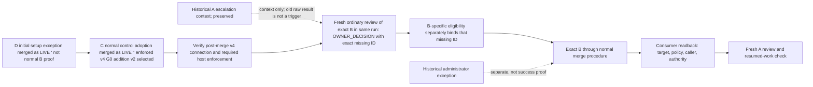

# Preview.4 gap roadmap for #405 (proposed)

**Status:** nonnormative planning document for independent review. It does not
amend the selected architecture Set, select a consumer route, authorize an
integration or administration action, activate a route, or establish consumer
proof. It supports #405's finite roadmap and leaves #403's scope freeze
provisional until independent review and consumer-route evidence are complete.

**Authority and baseline.** This roadmap is based on the complete selected
six-member Set at `origin/main` commit
`426fd7832dd5b32e6e74df74f63ba29926b7d717`: [architecture contract](../architecture.md),
[Authority Set](../architecture/authority-set.md),
[owner addition](../architecture/owner-addition.md),
[owner amendment](../architecture/owner-amendment.md),
[review execution](../architecture/review-execution.md), and
[self profile](../architecture/self-profile.md), selected by
[authorities.json](../../.codex/gatekeeper/authorities.json). The lifecycle
catalogue merged in #411 is a traceability aid, not authority or proof
([catalogue](2026-10-08-preview4-lifecycle-clause-catalogue.md)). Source and
test references below identify mechanisms at the stated revision only.

## Current checkpoint (2026-10-08)

The original roadmap below remains a dated baseline; this checkpoint records
later evidence and supersedes earlier status statements where they differ. The
latest confirmed main is `9082001396d1edf0c6457d4d72a91a5fd552d514`, the normal
squash merge of #422. Comparing the selected Set at the stated baseline with
that main shows a legacy v1 repair status update in
`review-execution.md`: the previously authorized repair is implemented and
shipped in v0.5.1. This wording update does not select or activate a new route,
change preview assurance, or alter the LIVE checkpoints below. #422's package
change splits source-cycle dependencies; it does not change route assurance.

LIVE's adopted state has advanced since the initial snapshot:

- **D / LIVE #145:** the consumer-approved initial external setup exception
  completed and merged as `b730befa4779d6c2a653a60b11b53832975f4e27`, with
  verified overview-only readback for all eight selected authority members.
  This is a recorded setup exception, not evidence that the historical v1
  result became a normal pass. [Public evidence](https://github.com/flair-agency/architecture-gatekeeper/issues/406#issuecomment-6051350463).
- **C / LIVE #147:** the consumer approved and merged the normal control
  adoption as `2539ed7db957074ba957357e528f86479810869c`. It records 11
  controls, documentation and test paths; keeps all eight selected authority
  members unchanged; and passed normal predecessor review/acceptance, the two
  required CI checks, Code Security and independent review. Security Review
  was optional, not a required check. C selects the enforced v4
  `OWNER_ADDITION / G0` route with `ownerAddition v2`. The retained local v1
  and older-schema split stays pinned to runtime `3f71fece`; the local schema
  bytes match the predecessor. This adoption does not establish a normal B or
  a completed T1 lifecycle. [Public evidence](https://github.com/flair-agency/architecture-gatekeeper/issues/407#issuecomment-6051350994).
- **Still open for LIVE:** actual B execution, #139 adoption, fresh A,
  post-merge v4 connection verification (#407), host-enforcement proof for
  check source, bypass and transition ordering, and a finite operational trace
  remain incomplete. A host ruleset readback returned 403, which means
  unavailable evidence, not evidence of absent protection. Issues #405, #406
  and #407 remain open; no release completion, scope freeze or date change
  follows from these checkpoints.
- **Separate runner-output finding:** PR #432 and run
  [37721924693](https://github.com/flair-agency/architecture-gatekeeper/actions/runs/37721924693)
  reproduce GitHub suppressing a job output named `final_message` as possibly
  secret while a same-job JSON output succeeds. The consumer workflow under
  investigation uses `final_message` in ordinary addition/report handoff, so this is relevant
  evidence for #407's verification plan. Full
  consumer inventory, secret-boundary analysis, replacement design, negative
  cases and hosted verification remain open; no LIVE incident is established.
- **Package preview scope:** quality PR #435 reports a full installed smoke
  pass at `aa708928`; the earlier #433 timeout cause remains unknown. That
  quality migration does not by itself expand Preview.4 adoption or assurance.
- **Separate package PR #423:** reviewed head
  `9c7f29557e374ede784cf276191ea65d0733d0f2` remains OPEN and BEHIND, with its
  exact merge approval pending. It has not merged and does not block recording
  these informational checkpoints.

These are coordination and evidence updates only. The original T0–T9 and B1–B8
tables retain their source-revision analysis; interpret their LIVE statuses
through this checkpoint. In particular, a completed D exception and adopted
C improve the route state but do not satisfy the remaining T1, T8 or T9 proof.

## Proposed priority and route boundaries

The original LIVE work had two changes. D amended the existing owner
responsibility and completed the initial external setup exception as recorded
above. C then completed the consumer-governed control adoption and selected
enforced v4 `OWNER_ADDITION / G0` with `ownerAddition v2`. The still-open T1
work is a later normal B for the missing approved-artifact-identity decision
identified by Change A. The public catalogue's #139 `OWNER_DECISION`, #144
separately authorized administrator exception and #143 two-file selection
remain historical evidence only; none substitutes for the later exact B.

The initial D exception is not normal B evidence, and its historical v1 result
is not reclassified as a normal pass. C's merge preserves all eight selected
authority members and the retained local v1/older-schema split; the runtime
pin is `3f71fece`, and the local schema is byte-identical to the predecessor.
The exact v4 post-merge consumer connection and host enforcement evidence are
still incomplete. A shared extension would require its own versioned contract
and authorization before implementation.

**Host-state evidence is limited.** Ruleset/protection readback returned HTTP
403 with a capability limitation noted in the private plan; this is unavailable
readback, not evidence that the rules are absent. Check producer ID `15368` was
observed. Whether that check is required, its exact source binding, bypass
scope, and ordering through the target transition remain unknown. No visibility
upgrade, permission, or credential has been selected.

The diagram distinguishes completed setup/selection from incomplete lifecycle
proof. D (#145) is canonically placed through its approved setup exception;
C (#147) is adopted through normal controls. Neither completes the later
normal B. First verify the exact post-merge v4 connection and required host
enforcement. Then the v4 path requires a fresh ordinary review of exact B in
the same run, returning `OWNER_DECISION` with the exact missing decision ID;
separate B eligibility binds that ID before the normal merge procedure. The
historical raw #139 result is context only and cannot trigger this review. The
historical #144 exception remains separate and does not prove normal B
eligibility. No migration M is currently identified as necessary. If a
consumer later selects one, its own exact predecessor must give prior authority
and the same M must receive ordinary `PASS`; the package's preview migration
API or receipt alone proves neither.

`ci-policy v5` with `ownerAddition v2` is not selected for this LIVE work and is
a deferred alternative; its finalizer is not the selected v4 path. Do not add
v5 implementation or switch policy as a shortcut. The package's existing
preview APIs remain available as explicitly UNVERIFIED mechanisms; this
roadmap proposes no new universal or all-route preview implementation.
Preview records cannot stand in for v4 enforced acceptance, authenticate an
owner, or demonstrate trusted adoption.
The trusted self amendment target and the Issue #147 procedural amendment
target remain separate, deferred work with their own selection and evidence
gates.

## Evidence vocabulary

| State | Evidence needed | Limit |
|---|---|---|
| Defined | Applicable clause in the selected Set | Does not prove source support or selection. |
| Implemented | Exact source, workflow and focused fixture at a named commit | Does not prove predecessor selection, live host settings or consumer operation. |
| Selected | Exact consumer predecessor policy, caller and complete selected inputs | Does not prove host enforcement or a completed route. |
| Connected | Readback of the exact caller, required check, target/ref rules, permissions, and integration procedure | Does not establish semantic B eligibility or adoption. |
| Actual proof | Exact A/B or M trace, bound evidence, ordinary transition, canonical readback, fresh A, and resumed-work handling where applicable | Proves only that tuple and time; does not generalize to other consumers. |

Keep defined, implemented, released, selectable, prior-selected, eligible,
owner action, adopted, canonically placed, commissioning, and active separate.
An unread or unselected selector is `UNKNOWN / NOT CLASSIFIED`, not
`UNSUPPORTED`. Use `UNSUPPORTED` only for an identified selected tuple whose
contract has no authorized normal route or bridge, or explicitly excludes the
requested integration form. No diagram, source file, test fixture, issue state
or green check substitutes for connection or actual proof.

## Transition coverage T0–T9

| Case | Applicability and exact evidence status | Source/test evidence at `426fd7832dd5b32e6e74df74f63ba29926b7d717` (mechanism only) | Specific next task and proposed allocation |
|---|---|---|---|
| **T0 Root** | Not applicable to the known existing LIVE repository unless a distinct never-existing root/lineage is in scope. No absent-ever root claim is needed for the proposed existing consumer. | Lifecycle definition in `docs/architecture.md`; preview records in `src/preview-lifecycle.mjs`, `test/preview-lifecycle.test.mjs` do not prove historical absence. | #405 records not-applicable for this existing repository; no bootstrap or release task. If a separate tuple appears, collect its lineage under #405 before classifying. |
| **T1 Addition for missing decision** | Applies to the later normal B for A's missing approved-artifact-identity decision. D and C are complete checkpoints; LIVE has selected enforced v4 `OWNER_ADDITION / G0` with `ownerAddition v2`. Exact post-merge connection, host enforcement and normal B remain incomplete. #139 is historical context, not the B trigger or adoption proof; #144 is a separate exception. | Policy parsing: [`src/resolve-ci-policy.mjs`](../../src/resolve-ci-policy.mjs); owner-addition mechanisms: [`src/owner-addition-ci.mjs`](../../src/owner-addition-ci.mjs), [`src/owner-addition-multiauthority.mjs`](../../src/owner-addition-multiauthority.mjs), [`src/owner-addition-finalize.mjs`](../../src/owner-addition-finalize.mjs), [`src/owner-addition-adoption.mjs`](../../src/owner-addition-adoption.mjs), [`src/ci-enforced-acceptance.mjs`](../../src/ci-enforced-acceptance.mjs), consumer workflow [`architecture-gate-consumer.yml`](../../.github/workflows/architecture-gate-consumer.yml); focused tests [`policy.test.mjs`](../../test/policy.test.mjs), [`owner-addition-ci.test.mjs`](../../test/owner-addition-ci.test.mjs), [`owner-addition-multiauthority.test.mjs`](../../test/owner-addition-multiauthority.test.mjs), [`owner-addition-finalize.test.mjs`](../../test/owner-addition-finalize.test.mjs), [`owner-addition-adoption.test.mjs`](../../test/owner-addition-adoption.test.mjs), [`github-owner-addition-readback.test.mjs`](../../test/github-owner-addition-readback.test.mjs). | #405 records the selected v4 family and outstanding normal route gaps. #407 verifies the exact post-merge v4 connection and host evidence. Then a fresh ordinary review of exact B in the same run must return `OWNER_DECISION` with the exact missing ID; separate B eligibility binds that ID; then the normal transition/readback, fresh A and resumed-work trace. Old #139 raw result cannot trigger this route. The v5 finalizer does not establish v4 behavior. A shared connection extension is separate/versioned. Package release: no route change from this roadmap. Consumer proof/adoption: #408. |
| **T2 Existing-decision amendment** | Applies to D, which amended the existing responsibility and completed the first external setup procedure through the approved initial-setup exception. LIVE #145 is merged; overview-only readback covered all eight selected authority members. This exception is separate from normal T1 B eligibility and does not relabel the historical v1 result as a normal pass. | Preview mechanics: [`src/preview-lifecycle.mjs`](../../src/preview-lifecycle.mjs), [`preview-amendment-block.test.mjs`](../../test/preview-amendment-block.test.mjs), [`preview-amendment-owner.test.mjs`](../../test/preview-amendment-owner.test.mjs). Trusted mechanism examples: [`src/owner-amendment.mjs`](../../src/owner-amendment.mjs), [`src/owner-amendment-semantic-eligibility.mjs`](../../src/owner-amendment-semantic-eligibility.mjs), [`src/owner-amendment-merge-group-acceptance.mjs`](../../src/owner-amendment-merge-group-acceptance.mjs); focused tests [`owner-amendment.test.mjs`](../../test/owner-amendment.test.mjs), [`owner-amendment-semantic-eligibility.test.mjs`](../../test/owner-amendment-semantic-eligibility.test.mjs), [`owner-amendment-merge-group-acceptance.test.mjs`](../../test/owner-amendment-merge-group-acceptance.test.mjs). They do not select LIVE. | LIVE #145's setup checkpoint is complete; #406 remains open for the tracked owner-responsibility work. The exception does not establish normal B eligibility or the v4 post-merge connection. The trusted self and Gatekeeper Issue #147 procedural amendment targets remain separate deferred alternatives, each with their own gates; no Preview.4 activation follows from D. |
| **T3 Equivalent maintenance / selector change** | C's LIVE selector/configuration adoption is complete and selects v4 `OWNER_ADDITION / G0` with `ownerAddition v2`. The v4 post-merge connection remains unverified. No separate equivalent-maintenance transition is identified; do not infer equivalence from identical bytes. | [`src/preview-lifecycle.mjs`](../../src/preview-lifecycle.mjs), [`src/authority-set.mjs`](../../src/authority-set.mjs), [`test/preview-lifecycle.test.mjs`](../../test/preview-lifecycle.test.mjs), [`test/authority-set.test.mjs`](../../test/authority-set.test.mjs). | #405 records the adopted C and the remaining connection gap. A distinct selector/maintenance tuple, if proposed, must be reviewed separately; no additional implementation/release is allocated from the current evidence. |
| **T4 Oversized Authority Set recovery** | Conditional only if LIVE's selected set exceeds selected/runtime bounds and recovery was selected beforehand. No LIVE T4 evidence is established. | Bounds/materialization: [`src/authority-set.mjs`](../../src/authority-set.mjs), [`src/prepare-authority-set.mjs`](../../src/prepare-authority-set.mjs), [`test/authority-set.test.mjs`](../../test/authority-set.test.mjs), [`test/prepare-authority-set.test.mjs`](../../test/prepare-authority-set.test.mjs). | #405 read exact limits and set. If under bounds, mark not applicable. If over bounds, #406 canonical owner decision if needed, then separately bounded #407 only under prior authorization. No package or consumer release allocation absent evidence. |
| **T5 Compatible migration** | No LIVE migration M is currently identified as necessary; D and C have already been adopted. Any future M would need an exact prior-selected predecessor and ordinary `PASS` for that same M. | Narrow initial v1→v2 preview path: [`src/preview-lifecycle.mjs`](../../src/preview-lifecycle.mjs), [`test/preview-migration-initial.test.mjs`](../../test/preview-migration-initial.test.mjs). This is only a mechanism; it does not prove a LIVE migration or select v4. | #405 records no M task absent a demonstrated consumer need and exact predecessor authority. If needed, #407 captures same-M ordinary `PASS`, pre-integration receipt, ordered integration/tree and target ancestry/readback. The API/receipt alone does not authorize M or prove the adopted v4 connection. #408 verifies actual consumer state. |
| **T6 Incompatible migration** | No incompatible migration is currently identified. If no selector/tuple is read, status is unknown; for a known selected tuple with no prior-authorized bridge, contract result is `UNSUPPORTED`. | Preview implementation explicitly rejects incompatible migration: [`src/preview-lifecycle.mjs`](../../src/preview-lifecycle.mjs), [`test/preview-migration-initial.test.mjs`](../../test/preview-migration-initial.test.mjs). | #405 classify only after exact predecessor review. If incompatible, retain predecessor and defer; a bridge needs owner-authorized canonical contract decision (#406) and a separately scoped #407. No fallback or release allocation. |
| **T7 First selection** | C completed LIVE's first v4 selection with `ownerAddition v2`. Post-merge v4 caller/runtime connection is still being verified; selection alone does not prove a working or enforced route. | Policy selection mechanism in [`src/resolve-ci-policy.mjs`](../../src/resolve-ci-policy.mjs), workflow path above, [`test/resolve-ci-policy.test.mjs`](../../test/resolve-ci-policy.test.mjs). | #407 verifies the exact v4 post-merge connection and host evidence. Bootstrap is not selected. Do not claim the normal B route is operational or enforced before that evidence and the B trace. |
| **T8 Adoption before ACTIVE** | C's control configuration is adopted, but no normal B adoption or full lifecycle is established; this roadmap makes no ACTIVE claim. A later ACTIVE claim requires eligible exact B, owner action, ordinary integration and canonical readback. | Mechanisms: addition source/test paths in T1; readback adapters [`src/github-owner-addition-readback.mjs`](../../src/github-owner-addition-readback.mjs), [`test/github-owner-addition-readback.test.mjs`](../../test/github-owner-addition-readback.test.mjs). Source tests are not LIVE host readback. | #407 closes the selected v4 connection gap if possible; #408 covers the consumer's normal B transition/readback and fresh A. Until all selected facts complete, do not claim normal B adoption, ACTIVE or full lifecycle. #409 recovery/publish only after an observed result/failure and separate authorization. |
| **T9 Later profile-fresh use** | No fresh A or resumed-work trace after a normal LIVE B exists; the normal B has not been completed. | Preview fresh review: `prepareFreshPreviewReview` in [`src/preview-lifecycle.mjs`](../../src/preview-lifecycle.mjs), [`test/preview-lifecycle.test.mjs`](../../test/preview-lifecycle.test.mjs). Ordinary CI review is in the consumer workflow above. | #408 includes fresh A and a resumed pending-work scenario against current bindings after the normal B. #409 handles permitted recovery with regenerated dependent evidence. No fallback on stale evidence or service failure. |

### T2 route-family dispositions

These are separate routes; source/API presence does not select one for LIVE.

| Route family | Applicability and disposition | Separate gate / release allocation |
|---|---|---|
| Current LIVE D | T2 existing-decision amendment for the owner responsibility and initial external setup. The approved exception is complete and merged as LIVE #145; its overview-only readback covered all eight selected authority members. It is not normal T1 B proof. | #406 remains open for the tracked owner-responsibility work. The completed exception neither relabels historical v1 results nor proves the later normal B. |
| Preview `BLOCK` amendment | UNVERIFIED mechanism only; not the current missing-decision case. | Retain existing preview API; no new all-route implementation or LIVE activation. Any later preview release must satisfy its route-specific consumer selection and fixture gates. |
| Preview `OWNER_DECISION` amendment | UNVERIFIED mechanism only; applies to a bound existing-decision change, not missing-decision addition. | Same preview-only gate, separate from BLOCK and addition. No LIVE activation under this roadmap. |
| Trusted self amendment | Self-repository target only; currently inactive pending its protected BLOCK and OWNER_DECISION end-to-end cases. | Deferred to self-profile gates and separate owner review; no Preview.4/LIVE release claim. |
| Gatekeeper Issue #147 procedural BLOCK target | Distinct inactive target; requires exact completed BLOCK with authenticated producer provenance, selected evidence custody through transition, prior-policy selection, eligible exact B, adoption/readback and fresh A. | Deferred until its own canonical selection, implementation, negative fixtures and finite production trace are authorized. This is separate from the LIVE Agency PR #147 C adoption above. |

## Bootstrap controls B1–B8

These guards apply only if a consumer independently selects guarded bootstrap
for T0 or T7. Bootstrap is not selected for LIVE. D's initial setup exception
and C's normal control adoption are complete, and C selects v4
`OWNER_ADDITION / G0` with `ownerAddition v2`. The post-merge connection,
required host-enforcement facts and finite operational trace for normal B are
still incomplete. This does not establish that no normal exit exists. No B
guard is treated as satisfied by missing files, package APIs or test fixtures.

| Guard | Applicability / evidence status | Source mechanism (not actual proof) | Specific task and disposition |
|---|---|---|---|
| **B1** Absent-ever / never-completed | Bootstrap is not selected; no absent-ever evidence collected. The known existing repository is not proposed as T0. | Contract only; preview records do not prove historical absence. | #405 records bootstrap N/A to the proposed path, not a satisfied B1. Reassess only if a separate bootstrap tuple is selected. |
| **B2** Inventory all exits; no finite path | Not assessed for LIVE bootstrap because bootstrap is not selected. LIVE has adopted D and selected v4 through C, but the normal B connection, host enforcement and finite operational trace remain unverified. | Source shows v4 mechanisms (`src/resolve-ci-policy.mjs`, `src/owner-addition-ci.mjs`, consumer workflow); source and fixtures cannot prove LIVE host settings or exhaust consumer-authorized exits. | #405 records the adopted D/C and outstanding connection/trace facts. Do not claim B2 satisfied, do not claim absence of a normal exit, and do not use bootstrap as a shortcut for the connection gap. |
| **B3** Independent exact-scope governance | Bootstrap is not selected. Consumer approval and adoption are recorded for D's setup exception and C's normal controls; no bootstrap authorization is selected. | No shared mechanism can self-authorize. | Keep bootstrap out of scope. #406 remains open for the tracked owner responsibility; completed D approval is not authority for a separate bootstrap route. |
| **B4** Bind candidate, paths, operations, actors and lineage | Bootstrap not selected; D/C identities and control adoption are recorded, while the later normal B candidate and operation bindings remain unproven. | v4 procedure bindings in `src/owner-addition-ci.mjs`; preview bindings in `src/preview-lifecycle.mjs`. | #405 records the selected D/C and exact missing B facts; #408 records the actual B trace if completed. Do not infer lineage reset or guard satisfaction. |
| **B5** Verify preparation, limits, inputs, producer and host | Bootstrap not selected; C readback verified the same eight authorities, but the exact v4 post-merge connection and required host source/bypass/order remain unverified. | `src/authority-set.mjs`, `src/prepare-authority-set.mjs`, `src/owner-addition-ci.mjs`. | #407 verifies the exact selected connection/host gap; #408 captures actual operation evidence. Source does not satisfy B5. |
| **B6** First-operation target/policy/caller readback | Bootstrap not selected. D/C readbacks exist; the first normal B operation and its target/policy/caller readback have not occurred. | [`src/github-owner-addition-readback.mjs`](../../src/github-owner-addition-readback.mjs), [`test/github-owner-addition-readback.test.mjs`](../../test/github-owner-addition-readback.test.mjs). | #407/#408 verify exact target, policy and caller connection for normal B. Tests do not prove LIVE configuration or B6. |
| **B7** Consume lineage authorization | No bootstrap authorization is selected or proposed. | Preview receipt integrity is not external authorization consumption. | Not applicable to current normal-route plan. If a bootstrap tuple is separately selected, assess under its exact authorizing contract. |
| **B8** Later normal adoption/readback before ACTIVE | Bootstrap not selected; normal B integration/readback and ordinary T8 remain separate conditions for any ACTIVE claim. | See T8 mechanisms above. | #408 supplies actual B integration/readback and fresh-A proof if the route is adopted. No bootstrap or ACTIVE claim. |

## Finite work sequence and release gates

| Issue | Reviewable outcome / owner | Dependency and exit evidence | Proposed disposition |
|---|---|---|---|
| [#403](https://github.com/flair-agency/architecture-gatekeeper/issues/403) | Scope freeze by coordinator after independent completeness review. | This roadmap is provisional until the complete selected Set, exact LIVE route evidence and worker coverage are reviewed. | Do not treat prior catalogue or this draft as a freeze. |
| [#405](https://github.com/flair-agency/architecture-gatekeeper/issues/405) | Complete finite transition/guard gap allocation and LIVE normal-route feasibility. | Record D #145 and C #147 as adopted; identify current v4 `OWNER_ADDITION / G0` with `ownerAddition v2`; verify the post-merge caller/runtime connection and host enforcement; preserve #139/#144 history and the distinction between C adoption and normal B adoption. | This documentation candidate records the checkpoints and remaining work. No package code/release or additional consumer activation is proposed. |
| [#406](https://github.com/flair-agency/architecture-gatekeeper/issues/406) | Track the remaining owner-responsibility work after D's initial setup exception. | Consumer owner authority; #145's exact setup exception is complete and readback verified. | Open; do not describe D's setup approval or canonical placement as pending. |
| [#407](https://github.com/flair-agency/architecture-gatekeeper/issues/407) | Verify the exact post-merge v4 connection and host evidence; investigate the demonstrated runner-output gap as scoped. | Exact authority, file scope, selector, tests and exit evidence; required check source, bypass and ordering; output consumer inventory, secret boundary, replacement and negative/hosted checks. | No universal preview route implementation. Existing preview APIs remain as-is. A shared connection extension would need separately versioned authorization. Security Review is optional and not a required CI check. |
| [#408](https://github.com/flair-agency/architecture-gatekeeper/issues/408) | Complete the normal LIVE B path, canonical readback, fresh A and resumed-work trace after the already adopted D/C controls. | #405 exact tuple; #407 post-merge connection/host evidence if resolved; consumer owner action and actual B trace. | Keep normal B adoption, ACTIVE and full lifecycle claims unavailable until all selected evidence is proven. |
| [#409](https://github.com/flair-agency/architecture-gatekeeper/issues/409) | Recovery/publish artifact for an observed interruption or completed, separately authorized release. | Preserve placement/adoption distinctions; regenerate dependent evidence when selected policy requires. | No automatic recovery or publishing. Release follows the runbook and an approved release plan. |
| [#423](https://github.com/flair-agency/architecture-gatekeeper/pull/423) | Prompt fix at reviewed head `9c7f29557e374ede784cf276191ea65d0733d0f2`; PR remains OPEN and BEHIND. | Its separate exact merge approval remains pending. Do not count it as merged or completed evidence. | Keep separate from #405–#408; use only if its final scope affects prompt/input binding or review behavior. |

## Non-goals and limits

No package code, schema, workflow, canonical authority or consumer repository is
changed by this roadmap. It does not enable a route, authorize an admin
exception, or decide whether a consumer's architecture is complete. D setup
and C control adoption are recorded; this roadmap makes no claim of LIVE host
enforcement, normal B adoption, full lifecycle completion, fresh A,
resumed-work completion, self-profile readiness, or broad support.
The `ci-policy v5` procedural alternative, trusted self amendment route, and
Issue #147 BLOCK procedural target remain deferred pending their own explicit
prior selection and end-to-end gates. Existing preview APIs are mechanism
evidence only. Package release status and consumer adoption status are
independent.
