# Preview.4 gap roadmap for #405 (proposed)

**Status:** nonnormative planning document for independent review. It does not
amend the selected architecture Set, select a consumer route, authorize an
integration or administration action, activate a route, or establish consumer
proof. It supports #405's finite roadmap and leaves #403's scope freeze
provisional until independent review and consumer-route evidence are complete.

**Authority and baseline.** This roadmap is based on the complete selected
six-member Set at `origin/main` commit
`426fd7832dd5b32e6e74df74f63ba29926b7d717`: [architecture contract](../architecture.md),
[Authority Set](../architecture/authority-set.md),
[owner addition](../architecture/owner-addition.md),
[owner amendment](../architecture/owner-amendment.md),
[review execution](../architecture/review-execution.md), and
[self profile](../architecture/self-profile.md), selected by
[authorities.json](../../.codex/gatekeeper/authorities.json). The lifecycle
catalogue merged in #411 is a traceability aid, not authority or proof
([catalogue](2026-10-08-preview4-lifecycle-clause-catalogue.md)). Source and
test references below identify mechanisms at the stated revision only.

## Proposed priority and route boundaries

The current LIVE CI policy is version 1; version 4 with `ownerAddition v2` is
not selected. The consumer-facing work has two distinct changes. First, D is
an existing-decision amendment and setup preparation for the newly identified
owner responsibility (T2). Second, after D and a separately consumer-governed
configuration change C select the v4 family, a later B may add the missing
approved-artifact-identity decision identified by Change A (T1). The public catalogue reports
PR #139 as `OWNER_DECISION`, PR #144 as a separately authorized administrator
exception, and PR #143's two-file selection as insufficient to reuse the
four-path #139 artifact. Those dated observations do not prove a usable D, a
selected LIVE route, or adoption.

The consumer owner approved preparing D and the first external setup procedure
under LIVE's own authority. This did not approve the exact setup operations;
their owner approval remains pending. The currently proposed initial-setup
exception would be a non-normal step that can make D canonical only after that
exact approval. Keep it separate from later normal B eligibility and adoption
evidence. This package roadmap does not approve or perform the exception,
merge D, administer LIVE, or activate either route. C is a later
consumer-governed configuration adoption after D. It may select the v4 family
under LIVE governance; no such selection or connection is established now. The
v4 post-merge connection is prospective consumer-owned work. A shared extension
would need a separate versioned contract and authorization before
implementation.

**Host-state evidence is limited.** Ruleset/protection readback returned HTTP
403 with a capability limitation noted in the private plan; this is unavailable
readback, not evidence that the rules are absent. Check producer ID `15368` was
observed. Whether that check is required, its exact source binding, bypass
scope, and ordering through the target transition remain unknown. No visibility
upgrade, permission, or credential has been selected.

```mermaid
flowchart LR
  A[Historical A escalation context; preserved] -. context only; old raw result is not a trigger .-> E
  D[Consumer prepares exact D and setup; T2] --> O[Exact setup operations approval pending]
  O -. proposed initial-setup exception; non-normal .-> DC[D canonical only after setup execution and readback verification]
  DC -->|if required| M[Compatible M under v1; ordinary PASS for same M; no v4 selection]
  M --> C[Separate C under v1; ordinary PASS; selects v4 after D]
  DC -->|if no migration needed| C
  C --> E[Fresh ordinary review of exact B in same run: OWNER_DECISION with exact missing ID]
  E --> K[B-specific eligibility separately binds that missing ID]
  K --> B[Exact B through normal merge procedure]
  B --> R[Consumer readback: target, policy, caller, authority]
  R --> F[Fresh A review and resumed-work check]
  X[Historical administrator exception] -. separate, not success proof .-> B
```

The diagram is a proposed sequence only; A and D are separate work items.
D's canonical status is pending: the external initial-setup exception has not
received approval for its exact operations, execution, and readback. C is a
separate ordinary consumer-governed configuration after D;
it is the proposed way to select v4. D is the current T2 responsibility
amendment; later B is a distinct T1 addition and does not reuse D's exception
or evidence. The proposed external initial-setup exception remains pending
exact operational approval and is not ordinary B evidence. M applies only if
a compatible control-plane migration is independently required; it is not a
step that selects v4. The package's narrow initial
v1-to-v2 preview migration mechanism is not itself a LIVE transition: any
consumer M requires an actual ordinary PASS for that same M under current v1
and cannot select trusted v4 acceptance. Its API, receipt, integration and
readback do not authorize B or prove LIVE adoption. C is a separate
consumer-governed configuration after D (and M if required); C itself must
pass ordinary review under current v1 before adoption. Only then may v4 be
selected for subsequent B reviews. In that v4 path, E is a fresh ordinary
review of the exact B in the same run. E must return `OWNER_DECISION` and the
exact missing decision ID that B-specific eligibility binds. The historical
raw #139 result is context only and cannot trigger E; its rejection is
preserved, not reused as the new B review. The historical #144 exception stays
a separate event and does not stand in for normal B proof.

`ci-policy v5` with `ownerAddition v2` is not selected for this LIVE work and is
a deferred alternative. Do not add v5 implementation or switch policy as a
shortcut. The package's existing preview APIs remain available as explicitly
UNVERIFIED mechanisms; this roadmap proposes no new universal or
all-route preview implementation. Preview records cannot stand in for v4
enforced acceptance, authenticate an owner, or demonstrate trusted adoption.
The trusted self amendment target and the Issue #147 procedural amendment
target remain separate, deferred work with their own selection and evidence
gates.

## Evidence vocabulary

| State | Evidence needed | Limit |
|---|---|---|
| Defined | Applicable clause in the selected Set | Does not prove source support or selection. |
| Implemented | Exact source, workflow and focused fixture at a named commit | Does not prove predecessor selection, live host settings or consumer operation. |
| Selected | Exact consumer predecessor policy, caller and complete selected inputs | Does not prove host enforcement or a completed route. |
| Connected | Readback of the exact caller, required check, target/ref rules, permissions, and integration procedure | Does not establish semantic B eligibility or adoption. |
| Actual proof | Exact A/B or M trace, bound evidence, ordinary transition, canonical readback, fresh A, and resumed-work handling where applicable | Proves only that tuple and time; does not generalize to other consumers. |

Keep defined, implemented, released, selectable, prior-selected, eligible,
owner action, adopted, canonically placed, commissioning, and active separate.
An unread or unselected selector is `UNKNOWN / NOT CLASSIFIED`, not
`UNSUPPORTED`. Use `UNSUPPORTED` only for an identified selected tuple whose
contract has no authorized normal route or bridge, or explicitly excludes the
requested integration form. No diagram, source file, test fixture, issue state
or green check substitutes for connection or actual proof.

## Transition coverage T0–T9

| Case | Applicability and exact evidence status | Source/test evidence at `426fd7832dd5b32e6e74df74f63ba29926b7d717` (mechanism only) | Specific next task and proposed allocation |
|---|---|---|---|
| **T0 Root** | Not applicable to the known existing LIVE repository unless a distinct never-existing root/lineage is in scope. No absent-ever root claim is needed for the proposed existing consumer. | Lifecycle definition in `docs/architecture.md`; preview records in `src/preview-lifecycle.mjs`, `test/preview-lifecycle.test.mjs` do not prove historical absence. | #405 records not-applicable for this existing repository; no bootstrap or release task. If a separate tuple appears, collect its lineage under #405 before classifying. |
| **T1 Addition for missing decision** | Applies to the later B for A's missing approved-artifact-identity decision. It is distinct from current D. LIVE policy v1 is known; v4 is not selected. Exact predecessor selection and future configuration C's connection remain to be established under consumer governance. #139 is historical context, not the B trigger or adoption proof; #144 is a separate exception. | Policy parsing: [`src/resolve-ci-policy.mjs`](../../src/resolve-ci-policy.mjs); owner-addition mechanisms: [`src/owner-addition-ci.mjs`](../../src/owner-addition-ci.mjs), [`src/owner-addition-multiauthority.mjs`](../../src/owner-addition-multiauthority.mjs), [`src/owner-addition-finalize.mjs`](../../src/owner-addition-finalize.mjs), [`src/owner-addition-adoption.mjs`](../../src/owner-addition-adoption.mjs), [`src/ci-enforced-acceptance.mjs`](../../src/ci-enforced-acceptance.mjs), consumer workflow [`architecture-gate-consumer.yml`](../../.github/workflows/architecture-gate-consumer.yml); focused tests [`policy.test.mjs`](../../test/policy.test.mjs), [`owner-addition-ci.test.mjs`](../../test/owner-addition-ci.test.mjs), [`owner-addition-multiauthority.test.mjs`](../../test/owner-addition-multiauthority.test.mjs), [`owner-addition-finalize.test.mjs`](../../test/owner-addition-finalize.test.mjs), [`owner-addition-adoption.test.mjs`](../../test/owner-addition-adoption.test.mjs), [`github-owner-addition-readback.test.mjs`](../../test/github-owner-addition-readback.test.mjs). | #405 records current v1 and proposed later C/v4 as unconnected. After D and C are canonically adopted by LIVE, prove the exact predecessor-selected v4 procedure: a fresh ordinary review of exact B in the same run returns `OWNER_DECISION` with the exact missing ID; separate B eligibility binds that ID; then ordinary transition/readback, fresh A and resumed work. Old #139 raw result cannot trigger this route. Current source plus proposed C does not prove a finite predecessor-authorized LIVE path. A shared connection extension is separate/versioned. Package release: no route change from this roadmap. Consumer proof/adoption: #408. |
| **T2 Existing-decision amendment** | Applicable to current D, which amends an existing responsibility/decision while preparing the first external setup procedure. The owner approved preparation only; exact setup operations approval remains pending. Proposed D canonicalization uses a prospective external initial-setup exception, not a normal transition; it is separate from later T1 B eligibility. | Preview mechanics: [`src/preview-lifecycle.mjs`](../../src/preview-lifecycle.mjs), [`preview-amendment-block.test.mjs`](../../test/preview-amendment-block.test.mjs), [`preview-amendment-owner.test.mjs`](../../test/preview-amendment-owner.test.mjs). Trusted mechanism examples: [`src/owner-amendment.mjs`](../../src/owner-amendment.mjs), [`src/owner-amendment-semantic-eligibility.mjs`](../../src/owner-amendment-semantic-eligibility.mjs), [`src/owner-amendment-merge-group-acceptance.mjs`](../../src/owner-amendment-merge-group-acceptance.mjs); focused tests [`owner-amendment.test.mjs`](../../test/owner-amendment.test.mjs), [`owner-amendment-semantic-eligibility.test.mjs`](../../test/owner-amendment-semantic-eligibility.test.mjs), [`owner-amendment-merge-group-acceptance.test.mjs`](../../test/owner-amendment-merge-group-acceptance.test.mjs). They do not select LIVE. | #406 is in progress for the necessary owner responsibility; direction is approved and canonical adoption is pending. Consumer owner must approve exact setup operations before its proposed exception can run. This package does not carry out D or the exception. The trusted self and Issue #147 procedural amendment targets remain separate deferred alternatives, each with their own gates; no Preview.4 activation. |
| **T3 Equivalent maintenance / selector change** | Current LIVE policy v1 is known; C's future selector/configuration change is not yet selected. Applicable only when the exact predecessor/successor is identified. No equivalence is inferred from identical bytes. | [`src/preview-lifecycle.mjs`](../../src/preview-lifecycle.mjs), [`src/authority-set.mjs`](../../src/authority-set.mjs), [`test/preview-lifecycle.test.mjs`](../../test/preview-lifecycle.test.mjs), [`test/authority-set.test.mjs`](../../test/authority-set.test.mjs). | #405 read the actual predecessor and proposed C diff. A selector change routes to T5 or T6. Until exact tuple is selected, status is unknown and no implementation/release is allocated. |
| **T4 Oversized Authority Set recovery** | Conditional only if LIVE's selected set exceeds selected/runtime bounds and recovery was selected beforehand. No LIVE T4 evidence is established. | Bounds/materialization: [`src/authority-set.mjs`](../../src/authority-set.mjs), [`src/prepare-authority-set.mjs`](../../src/prepare-authority-set.mjs), [`test/authority-set.test.mjs`](../../test/authority-set.test.mjs), [`test/prepare-authority-set.test.mjs`](../../test/prepare-authority-set.test.mjs). | #405 read exact limits and set. If under bounds, mark not applicable. If over bounds, #406 canonical owner decision if needed, then separately bounded #407 only under prior authorization. No package or consumer release allocation absent evidence. |
| **T5 Compatible migration** | Conditional; current LIVE policy v1 is known. A compatible M may be needed, but the exact successor and need remain unknown. M cannot select trusted v4. | Narrow initial v1→v2 preview path: [`src/preview-lifecycle.mjs`](../../src/preview-lifecycle.mjs), [`test/preview-migration-initial.test.mjs`](../../test/preview-migration-initial.test.mjs). This is only a mechanism; actual selected consumer M requires ordinary PASS for that same M under the predecessor. | #405 establishes whether LIVE needs and authorizes M. If so, #407 captures exact same-M ordinary PASS, pre-integration receipt, ordered integration/tree and target ancestry/readback. Only after M may separate consumer-governed C select v4. No API/receipt claim substitutes for ordinary PASS or C. #408 verifies actual consumer state. |
| **T6 Incompatible migration** | No incompatible migration is currently identified. If no selector/tuple is read, status is unknown; for a known selected tuple with no prior-authorized bridge, contract result is `UNSUPPORTED`. | Preview implementation explicitly rejects incompatible migration: [`src/preview-lifecycle.mjs`](../../src/preview-lifecycle.mjs), [`test/preview-migration-initial.test.mjs`](../../test/preview-migration-initial.test.mjs). | #405 classify only after exact predecessor review. If incompatible, retain predecessor and defer; a bridge needs owner-authorized canonical contract decision (#406) and a separately scoped #407. No fallback or release allocation. |
| **T7 First selection** | Potentially applicable to later configuration C. Current LIVE policy v1 is known; v4 is not selected, and future selector/caller connection is unknown. Exact setup operations approval for current D remains pending. | Policy selection mechanism in [`src/resolve-ci-policy.mjs`](../../src/resolve-ci-policy.mjs), workflow path above, [`test/resolve-ci-policy.test.mjs`](../../test/resolve-ci-policy.test.mjs). | #405 distinguishes D's proposed exception from C's later consumer-governed v4 selection and records exact readback needs. No bootstrap is selected; do not say the v4 route is currently finite or predecessor-authorized. No activation claim before C and connection evidence. |
| **T8 Adoption before ACTIVE** | Applicable to any lifecycle-v1 ACTIVE claim; this roadmap makes no ACTIVE claim. Proposed v4 consumer adoption must independently establish eligible exact B, owner action, ordinary integration and canonical readback. | Mechanisms: addition source/test paths in T1; readback adapters [`src/github-owner-addition-readback.mjs`](../../src/github-owner-addition-readback.mjs), [`test/github-owner-addition-readback.test.mjs`](../../test/github-owner-addition-readback.test.mjs). Source tests are not LIVE host readback. | #408 performs actual consumer-owned transition/readback and fresh A. Until all required facts complete, keep pending/commissioning. #409 recovery/publish only after an observed result/failure and separate authorization. |
| **T9 Later profile-fresh use** | Applicable to resumed/new work after canonical B; no LIVE fresh-A or resumed-work trace is established. | Preview fresh review: `prepareFreshPreviewReview` in [`src/preview-lifecycle.mjs`](../../src/preview-lifecycle.mjs), [`test/preview-lifecycle.test.mjs`](../../test/preview-lifecycle.test.mjs). Ordinary CI review is in the consumer workflow above. | #408 includes fresh A and a resumed pending-work scenario against current bindings. #409 handles permitted recovery with regenerated dependent evidence. No fallback on stale evidence or service failure. |

### T2 route-family dispositions

These are separate routes; source/API presence does not select one for LIVE.

| Route family | Applicability and disposition | Separate gate / release allocation |
|---|---|---|
| Current LIVE D | T2 existing-decision amendment for the owner responsibility and first external setup preparation. Preparation is approved; exact setup operations approval is pending. D's prospective initial-setup exception is pending and is not normal T1 B proof. | #406 is in progress for the necessary owner responsibility; direction approved, canonical adoption pending. Consumer owner must separately approve the exact setup operation. No package merge, administration, or route activation. |
| Preview `BLOCK` amendment | UNVERIFIED mechanism only; not the current missing-decision case. | Retain existing preview API; no new all-route implementation or LIVE activation. Any later preview release must satisfy its route-specific consumer selection and fixture gates. |
| Preview `OWNER_DECISION` amendment | UNVERIFIED mechanism only; applies to a bound existing-decision change, not missing-decision addition. | Same preview-only gate, separate from BLOCK and addition. No LIVE activation under this roadmap. |
| Trusted self amendment | Self-repository target only; currently inactive pending its protected BLOCK and OWNER_DECISION end-to-end cases. | Deferred to self-profile gates and separate owner review; no Preview.4/LIVE release claim. |
| Issue #147 procedural BLOCK target | Distinct inactive target; requires exact completed BLOCK with authenticated producer provenance, selected evidence custody through transition, prior-policy selection, eligible exact B, adoption/readback and fresh A. | Deferred until its own canonical selection, implementation, negative fixtures and finite production trace are authorized. No LIVE applicability inferred. |

## Bootstrap controls B1–B8

These guards apply only if a consumer independently selects guarded bootstrap
for T0 or T7. Bootstrap is not selected for the proposed LIVE work. The
existing v4 source and approval to prepare D do not establish a finite
predecessor-authorized normal LIVE path: D's first edge is still unadopted, C
is not selected, and the exact setup operations approval is pending. Therefore
this roadmap neither claims the guards are satisfied nor claims that no normal
exit exists. No B guard is treated as satisfied by missing files, package APIs
or test fixtures.

| Guard | Applicability / evidence status | Source mechanism (not actual proof) | Specific task and disposition |
|---|---|---|---|
| **B1** Absent-ever / never-completed | Bootstrap is not selected; no absent-ever evidence collected. The known existing repository is not proposed as T0. | Contract only; preview records do not prove historical absence. | #405 records bootstrap N/A to the proposed path, not a satisfied B1. Reassess only if a separate bootstrap tuple is selected. |
| **B2** Inventory all exits; no finite path | Not assessed for LIVE bootstrap because bootstrap is not selected. v4 source and the approved D-preparation direction do not prove a finite predecessor-authorized normal LIVE path; D is unadopted and C unselected. | Source shows v4 mechanisms (`src/resolve-ci-policy.mjs`, `src/owner-addition-ci.mjs`, consumer workflow); source and fixtures cannot prove LIVE selection or exhaust the consumer's authorized exits. | #405 establishes exact D/C and predecessor route facts. Do not claim B2 satisfied, do not claim absence of a normal exit, and do not use bootstrap due to the current connection gap. |
| **B3** Independent exact-scope governance | Bootstrap is not selected. Owner approval covers preparing D/setup only; exact setup operations approval remains pending. | No shared mechanism can self-authorize. | Consumer owner handles exact pending approval. #406 tracks the necessary owner responsibility; no package bootstrap work. |
| **B4** Bind candidate, paths, operations, actors and lineage | Bootstrap not selected; D/setup identities and operations remain consumer evidence. | v4 procedure bindings in `src/owner-addition-ci.mjs`; preview bindings in `src/preview-lifecycle.mjs`. | #405 records exact D/C bindings when available; #408 actual trace. Do not infer lineage reset or guard satisfaction. |
| **B5** Verify preparation, limits, inputs, producer and host | Bootstrap not selected; actual LIVE limits, producer and host connection remain unverified. | `src/authority-set.mjs`, `src/prepare-authority-set.mjs`, `src/owner-addition-ci.mjs`. | #405 records unknowns; #408 reads back the actual selected connection. Source does not satisfy B5. |
| **B6** First-operation target/policy/caller readback | Bootstrap not selected; actual first-operation readback is pending with consumer setup. | [`src/github-owner-addition-readback.mjs`](../../src/github-owner-addition-readback.mjs), [`test/github-owner-addition-readback.test.mjs`](../../test/github-owner-addition-readback.test.mjs). | #405/#408 collect exact target, policy and caller readback if the consumer proceeds. Tests do not prove LIVE configuration or B6. |
| **B7** Consume lineage authorization | No bootstrap authorization is selected or proposed. | Preview receipt integrity is not external authorization consumption. | Not applicable to current normal-route plan. If a bootstrap tuple is separately selected, assess under its exact authorizing contract. |
| **B8** Later normal adoption/readback before ACTIVE | Bootstrap not selected; ordinary T8 remains a separate condition for any ACTIVE claim. | See T8 mechanisms above. | #408 supplies actual adoption/readback and fresh-A proof if route is adopted. No bootstrap or ACTIVE claim. |

## Finite work sequence and release gates

| Issue | Reviewable outcome / owner | Dependency and exit evidence | Proposed disposition |
|---|---|---|---|
| [#403](https://github.com/flair-agency/architecture-gatekeeper/issues/403) | Scope freeze by coordinator after independent completeness review. | This roadmap is provisional until the complete selected Set, exact LIVE route evidence and worker coverage are reviewed. | Do not treat prior catalogue or this draft as a freeze. |
| [#405](https://github.com/flair-agency/architecture-gatekeeper/issues/405) | Complete finite transition/guard gap allocation and LIVE normal-route feasibility. | Record known current policy v1; read exact LIVE base selector/caller and D/setup scope; track C's later owner-governed adoption and the prospective v4 connection separately; preserve #139/#144 histories. | Documentation-only roadmap candidate is this file. No package code/release or consumer activation. |
| [#406](https://github.com/flair-agency/architecture-gatekeeper/issues/406) | Necessary owner responsibility identified; direction approved; canonical adoption is pending. | Consumer owner authority. Exact setup operations approval also remains pending and is a separate consumer action. | In progress; do not mark deferred or treat preparation approval as authorization to operate the exception. |
| [#407](https://github.com/flair-agency/architecture-gatekeeper/issues/407) | Build one bounded artifact for a demonstrated mechanism/connection gap. | Exact authority, file scope, selector, tests and exit evidence must be named first. Prefer consumer-owned v4 post-merge procedure; a shared extension needs separate versioned authorization. | No universal preview route implementation. Existing preview APIs remain as-is. Package release only for independently verified package change, after focused checks and normal package gates. |
| [#408](https://github.com/flair-agency/architecture-gatekeeper/issues/408) | Actual LIVE owner-controlled D/setup, B eligibility, ordinary merge/readback, fresh A and resumed-work trace. | #405 exact tuple; #407 only if a real gap requires implementation; consumer owner action and host readback. | Consumer adoption checkpoint; keep activation/ACTIVE claims unavailable until all selected evidence is proven. |
| [#409](https://github.com/flair-agency/architecture-gatekeeper/issues/409) | Recovery/publish artifact for an observed interruption or completed, separately authorized release. | Preserve placement/adoption distinctions; regenerate dependent evidence when selected policy requires. | No automatic recovery or publishing. Release follows the runbook and an approved release plan. |
| [#423](https://github.com/flair-agency/architecture-gatekeeper/pull/423) | Prompt fix currently in progress. | Reconcile its final reviewed change with selected inputs and this route map; do not count an open task as completed evidence. | Dependency only if its final scope affects prompt/input binding or review behavior; otherwise no coupling. |

## Non-goals and limits

No package code, schema, workflow, canonical authority or consumer repository is
changed by this roadmap. It does not enable a route, authorize an admin
exception, or decide whether a consumer's architecture is complete. It makes
no claim of LIVE host enforcement, actual B eligibility, canonical adoption,
fresh A, resumed-work completion, self-profile readiness, or broad support.
The `ci-policy v5` procedural alternative, trusted self amendment route, and
Issue #147 BLOCK procedural target remain deferred pending their own explicit
prior selection and end-to-end gates. Existing preview APIs are mechanism
evidence only. Package release status and consumer adoption status are
independent.
