# Preview.4 lifecycle clause catalogue (draft)

**Purpose.** This is a traceability aid for #404, not an amendment to the selected
architecture contract or evidence that any route is adopted. It maps the
complete six-member Set at `origin/main` **`3f71fece350c3b5004cc81a7cb2253569a91e6b5`**
(read 2026-10-08 JST) to lifecycle transitions and records the evidence needed
to distinguish contract definition, source implementation, route selection,
host/consumer connection and actual consumer proof. The six documents have no
implicit precedence. Read their complete clauses when applying a row.

The mapping baseline remains that historical commit. At current main
`7232505f40beed37b61906ed61b42f6dc12371eb`, the selected manifest and five
other authority members are byte-identical to the baseline. `docs/architecture.md`
has since expanded its canonical lifecycle section. The baseline heading ledger
below stays historical; the current-main lifecycle headings and their mapping
are listed separately.

This catalogue is intentionally thin: it records obligations and known route
families, not a full assurance audit of every adapter or host configuration.
“Implemented” below means source/test material exists at the baseline; it does
not imply an enabled selection or consumer outcome. Unknown means no adequate
readback was available for this catalogue.

## Evidence and state vocabulary

| Dimension | What can establish it | What it does not establish |
| --- | --- | --- |
| Definition | Normative clause in one of the six selected members | Implementation, selection, or operation |
| Source | Code, workflow, and focused fixture/test at an exact commit | Protected prior-policy selection, live host settings, or consumer use |
| Selection | Exact predecessor/protected policy and complete selected inputs | Host enforcement or that the route completed |
| Host/consumer connection | Readback of caller, required check, target/ref rules, permissions and integration procedure for the exact tuple | Semantic eligibility or a completed adoption |
| Actual proof | Exact A/B or M trace: completed decision, bound evidence, normal transition, canonical readback, fresh A where required | Broader repository/profile support |

Keep these values separate throughout: defined, implemented, released,
selectable, prior-selected, eligible, owner action, adopted, canonically placed,
commissioning, active. `PASS`, `BLOCK` and `OWNER_DECISION` are A review results;
addition/amendment eligibility is a separate B result; integration/readback is
another result. No result is inferred from a diagram, API, fixture or project
status.

## Normative clause index

The IDs below are local catalogue labels, not new contract IDs. Each row maps
all six selected documents at the granularity needed to find applicable
requirements. The linked clause trace below identifies operative section
anchors; shared invariants and exceptions remain applicable across rows.

| Label | Normative source and clause coverage | Lifecycle relevance |
| --- | --- | --- |
| C1 | [Architecture contract](../architecture.md): Why/What, consumer authority, shared mechanism, acceptance/host boundary, conceptual operation, current and target acceptance, lifecycle, preview, invariants 1–12, non-responsibilities, dogfooding and canonical organization | All transitions; separates owner authority, execution, evidence, acceptance and host enforcement |
| C2 | [Authority Set](../architecture/authority-set.md): distributed-authority target; initial CI and local bounds | Exact predecessor-selected Set and recorded-revision inputs for A and B |
| C3 | [Owner addition](../architecture/owner-addition.md): G0; multi-document route; public-fixture release gate; Issue #121 dimensions | Missing decision only; complete-set eligibility, separate adoption/readback, assurance dimensions |
| C4 | [Owner amendment](../architecture/owner-amendment.md): Issue #75 governance; Self-v1 input/receipt; BLOCK profile; exact-claim authorization/revocation | Existing decision only; exact trigger, scope, evidence freshness, owner integration and recovery |
| C5 | [Review execution](../architecture/review-execution.md): local/manual, local provider-independent target, CI; Fork denial and deferred targets; execution boundary; API WIF; proxy; Gemini; output sink; legacy v1 repair | A review and execution semantics; route-specific credential and caller boundaries; inactive targets remain inactive |
| C6 | [Self profile](../architecture/self-profile.md): self-only reporter target; v0.6.0 dogfooding and self reference profile | Self-repository target and release gates; not a LIVE consumer selection |

### Full selected-heading trace ledger

This ledger lists every heading in the six selected members at the baseline.
Section names group the detailed paragraphs beneath them; where a heading is a
pointer, the linked required member contains its operative clause. T0–T9/B1–B8
are cross-cutting lifecycle categories, not claims that the heading enables a
route.

| Selected member headings (all in baseline) | Catalogue coverage |
| --- | --- |
| `architecture.md`: Contract navigation; Why; What; Consumer authority; Target distributed authority; initial distributed-authority CI and local bounds; Shared mechanism; Acceptance authority and host enforcement boundary; OWNER_ADDITION / G0; target multi-document OWNER_ADDITION; public fixture full-cycle release gate; target owner-amendment governance; self-v1 semantic eligibility input/receipt; exact-claim authorization/revocation; OWNER_ADDITION adoption and assurance; Three separate concepts and target contracts; Conceptual operation; Local/manual; local provider-independent target; CI model review; Fork PR review authorization; provider-independent CI execution; API WIF; credential-isolated proxy; Gemini auth and execution; step-output sink; self-repository ruleset-readback capability; self-only reporter; legacy v1 repair; Current acceptance mechanism; target evidence/acceptance; Canonical authority lifecycle; Explicit UNVERIFIED consumer preview; Normative invariants 1–12; Non-responsibilities; Dogfooding/change discipline and v0.6.0 self reference; canonical document organization; relationship to tracked work | C1 / T0–T9 / B1–B8; C2–C6 where their linked clauses govern. Host boundary, self-only routes, active/inactive status, no downgrade and exact adoption obligations are included in the exception table and evidence vocabulary. |
| `authority-set.md`: distributed-authority target; initial distributed-authority CI bounds; initial local distributed-authority bounds | C2 / T0–T9; exact full predecessor-selected inputs and route-specific protected/local limits. |
| `owner-addition.md`: OWNER_ADDITION / G0; target multi-document route; v0.5.1 fixture full-cycle gate; adoption and assurance dimensions | C3 / T1 and applicable T7/T8; exact missing decision, complete Set, eligible B, adoption/readback and separate assurance dimensions. |
| `owner-amendment.md`: target governance; self-v1 semantic eligibility input/receipt; procedural BLOCK amendment profile (Issue #147); exact-claim authorization/revocation | C4 / T2 and applicable T7–T9; triggers, strict scope, evidence/producer, freshness, transition, revocation and recovery. |
| `review-execution.md`: local/manual; local provider-independent target; CI model review; self-repository original Fork denial; deferred Fork PR authorization; deferred public-Fork Environment target; provider-independent execution; API WIF; credential-isolated proxy; Gemini authentication; Gemini execution; GitHub step-output sink; legacy v1 authority repair | C5 / A review at every applicable T; actor/credential/execution and selection boundaries. Deferred/inactive targets stay explicitly so. |
| `self-profile.md`: self-only GitHub Free/public reporter target; Dogfooding and change discipline; v0.6.0 self-reference profile | C6 / self-only T7–T9 and release evidence gates; not consumer-generalized. |

### Current-main lifecycle clause delta

Current main adds these lifecycle subheadings under the existing canonical
lifecycle clause. They refine its organization and make the same T/B
obligations easier to locate; they do not add an exception or cardinality rule.

| Current-main clause | Applicable transitions / guard coverage |
| --- | --- |
| [Lifecycle scope and records](../architecture.md#lifecycle-scope-and-records) | C1; all T/B: tuple scope, canonical snapshot, phase/kind, capability/assurance, `ABSENT_INITIAL`, addition, recovery and oversized-Set meanings. |
| [Transition cases T0–T9](../architecture.md#transition-cases-t0t9) | C1; T0–T9: normal path categories and non-resettable repository/target lineage. |
| [Guarded bootstrap controls B1–B8](../architecture.md#guarded-bootstrap-controls-b1b8) | C1; B1–B8: prerequisites, lineage, evidence, readback and later adoption; B7 consumes the lineage authorization without imposing a cardinality rule. |
| [Adoption, placement, and failure handling](../architecture.md#adoption-placement-and-failure-handling) | C1; all T/B: pending predecessor, pre/post-integration failure, adoption and placement remain distinct; preserve history and require fresh review. |
| [Lifecycle relationship diagram](../architecture.md#lifecycle-relationship-diagram) | C1; navigation only. Its labeled support path and separate placement fact do not establish support or add lifecycle conditions. |

### Clause-to-transition trace

The heading inventory above establishes the exact selected scope. This linked
trace maps the operative sections to T/B categories. Rows group adjacent
related clauses and name their applicability; architecture-index headings that
only point elsewhere are marked **pointer** and paired with their operative
member below.

| Linked clause group | Applicable transitions / guard coverage |
| --- | --- |
| [Why](../architecture.md#why) and [Consumer authority](../architecture.md#consumer-authority) | C1; all T/B: consumer owner retains architecture, authority and acceptance choices; Gatekeeper cannot infer them. |
| [Distributed-authority target](../architecture.md#target-contract-distributed-authority), [initial CI bounds](../architecture.md#initial-distributed-authority-ci-bounds-issue-51-owner-decision), [initial local bounds](../architecture.md#initial-local-distributed-authority-bounds-issue-51-owner-decision) — pointers | C2; all A/T inputs. Operative text is in the corresponding [Set target](../architecture/authority-set.md#target-contract-distributed-authority), [CI bounds](../architecture/authority-set.md#initial-distributed-authority-ci-bounds-issue-51-owner-decision), [local bounds](../architecture/authority-set.md#initial-local-distributed-authority-bounds-issue-51-owner-decision). |
| [Shared mechanism](../architecture.md#shared-mechanism) and [acceptance/host boundary](../architecture.md#acceptance-authority-and-host-enforcement-boundary) | C1; all T/B: selected inputs, execution, evidence, reporting, policy acceptance and host enforcement remain distinct. |
| [OWNER_ADDITION / G0](../architecture.md#owner_addition--g0-route-for-missing-decisions-issue-111), [multi-document route](../architecture.md#target-multi-document-owner_addition-route-issue-119-owner-decision), [fixture gate](../architecture.md#v051-public-fixture-full-cycle-release-gate-owner-decision), [adoption dimensions](../architecture.md#owner_addition-adoption-and-assurance-dimensions-issue-121-owner-decision) — pointers | C3; T1/T7/T8. Operative requirements are in [G0](../architecture/owner-addition.md#owner_addition--g0-route-for-missing-decisions-issue-111), [multi-document](../architecture/owner-addition.md#target-multi-document-owner_addition-route-issue-119-owner-decision), [fixture gate](../architecture/owner-addition.md#v051-public-fixture-full-cycle-release-gate-owner-decision), [adoption dimensions](../architecture/owner-addition.md#owner_addition-adoption-and-assurance-dimensions-issue-121-owner-decision). |
| [Amendment governance](../architecture.md#target-owner-amendment-governance-issue-75-owner-decision), [Self-v1 receipt](../architecture.md#self-v1-semantic-eligibility-input-and-receipt-owner-decision), [claim authorization](../architecture.md#separate-exact-claim-authorization-and-revocation-owner-decision) — pointers | C4; T2/T7–T9. Operative requirements are in [governance](../architecture/owner-amendment.md#target-owner-amendment-governance-issue-75-owner-decision), [Self-v1](../architecture/owner-amendment.md#self-v1-semantic-eligibility-input-and-receipt-owner-decision), [claim authorization](../architecture/owner-amendment.md#separate-exact-claim-authorization-and-revocation-owner-decision). |
| [Three separate concepts](../architecture.md#three-separate-concepts-and-target-contracts) and [conceptual operation](../architecture.md#conceptual-operation) | C1; all T/B: A result, B eligibility, evidence, adoption and acceptance cannot collapse into one state. |
| [Local/manual review](../architecture.md#local-and-manual-review), [local provider-independent target](../architecture.md#target-local-provider-independent-execution-issue-265-owner-direction) — pointers | C5; A for T0–T9. Operative clauses in [local/manual](../architecture/review-execution.md#local-and-manual-review) and [local execution](../architecture/review-execution.md#target-local-provider-independent-execution-issue-265-owner-direction). |
| [CI model review](../architecture.md#ci-model-review) — pointer | C5; A for T0–T9. Operative baseline and profile clauses in [CI review](../architecture/review-execution.md#ci-model-review). |
| [Fork target](../architecture.md#target-fork-pr-review-authorization-issue-331-owner-direction), [provider-independent execution](../architecture.md#target-provider-independent-ci-execution-boundary-issue-332-owner-decision-2026-10-04) — pointers | C5; A caller and execution boundaries. The member distinguishes active self-only Fork denial from deferred Fork targets. |
| [API WIF](../architecture.md#target-api-wif-ci-authentication-boundary-issue-218-owner-decision-2026-09-30), [proxy](../architecture.md#target-multi-provider-credential-isolated-review-proxy-boundary-issue-252-owner-decision-2026-10-02), [Gemini auth](../architecture.md#target-gemini-ci-authentication-selection-issue-252-owner-decision-2026-10-04), [Gemini execution](../architecture.md#target-gemini-ci-execution-selection-issue-252-owner-decision-2026-10-04) — pointers | C5; A only for exact selected execution tuple; see direct member links below. No route activation or fallback from target text. |
| [Step-output sink](../architecture.md#github-step-output-sink-owner-decision-2026-10-03) — pointer | C5; CI report transport only; no semantic acceptance authority. Operative clause in [review execution](../architecture/review-execution.md#github-step-output-sink-owner-decision-2026-10-03). |
| [Self ruleset-readback capability](../architecture.md#github-self-repository-ruleset-readback-capability-owner-decision-2026-10-04) | C1/C5; self-only host capability and separate protected boundary; not consumer preview evidence or route activation. |
| [Self-only reporter](../architecture.md#target-self-only-github-freepublic-reporter-issue-210-a-owner-decision) — pointer | C6; self-only T7–T9 target, inactive until adoption and protected-cycle proof; operative clause in [self profile](../architecture/self-profile.md#target-self-only-github-freepublic-reporter-issue-210-a-owner-decision). |
| [Legacy v1 repair](../architecture.md#target-legacy-v1-ci-authority-repair-issue-120-owner-decision) — pointer | C5; legacy A fail-closed applicability; operative clause in [review execution](../architecture/review-execution.md#target-legacy-v1-ci-authority-repair-issue-120-owner-decision). |
| [Current acceptance](../architecture.md#current-acceptance-mechanism) and [target evidence](../architecture.md#target-evidence-and-acceptance-contract) | C1; all T/B: present same-run/waiver semantics and future versioned bindings, invalidation, protected route selection and host enforcement. |
| [Canonical lifecycle](../architecture.md#canonical-authority-lifecycle) | C1; T0–T9/B1–B8, state distinctions, pending/failure behavior, support evidence and bootstrap restriction. |
| [Explicit UNVERIFIED preview](../architecture.md#explicit-unverified-consumer-preview-procedure-owner-direction-2026-10-04) | C1; T1/T2/T5 plus trigger, migration and recovery; prior selection, exact receipt/integration/readback, `OBSERVED`, no trusted/G0/ACTIVE claim. |
| [Normative invariants](../architecture.md#normative-invariants) and [non-responsibilities](../architecture.md#non-responsibilities) | C1; all T/B: ownership, no downgrade, trust boundaries, freshness and explicit host/admin limits. |
| [Canonical organization](../architecture.md#canonical-document-organization-owner-direction-2026-10-04), [dogfooding](../architecture.md#dogfooding-and-change-discipline), [v0.6.0 self profile](../architecture.md#development-sequence-and-v060-self-reference-profile-owner-decision) | C1/C6; preserve selected meaning across moves; self-release evidence is not consumer proof. |
| [Authority Set distributed target](../architecture/authority-set.md#target-contract-distributed-authority) | C2; all T/B A-input materialization, immutable identity, complete Set and no subset fallback. |
| [Authority Set CI bounds](../architecture/authority-set.md#initial-distributed-authority-ci-bounds-issue-51-owner-decision) | C2; CI A and dependent B: prior-selected effective limits, runtime ceilings and fail-closed selection. |
| [Authority Set local bounds](../architecture/authority-set.md#initial-local-distributed-authority-bounds-issue-51-owner-decision) | C2; local A: one recorded commit, limits, source-access constraints and feedback-only result. |
| [OWNER_ADDITION / G0](../architecture/owner-addition.md#owner_addition--g0-route-for-missing-decisions-issue-111) | C3; T1/T8: exact missing decision, authority-only B, tag/record, preserved rejection and fresh A. |
| [Multi-document OWNER_ADDITION](../architecture/owner-addition.md#target-multi-document-owner_addition-route-issue-119-owner-decision) | C3; T1/T8: full predecessor Set, one affected member, exact limits and no unrelated files. |
| [Public fixture full-cycle gate](../architecture/owner-addition.md#v051-public-fixture-full-cycle-release-gate-owner-decision) | C3; T1 synthetic fixture release gate; does not establish actual consumer operation. |
| [OWNER_ADDITION adoption/assurance](../architecture/owner-addition.md#owner_addition-adoption-and-assurance-dimensions-issue-121-owner-decision) | C3; T1/T8: eligibility, policy protection, host enforcement, identity, adoption, placement and freshness remain separate. |
| [Amendment governance](../architecture/owner-amendment.md#target-owner-amendment-governance-issue-75-owner-decision) | C4; T2/T8: prior-selected trigger, full Set, semantic eligibility, producer and owner adoption. |
| [Self-v1 input/receipt](../architecture/owner-amendment.md#self-v1-semantic-eligibility-input-and-receipt-owner-decision) | C4; T2: exact trigger/B inputs and versioned receipt; `ELIGIBLE` is not acceptance or identity. |
| [Procedural BLOCK profile, Issue #147](../architecture/owner-amendment.md#target-procedural-block-amendment-profile-issue-147-owner-decision) | C4; T2/T8: completed authenticated BLOCK, authority-only B and trusted evidence through adoption; backend/consumer activation unselected. |
| [Exact-claim authorization/revocation](../architecture/owner-amendment.md#separate-exact-claim-authorization-and-revocation-owner-decision) | C4; T2/T8: exact claim, prior selection, revocation timing and host order; inactive until verified. |
| [Local/manual execution](../architecture/review-execution.md#local-and-manual-review) | C5; local A remains feedback absent selected validated evidence. |
| [Local provider-independent execution](../architecture/review-execution.md#target-local-provider-independent-execution-issue-265-owner-direction) | C5; local A adapter/settings/deadline; no fallback or evidence from process completion. |
| [CI model review](../architecture/review-execution.md#ci-model-review) | C5; CI A; prior policy selects assurance, credentials isolated, required review fails closed. |
| [Self original-Fork denial](../architecture/review-execution.md#self-repository-original-fork-denial-issue-350-owner-decision-2026-10-04) | C5; self-only A caller classification and privileged-path denial; no LIVE selection implication. |
| [Deferred Fork authorization](../architecture/review-execution.md#deferred-target-fork-pr-review-authorization-issue-331-owner-direction-2026-10-04-inactive) and [deferred Environment profile](../architecture/review-execution.md#deferred-owner-selected-initial-public-fork-environment-profile-target-issue-331-2026-10-04-inactive) | C5; future caller profiles, explicitly inactive; no present T support. |
| [Provider-independent CI execution](../architecture/review-execution.md#target-provider-independent-ci-execution-boundary-issue-332-owner-decision-2026-10-04) | C5; A adapter execution/observation; process success is not semantic result or acceptance. |
| [API WIF](../architecture/review-execution.md#target-api-wif-ci-authentication-boundary-issue-218-owner-decision-2026-09-30) | C5; CI A authentication target, API only, inactive absent implementation/selection; no key fallback. |
| [Credential-isolated proxy](../architecture/review-execution.md#target-multi-provider-credential-isolated-review-proxy-boundary-issue-252-owner-decision-2026-10-02) | C5; A credential boundary; no same-user isolation/provider equivalence claim; consumer selection still required. |
| [Gemini auth](../architecture/review-execution.md#target-gemini-ci-authentication-selection-issue-252-owner-decision-2026-10-04) and [Gemini execution](../architecture/review-execution.md#target-gemini-ci-execution-selection-issue-252-owner-decision-2026-10-04) | C5; CI A; remaining deployment settings and evidence precede selection/activation; no fallback. |
| [GitHub step-output sink](../architecture/review-execution.md#github-step-output-sink-owner-decision-2026-10-03) | C5; CI report sink only; no semantic acceptance result. |
| [Legacy v1 repair](../architecture/review-execution.md#target-legacy-v1-ci-authority-repair-issue-120-owner-decision) | C5; legacy A policy/input selection and fail-closed behavior; no current host-protection claim. |
| [Self-only reporter](../architecture/self-profile.md#target-self-only-github-freepublic-reporter-issue-210-a-owner-decision) | C6; self-only T7–T9, inactive pending adoption, spoof rejection and protected E2Es. |
| [Self dogfooding](../architecture/self-profile.md#dogfooding-and-change-discipline) and [self reference profile](../architecture/self-profile.md#development-sequence-and-v060-self-reference-profile-owner-decision) | C6; self rollout/release gates and path-specific proof; cannot substitute consumer proof. |

The shared [canonical lifecycle clause](../architecture.md#canonical-authority-lifecycle)
defines T0–T9/B1–B8 and the shared pending, recovery and `UNSUPPORTED` states.
The separately versioned [UNVERIFIED preview clause](../architecture.md#explicit-unverified-consumer-preview-procedure-owner-direction-2026-10-04)
adds a consumer-governed procedure with exact predecessor selection, receipt,
integration and readback conditions; it does not satisfy trusted/G0/enforced or
`ACTIVE` claims. Invariants 1–12 apply across these sections. In particular:
consumer ownership (1), separation of review/evidence/acceptance (2), local
independent usability (3), explicit inputs and protected selection (4–6), no
downgrade (7), preserved rejection and fresh A (8), credential boundary (9),
distribution (10), bounded trust claims (11), and dogfooding (12).

## T0–T9 transition catalogue

| Transition | Contract category and normal condition | Actor, scope and required bindings | Failure, recovery and present source boundary |
| --- | --- | --- | --- |
| T0 — root | First canonical root. Root authority and configuration share non-resettable repository/target lineage authorization. | Consumer owner/governance authorizes root; bind exact repository and target. Root creation is not ordinary missing-decision addition. | Bootstrap only if root was absent ever and B1–B8 all hold. Rename, backend, manifest, policy/profile change or missing files cannot reset lineage. Source/profile support and consumer proof are tuple-specific; unknown until readback. |
| T1 — missing decision | Separate addition follows completed `OWNER_DECISION` that identifies the exact missing decision. B adds only that decision; A’s result remains unchanged. | Prior policy selects complete Set, inputs, route and scope. Bind A, exact decision ID, base/B, AdditionRecord, receipt, producer/runtime and integration/readback as selected by route. | `PASS`, `BLOCK`, unrelated or ambiguous decision cannot trigger. Ineligible/incomplete B stays pending; no fallback. Addition source exists, but no source result alone proves LIVE policy/host adoption. |
| T2 — amend existing | Separate amendment changes only the exact existing decision addressed by its bound `OWNER_DECISION` or an explicitly selected completed `BLOCK` profile. | Prior policy selects trigger profile, full Set, scope, validators, assurance and owner integration. Bind A trigger bytes/provenance, AmendmentRecord, exact B diff, eligibility/adoption evidence and target readback. | Preserve historical A. Unsupported or ambiguous trigger and unrelated edits fail. Lost BLOCK may be replaced only by a new completed BLOCK where prior policy permits; regenerate all dependent bindings. Exact-claim authorization/revocation is a separate, inactive target unless selected and proved. |
| T3 — equivalent maintenance | Equivalent maintenance keeps canonical meaning and follows existing selector to T5 or T6; it is not a reset or exception. | Prior selector compares exact predecessor/successor Set, policy, runtime/caller and relevant bindings; owner uses its normal authorized procedure. | If equivalence or compatibility is unknown, classify unsupported/pending; do not call it no-op. Readback must preserve selected identities and history. |
| T4 — oversized recovery | Bounded oversized Set recovery only when selected before the transition and only within recorded limits. | Prior policy binds size/limits, all selected members and preparation/verification evidence. | Missing/invalid/over-limit member does not authorize bootstrap or reduce the Set. Remain pending/incomplete or unsupported; recover through authorized route. |
| T5 — compatible migration | Prior-authorized compatible migration preserves the predecessor contract while selecting a fully bound successor. For UNVERIFIED preview, same M receives ordinary predecessor-schema PASS, pre-integration receipt, integration and readback. The selected manifest remains unchanged. | Consumer owner follows preselected migration procedure. Bind repository/base/M, predecessor policy and complete Set, candidate config, complete successor Set, runtime/reviewer inputs, integration ancestry/tree and exact target readback. | No candidate self-selection, canonical decision change, multi-M split, or missing trailer/receipt. Missing evidence means incomplete. Preview supports normal merge only under its exact contract; other integration forms unsupported. |
| T6 — incompatible migration | Incompatible migration requires a separately prior-authorized bridge with versioned bindings; otherwise `UNSUPPORTED`. | Prior governance must authorize exact bridge and successor; bind both sides and every required review/integration identity. | No inferred bridge or fallback. Keep predecessor and reject unsupported tuple before work begins where detectable. Current actual consumer selection/proof is unknown. |
| T7 — first selection | First selection proceeds via existing normal route, or guarded bootstrap only when genuine first activation has no authorized normal/staged path. | Owner/governance selects exact repository/target lineage, caller, policy/profile, authority Set, actor and scope. T0/T7 share non-resettable lineage authorization. | B1–B8 bootstrap is external governance, not PASS/G0; any finite authorized normal/staged/migration/repair exit bars it regardless of cost. No missing source, tests, outage or defect proves no exit. |
| T8 — adoption before active | Normal adoption and readback must complete before a lifecycle-v1 `ACTIVE` claim. A supported tuple additionally needs its finite predecessor-authorized path, production trace, matching fixture and fail-closed negative cases. | Owner acts through selected normal procedure; evidence binds prior authorization, exact B/Set/policy/runtime/caller, required producer/host facts, canonical placement and readback. | Until completed, status is pending/commissioning/incomplete. Post-integration failure records adoption separately from placement; no fictitious rollback. No exception creates `ACTIVE`. |
| T9 — later profile-fresh use | Subsequent use is fresh under the selected profile and current bindings; no fallback/reset. | Re-resolve selected current inputs and evidence at each required boundary; run a fresh A on resulting canonical state where applicable. | Stale/replayed/mismatched evidence or service/credential failure leaves work incomplete. Preserve prior result and predecessor; no weaker route is selected dynamically. |

### B1–B8 bootstrap guard catalogue

Bootstrap is an exceptional guarded path, not normal completion and not an
acceptance result. It is available only for absent-ever root (T0) or genuine
first activation with no authorized normal/staged path (T7).

| Guard | Required proposition/evidence | Failure meaning |
| --- | --- | --- |
| B1 | Prove absent-ever root or never-completed first activation. | Missing file, version, receipt or observed record is not proof of absence. |
| B2 | Inventory authorized normal, staged, migration and repair exits; establish none is finite and non-circular. | Any such path bars bootstrap regardless of cost or deadline; missing code/tests, defect or outage is not proof that no path exists. |
| B3 | Independent existing/external governance authorizes exact bootstrap scope. | Candidate B cannot authorize itself. |
| B4 | Bind candidate, paths, operations, actors and non-resettable lineage. | Mismatch or missing binding stops the path. |
| B5 | Verify preparation, limits, inputs, producer and host conditions. | Unknown or failed check is incomplete; no implicit assurance. |
| B6 | Read back first-operation target, policy and caller. | No verified readback means no successful first operation. |
| B7 | Consume the bound lineage authorization as required by its authorizing contract. | Missing or mismatched authorization, or failure to consume it as required by that contract, leaves bootstrap incomplete. |
| B8 | Later complete normal adoption and readback before `ACTIVE`; zero exception. The claimed tuple still needs its predecessor-authorized production trace, matching fixture and fail-closed negatives. | Remain commissioning; bootstrap itself never makes the route active. |

The bootstrap contract requires an implemented T8 plan before start, and the
resulting policy must authorize it. Owner-authorized external-admin exceptions
remain consumer-owned and never establish Gatekeeper adoption or `ACTIVE`.

## Exceptional, recovery and unsupported paths

| Case | Normative handling and required evidence | Do not infer |
| --- | --- | --- |
| Rejection / `OWNER_DECISION` | Preserve completed A and its exact selected inputs. Addition only for identified missing decision; amendment only for identified existing decision and selected profile. | No converting to PASS, broadening scope, or accepting A through B. |
| BLOCK amendment | Exact completed BLOCK, original bytes and selected producer provenance; B/AmendmentRecord targets only that conflict; evidence stays valid through protected transition where required. | Tag text, digest without bytes, stale/unrelated BLOCK, or a green check alone is not proof. |
| Trigger evidence lost before transition | Stop pending attempt. If prior policy permits, obtain a fresh completed BLOCK for same A and regenerate AmendmentRecord, tag, receipts and other dependent bindings. | Recovered/new record is not restoration of old evidence; PASS, OWNER_DECISION, refusal or incomplete review cannot replace BLOCK. |
| Addition/amendment receipt lost/altered | Procedure remains incomplete; rerun/recreate only as allowed by exact contract and regenerate dependent bindings. | A copied claim or placement does not repair eligibility. |
| Interrupted pre-integration | Keep predecessor canonical; pending B is not adopted. Resume only from revalidated bindings and selected procedure. | No success from started job, artifact, tag or queued integration. |
| Interrupted/post-integration | Record integration and canonical placement separately; verify actual target ancestry/state, then determine adoption validity. | Do not claim rollback or treat placement as valid adoption. |
| Revocation / evidence changed | Before protected transition, selected revocation/current-state rule prevents adoption despite prior green check. Later ordinary revoke is prospective; evidence invalid at acceptance requires separate correction/incident process. | No stale green check, fallback grade or retroactive ordinary rollback. |
| Stale/replayed A/B/M or cross-target input | Exact repository, target ref, base, head, authority and policy bindings must match; preview binds repository and target on every record. | Shared base, same artifact, or equal bytes alone do not permit cross-repository/ref replay. |
| Lost canonical member / oversized Set | Recovery is not initial root nor addition. Use selected bounded recovery/authorized migration; preserve complete Set and predecessor. | Missing file is not B1; no reduced Set or reset. |
| Incompatible migration without bridge; unsupported integration form | `UNSUPPORTED`; retain predecessor and no acceptance/fallback. | API or fixture existence is not consumer support. |
| Failure of service, API, billing, auth, timeout or execution | Required review/procedure stays incomplete at selected assurance. | Never downgrade dynamically or select preview/alternate provider as fallback. |
| UNVERIFIED preview | Only explicit predecessor-selected profile and exact receipt/scope/trigger/integration/readback. Report `OBSERVED` and each assurance dimension separately. | Not trusted adoption, G0, OWNER_ADDITION/AMENDMENT, protected acceptance, host enforcement, principal authorization or lifecycle `ACTIVE`. |
| Preview integration commitment | For addition, amendment or migration, the completed route receipt is committed by exactly one `AGK-Preview-Receipt-v1: sha256:<64 lowercase hex>` trailer; finalization/fresh review validates the receipt and recomputed digest, ordered parents and resulting tree, and target ancestry/readback. | Trailer/digest establishes only Git commitment to bytes, not producer authentication, owner action, chronology or custody. Missing/duplicate/malformed binding is incomplete even if placement exists. |
| Self-repository rollout | Keep current route until reviewed adoption; the self-only merge-queue target needs exact-context spoof rejection, protected BLOCK and OWNER_DECISION full cycles, and fresh A. | Self profile does not select LIVE’s consumer policy or PR reporter route. |

## Source and route inventory at baseline

The baseline contains substantial implementation surfaces for distinct
mechanisms: `src/authority-set.mjs`, `src/owner-addition-*.mjs`,
`src/owner-amendment-*.mjs`, `src/preview-lifecycle.mjs`, CI policy and
acceptance modules, and GitHub readback/reporting adapters. Corresponding
focused tests include `test/authority-set.test.mjs`, owner-addition and
owner-amendment suites, `test/preview-lifecycle.test.mjs`, and GitHub readback tests. Workflows include self, reusable consumer,
owner-addition, and amendment paths under `.github/workflows/`. This inventory
is a source pointer only: presence does not establish that the full T0–T9 tuple
is implemented or wired, that a consumer selected it, or that host settings
enforce it. The Issue #210 self-only target is expressly inactive until its
separate adoption and evidence gates; other target sections likewise retain
their stated inactive/deferred conditions.

Before turning any source pointer into an implementation claim, inspect exact
workflow call graph and policy source for the tuple, run only the focused
checks needed for that claim, and record their result separately from live
host/consumer readback. For this planning draft, the clauses above are the
source of required behavior; there is no claim that every listed fixture,
adapter or consumer mapping was independently audited.

## LIVE and ADA dated observations

These are bounded observations supplied/read for this task on 2026-10-08 JST;
they are not this draft’s consumer proof and must be refreshed at the next
checkpoint.

| Consumer | Observed trace/evidence | What it establishes | What remains unknown / next proof |
| --- | --- | --- | --- |
| LIVE Agency | [PR #139](https://github.com/flair-agency/live-agency/pull/139) is OPEN at head `866c0c4a855877ed74e2a769d6555e20321b2b63` against base `01ab182e2167f2ad54138dcaa6fa00e7b412eb7e`; its actual review is `OWNER_DECISION` because canonical base lacks approved artifact identity, despite consistent bundle/manifest. [PR #144](https://github.com/flair-agency/live-agency/pull/144) used a separately authorized exact administrator exception. [PR #143](https://github.com/flair-agency/live-agency/pull/143) selects two control files; #139's candidate artifact has four changed paths. | A real blocked A and a bypass history exist. #139 is not an adopted B or fresh A proof; #144 is an exception datapoint, not normal-path success. The two-file #143 control selection does not authorize treating or reusing #139's four-path artifact as its evidence. This makes the normal predecessor-policy selection and noncircular B acceptance feasibility decisive for #405. | Exact LIVE prior-policy selection of a normal first-selection route, eligible exact B scope, ordinary transition/readback and fresh A are not established here. #405 must determine that route and exact missing bindings; this is a policy/acceptance and host connection question, not an assumption that the package lacks an API. |
| ADA | Parent’s latest thread read reports #83 remains draft; pins/native PASS and tests 44 exist, while main remains preview.2. No lifecycle actual-proof trace was found. | Source/fixture/review readiness signals only, dated to the parent’s read. | No actual lifecycle adoption/readback/fresh A established; determine whether ADA has an applicable preview task and selected prior policy before assigning an operation. Do not invent a blocked task or force route applicability. |

Neither consumer observation establishes producer authentication, host
enforcement, G0, trusted adoption, `ACTIVE`, or broad support. Project status
also remains coordination metadata. Preserve earlier failures and exact
identities when refreshing evidence.

## Lifecycle conditions

```mermaid
stateDiagram-v2
  [*] --> Selected: prior governance selects exact tuple
  Selected --> AReview: resolve full predecessor Set and inputs
  AReview --> Rejected: BLOCK or OWNER_DECISION
  AReview --> OrdinaryPass: completed PASS under prior policy
  OrdinaryPass --> Integrated: selected normal acceptance or same-M migration
  Rejected --> TriggerClassified: exact completed result identifies missing/existing decision
  TriggerClassified --> ScopedB: prior-selected addition or amendment profile only
  ScopedB --> Eligible: semantic checks + all route evidence
  Eligible --> OwnerAction: selected route permits B
  OwnerAction --> Integrated: selected ordinary host/owner procedure
  Integrated --> Readback: exact target and integration facts
  Readback --> TrustedAdopted: trusted route valid and selected claims verified
  Readback --> PreviewObserved: preview procedure valid; limited claims only
  TrustedAdopted --> FreshA: re-review against resulting canonical inputs
  PreviewObserved --> FreshA: re-review against resulting canonical inputs
  FreshA --> [*]: next work only under fresh acceptable result
  Selected --> Bootstrap: T0/T7 only, all B1-B8 guards
  Bootstrap --> Commissioning: first-operation readback
  Commissioning --> TrustedAdopted: later normal T8 adoption/readback; zero exception
  ScopedB --> Pending: missing/stale/mismatched evidence or interruption
  Integrated --> Pending: adoption validation failed; placement tracked separately
  Selected --> Unsupported: no authorized normal path/bridge for tuple
  Pending --> Selected: re-resolve and retry only if prior policy permits
```

Every diagram edge is conditional on the matching normative clauses and
selected route. An `Eligible` result is not integration; integration is not
readback; readback is not adoption if eligibility/evidence failed; adoption is
not fresh A; and no state is evidence of host enforcement without host
readback.

## Scope boundary for this increment

This catalogue enables #405 to start the normal LIVE exit feasibility check
from the actual `OWNER_DECISION` and approved artifact identity context. It
does not decide that a preview procedure applies, select a new LIVE route,
change the canonical contract, claim an implementation gap is resolved, or
freeze preview.4 scope. Owner choice, normal host transition, exact canonical
readback and resumed fresh A remain separate gates. The full gap roadmap,
preview.4 can/cannot boundary and independent completeness review belong to
#403/#405; dates and estimates without measured evidence remain unknown.
