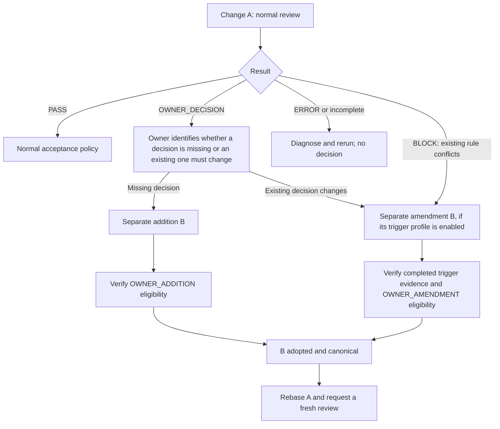

# Owner intervention for Architecture Gate

Architecture Gate reports the result of its configured review and protected-base
acceptance policy. A failed or incomplete run is not a `PASS`. The repository
owner may need to act, but the action depends on the cause. This runbook is
operational guidance; each consumer's canonical architecture and repository
administration rules remain authoritative.

The diagram shows the intended order, not an enabled amendment route. A
`BLOCK` is one amendment trigger; an `OWNER_DECISION` can also call for a
change to an existing decision. The authority change distinguishes
`OWNER_ADDITION` from `OWNER_AMENDMENT`. The consumer's previous protected-base
policy determines which B procedure and trigger profile is available.

## OWNER_DECISION

`OWNER_DECISION` means the reviewer found an architecture choice that the
consumer's canonical authority does not resolve. The choice may be a missing
decision or whether an existing decision should change. The current run cannot
accept the change.

1. Read the decision and identify the unresolved responsibility or boundary.
2. The accountable owner makes the architecture decision and proposes the
   canonical-authority update. Keep the proposed change (A) distinct from the
   authority update (B) when protected CI selects authority from the base;
   authority written only in A's head cannot resolve A's current review.
3. Determine whether B adds a missing decision or changes an existing one,
   then check whether B can proceed under the repository's existing protected
   policy. A separate B is not automatically eligible for `PASS`. The current
   BLOCK-evidence `OWNER_AMENDMENT` profile does not cover `OWNER_DECISION`;
   a distinct trigger profile requires its own protected evidence and opt-in.
   If B is unresolved or blocked, it remains so unless an applicable process
   in the consumer's existing policy permits otherwise. This runbook does not
   impose a universal file-scope rule on B.
4. Once B has actually become canonical, update A to the new base and request
   a fresh review. Preserve A's prior `OWNER_DECISION` as historical evidence;
   do not rewrite it as accepted. Merge A only if the fresh review and
   protected acceptance policy permit it. A fresh review may identify a
   different unresolved choice.

The implemented `OWNER_ADDITION / G0` route applies only when the previous
base policy opts in; [the contract](architecture.md)
defines its scope. This repository's policy does not opt in. Initial policy
adoption may require an authorized, separately recorded administrative
exception after review and fixture E2E; that exception is not Gatekeeper
acceptance. Policy v2 requires a one-member `self` Authority Set; v4 and v5
review the complete selected set while B edits one existing authority file.
The completed `OWNER_DECISION` ID must match B's exact-commit annotated
`AdditionRecord` tag. G0 authenticates neither the tagger nor owner; a mutable
tag ref is observed only at verification time. This route needs no historical
`BLOCK` evidence, identity provider, exact-claim receipt or revocation service.
B cannot assert that work is complete; migration or cutover completion needs
its own evidence when A's acceptance depends on it.

A PR comment or workflow approval alone does not record canonical architecture
authority. An administrator's existing bypass power is outside Gatekeeper's
protected result and cannot be described as `PASS` or `OWNER_ADDITION / G0`.
Any existing owner-authorized administrative exception remains governed by the
consumer's policy and must be recorded separately from Gatekeeper acceptance.

### Procedural v0.5.1 G0 route

When the recorded-base consumer policy explicitly selects version 5
`mode: procedural`, use these steps for B in a repository without a required
Gate check:

1. Put only the missing decision in B's selected authority file. Keep its
   annotated `architecture-owner-addition/<exact B SHA>` tag and version-2
   AdditionRecord. The complete Authority Set remains part of both reviews.
2. Run the selected GitHub Actions caller on exact B. Confirm the ordinary
   `OWNER_DECISION` names the same ID, the separate B review is eligible, and
   the result reads `eligibility=eligible / adoption=pending /
   canonical=pending`. Record the Actions run ID and attempt. A green result
   alone is not adoption.
3. The owner decides whether to adopt B and uses an ordinary **merge commit**
   on its PR. v0.5.1 does not support squash or rebase merge for this route.
4. Run `architecture-owner-addition-finalize <owner/repo> <B PR> --run-id
   <run ID> --attempt <attempt> --output <record.json>`. The command reads the
   recorded-base policy and GitHub's exact pre-merge producer, checks the
   immutable tag object, ordered merge parents and B tree, then reads back
   the target ref and authority bytes. Preserve the resulting adoption record
   with the PR. A missing or invalid result must not be called a valid G0
   adoption.
5. Update A to the new canonical base and request a fresh normal review. A's
   old `OWNER_DECISION` remains historical; it is never reclassified as PASS.

This route reports principal authentication as `not_verified` and does not
claim host merge enforcement or protected policy selection unless separately
verified. If an ineligible B is merged anyway, its content may be present on
the target branch, but that fact does not make its G0 adoption valid.

## CI review unavailable

An `ERROR` report means the review or its policy processing did not complete
successfully. It does not identify the cause by itself. Inspect the linked
Actions run first. API credit or billing exhaustion, model or service outage,
and credential failures are examples of review infrastructure problems; an
invalid policy or malformed decision may require a repository fix instead.

If the owner establishes that review infrastructure is unavailable and chooses
to accept the current change before service is restored:

1. Confirm the failure is not a semantic `BLOCK` or unresolved
   `OWNER_DECISION`, and record the relevant Actions run.
2. Where available and useful, run the installed exact-version local or manual
   Architecture Review. Check its `reviewedRevision` against the revision being
   accepted. A local `PASS` is development feedback, not authoritative merge
   evidence under the current CI policy.
3. Record the infrastructure cause, the accepted PR head revision, any local
   review result and its revision, and the owner's reason for accepting the
   exception in the PR.
4. If repository rules permit it, the owner or administrator explicitly uses
   the repository's merge bypass mechanism. If they do not permit bypass,
   restore the service and rerun the Gate.

The Architecture Gate check remains failed. The audit record must say that the
owner accepted a change despite an unavailable Gate; it must not claim that
Gatekeeper returned `PASS`. This is a human acceptance exception outside the
Gatekeeper evidence contract. Service failure never activates a weaker route
in protected policy. A semantic `BLOCK` is excluded from this procedure.
