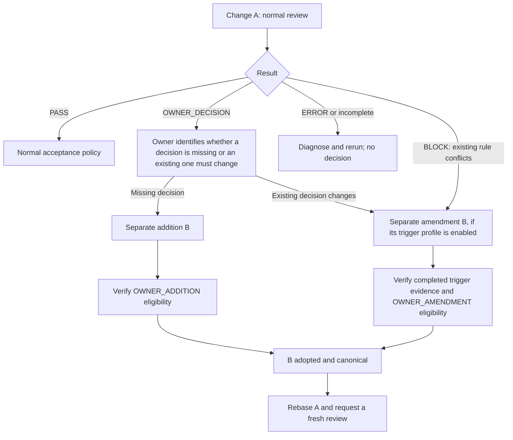

# Owner intervention for Architecture Gate

Architecture Gate reports the result of its configured review and protected-base
acceptance policy. A failed or incomplete run is not a `PASS`. The repository
owner may need to act, but the action depends on the cause. This runbook is
operational guidance; each consumer's canonical architecture and repository
administration rules remain authoritative.

The diagram shows the intended order, not an enabled amendment route. A
`BLOCK` is one amendment trigger; an `OWNER_DECISION` can also call for a
change to an existing decision. The authority change distinguishes
`OWNER_ADDITION` from `OWNER_AMENDMENT`. The consumer's previous protected-base
policy determines which B procedure and trigger profile is available.

## Legacy v1 consumer upgrade

Check the installed package version and the caller's immutable workflow pin
before choosing an upgrade procedure. A consumer still on 0.5.0 is not a
0.5.1-compatible consumer merely because a newer package is installed locally.
The 0.5.1 legacy v1 repair intentionally rejects enforced policies that lack
base-selected authority and instruction paths.

The ordinary reusable `architecture-gate-consumer.yml` needs `contents: read` and
`pull-requests: write` from its caller. It contains no self-only OIDC or
attestation signer. This repository's existing `architecture-gate.yml`
retains those signing jobs and its attestation signer identity; ordinary consumers must not add `id-token: write`
or `attestations: write` to work around a self-only permission requirement.
This source change does not modify the already published 0.6.0-preview.1;
consume it only through a separately verified corrected release and exact pin.

### Adopt the protected selection before relying on the new gate

1. Inventory the existing consumer-owned canonical authority files, CI prompt,
   decision schema and optional validation file at the recorded base. Check
   the proposed selectors against those exact bytes; copying this repository's
   policy is not consumer adoption.
2. Prepare explicit v1 `authorityFiles`, `promptPath`, `schemaPath`, and
   `validationPath` (`null` if no additional validation is selected). Keep
   the existing model, effort and authority meaning. The caller must use
   protected review instructions and select the matching `validation-path`
   (empty when the recorded selection is `null`).
3. Check whether the previous consumer policy already authorizes an adoption
   process that can make this selection and its base-owned caller canonical.
   An owner must authorize the exact adoption under that consumer's governance;
   package installation, a PR comment, and this runbook do not grant that power.
4. If the old resolver rejects the new fields and the new resolver rejects the
   old base, stop the normal upgrade PR at this adoption boundary. There is no
   automatic bridge in this implementation, and this procedure authorizes no
   administrative bypass or exception. The consumer owner must identify an
   adoption process already permitted by its canonical governance and record
   the exact authorized scope and failed/incomplete Gate result. If no such
   process exists, the owner must settle that governance decision before
   proceeding. Do not temporarily drop the
   required check, enable an unselected owner route, infer selectors from the
   candidate, or convert the failure to PASS.
5. After actual adoption, read back the target branch and exact authority,
   policy and caller identities. Refresh the upgrade PR against that base and
   run the new gate. Verify least-privilege startup, protected snapshots,
   decision validation and required acceptance on the exact refreshed head.
   Local/native preparation alone is not successful CI acceptance.

Update package/lockfile and any used Skill/workflow pins consistently with the
selected corrected release. Preserve unsuccessful runs as history and report
consumer adoption and host enforcement separately. This procedure enables no
OWNER_AMENDMENT, App, merge queue, Environment migration or new owner route.

## OWNER_DECISION

`OWNER_DECISION` means the reviewer found an architecture choice that the
consumer's canonical authority does not resolve. The choice may be a missing
decision or whether an existing decision should change. The current run cannot
accept the change.

1. Read the decision and identify the unresolved responsibility or boundary.
2. The accountable owner makes the architecture decision and proposes the
   canonical-authority update. Keep the proposed change (A) distinct from the
   authority update (B) when protected CI selects authority from the base;
   authority written only in A's head cannot resolve A's current review.
3. Determine whether B adds a missing decision or changes an existing one,
   then check whether B can proceed under the repository's existing policy. A
   separate B is not automatically eligible for `PASS`. The v0.6.0 self
   reference contract defines separate `completed-block-v1` and
   `completed-owner-decision-self-v1` amendment trigger profiles; the committed
   `main` policy selects the latter. Each profile has its own bound trigger
   evidence and previous-policy selection, and profile selection alone does
   not establish a completed amendment acceptance cycle. Issue #147 separately
   authorizes a procedural BLOCK amendment profile, but its versioned wire
   formats and trusted backend remain unselected. The package's
   `preview-unverified-procedure-v1` is a distinct consumer-selected procedure
   with `UNVERIFIED` assurance; see the [integration reference](integration-reference.md#unverified-preview-lifecycle-api).
   If B is unresolved or blocked, it remains so unless an applicable process
   in the consumer's existing policy permits otherwise. This runbook does not
   impose a universal file-scope rule on B.
4. Once B has actually become canonical, update A to the new base and request
   a fresh review. Preserve A's prior `OWNER_DECISION` as historical evidence;
   do not rewrite it as accepted. Merge A only if the fresh review and
   protected acceptance policy permit it. A fresh review may identify a
   different unresolved choice.

The implemented `OWNER_ADDITION / G0` route applies only when the previous
base policy opts in; [the contract](architecture.md)
defines its scope. This repository's policy does not opt in. Initial policy
adoption may require an authorized, separately recorded administrative
exception after review and fixture E2E; that exception is not Gatekeeper
acceptance. Policy v2 requires a one-member `self` Authority Set; v4 and v5
review the complete selected set while B edits one existing authority file.
The completed `OWNER_DECISION` ID must match B's exact-commit annotated
`AdditionRecord` tag. G0 authenticates neither the tagger nor owner; a mutable
tag ref is observed only at verification time. This route needs no historical
`BLOCK` evidence, identity provider, exact-claim receipt or revocation service.
B cannot assert that work is complete; migration or cutover completion needs
its own evidence when A's acceptance depends on it.

A PR comment or workflow approval alone does not record canonical architecture
authority. An administrator's existing bypass power is outside Gatekeeper's
protected result and cannot be described as `PASS` or `OWNER_ADDITION / G0`.
Any existing owner-authorized administrative exception remains governed by the
consumer's policy and must be recorded separately from Gatekeeper acceptance.

### Procedural v0.5.1 G0 route

When the recorded-base consumer policy explicitly selects version 5
`mode: procedural`, use these steps for B in a repository without a required
Gate check:

1. Put only the missing decision in B's selected authority file. Keep its
   annotated `architecture-owner-addition/<exact B SHA>` tag and version-2
   AdditionRecord. The complete Authority Set remains part of both reviews.
2. Run the selected GitHub Actions caller on exact B. Confirm the ordinary
   `OWNER_DECISION` names the same ID, the separate B review is eligible, and
   the result reads `eligibility=eligible / adoption=pending /
   canonical=pending`. Record the Actions run ID and attempt. A green result
   alone is not adoption.
3. The owner decides whether to adopt B and uses an ordinary **merge commit**
   on its PR. v0.5.1 does not support squash or rebase merge for this route.
4. Run `architecture-owner-addition-finalize <owner/repo> <B PR> --run-id
   <run ID> --attempt <attempt> --output <record.json>`. The command reads the
   recorded-base policy and GitHub's exact pre-merge producer, checks the
   immutable tag object, ordered merge parents and B tree, then reads back
   the target ref and authority bytes. Preserve the resulting adoption record
   with the PR. A missing or invalid result must not be called a valid G0
   adoption.
5. Update A to the new canonical base and request a fresh normal review. A's
   old `OWNER_DECISION` remains historical; it is never reclassified as PASS.

This route reports principal authentication as `not_verified` and does not
claim host merge enforcement or protected policy selection unless separately
verified. If an ineligible B is merged anyway, its content may be present on
the target branch, but that fact does not make its G0 adoption valid.

## CI review unavailable

An `ERROR` report means the review or its policy processing did not complete
successfully. It does not identify the cause by itself. Inspect the linked
Actions run first. API credit or billing exhaustion, model or service outage,
and credential failures are examples of review infrastructure problems; an
invalid policy or malformed decision may require a repository fix instead.

If the owner establishes that review infrastructure is unavailable and chooses
to accept the current change before service is restored:

1. Confirm the failure is not a semantic `BLOCK` or unresolved
   `OWNER_DECISION`, and record the relevant Actions run.
2. Where available and useful, run the installed exact-version local or manual
   Architecture Review. Check its `reviewedRevision` against the revision being
   accepted. A local `PASS` is development feedback, not authoritative merge
   evidence under the current CI policy.
3. Record the infrastructure cause, the accepted PR head revision, any local
   review result and its revision, and the owner's reason for accepting the
   exception in the PR.
4. If repository rules permit it, the owner or administrator explicitly uses
   the repository's merge bypass mechanism. If they do not permit bypass,
   restore the service and rerun the Gate.

The Architecture Gate check remains failed. The audit record must say that the
owner accepted a change despite an unavailable Gate; it must not claim that
Gatekeeper returned `PASS`. This is a human acceptance exception outside the
Gatekeeper evidence contract. Service failure never activates a weaker route
in protected policy. A semantic `BLOCK` is excluded from this procedure.
