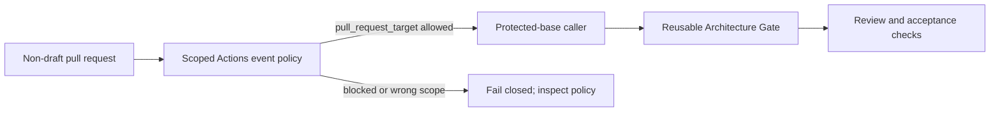

# Self Architecture Gate Actions event policy

GitHub's default Actions policy for public repositories currently evaluates
`pull_request_target` runs and is scheduled to block affected runs on
2026-11-02. The self Architecture Gate uses that event to run its protected-base
caller, `.github/workflows/self-architecture-gate.yml`. This page records the
repository-specific policy needed for [issue #12](https://github.com/flair-agency/architecture-gatekeeper/issues/12).

## Intended setting

The repository policy was applied on 2026-09-23 as
[policy 5316](https://github.com/flair-agency/architecture-gatekeeper/settings/actions/rules/5316).
Its API readback showed `enforcement: active`, the single workflow path below,
and only `pull_request_target` in `allowed_events`.

The **currently active repository Actions event policy** targets only
`.github/workflows/self-architecture-gate.yml` and allows only
`pull_request_target`. The v0.6.0 self reference profile also requires a
`merge_group` check before a protected merge-queue transition. Add that event
to this same narrowly scoped policy only after the caller implements a
reviewed, fail-closed merge-group path and before enabling merge queue on
`main`. Do not widen the workflow-path selection or token permissions to
compensate for a missing check. The current permitted execution path is:



The saved policy has this API shape:

```json
{
  "name": "Allow protected self Architecture Gate pull_request_target",
  "enforcement": "active",
  "conditions": {
    "workflow_path": {
      "include": [".github/workflows/self-architecture-gate.yml"],
      "exclude": []
    }
  },
  "rules": [
    {
      "type": "restrict_action_events",
      "parameters": {
        "allowed_events": ["pull_request_target"]
      }
    }
  ]
}
```

This policy permits a privileged event; it does not grant new token scopes,
change workflow code, or make a review decision. The caller must continue to
come from the protected base. Its `pull-requests: write` permission is needed
for reporting; reviewer instructions and CI policy come from the protected
base, while the review reads the pull-request diff. Pull-request code must not
run with the write token or review credentials.
Review changes to the caller and reusable workflow against this boundary before
keeping the policy active.

## v0.6.0 merge queue transition

1. Review the exact caller and reusable workflow changes, including the
   `merge_group` trigger, event-specific base/head selection and required
   `architecture-gate / accept` result. The merge-group path must not treat an
   absent `pull_request` payload as permission to skip evidence checks.
2. Update policy 5316's `allowed_events` to
   `["pull_request_target", "merge_group"]`, retaining its single workflow
   path and active enforcement. Read the saved policy back before relying on it.
3. Prove the queue check on an actual merge-group revision. Keep the existing
   required PR check in place. Only then change branch protection to require
   merge queue with merge commits and remove the incompatible linear-history
   requirement; preserve required-check source, strictness and other protections.
4. Read back the host settings and demonstrate a normal protected transition
   and canonical readback. A successful PR check alone does not prove the
   merge-group path or the evidence ordering through transition.

Until step 2, the saved policy still authorizes only `pull_request_target`;
until step 4, no v0.6.0 merge-queue guarantee is claimed.

## Original policy application and verification

1. In repository **Settings → Actions → Policies**, inspect existing repository
   and inherited policies. If an applicable policy already permits the event,
   confirm its workflow scope before adding another rule.
2. Create the policy above for this repository. Read the saved policy back and
   verify `enforcement: active`, the single included workflow path, and the
   single allowed event. Keep the returned policy ID for recovery.
3. On a subsequent non-draft pull request, confirm that the self Gate runs from
   `pull_request_target` and that `policy`, `codex-action-integrity`, `review`,
   `report`, and `accept` complete. Check that the sticky PR comment updates.
   A successful run while the default policy is still in evaluate mode is not,
   by itself, proof that the saved allow policy is active.
4. Check Actions policy insights for unexpected blocks or scope matches after
   activation and again around the 2026-11-02 enforcement date.

The [GitHub security guide](https://docs.github.com/en/actions/reference/security/securely-using-pull_request_target)
explains the default policy and the privileged-event boundary. The
[Actions policies API](https://docs.github.com/en/rest/actions/policies)
documents policy creation and readback. [GitHub's merge queue guide](https://docs.github.com/en/repositories/configuring-branches-and-merges-in-your-repository/configuring-pull-request-merges/managing-a-merge-queue)
requires a `merge_group` event for Actions-backed required checks.

## Recovery

If the rule matches the wrong workflow or unexpectedly changes Actions
behavior, disable or delete that policy by its saved ID, then read the policy
list back. This returns the repository to the applicable inherited/default
policy; after the enforcement date, that may block self Gate runs. Keep merge
acceptance fail closed until the correctly scoped event policy and a fresh
self Gate run both succeed. Do not compensate by broadening token permissions
or accepting an unreviewed PR.
